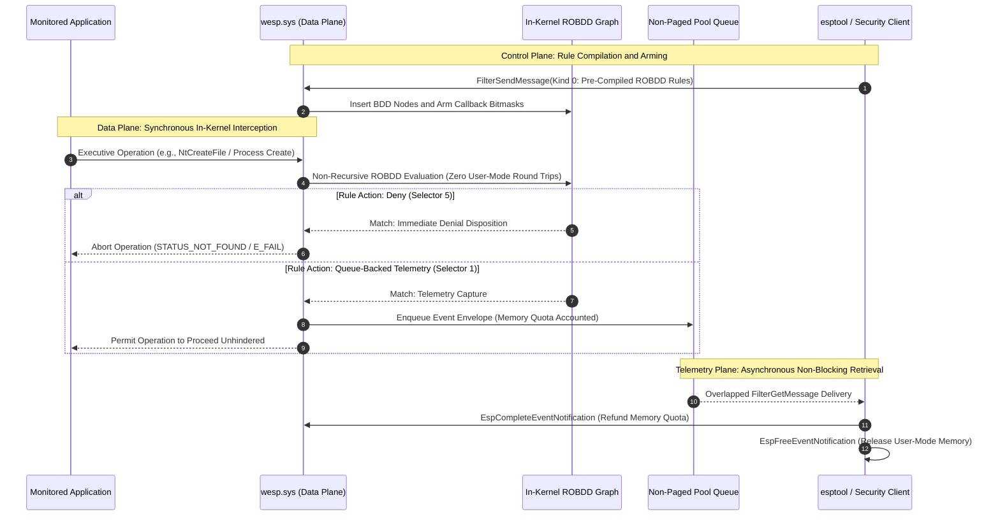
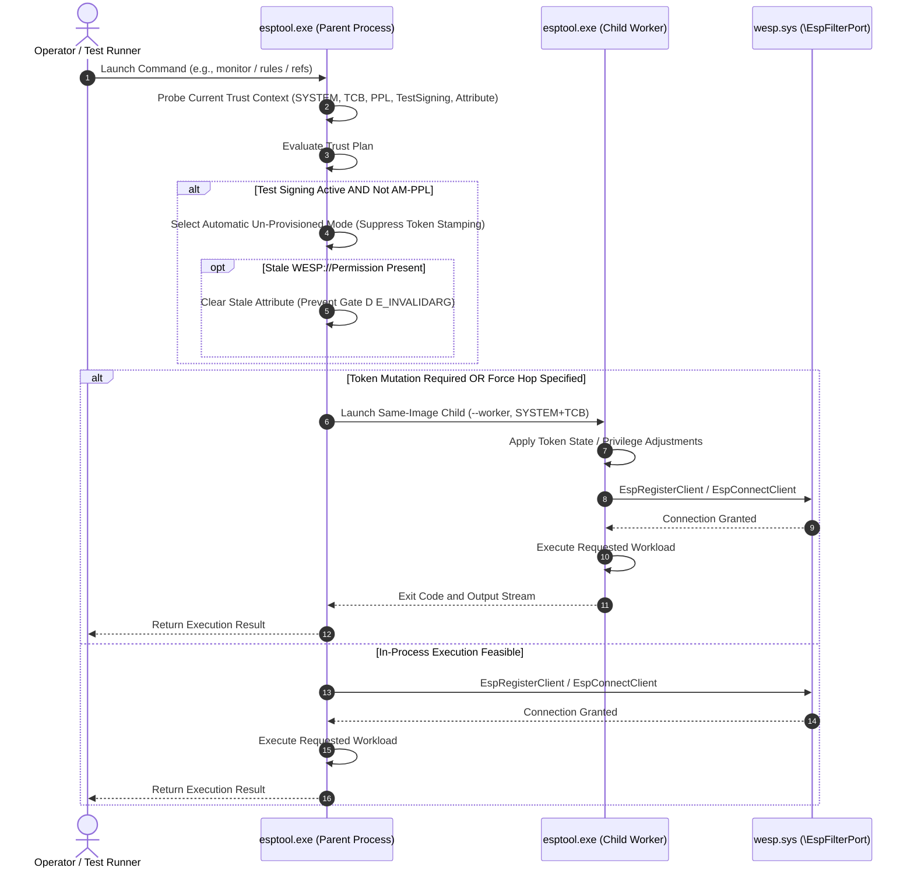
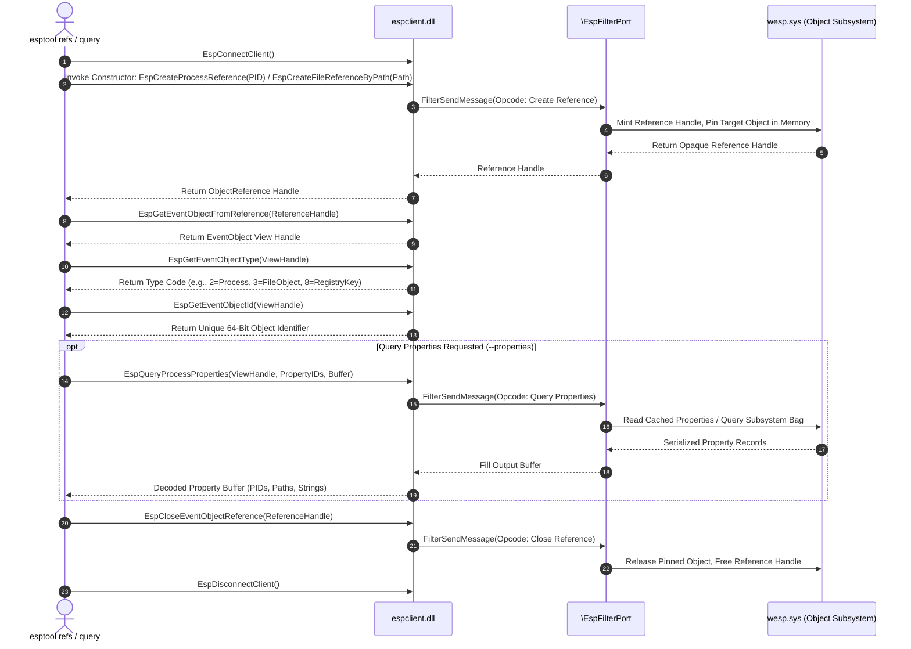
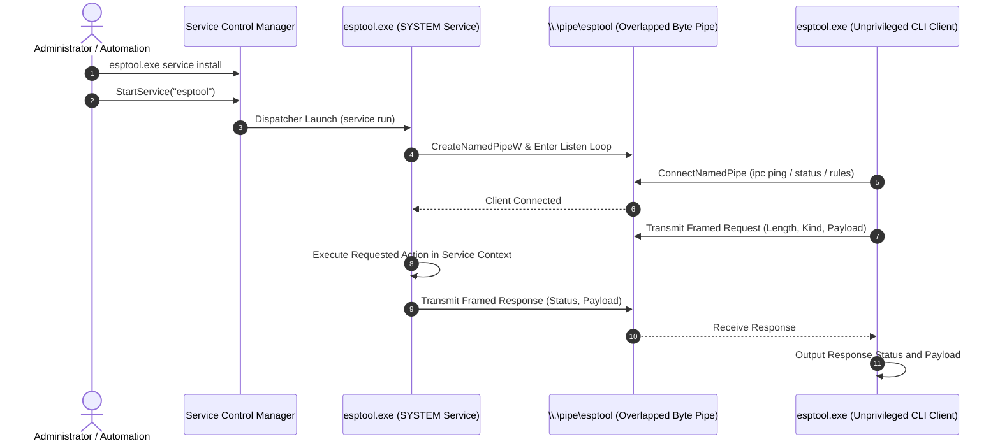
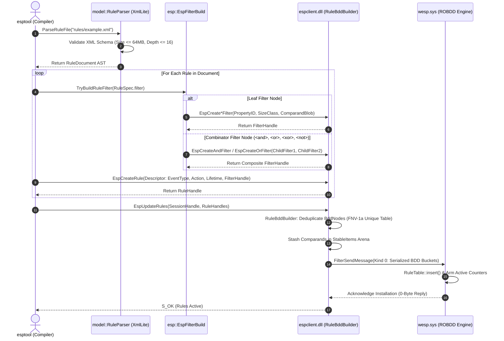
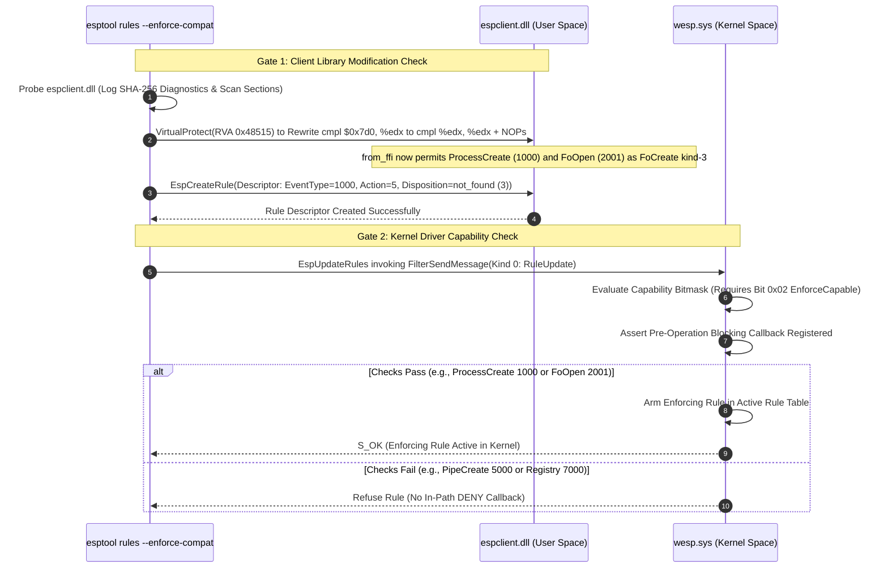
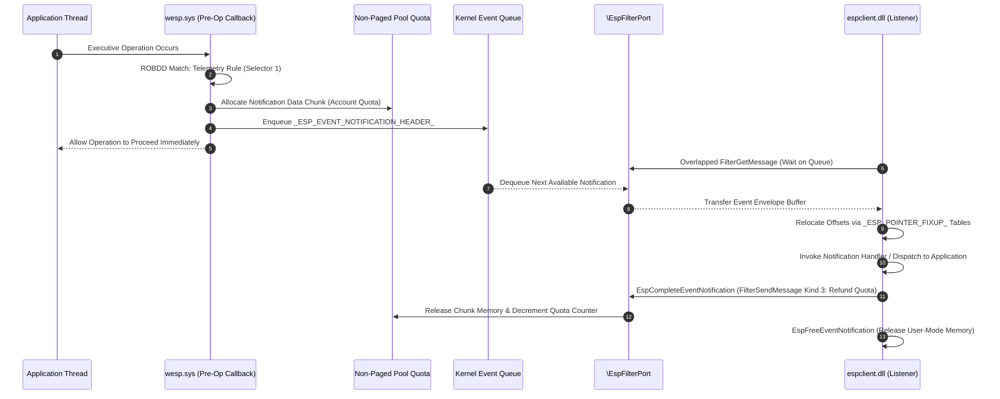
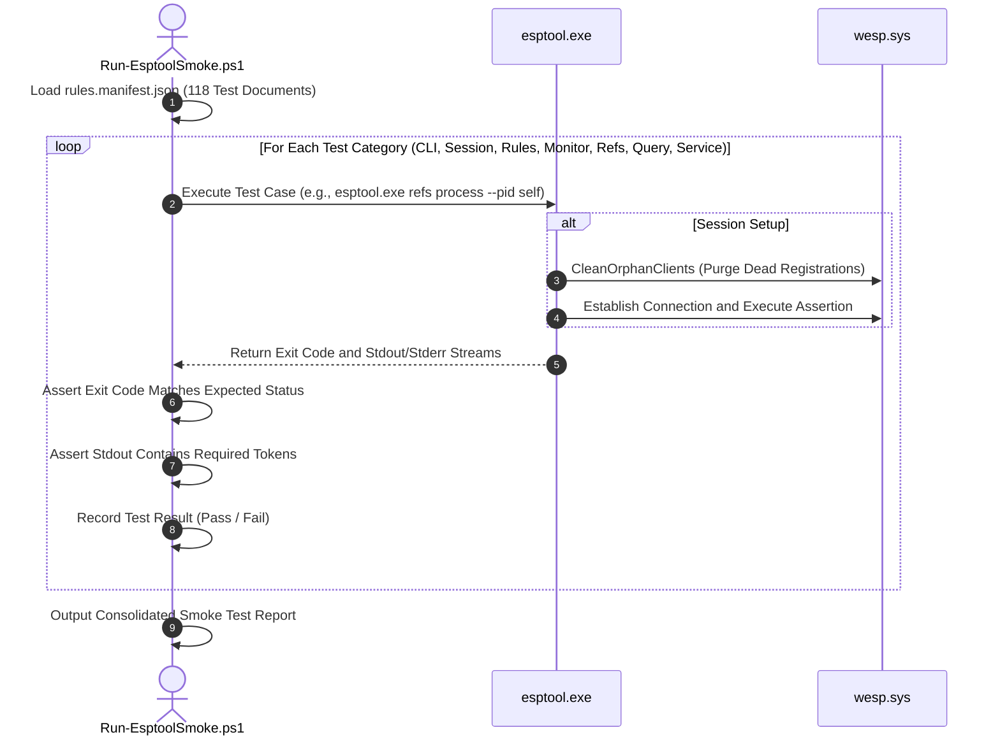

# Esptool Architectural Reference and Harness Guidelogy

The Windows Endpoint Security Platform (WESP, also designated ESP) is an operating system subsystem introduced in Windows 11 Insider Preview builds (25H2, reference builds 10.0.29641 through 10.0.29667). WESP provides security software with a consolidated kernel telemetry pipeline and real-time policy enforcement engine across Windows executive subsystems.

Traditional endpoint security architectures rely on third-party filesystem minifilter drivers paired with user-mode service daemons. When an I/O request occurs, such as file creation via `NtCreateFile`, the minifilter intercepts the request in a pre-operation callback, invokes `FltSendMessage`, and suspends the calling thread while waiting for user-mode code to inspect the request and return an authorization verdict via `FilterReplyMessage`. This synchronous IPC design introduces latency, risks recursive deadlocks during paging I/O, and causes system degradation if the user-mode service becomes unresponsive.

WESP replaces synchronous user-mode round-trips with an asymmetric architecture: user-space rule compilation paired with in-kernel decision graph evaluation. The subsystem operates across three functional planes:

- **Control Plane**: Operates over the Filter Manager communication port `\EspFilterPort`. It authenticates security agents, manages client registrations, and transmits pre-compiled rule sets from user space to kernel space.
- **Data Plane**: Intercepts operations across five kernel subsystems (Process Manager, Object Manager, Configuration Manager, Filter Manager, and Kernel Transaction Manager) into a consolidated surface of 47 event types. The kernel driver `wesp.sys` evaluates rules directly within pre-operation callbacks. If an enforcing rule matches, the callback returns an immediate blocking status (`FLT_PREOP_COMPLETE` with `STATUS_NOT_FOUND`, or `PS_CREATE_NOTIFY_INFO.CreationStatus` denial) before the I/O reaches the target driver.
- **Telemetry Plane**: Mediates non-blocking event transfer. For observation rules, the driver enqueues event envelopes into memory-budgeted kernel queues. User-mode listeners retrieve events asynchronously through overlapped reads without suspending monitored applications. Telemetry completion calls release memory quotas rather than returning synchronous authorization decisions.



`esptool` is a standalone reverse engineering, validation, and diagnostic research harness built to exercise WESP and its user-mode client library `espclient.dll`. The tool dynamically loads `espclient.dll` at runtime via `LoadLibraryExW` and resolves exports through `GetProcAddress`, eliminating static linkage dependencies on `espclient.lib` and allowing execution across differing OS builds.

In production Windows builds, vendor utilization of WESP remains restricted. Microsoft Defender (`MpRtp.dll`) binds only 15 of the 121 exports in `espclient.dll`, executing a single telemetry recipe for Named Pipe creation (`5000`) and Pipe FileObject opens (`2001`). `esptool` exercises the complete functional surface of the platform: all 121 cataloged exports, all 47 sparse event types, 16 typed filter constructors, boolean combinators, collection types, property queries across live kernel objects, and the two-sided enforcement gate.

# Security Model and Trust Architecture

Communication with `\EspFilterPort` is governed by multi-layered kernel security checks. The driver evaluates caller identity, token attributes, process protection levels, and system code integrity state during `EspRegisterClient`.

## Token Security Attribute

Callers in production must possess the `WESP://Permission` token security attribute. The platform accepts `restricted` (`10000000`) or `full` (`1000000000`). Setting this attribute requires `NT AUTHORITY\SYSTEM` and `SeTcbPrivilege`. The attribute is evaluated by `wesp.sys` during connection establishment.

## Antimalware Protected Process Light Enforcement

The kernel driver mandates that any caller presenting the `WESP://Permission` attribute must execute as an Antimalware Protected Process Light (`PsProtectedSignerAntimalware`, `0x31`). If a standard elevated or SYSTEM process presents this attribute without AM-PPL protection, `wesp.sys` rejects `EspRegisterClient` with `0x80070057` (`E_INVALIDARG`).

## Kernel Test-Signing Fallback Gate

On test installations with test signing active (`bcdedit /set {current} testsigning on`), `wesp.sys` provides an internal development fallback. If the caller presents no `WESP://Permission` attribute, the driver admits the un-attributed client without requiring AM-PPL.

`esptool` inspects system code integrity policy and process protection state at startup. When running as an unprotected process under test signing, `esptool` automatically suppresses token attribute stamping (`effective_no_provision = true`), enabling execution without manual `--no-provision` flags.

## Inherited Attribute Sanitization

If a pre-existing `WESP://Permission` attribute is detected on the primary token in a test-signed environment, `wesp.sys` rejects the connection because the process lacks AM-PPL. `esptool` automatically clears the stale attribute via `ppl::DeleteWespPermission` and asserts its absence before establishing communication with `wesp.sys`.

## Selective Worker Hopping

Commands that access the driver evaluate whether token mutation (stamping or clearing) is required. If token mutation is necessary, `esptool` hops to a same-image child worker under `NT AUTHORITY\SYSTEM` with `SeTcbPrivilege` enabled to isolate token modifications from the parent environment. If the primary token is already in the required state, execution proceeds directly in-process. Child execution can be explicitly demanded via `--force-hop` or suppressed via `--no-hop`.



# Complete Command Reference

`esptool` organizes its operational capabilities into 36 distinct commands covering system inspection, session lifecycle, telemetry management, object references, diagnostic sweeps, trust management, and remote IPC hosting.

## System Inspection and Export Catalog

### exports

The `exports` command walks the internal catalog of 121 exports defined in `espclient.dll`. It resolves each symbol using `GetProcAddress`, reports arity, and prints resolution status.

- Syntax: `esptool.exe exports [--dll <path>]`
- Worker Hop: No.
- APIs Invoked: `LoadLibraryExW`, `GetProcAddress`.
- Internal Execution Sequence:
  1. Loads `espclient.dll` via `LoadLibraryExW`.
  2. Iterates across the catalog of 121 exports declared in `esp/EspExports.inc` and compiled via `EspApi::BuildCatalog()`.
  3. Invokes `GetProcAddress` for each export descriptor.
  4. Formats a structured table showing function name, arity, and resolution status.
  5. Computes and displays total resolved and missing counts.
- Output Anatomy:
  ```text
  ------------------------------------------------------------
  export                                       arity  resolved
  EspRegisterClient                            4      yes
  EspConnectClient                             2      yes
  ...
  ------------------------------------------------------------
  resolved 120 of 121
  missing 1: _DllMainCRTStartup
  ```

### status

The `status` command inspects and displays the operational environment of `esptool` and the host system.

- Syntax: `esptool.exe status [--dll <path>]`
- Worker Hop: No.
- APIs Invoked: `LoadLibraryExW`, `NtQueryInformationProcess` (`ProcessProtectionInformation`), `NtQueryInformationToken` (`TokenSecurityAttributes`), `NtQuerySystemInformation` (`SystemCodeIntegrityInformation`), `RegQueryValueExW` (`UEFISecureBootEnabled`).
- Internal Execution Sequence:
  1. Verifies `espclient.dll` presence and counts resolved exports.
  2. Queries current process token for `NT AUTHORITY\SYSTEM` SID and `SeTcbPrivilege` status.
  3. Queries process protection via `ProcessProtectionInformation` (extracting `PS_PROTECTION`).
  4. Queries primary token security attributes for `WESP://Permission`.
  5. Queries system code integrity for `CODEINTEGRITY_OPTION_TESTSIGN`.
  6. Queries registry key `HKLM\SYSTEM\CurrentControlSet\Control\SecureBoot\State` value `UEFISecureBootEnabled` for Secure Boot status.
- Output Anatomy:
  ```text
  dll: C:\Windows\System32\espclient.dll
  resolved 120 of 121
  account: SYSTEM
  elevated: yes
  tcb: enabled
  protection: 0x00 (None, None, audit=0)
  attribute: present restricted (10000000)
  codeintegrity: options=0x00000002 testsigning=on ci=on
  secureboot: off
  ```

### trust

The `trust` command verifies whether the current execution context satisfies WESP connection requirements by executing an end-to-end registration and queue creation probe under a unique client specification.

- Syntax: `esptool.exe trust`
- Worker Hop: Yes (evaluates trust plan and hops if token mutation is required).
- APIs Invoked: `EspRegisterClient`, `EspConnectClient`, `EspCreateEventQueue`, `EspCloseEventQueue`, `EspDisconnectClient`, `EspUnregisterClient`.
- Internal Execution Sequence:
  1. Displays trust diagnostics identical to `status`.
  2. Generates a unique client name and altitude using process tick and ID.
  3. Invokes `EspRegisterClient` and `EspConnectClient`.
  4. Invokes `EspCreateEventQueue` and `EspCloseEventQueue`.
  5. Tears down the test connection via `EspDisconnectClient` and `EspUnregisterClient`.
- Output Anatomy:
  ```text
  account: SYSTEM
  elevated: yes
  tcb: enabled
  ...
  ------------------------------------------------------------
  ok   EspRegisterClient                        0x00000000 S_OK
  ok   EspConnectClient                         0x00000000 S_OK
  ok   EspCreateEventQueue                      0x00000000 S_OK
  ok   EspCloseEventQueue                       0x00000000 S_OK
  ok   EspDisconnectClient                      0x00000000 S_OK
  ok   EspUnregisterClient                      0x00000000 S_OK
  ```

## Session, Client, and Queue Lifecycle

### connect

The `connect` command registers a transient client identity, establishes a port connection, creates an event queue, arms a notification object, and disconnects.

- Syntax: `esptool.exe connect`
- Worker Hop: Yes.
- APIs Invoked: `EspRegisterClient`, `EspConnectClient`, `EspCreateEventQueue`, `EspArmEventNotification`, `EspAllocateEventNotification`, `EspFreeEventNotification`, `EspCloseEventQueue`, `EspDisconnectClient`, `EspUnregisterClient`.
- Internal Execution Sequence:
  1. Connects to `\EspFilterPort` under default identity (`esptool`, altitude `385000`).
  2. Creates a kernel event queue via `EspCreateEventQueue`.
  3. Allocates notification memory via `EspAllocateEventNotification` and arms notification delivery via `EspArmEventNotification`.
  4. Releases notification memory via `EspFreeEventNotification`.
  5. Closes the queue and unregisters the client.
- Output Anatomy:
  ```text
  ok   EspRegisterClient                        0x00000000 S_OK
  ok   EspConnectClient                         0x00000000 S_OK
  ok   EspCreateEventQueue                      0x00000000 S_OK
  ok   EspAllocateEventNotification             0x00000000 S_OK
  ok   EspArmEventNotification                  0x00000000 S_OK
  ok   EspFreeEventNotification                 0x00000000 S_OK
  ok   EspCloseEventQueue                       0x00000000 S_OK
  ok   EspDisconnectClient                      0x00000000 S_OK
  ok   EspUnregisterClient                      0x00000000 S_OK
  ```

### clients

The `clients` command queries the kernel for all registered WESP client identities currently tracked by `wesp.sys`.

- Syntax: `esptool.exe clients`
- Worker Hop: Yes.
- APIs Invoked: `EspEnumerateRegisteredClients`.
- Output Anatomy:
  ```text
  registered-clients 2
  client {a1b2c3d4-e5f6-7890-1234-56789abcdef0}
  client {391d246d-f7bc-dd43-894a-0ab429fa8dad}
  ```

### unregister

The `unregister` command unregisters one or all client identities from the driver, releasing client state in kernel memory.

- Syntax: `esptool.exe unregister (--guid <guid> | --all)`
- Worker Hop: Yes.
- APIs Invoked: `EspUnregisterClient`, `EspEnumerateRegisteredClients`.
- Internal Execution Sequence:
  - When `--guid <guid>` is provided, invokes `EspUnregisterClient` for that specific identifier.
  - When `--all` is provided, enumerates all registered client GUIDs and unregisters each disconnected client sequentially. Connected clients with active open ports return `0x8007139F` (`ERROR_INVALID_STATE`) and remain preserved.

### open-queue

The `open-queue` command validates cross-session queue handle sharing. It establishes an initial session to create an event queue, retrieves the queue GUID via `EspGetEventQueueId`, and opens that queue from an independent second session via `EspOpenEventQueue`.

- Syntax: `esptool.exe open-queue`
- Worker Hop: Yes.
- APIs Invoked: `EspCreateEventQueue`, `EspGetEventQueueId`, `EspOpenEventQueue`, `EspCloseEventQueue`.
- Output Anatomy:
  ```text
  open-queue ok
  ```

## Rule Deployment and Telemetry Management

### rules

The `rules` command parses an XML rule document, connects to `\EspFilterPort`, creates an event queue if queue-backed actions exist, and submits the rule batch to the driver via `EspCreateRule` and `EspUpdateRules`.

- Syntax: `esptool.exe rules --rules <path.xml> [--duration <ms>] [--iocp] [--enforce-compat] [--fresh]`
- Worker Hop: Yes.
- Key Options:
  - `--duration <ms>`: Holds the session active for the specified duration before disconnecting, allowing in-path enforcing rules to intercept operations.
  - `--iocp`: Configures event queue pumping via an I/O Completion Port.
  - `--enforce-compat`: Enables in-memory patching of `espclient.dll` to permit deny rules for driver-ready event types.
  - `--fresh`: Scans for and unregisters orphaned client identities from previous runs before installing rules.
- Internal Execution Sequence:
  1. Parses the XML file into an in-memory `RuleDocument` AST.
  2. If `--fresh` is specified, clears disconnected orphan clients.
  3. Registers and connects the client session.
  4. Inspects rules: if any rule uses queue-backed action (Selector 1), creates a session event queue. Enforcing rules (Selector 5) skip queue creation.
  5. Removes prior rules associated with the client via `EspRemoveAllRulesForClient`.
  6. Translates filter trees into `EspCreate*Filter` and combinator calls.
  7. Builds rule descriptors and invokes `EspCreateRule`.
  8. Submits rules via `EspUpdateRules` individually to prevent batch vetoes.
  9. If `--duration` is specified, holds the session open or pumps notifications.
  10. Disconnects and unregisters.

### monitor

The `monitor` command deploys a rule document and pumps telemetry notifications for a specified duration or until a maximum event threshold is reached.

- Syntax: `esptool.exe monitor --rules <path.xml> [--duration <ms>] [--max <count>] [--iocp]`
- Worker Hop: Yes.
- Exit Code Contract: Returns exit code `0` only if at least one notification arrives. A clean installation that yields zero events exits with code `1`.
- Internal Execution Sequence:
  1. Deploys the rule document using the `rules` installation sequence.
  2. Allocates an event notification buffer via `EspAllocateEventNotification`.
  3. Enters the notification pump loop:
     - Callback Mode (Default): Connects the event queue to the notification handler via `EspConnectEventQueueWithCallback` and pumps incoming notifications.
     - IOCP Mode (`--iocp`): Associates the event queue with a completion port via `EspConnectEventQueueWithIocp` and retrieves events via `GetQueuedCompletionStatus`.
  4. For each arrived notification, unwraps the payload, relocates embedded pointers, and extracts property bags.
  5. If post-notification `<query>` recipes are defined on the rule, invokes typed property queries against the entity.
  6. Releases kernel memory quota via `EspCompleteEventNotification` and frees user-mode notification buffers via `EspFreeEventNotification`.
  7. Exits when `--duration` expires or `--max` events are captured.
- Output Anatomy:
  ```text
  [INFO ] monitor: rules installed, pumping
  [INFO ] notification 1 id=1 kind=3277015211 payload=0 event=1000 pid=4812 tid=0 name=\Device\HarddiskVolume3\Windows\System32\notepad.exe
    prop[Process:6] (ProcessId, type 5): 4812 (0x12CC)
    prop[Process:20] (ImagePath, type 8): \Device\HarddiskVolume3\Windows\System32\notepad.exe
    prop[Process:1] (CommandLine, type 8): "C:\Windows\System32\notepad.exe"
    prop[Process:2] (SessionId, type 10): 0x1DD455AE1AADB2C
  [INFO ] notification pump received 1
  ```

### persist-rules

The `persist-rules` command deploys rules with persistent lifetime (`RuleLifetime::Persistent`, FFI value 3). Persistent rules survive client disconnection and remain active in kernel non-paged pool memory.

- Syntax: `esptool.exe persist-rules --rules <path.xml> [--fresh]`
- Worker Hop: Yes.
- Operational Constraint: Must not allocate a user-mode event queue. The driver persistent store rejects rules containing live user-mode queue pointers with `E_INVALIDARG`.
- Output Anatomy:
  ```text
  persist-rules 1
  ```

### enum-rules

The `enum-rules` command queries rule counts across all lifetime tiers for the active client identity.

- Syntax: `esptool.exe enum-rules`
- Worker Hop: Yes.
- APIs Invoked: `EspEnumerateAllRulesForClient`, `EspEnumerateRuleIds`.
- Output Anatomy:
  ```text
  rules 4
  rules-lifetime-1 2
  rules-lifetime-2 0
  rules-lifetime-3 2
  rules-lifetime-4 0
  ```

### remove-rules

The `remove-rules` command tears down all rules currently deployed by the calling client.

- Syntax: `esptool.exe remove-rules`
- Worker Hop: Yes.
- APIs Invoked: `EspRemoveAllRulesForClient`.

## Object References and Property Queries

WESP exposes an Object Reference Subsystem allowing connected clients to mint kernel handles to intercepted executive entities, unwrap event object views, query property bags, and inspect capabilities.



### refs

The `refs` command creates a kernel object reference for a specified executive object kind, unwraps its internal event object view, and queries requested properties.

- Syntax: `esptool.exe refs <kind> [natural-key-options] [--properties <ids>] [--supported <id>] [--duplicate] [--context-set] [--context-enum] [--from-notify]`
- Supported Kinds: `process`, `process-token`, `thread`, `thread-token`, `token`, `file`, `fileobject`, `stream`, `filestream`, `registry`, `volume`, `disk`, `desktop`, `pipe`, `mailslot`, `event`.
- Key Options:
  - `--pid <id|self>`: Target process identifier. Passing `self` resolves the current process ID via `GetCurrentProcessId()`.
  - `--tid <id|self>`: Target thread identifier. Passing `self` resolves `GetCurrentThreadId()`.
  - `--path <path>`: Win32 or NT target path.
  - `--file-id <hex>`: 128-bit hexadecimal `FILE_ID_128` string.
  - `--volume <guid>`: Target volume GUID.
  - `--stream <name>`: Stream identifier for file stream objects.
  - `--name <name>`: Desktop object name.
  - `--event-id <id>`: Unique 64-bit event identifier.
  - `--properties <id,id,...>`: Comma-separated list of property identifiers to query.
  - `--supported <id>`: Probes whether a property identifier is supported by the kernel driver.
  - `--from-notify`: Deploys rules, captures one notification, and mints an object reference directly from the event payload.
- Internal Execution Breakdown by Kind:
  - Process Reference (`refs process --pid self --properties 6,20,1,2`):
    - Invokes `EspCreateProcessReference`.
    - Unwraps view: `EspGetEventObjectFromReference`.
    - Queries type (`2` for Process) and 64-bit ID.
    - Calls `EspQueryProcessProperties` for IDs 6 (`ProcessId`), 20 (`ImagePath`), 1 (`CommandLine`), and 2 (`SessionId`).
  - File Reference (`refs file --path C:\Windows\System32\ntdll.dll --properties 1,9,28`):
    - Invokes `EspCreateFileReferenceByPath`. Win32 paths prefixed with `$nt:` undergo Win32-to-NT device path expansion via `ExpandFilterValue`; standard Win32 paths are passed directly as kind-1 path descriptors.
    - Unwraps view (`3` for FileObject).
    - Calls `EspQueryFileProperties` for IDs 1 (`FileName`), 9 (`VolumeName`), and 28 (`FileObjectType`).
  - Registry Reference (`refs registry --path HKLM\Software --properties 1,2`):
    - Invokes `EspCreateRegistryKeyReference`. User-mode `HKLM\...` paths are expanded by `espclient.dll` / driver (`Esp::EnsureNtRegistryPath`); pre-expanding in user space is avoided as it returns `ERROR_BAD_PATHNAME`.
    - Unwraps view (`8` for Registry Key).
    - Calls `EspQueryRegistryKeyProperties` for IDs 1 (`KeyPath`) and 2 (`ValueName`).
- Output Anatomy:
  ```text
  ref created kind=process
  event-object-type 2
  event-object-id 1730
  query EspQueryProcessProperties 0x00000000 buffer=0000008000537EC0
  ok   EspRegisterClient                        0x00000000 S_OK
  ok   EspConnectClient                         0x00000000 S_OK
  ok   EspCreateProcessReference                0x00000000 S_OK
  ok   EspGetEventObjectFromReference           0x00000000 S_OK
  ok   EspGetEventObjectType                    0x00000000 S_OK
  ok   EspGetEventObjectId                      0x00000000 S_OK
  ok   EspQueryProcessProperties                0x00000000 S_OK
  ```

### query

The `query` command performs property queries and capability probes.

- Syntax: `esptool.exe query [--kind <kind>] [--properties <ids>] [--supported <id>]`
- Worker Hop: Yes (eligible when token adjustments are required).
- Behavior without `--kind`: Issues count-0 smoke calls to all `EspQuery*Properties` exports to verify API availability without faults.
- Behavior with `--kind`: Creates a temporary reference to the specified entity kind and queries properties or evaluates property support flags via `EspIs*PropertySupported`.
- Output Anatomy:
  ```text
  query EspQueryProcessProperties 0x00000000 buffer=000000DF3DE666E0
  property-supported process 6 1
  ok   EspRegisterClient                        0x00000000 S_OK
  ok   EspConnectClient                         0x00000000 S_OK
  ok   EspCreateProcessReference                0x00000000 S_OK
  ok   EspGetEventObjectFromReference           0x00000000 S_OK
  ok   EspQueryProcessProperties                0x00000000 S_OK
  ```

### collections

The `collections` command creates, updates, and inspects in-kernel collections. In-kernel collections maintain sets of integers, strings, or binary blobs evaluated directly by kernel ROBDD decision graphs.

- Syntax: `esptool.exe collections [--type <1|2|3>] [--lifetime <1|2|3>] [--enum-ids] [--open --guid <guid>]`
- Worker Hop: Yes (eligible when token adjustments are required).
- Types: `1` (Integer), `2` (String), `3` (Binary).
- Lifetimes: `1` (Transient), `2` (Session), `3` (Persistent).
- APIs Invoked: `EspCreateCollection`, `EspUpdateCollection`, `EspGetCollectionId`, `EspGetCollectionType`, `EspEnumerateCollectionEntries`, `EspEnumerateCollectionIds`, `EspOpenCollection`, `EspCloseCollection`.
- Output Anatomy:
  ```text
  collection-id {391d246d-f7bc-dd43-894a-0ab429fa8dad}
  collection-type 2
  collection-entries 1
  ok   EspRegisterClient                        0x00000000 S_OK
  ok   EspConnectClient                         0x00000000 S_OK
  ok   EspCreateCollection                      0x00000000 S_OK
  ok   EspUpdateCollection                      0x00000000 S_OK
  ok   EspGetCollectionId                       0x00000000 S_OK
  ok   EspGetCollectionType                     0x00000000 S_OK
  ok   EspEnumerateCollectionEntries            0x00000000 S_OK
  ```

### context

The `context` command exercises client-level correlation context storage.

- Syntax: `esptool.exe context`
- Worker Hop: Yes (eligible when token adjustments are required).
- APIs Invoked: `EspSetClientContextKey`, `EspEnumerateClientContextKeys`.

## Diagnostic Sweeps and Raw Execution

### exercise

The `exercise` command executes a systematic API sweep across all resolved exports in `espclient.dll` using synthetic argument vectors.

- Syntax: `esptool.exe exercise [--isolated]`
- Worker Hop: Yes (eligible when token adjustments are required).
- Execution Modes:
  - In-Process (Default): Executes all export invocations sequentially within the current process.
  - Isolated (`--isolated`): Spawns an independent child process for each individual export. If an export triggers an unhandled access violation or kernel fault, only the child process terminates, allowing the test harness to complete the sweep and identify the failing API.
- Output Anatomy:
  ```text
  ------------------------------------------------------------
  export                                       arity  resolved   invoked      result     detail
  EspRegisterClient                            4      resolved   invoked      0x80070057 E_INVALIDARG
  EspConnectClient                             2      resolved   invoked      0x80070057 E_INVALIDARG
  ...
  ------------------------------------------------------------
  total 121, resolved 120, invoked 120, ok 0, failed 120, faulted 0
  ```

### call-one

The `call-one` command executes a single export from `espclient.dll` by name with synthetic argument vectors.

- Syntax: `esptool.exe call-one <export_name>`
- Worker Hop: Yes (eligible when token adjustments are required).
- Exit Code Contract: The export HRESULT return value is returned directly as the process exit code, enabling programmatic assertion testing in CI/CD pipelines.

## Trust and Privilege Utilities

### ppl

The `ppl` command family inspects process protection states.

- `ppl status`: Queries the current process via `NtQueryInformationProcess` (`ProcessProtectionInformation`) and decodes the `PS_PROTECTION` byte into signer type, protection level, and audit bits.

### token

The `token` command family manages the `WESP://Permission` security attribute on the primary process token.

- `token status`: Queries and displays primary token security attributes, identifying whether `WESP://Permission` is present and showing its assigned value.
- `token set [full|restricted]`: Stamps `WESP://Permission` onto the current token using `NtSetInformationToken` (`TokenSecurityAttributes`). Requires administrative execution under `NT AUTHORITY\SYSTEM` with `SeTcbPrivilege`.
- `token clear`: Removes the `WESP://Permission` attribute from the primary token.

### provision

The `provision` command validates that the host environment satisfies all prerequisites for full production WESP testing: verifies SYSTEM identity, enables `SeTcbPrivilege`, stamps the `WESP://Permission` token attribute, and displays comprehensive trust diagnostics.

- Syntax: `esptool.exe provision`
- Exit Code Contract: Returns exit code `0` if the environment is provisioned, or `1` if prerequisites are missing.

## Windows Service and Named-Pipe IPC Infrastructure

To support testing WESP within SYSTEM service contexts without requiring interactive desktop sessions, `esptool` includes a complete Windows Service implementation and an authenticated named-pipe IPC subsystem.



### service

The `service` command family manages the lifecycle of `esptool` as a Windows service.

- `service install`: Registers a demand-start service (`esptool`) executing `esptool.exe service run` under the LocalSystem account.
- `service uninstall`: Stops and deletes the `esptool` service.
- `service run`: Service entry point called by the Service Control Manager dispatcher.
- `service foreground`: Executes the service IPC server in the foreground console for debugging without connecting to the Service Control Manager.

### ipc

The `ipc` command family transmits requests to the running `esptool` service over the named pipe `\\.\pipe\esptool`. Framing consists of a 32-bit length, a 32-bit request kind, and a payload.

- `ipc ping`: Sends a ping message and confirms server availability.
- `ipc status`: Queries the protection state, trust level, and loaded DLL path from the remote service.
- `ipc exports`: Retrieves export resolution statistics from the service process.
- `ipc exercise`: Directs the service to execute an export sweep and return the results.
- `ipc rules --rules <path.xml>`: Transmits an XML rule document across the pipe for remote compilation and deployment by the service.

# Declarative XML Rule Engine and Compilation Pipeline

`esptool` uses a declarative XML schema to define rules, filter trees, collections, and post-notification query recipes. This format allows researchers to author complex filtering predicates, boolean combinations, and action configurations without modifying C++ source code.

For the authoritative and complete reference on the declarative rule syntax, XML attributes, action selectors, kernel disposition codes, relational and numeric operators (1 through 11), and the complete property ID catalog across all 15 executive object families, consult `tools/esptool/rules/README.md`.

## Document Structure and Parsing

The document root is `<esptool>`, encapsulating optional `<client>` identity configuration, dynamic `<collections>`, and one or more `<rule>` specifications:

```xml
<?xml version="1.0" encoding="utf-8"?>
<esptool>
  <client name="esptool-example" altitude="385000" guid="{optional}"/>

  <collections>
    <collection name="blocked-binaries" type="string">
      <entry>$nt:C:\tools\malicious.exe</entry>
    </collection>
  </collections>

  <rules>
    <rule name="deny-execution" event="ProcessCreate" eventType="1000"
          lifetime="transient" action="deny" disposition="not_found">
      <filter type="10" comparand="4" property="1" collection="blocked-binaries"/>
      <query kind="process" properties="6,20,1,2"/>
    </rule>
  </rules>
</esptool>
```

XML documents are parsed using the Windows XmlLite runtime within a single-threaded COM apartment. Numeric attributes are authoritative. String names for events, properties, and operators are retained as descriptive labels in logging output. The parser enforces a maximum file size of 64 MiB and caps predicate nesting at 16 levels.

## Client Registration and Altitude Collision Arbitration

The `<client>` element configures the client registration parameters passed to `EspRegisterClient`:

- `name`: Client name string (default: `esptool`).
- `altitude`: Filter altitude string (default: `385000`). Production Defender recipes use altitude `328000`.
- `guid`: Optional client GUID string. If omitted, `esptool` generates a unique client identity via `CoCreateGuid` to prevent registration collisions.

### Altitude Collision Retry Arbitration

Filter Manager requires unique altitude strings per active client connection. When `EspRegisterClient` returns `0x800700B7` (`ERROR_ALREADY_EXISTS`), `EspSession` executes an automated collision avoidance loop:

- It executes up to 32 sequential retry attempts (`kAltitudeCollisionTries = 32`).
- On each collision attempt, it increments the base altitude by 10 (`kAltitudeCollisionStep = 10`), testing altitudes `385010`, `385020`, up to `385310`.
- This automated arbitration guarantees that concurrent `esptool` worker processes or lingering disconnected registrations do not cause immediate startup failures.

## Rule Compilation and Binary Descriptor Construction

When `esptool` processes a parsed `RuleDocument`, it compiles individual `RuleSpec` objects into 1152-byte (`0x480`) binary structures conforming to `RuleDescriptor` defined in `esp/EspRuleAbi.h` before invoking `EspCreateRule`:

| Offset  | Field Name           | Size       | Description                                                                                                                                                                         |
| ------- | -------------------- | ---------- | ----------------------------------------------------------------------------------------------------------------------------------------------------------------------------------- |
| `+0`    | `id`                 | 16 bytes   | Unique Rule GUID identifier.                                                                                                                                                        |
| `+16`   | `opaque16`           | 8 bytes    | Evaluation order key. Fixed at `100` (`kRuleOrderKey`).                                                                                                                             |
| `+24`   | `lifetime`           | 4 bytes    | Rule persistence tier: `1` for transient, `3` for persistent.                                                                                                                       |
| `+28`   | `flags`              | 4 bytes    | Rule configuration bitmask.                                                                                                                                                         |
| `+32`   | `event_type`         | 4 bytes    | Target sparse ABI event type identifier.                                                                                                                                            |
| `+36`   | `config`             | 1052 bytes | Subsystem-specific configuration buffer (`kRuleConfigSize = 0x41C`). Stores filter handles and query lists.                                                                         |
| `+1088` | `event_modify_count` | 4 bytes    | EventModify inner kind. Must be `3` for FoCreate and enforce-compat rules.                                                                                                          |
| `+1092` | `event_modify_size`  | 4 bytes    | EventModify payload size. Fixed at `16` bytes for AccessMask modifications.                                                                                                         |
| `+1096` | `event_modify_ptr`   | 8 bytes    | Pointer to `EventModifyBlob` list header containing `AccessMaskModification`.                                                                                                       |
| `+1104` | `action_selector`    | 4 bytes    | Action selector code (`1` queue, `4` suppress, `5` rewrite/deny, `6` cancel, `7` subrules).                                                                                         |
| `+1108` | `pad1108`            | 4 bytes    | Internal structure alignment padding.                                                                                                                                               |
| `+1112` | `event_queue`        | 8 bytes    | Dual-purpose field: queue handle for Selector 1; low 32 bits store disposition selector (`1` virus, `2` access denied, `3` not found) for Selector 5; subrule count for Selector 7. |
| `+1120` | `tail`               | 32 bytes   | Pointer to predecessor handle array at offset `+1120` for Selector 7 subrule matching.                                                                                              |

## In-Kernel ROBDD Decision Graph Compilation

Rather than transmitting raw filter trees to the driver, `espclient.dll` (`RuleBddBuilder`) compiles boolean predicate trees into a canonical Reduced Ordered Binary Decision Diagram (ROBDD). The client compiler deduplicates decision nodes into 32-byte `BddNode` records using an FNV-1a hash-consing unique table, stashes right-hand-side comparands in stable arena memory, and transmits the resulting BDD buckets as serialized Kind 0 message batches over `\EspFilterPort`.



# Policy Enforcement and the Enforce-Compat Mechanism

WESP implements a two-sided gate model that governs whether an enforcing rule (`action="deny"`) can be armed.



## The Two-Sided Enforcement Gate

To successfully install an enforcing rule, two independent gates must be satisfied:

1. **User-Mode Client Gate (`EventModify::from_ffi`)**: In an unpatched `espclient.dll`, the function `EventModify::from_ffi` validates the event type before constructing an enforcing rule descriptor. It restricts the construction of kind-3 `AccessMask` modification descriptors exclusively to `FoCreate` (`2000`), while routing `3007`, `8000`, and `8001` through kind-1 handles. All other event types fail with `0x80070057` (`E_INVALIDARG`).
2. **Kernel Driver Gate (`RuleAction::from_incoming`)**: When `wesp.sys` receives a rule descriptor, it inspects internal capability bitmasks and callback registration tables. The driver requires capability bit `0x02` (`EnforceCapable`) and mandates that the subsystem pre-operation callback supports status modification (such as writing to `PS_CREATE_NOTIFY_INFO.CreationStatus` or returning `FLT_PREOP_COMPLETE`).

An unmodified `espclient.dll` prevents researchers from deploying deny rules on events that the kernel driver is fully equipped to enforce, such as Process Creation (`1000`) and File Open (`2001`).

## In-Memory Patch Mechanics: enforce-compat

To bypass the client-side restriction without modifying binary files on disk, `esptool` provides the `--enforce-compat` flag.

When `--enforce-compat` is enabled, `esptool` applies an in-memory binary patch to `espclient.dll` within its own process space using dynamic structural pattern matching:

1. **Diagnostic Digest Logging**: It reads `espclient.dll` and computes its SHA-256 hash for diagnostic telemetry (historical reference build 29641 has size 1,108,088 bytes and SHA-256 `6ea81fe48b9068ff893ae76ebd00f5e7e1397d422b71ba48477d64a3f5ef73f8`; build 29667 has size 1,122,960 bytes).
2. **Dual-Anchor Structural Location**: Instead of relying exclusively on static RVAs, `FindFromFfiPatchSite` enumerates all executable sections (`IMAGE_SCN_MEM_EXECUTE`) in the mapped module. It evaluates known candidate hint RVAs (`0x48515` on Build 29641, `0x49C27` on Build 29667) and executes a search validated by two structural context anchors:
   - **Preceding Anchor**: Asserts that `cmpl $0x1f3f, %edx` (`81 FA 3F 1F 00 00`, event type versus 7999) is present within 16 bytes before the candidate patch site.
   - **Following Anchor**: Asserts that `cmpl $0x0bbf, %edx` (`81 FA BF 0B 00 00`, event type versus 3007) is present within 24 bytes following the jump instruction (`je`, opcode `0x74` or `0x0F 0x84`).
3. **Idempotent In-Memory Rewrite**:
   - If the memory already matches `kFromFfiPatchedBytes`, `esptool` logs that the patch is already active and returns success immediately.
   - Otherwise, it changes page protection via `VirtualProtect` to `PAGE_EXECUTE_READWRITE`.
   - It rewrites six bytes: `cmpl $0x7d0, %edx` (`81 FA D0 07 00 00`) is replaced with `cmpl %edx, %edx` (`39 D2`) followed by four NOP instructions (`90 90 90 90`).
   - It restores the original page protection and flushes the instruction cache.
4. **Execution Effect**: The rewritten instruction forces `ZF=1`, ensuring the conditional jump (`je`) is unconditionally taken. Every driver-ready event type reaching the check routes into the `FoCreate` kind-3 AccessMask descriptor constructor, generating a valid enforcing rule descriptor.

## Compatibility Event Set

The compatibility set covers event types that possess kernel enforcement capability bit `0x02` and implement a pre-operation blocking callback:

- `1000` (ProcessCreate): Blocked in `PsSetCreateProcessNotifyRoutineEx` callback by writing an error status to `CreationStatus`.
- `2001` (FoOpen): Blocked in Filter Manager post-open callback by terminating unauthorized opens via `FltCancelFileOpen`.
- `2002` through `2003` (FoRead, FoWrite): Blocked in filesystem pre-operation callbacks by returning `FLT_PREOP_COMPLETE` with error status.
- `3000` through `3008` except `3007` (Filesystem operations): Blocked in minifilter callbacks.
- `4000`, `4002` (Volume mount, Volume FSCTL): Blocked in volume interception callbacks.

`FoCreate` (`2000`) is supported natively by the client library and does not require the patch. Events excluded from enforcement include `2004` (FoCleanup, post-operation only), `3007` (FS QueryOpen, lacks status modification), `5000` and `6000` (Named Pipe and Mailslot create, lack pre-operation blocking logic in current builds), `7000` through `7014` (Registry operations, lack callback disposition mapping), and `8000`/`8001` (Object Manager handle operations).

## Empirical Enforcement Outcomes

Live validation testing on Windows 11 reference builds confirms functional enforcement:

- **Process Creation Denial (`1000`)**: Deployed with `action="deny"`. Attempted execution of targeted binaries terminates immediately with HRESULT `0x80004005` (`E_FAIL`). User-mode code never executes.
- **File Creation Denial (`2000`)**: Deployed natively with `action="deny"`. File creation requests targeting specified paths fail with Win32 error `0x80070490` (`ERROR_NOT_FOUND`). The file is not created on disk.

# Asynchronous Telemetry Engine and Event Queuing

The telemetry plane mediates the high-throughput transfer of event records from kernel space to user space without blocking application execution.



## Producer-Consumer Queue Architecture

When a telemetry rule matches in `wesp.sys`, the driver allocates an event envelope from non-paged pool memory using a dedicated lookaside list. The envelope encapsulates:

- `_ESP_EVENT_NOTIFICATION_HEADER_`: Carries sequence number, total byte length, generation timestamp, and sparse event type.
- `_ESP_EVENT_NOTIFICATION_DATA_V1_`: Contains fixed-size metadata fields and offsets pointing to variable-length parameter blocks.
- Variable-Length Property Bags: Contains packed strings, SIDs, and property values.
- Pointer Fixup Table (`_ESP_POINTER_FIXUP_`): Contains an array of offsets identifying internal relative pointers that require relocation when mapped into user-mode virtual address space.

## Two-Stage Retrieval and Pointer Relocation

Because the notification envelope is transferred across the kernel-user boundary into arbitrary user-mode memory addresses, internal pointer fields cannot store absolute kernel addresses. WESP employs a two-stage retrieval protocol:

1. Fixed Envelope Retrieval: The fixed envelope buffer (`_ESP_EVENT_NOTIFICATION_HEADER_` core plus `_ESP_EVENT_NOTIFICATION_DATA_V1_`) is retrieved through an overlapped `FilterGetMessage` call.
2. Variable Payload Retrieval: When extra payload data is required, `espclient.dll` transmits a `FilterSendMessage` request with message Kind 29 to fetch variable-length parameter blocks from the kernel.
3. Dual-Base Pointer Relocation: `espclient.dll` (`EspRsInitNotification`) walks the `_ESP_POINTER_FIXUP_` relocation array, recalculating relative pointer offsets against the envelope and payload base addresses. Once fixed up, consumer code navigates parameter structures directly using standard C++ pointers without secondary copy operations.

## Notification Pumping Delivery Modes

`esptool` supports two asynchronous delivery mechanisms:

- **Callback Delivery (Default)**: `esptool monitor` connects the event queue to the notification handler via `EspConnectEventQueueWithCallback` and pumps completed notification packets in a wait loop.
- **I/O Completion Port Mode (`--iocp`)**: `esptool monitor --iocp` calls `EspConnectEventQueueWithIocp`, associating the kernel event queue handle with a Win32 I/O Completion Port. Worker threads retrieve packets via `GetQueuedCompletionStatus`.

## Memory Quota and Backpressure Accounting

To prevent kernel memory exhaustion caused by slow or unresponsive user-mode listeners, each event queue enforces strict memory quotas. When the non-paged pool allocated to a queue exceeds its configured threshold, `wesp.sys` drops new telemetry events, increments an internal drop counter, and marks dropped packets in subsequent delivery headers. Invoking `EspCompleteEventNotification` transmits a completion message (Kind 3) to `\EspFilterPort`, returning envelope memory to the kernel lookaside list and refunding the client quota counter. Calling `EspFreeEventNotification` then releases user-mode heap memory.

# Research Harness Methodology and Regression Testing Framework

`esptool` serves as an automated test harness designed to support automated regression testing, security auditing, and driver vulnerability research.



## Harness Automation Architecture

`esptool` integrates several architectural features to enable headless automation:

- **Autonomous Error Recovery**: Before running test cases, commands invoke `CleanOrphanClients` to detect and unregister disconnected client registrations left by prior aborted runs.
- **Fail-Closed Verification**: The harness asserts strict return contracts. Partial rule installations (where some rules are accepted and others refused) produce a non-zero exit code.
- **Crash-Resistant Execution**: Through `exercise --isolated`, the tool evaluates unstable or malformed inputs within isolated worker processes, ensuring that a driver or DLL crash does not terminate the test runner.
- **Deterministic Scripting Interface**: The `Run-EsptoolSmoke.ps1` test runner drives a 312-case automated smoke suite exercising every command, option permutation, error boundary, and rule document.

## Worked Diagnostic Scenarios

### Telemetry Collection Workflow

This workflow deploys a telemetry listener to monitor process creation and inspect process metadata:

1. Deploy the rule and start the notification pump:
   ```powershell
   esptool.exe monitor --rules rules\monitor_process_create.xml --duration 10000 --max 5
   ```
2. Trigger the target activity in a separate terminal:
   ```powershell
   Start-Process notepad.exe
   ```
3. The monitor captures the notification, decodes the parameter blocks, prints process properties (PID, ImagePath, CommandLine, SessionId), and exits with code `0`.

### Real-Time Policy Enforcement Workflow

This workflow installs an in-kernel blocking rule to deny the execution of a specific target binary:

1. Deploy the enforcing rule using the compatibility patch:
   ```powershell
   esptool.exe rules --rules rules\deny_process_create.xml --enforce-compat --duration 20000
   ```
2. While the rule session holds active, attempt to execute the restricted binary:
   ```powershell
   Start-Process C:\tools\esptool-deny\proc_target.exe
   ```
3. Process creation fails with `E_FAIL` (`0x80004005`). The kernel driver writes an error status to `PS_CREATE_NOTIFY_INFO.CreationStatus`, aborting initialization before user code executes.
4. Attempting to execute any non-matching executable succeeds without interference.

### Live Object Reference and Property Extraction Workflow

This workflow creates an object reference to an active executive object and extracts its properties:

1. Query properties of the current process using the self identifier:
   ```powershell
   esptool.exe refs process --pid self --properties 6,20,1,2
   ```
2. The command establishes a connection to `\EspFilterPort`, invokes `EspCreateProcessReference`, unwraps the event object view, queries properties 6 (ProcessId), 20 (ImagePath), 1 (CommandLine), and 2 (SessionId), prints the decoded buffer, and closes the reference.
3. Query file properties by path:
   ```powershell
   esptool.exe refs file --path C:\Windows\System32\ntdll.dll --properties 1,9,28
   ```
4. Query registry key properties:
   ```powershell
   esptool.exe refs registry --path HKLM\Software --properties 1,2
   ```

### Isolated Export Sweep Workflow

This workflow audits all exported DLL interfaces for unexpected crashes or access violations:

1. Execute the isolated export sweep:
   ```powershell
   esptool.exe exercise --isolated
   ```
2. The harness iterates through all 121 cataloged exports, launching a dedicated child process for each export.
3. Each child invokes the target export with synthetic argument vectors.
4. The parent process logs outcomes, captures fault exit codes, and prints a final summary detailing resolved, invoked, successful, failed, and faulted API counts.

### Remote Service IPC Workflow

This workflow executes tests inside a SYSTEM service context:

1. Install the service:
   ```powershell
   esptool.exe service install
   ```
2. Start the service via the Service Control Manager:
   ```powershell
   Start-Service esptool
   ```
3. Transmit commands across the named pipe from an unprivileged client:
   ```powershell
   esptool.exe ipc ping
   esptool.exe ipc status
   esptool.exe ipc rules rules\monitor_process_create.xml
   ```
4. Stop and uninstall the service when testing is complete:
   ```powershell
   Stop-Service esptool
   esptool.exe service uninstall
   ```

# Diagnostic Reference and Event Support Matrix

## Diagnostic Status Codes

The following table details diagnostic status codes, observed error conditions, and operational recovery actions.

| Status Code  | Symbolic Name          | Root Cause                                                                                                                                                      | Recovery Action                                                                                                                   |
| ------------ | ---------------------- | --------------------------------------------------------------------------------------------------------------------------------------------------------------- | --------------------------------------------------------------------------------------------------------------------------------- |
| `0x80070057` | `E_INVALIDARG`         | Caller presented `WESP://Permission` without AM-PPL protection under test signing, or submitted an unsupported selector.                                        | Run with `--no-provision` (or allow automatic test-signing detection), or clear stale token attributes via `esptool token clear`. |
| `0x8007139F` | `ERROR_INVALID_STATE`  | Attempted to unregister a client identity that is currently connected to an active port handle.                                                                 | Disconnect the active session before attempting to unregister the client GUID.                                                    |
| `0x80070490` | `ERROR_NOT_FOUND`      | Normal blocking status returned when a file create operation matches an active enforcing rule.                                                                  | Verify that the path matched the intended deny rule filter.                                                                       |
| `0x80004005` | `E_FAIL`               | Process creation blocked by an enforcing WESP rule in kernel pre-notify callback.                                                                               | Verify that `PS_CREATE_NOTIFY_INFO.CreationStatus` was set to an error status as expected by the rule.                            |
| `0x80070005` | `E_ACCESSDENIED`       | Caller attempted to set `WESP://Permission` without `SeTcbPrivilege` or administrative SYSTEM execution, or submitted BootLoadDriver `9000` in restricted mode. | Execute from an elevated shell under `NT AUTHORITY\SYSTEM`, or remove event `9000` from rule batches.                             |
| `0x8007007E` | `ERROR_MOD_NOT_FOUND`  | `espclient.dll` could not be located in the system search path (`kModNotFound`).                                                                                | Supply the explicit DLL path using `--dll <path>`.                                                                                |
| `0x800700B7` | `ERROR_ALREADY_EXISTS` | Client altitude collision during `EspRegisterClient`.                                                                                                           | `EspSession` executes an automated collision avoidance loop up to 32 attempts (+10 altitude per step).                            |
| `0x800703E5` | `ERROR_IO_PENDING`     | Normal asynchronous I/O completion status when arming event queue notifications (`kIoPending`).                                                                 | Process notifications upon completion routine or completion port signal.                                                          |

## Complete Event Surface and Validation Matrix

The following table records the functional status across all 47 sparse WESP event types evaluated on Windows 11 reference builds (builds 10.0.29641 through 10.0.29667):

| Dense | Sparse | Symbolic Event Name              | Queue Install Status    | Notification Verification            |
| ----- | ------ | -------------------------------- | ----------------------- | ------------------------------------ |
| 0     | 0      | `NONE`                           | Skipped                 | Non-event                            |
| 1     | 1      | `THREAD_CREATE`                  | `S_OK`                  | Verified Isolated Decode             |
| 2     | 2      | `THREAD_START`                   | `S_OK`                  | Verified Isolated Decode             |
| 3     | 3      | `THREAD_TERMINATE`               | `S_OK`                  | Verified Isolated Decode             |
| 4     | 1000   | `PROCESS_CREATE`                 | `S_OK`                  | Verified Isolated Decode             |
| 5     | 1001   | `PROCESS_TERMINATE`              | `S_OK`                  | Verified Batch Decode                |
| 6     | 1002   | `PROCESS_LOAD_IMAGE`             | `S_OK`                  | Verified Batch Decode                |
| 7     | 2000   | `FO_CREATE`                      | `S_OK`                  | Verified Isolated Decode             |
| 8     | 2001   | `FO_OPEN`                        | `S_OK`                  | Verified Pipe Restricted             |
| 9     | 2002   | `FO_READ`                        | `S_OK`                  | Verified Isolated Decode             |
| 10    | 2003   | `FO_WRITE`                       | `S_OK`                  | Verified Isolated Decode             |
| 11    | 2004   | `FO_CLEANUP`                     | `S_OK`                  | Verified Batch Decode                |
| 12    | 3000   | `FS_CREATE_FILE_SECTION`         | `S_OK`                  | Verified Batch Decode                |
| 13    | 3001   | `FS_QUERY_FILE_INFORMATION`      | `S_OK`                  | Verified Isolated Decode             |
| 14    | 3002   | `FS_SET_FILE_INFORMATION`        | `S_OK`                  | Verified Batch Decode                |
| 15    | 3003   | `FS_SET_FILE_SECURITY`           | `S_OK`                  | Verified Batch Decode                |
| 16    | 3004   | `FS_QUERY_DIRECTORY_INFORMATION` | `S_OK`                  | Verified Batch Decode                |
| 17    | 3005   | `FS_FSCTL_FILE`                  | `S_OK`                  | Verified Batch Decode                |
| 18    | 3006   | `FS_SET_EA`                      | `S_OK`                  | Verified Batch Decode                |
| 19    | 3007   | `FS_QUERY_OPEN_FILE`             | `S_OK`                  | Verified Batch Decode                |
| 20    | 3008   | `FS_LOCK_FILE`                   | `S_OK`                  | Verified Isolated Decode             |
| 21    | 3009   | `FS_UNLOCK_FILE`                 | `S_OK`                  | Verified Isolated Decode             |
| 22    | 3010   | `KTM_TRANSACTION_COMMIT`         | `S_OK`                  | Verified Batch Decode                |
| 23    | 3011   | `KTM_TRANSACTION_ROLLBACK`       | `S_OK`                  | Verified Batch Decode                |
| 24    | 4000   | `VOLUME_MOUNT`                   | `S_OK`                  | Verified Batch Decode                |
| 25    | 4001   | `VOLUME_DISMOUNT`                | `S_OK`                  | Verified Batch Decode                |
| 26    | 4002   | `VOLUME_FSCTL`                   | `S_OK`                  | Verified Isolated Decode             |
| 27    | 5000   | `PIPE_CREATE`                    | `S_OK`                  | Verified Isolated Decode             |
| 28    | 6000   | `MAILSLOT_CREATE`                | `S_OK`                  | Verified Isolated Decode             |
| 29    | 7000   | `REG_CREATE_KEY`                 | `S_OK`                  | Verified Isolated Decode             |
| 30    | 7001   | `REG_OPEN_KEY`                   | `S_OK`                  | Verified Isolated Decode             |
| 31    | 7002   | `REG_DELETE_KEY`                 | `S_OK`                  | Verified Batch Decode                |
| 32    | 7003   | `REG_SET_VALUE_KEY`              | `S_OK`                  | Verified Batch Decode                |
| 33    | 7004   | `REG_DELETE_VALUE_KEY`           | `S_OK`                  | Verified Batch Decode                |
| 34    | 7005   | `REG_RENAME_KEY`                 | `S_OK`                  | Verified Batch Decode                |
| 35    | 7006   | `REG_REPLACE_KEY`                | `S_OK`                  | Verified Batch Decode                |
| 36    | 7007   | `REG_RESTORE_KEY`                | `S_OK`                  | Verified Batch Decode                |
| 37    | 7008   | `REG_SET_KEY_SECURITY`           | `S_OK`                  | Verified Batch Decode                |
| 38    | 7009   | `REG_QUERY_KEY`                  | `S_OK`                  | Verified Isolated Decode             |
| 39    | 7010   | `REG_QUERY_VALUE_KEY`            | `S_OK`                  | Verified Batch Decode                |
| 40    | 7011   | `REG_SAVE_KEY`                   | `S_OK`                  | Verified Batch Decode                |
| 41    | 7012   | `REG_LOAD_KEY`                   | `S_OK`                  | Verified Batch Decode                |
| 42    | 7013   | `REG_ENUM_KEY`                   | `S_OK`                  | Verified Batch Decode                |
| 43    | 7014   | `REG_ENUM_VALUE_KEY`             | `S_OK`                  | Verified Batch Decode                |
| 44    | 8000   | `OB_CREATE_HANDLE`               | `S_OK`                  | Verified Isolated Decode             |
| 45    | 8001   | `OB_DUPLICATE_HANDLE`            | `S_OK`                  | Verified Isolated Decode             |
| 46    | 9000   | `BOOT_LOAD_DRIVER`               | Rejected (`0x80070005`) | Kernel rejects batch containing 9000 |
