# Windows Endpoint Security Platform: Reverse-Engineered Architecture and Functional Specification

## Table of Contents

- [Overview](#overview)
- [Operating Environment and Altitudes](#operating-environment-and-altitudes)
- [Wire Protocol, Connection Roles, and Communication Ports](#wire-protocol-connection-roles-and-communication-ports)
- [Kernel Infrastructure and Driver Lifecycle](#kernel-infrastructure-and-driver-lifecycle)
  - [Driver Lifecycle, Global State, and Publication Barriers](#driver-lifecycle-global-state-and-publication-barriers)
  - [Kernel Interception Callbacks](#kernel-interception-callbacks)
  - [Event Object Identity and Argument Resolution](#event-object-identity-and-argument-resolution)
- [Security, Authentication, and Access Control](#security-authentication-and-access-control)
  - [Layered Caller Authentication and Authorization](#layered-caller-authentication-and-authorization)
  - [Trust Boundaries, Attack Vantages, and Capability Model](#trust-boundaries-attack-vantages-and-capability-model)
- [Rule Engine and In-Kernel Policy Enforcement](#rule-engine-and-in-kernel-policy-enforcement)
  - [Rule, Filter, and ROBDD Decision Engine](#rule-filter-and-robbd-decision-engine)
  - [Policy Enforcement, Disposition Tables, and Deny Flow](#policy-enforcement-disposition-tables-and-deny-flow)
- [Telemetry Plane and Client Runtime](#telemetry-plane-and-client-runtime)
  - [Asynchronous Notification Pipeline and Memory Accounting](#asynchronous-notification-pipeline-and-memory-accounting)
- [Client Library Architecture: espclient.dll](#client-library-architecture-espclientdll)
  - [Overview](#overview-1)
- [Integration Workflows and Operational Verification](#integration-workflows-and-operational-verification)
  - [End-to-End Operational Workflows](#end-to-end-operational-workflows)
  - [Worked End-to-End Scenarios](#worked-end-to-end-scenarios)
  - [Operational Verification and Target Host Findings](#operational-verification-and-target-host-findings)
- [Reliability, Diagnostics, and Failure Modes](#reliability-diagnostics-and-failure-modes)
  - [Observability, Diagnostics, and Failure Recovery](#observability-diagnostics-and-failure-recovery)
- [Annexes and Reference Tables](#annexes-and-reference-tables)
  - [Complete Functional Event Surface (47 Event Types)](#complete-functional-event-surface)
  - [Consolidated Wire Protocol Matrix Reference](#consolidated-wire-protocol-matrix-reference)
  - [Public C API Catalog (120 Functions, 121 Symbols)](#public-c-api-catalog)
  - [Module Security Postures and Import Boundaries](#module-security-postures-and-import-boundaries)
  - [Platform Constants Reference](#platform-constants-reference)
  - [Retrieved Panic String and PDB Path Inventory](#retrieved-panic-string-and-pdb-path-inventory)
  - [Functional Data Structures Catalog](#functional-data-structures-catalog)
  - [Error Model and Status Conversion](#error-model-and-status-conversion)
  - [Glossary of Terms](#glossary-of-terms)
  - [Easily Confused Pairs](#easily-confused-pairs)

## Overview

The Windows Endpoint Security Platform (WESP) is an operating system subsystem introduced in Windows 11 Insider Preview builds (25H2). This specification describes reference build 10.0.29667. It provides endpoint security products with a unified, kernel-level activity telemetry pipeline and real-time policy enforcement capabilities.

WESP operates as a dual-mode platform combining non-blocking event observation with pre-operation interception and final in-kernel disposition. In observation mode, intercepted activity is delivered to user-mode consumers asynchronously without stalling system I/O. In enforcement mode, pre-operation callbacks evaluate policy within the kernel and return an immediate, final disposition to Filter Manager before the intercepted operation completes.

### Platform Mission and Industry Context

Classic Windows endpoint security architectures rely on third-party filesystem minifilters and user-mode daemons communicating across Filter Manager ports. In the legacy model, a minifilter intercepts an I/O request, calls `FltSendMessage`, and suspends the calling thread until a user-mode service inspects the payload and returns an authorization verdict via `FilterReplyMessage`.

This legacy model introduces operational constraints:

- **Latency Spikes**: Synchronous IPC to user space adds round-trip latency to critical execution and filesystem paths.
- **Paging Deadlocks**: Intercepting paging I/O while waiting on user-mode analysis risks recursive deadlocks when the user-mode service triggers secondary paging.
- **Service Instability**: A crashed or unresponsive security daemon blocks the operating system thread pool, degrading responsiveness across the entire host.

WESP removes this synchronous dependency through an asymmetric compilation architecture: **user-space rule compilation paired with in-kernel graph traversal**. In this model, the computationally intensive tasks of rule parsing, boolean expression optimization, and graph canonicalization occur entirely in user mode within the client runtime (`espclient.dll`). The client compiles complex predicate trees into a compact, canonical binary decision graph: a Reduced Ordered Binary Decision Diagram (ROBDD).

This compiled binary representation, containing deduplicated 32-byte `BddNode` records and stashed string pattern comparands, is serialized into a rule update blob and transmitted across `\EspFilterPort` via synchronous message send (`FilterSendMessage` Kind 0). The kernel driver (`wesp.sys`) performs zero runtime expression parsing and allocates no recursive stack frames. It deserializes the pre-compiled binary blob into kernel memory structures and executes a deterministic, iterative traversal over the decision graph directly within the originating pre-operation callback.

Telemetry delivery is fully decoupled from the I/O path: completion messages from user mode serve as accounting acknowledgments that release kernel memory quotas, rather than synchronous authorization replies.

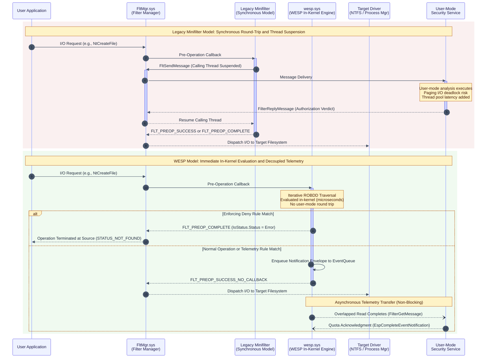
```mermaid
%%{init: {'theme': 'base', 'themeVariables': {'darkMode': false, 'background': '#ffffff', 'primaryColor': '#ffffff', 'primaryTextColor': '#0f172a', 'primaryBorderColor': '#64748b', 'lineColor': '#475569', 'textColor': '#1e293b', 'actorBkg': '#eef2ff', 'actorBorder': '#4f46e5', 'actorTextColor': '#1e1b4b', 'actorLineColor': '#a5b4fc', 'signalColor': '#475569', 'signalTextColor': '#1e293b', 'labelBoxBkgColor': '#fef3c7', 'labelBoxBorderColor': '#b45309', 'labelTextColor': '#451a03', 'loopTextColor': '#1e293b', 'noteBkgColor': '#fef3c7', 'noteBorderColor': '#b45309', 'noteTextColor': '#451a03', 'activationBkgColor': '#c7d2fe', 'activationBorderColor': '#4f46e5', 'sequenceNumberColor': '#0f172a'}, 'themeCSS': '.messageText { fill: #1e293b !important; stroke: none; } .actor text { fill: #1e1b4b; } .loopText { fill: #1e293b !important; } .labelText { fill: #451a03 !important; } .noteText { fill: #451a03 !important; } svg { background-color: #ffffff !important; }'}}%%
sequenceDiagram
    autonumber
    participant App as User Application
    participant FltMgr as FltMgr.sys<br/>(Filter Manager)
    participant Legacy as Legacy Minifilter<br/>(Synchronous Model)
    participant Wesp as wesp.sys<br/>(WESP In-Kernel Engine)
    participant FS as Target Driver<br/>(NTFS / Process Mgr)
    participant Service as User-Mode<br/>Security Service

    rect rgb(250, 240, 240)
        Note over App,Service: Legacy Minifilter Model: Synchronous Round-Trip and Thread Suspension
        App->>FltMgr: I/O Request (e.g., NtCreateFile)
        FltMgr->>Legacy: Pre-Operation Callback
        activate Legacy
        Legacy->>FltMgr: FltSendMessage (Calling Thread Suspended)
        activate FltMgr
        FltMgr->>Service: Message Delivery
        activate Service
        Note over Service: User-mode analysis executes<br/>Paging I/O deadlock risk<br/>Thread pool latency added
        Service-->>FltMgr: FilterReplyMessage (Authorization Verdict)
        deactivate Service
        FltMgr-->>Legacy: Resume Calling Thread
        deactivate FltMgr
        Legacy-->>FltMgr: FLT_PREOP_SUCCESS or FLT_PREOP_COMPLETE
        deactivate Legacy
        FltMgr-->>FS: Dispatch I/O to Target Filesystem
    end

    rect rgb(240, 250, 240)
        Note over App,Service: WESP Model: Immediate In-Kernel Evaluation and Decoupled Telemetry
        App->>FltMgr: I/O Request (e.g., NtCreateFile)
        FltMgr->>Wesp: Pre-Operation Callback
        activate Wesp
        Note over Wesp: Iterative ROBDD Traversal<br/>Evaluated in-kernel (microseconds)<br/>No user-mode round trip
        alt Enforcing Deny Rule Match
            Wesp-->>FltMgr: FLT_PREOP_COMPLETE (IoStatus.Status = Error)
            FltMgr-->>App: Operation Terminated at Source (STATUS_NOT_FOUND)
        else Normal Operation or Telemetry Rule Match
            Wesp->>Wesp: Enqueue Notification Envelope to EventQueue
            Wesp-->>FltMgr: FLT_PREOP_SUCCESS_NO_CALLBACK
            deactivate Wesp
            FltMgr-->>FS: Dispatch I/O to Target Filesystem
            Note over Wesp,Service: Asynchronous Telemetry Transfer (Non-Blocking)
            Wesp--)Service: Overlapped Read Completes (FilterGetMessage)
            Service--)Wesp: Quota Acknowledgment (EspCompleteEventNotification)
        end
    end
```

### Subsystem Goals and Deliverables

WESP delivers five primary architectural capabilities:

- **Low-Latency In-Kernel Enforcement**: Evaluates complex security rules inside pre-operation callbacks, returning definitive allow, block, or modify dispositions before operations reach target drivers.
- **Unified Multi-Subsystem Observation**: Consolidates telemetry across five distinct kernel subsystems (Process Manager, Object Manager, Configuration Manager, Filter Manager, and Kernel Transaction Manager) into a standardized event stream of 47 event types.
- **Deterministic Evaluation Paths**: Replaces runtime rule parsing with user-mode compiled Reduced Ordered Binary Decision Diagrams (ROBDDs) that the kernel traverses iteratively without stack recursion.
- **Quota-Driven System Protection**: Maintains system availability under telemetry floods by enforcing strict per-queue memory budgets, dropping excess telemetry rather than exhausting non-paged pool or throttling monitored applications.
- **Multi-Client Isolation and Ordering**: Enables multiple concurrent security consumers to operate independently, executing policy in relative altitude order with transactional registry persistence.

### Primary Use Cases

WESP serves three primary operational use cases:

- **Asynchronous EDR Telemetry Streaming**: Endpoint detection and response (EDR) sensors consume comprehensive process lineage, thread injection, registry mutation, and file access telemetry through asynchronous completion ports without degrading operating system performance.
- **Real-Time Malicious Activity Prevention**: Security products deploy in-kernel rules to block unauthorized process execution, prevent file creation in sensitive directories, or deny critical registry modifications at the point of origin.
- **Targeted Live Object Inspection**: Security agents query live, validated properties of active kernel entities (tokens, security descriptors, file streams, processes) using stable 64-bit opaque identifiers without holding dangerous raw pointer references.

### High-Level Architectural Model

WESP organizes endpoint security into three functional planes:

- **Control Plane**: Operates over Filter Manager communication port `\EspFilterPort`. It handles client registration, token security attribute verification, Protected Process Light (PPL) auditing, ahead-of-time user-space rule compilation into binary ROBDD blobs, rule deployment via synchronous message batches, collection management, and lifecycle teardown.
- **Data Plane**: Operates entirely in kernel mode. It intercepts operations across kernel subsystems, applies fast counter-based gating, executes iterative non-recursive traversals of the pre-compiled in-kernel BDD decision graphs, applies access-mask modifications, and enforces blocking verdicts in real time without user-mode IPC.
- **Telemetry Plane**: Mediates non-blocking event transfer. It delivers event envelopes across kernel queues to user-mode listeners using a two-stage retrieval protocol that separates fixed metadata headers from variable-length payloads. Boot-time telemetry enters through the `wesp_elam.sys` producer queue.

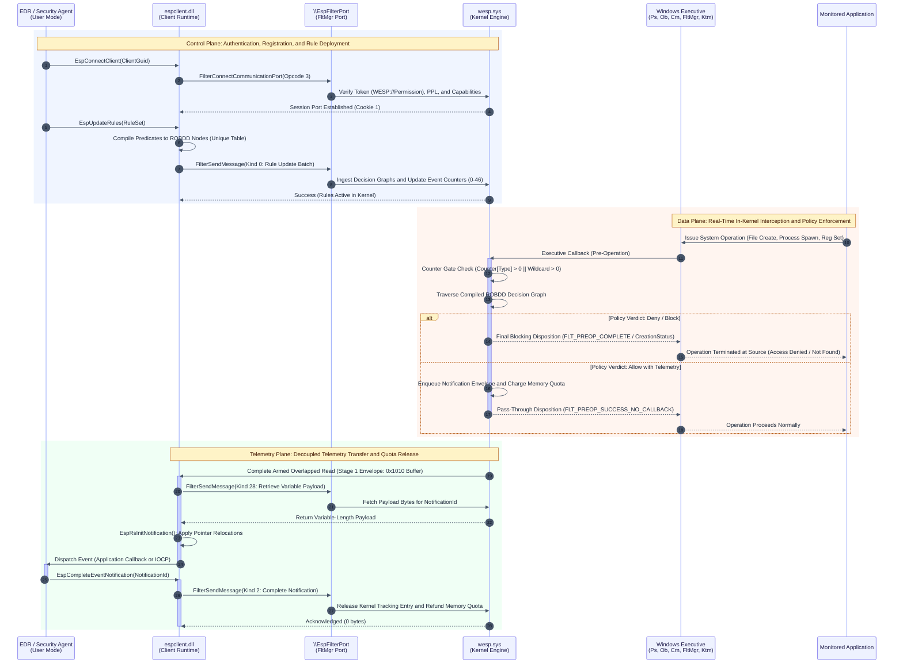
```mermaid
%%{init: {'theme': 'base', 'themeVariables': {'darkMode': false, 'background': '#ffffff', 'primaryColor': '#ffffff', 'primaryTextColor': '#0f172a', 'primaryBorderColor': '#64748b', 'lineColor': '#475569', 'textColor': '#1e293b', 'actorBkg': '#eef2ff', 'actorBorder': '#4f46e5', 'actorTextColor': '#1e1b4b', 'actorLineColor': '#a5b4fc', 'signalColor': '#475569', 'signalTextColor': '#1e293b', 'labelBoxBkgColor': '#fef3c7', 'labelBoxBorderColor': '#b45309', 'labelTextColor': '#451a03', 'loopTextColor': '#1e293b', 'noteBkgColor': '#fef3c7', 'noteBorderColor': '#b45309', 'noteTextColor': '#451a03', 'activationBkgColor': '#c7d2fe', 'activationBorderColor': '#4f46e5', 'sequenceNumberColor': '#0f172a'}, 'themeCSS': '.messageText { fill: #1e293b !important; stroke: none; } .actor text { fill: #1e1b4b; } .loopText { fill: #1e293b !important; } .labelText { fill: #451a03 !important; } .noteText { fill: #451a03 !important; } svg { background-color: #ffffff !important; }'}}%%
sequenceDiagram
    autonumber
    participant Agent as EDR / Security Agent<br/>(User Mode)
    participant Client as espclient.dll<br/>(Client Runtime)
    participant Port as \\EspFilterPort<br/>(FltMgr Port)
    participant Driver as wesp.sys<br/>(Kernel Engine)
    participant Exec as Windows Executive<br/>(Ps, Ob, Cm, FltMgr, Ktm)
    participant App as Monitored Application

    rect rgb(240, 245, 255)
        Note over Agent,Driver: Control Plane: Authentication, Registration, and Rule Deployment
        Agent->>Client: EspConnectClient(ClientGuid)
        Client->>Port: FilterConnectCommunicationPort(Opcode 3)
        Port->>Driver: Verify Token (WESP://Permission), PPL, and Capabilities
        Driver-->>Client: Session Port Established (Cookie 1)
        Agent->>Client: EspUpdateRules(RuleSet)
        Client->>Client: Compile Predicates to ROBDD Nodes (Unique Table)
        Client->>Port: FilterSendMessage(Kind 0: Rule Update Batch)
        Port->>Driver: Ingest Decision Graphs and Update Event Counters (0-46)
        Driver-->>Client: Success (Rules Active in Kernel)
    end

    rect rgb(255, 245, 240)
        Note over App,Exec: Data Plane: Real-Time In-Kernel Interception and Policy Enforcement
        App->>Exec: Issue System Operation (File Create, Process Spawn, Reg Set)
        Exec->>Driver: Executive Callback (Pre-Operation)
        activate Driver
        Driver->>Driver: Counter Gate Check (Counter[Type] > 0 || Wildcard > 0)
        Driver->>Driver: Traverse Compiled ROBDD Decision Graph
        alt Policy Verdict: Deny / Block
            Driver-->>Exec: Final Blocking Disposition (FLT_PREOP_COMPLETE / CreationStatus)
            Exec-->>App: Operation Terminated at Source (Access Denied / Not Found)
        else Policy Verdict: Allow with Telemetry
            Driver->>Driver: Enqueue Notification Envelope and Charge Memory Quota
            Driver-->>Exec: Pass-Through Disposition (FLT_PREOP_SUCCESS_NO_CALLBACK)
            deactivate Driver
            Exec-->>App: Operation Proceeds Normally
        end
    end

    rect rgb(240, 255, 245)
        Note over Client,Driver: Telemetry Plane: Decoupled Telemetry Transfer and Quota Release
        Driver->>Client: Complete Armed Overlapped Read (Stage 1 Envelope: 0x1010 Buffer)
        activate Client
        Client->>Port: FilterSendMessage(Kind 28: Retrieve Variable Payload)
        Port->>Driver: Fetch Payload Bytes for NotificationId
        Driver-->>Client: Return Variable-Length Payload
        Client->>Client: EspRsInitNotification(): Apply Pointer Relocations
        Client->>Agent: Dispatch Event (Application Callback or IOCP)
        deactivate Client
        activate Agent
        Agent->>Client: EspCompleteEventNotification(NotificationId)
        deactivate Agent
        activate Client
        Client->>Port: FilterSendMessage(Kind 2: Complete Notification)
        Port->>Driver: Release Kernel Tracking Entry and Refund Memory Quota
        Driver-->>Client: Acknowledged (0 bytes)
        deactivate Client
    end
```

### Platform Binaries and Operating Environment

The platform is delivered through three coordinated binaries:

- **`wesp.sys` (Kernel Engine)**: A kernel-mode filesystem minifilter driver and event mediation engine. It attaches within Filter Manager at altitude `329500` (in the `FSFilter Anti-Virus` load order group), positioning it directly above the Windows Defender minifilter (`WdFilter.sys` at altitude `328010`). It intercepts system activity and executes in-kernel policy.
- **`wesp_elam.sys` (Early-Boot Policy-Evaluation Node)**: A kernel-mode driver that evaluates boot-driver load records and registry activity against locally loaded platform rules, writes verdicts back through the boot callback, and stages evaluated notifications in the 64MB shared queue section for draining by `wesp.sys`.
- **`espclient.dll` (User-Mode Client Runtime)**: A client library providing an exported C application programming interface (API) and internal C++ handle management runtime. It compiles rule trees into binary decision graphs, manages event queue listener threads, and marshals communication across `\EspFilterPort`.

### Core Architectural Principles

The architecture of WESP is governed by six core architectural principles:

- **Compile Once in User Space, Evaluate Many in Kernel**: Complex detection policies compile in user mode (`espclient.dll`) into Reduced Ordered Binary Decision Diagrams (ROBDDs) and string pattern matching structures. The resulting binary decision graph is serialized and transmitted to the kernel once as a pre-compiled blob. The kernel driver (`wesp.sys`) executes pure iterative BDD traversals without recursion, drawing scratch memory from pre-allocated lookaside lists.
- **Decoupled Telemetry and Enforcement**: Asynchronous telemetry delivery is decoupled from active policy enforcement. Notification delivery never stalls kernel I/O, and completion messages are quota acknowledgments rather than synchronous replies.
- **Hierarchical Evaluation Order**: In-path evaluation enforces strict ordering: connected clients evaluate in descending altitude order; within a client, rules partition by event type and evaluate by explicit order keys, resolving ties by insertion order.
- **Stable Object Identity Abstraction**: Kernel virtual addresses are shielded from user space through opaque 64-bit event object identifiers drawn from a monotonic counter, maintaining stable identity across the lifetime of held references.
- **Quota-Driven Backpressure**: Kernel notification queues enforce strict memory quotas computed as a 4,096-byte baseline per notification plus 65,536 bytes per variable payload element. Under queue saturation, subsequent telemetry is dropped to protect host non-paged pool memory.
- **Multi-Layered Trust Boundary**: Access to the platform is guarded by a multi-stage authorization sequence combining communication port access control, token security attributes (`WESP://Permission`), Protected Process Light verification, an altitude-sorted allowlist, and per-message capability gates.

### Specification Scope and Purpose

This document establishes the self-contained high-level architectural specification, functional contracts, and component interaction models for WESP, derived through reverse engineering of the platform binaries. It serves as the authoritative conceptual reference for the platform, defining system architecture, communication protocols, enforcement primitives, and data structures.

### Build Provenance and Target Environment Identity

Analysis of WESP spans two specific Windows 11 Insider Preview builds. Every empirical claim in this specification is grounded in one of these two targets:

| Target Identifier                 | Operating System Build | Binary Under Test                                             | File Size                 | Verified Functionality                                                                                                                                                                            |
| :-------------------------------- | :--------------------- | :------------------------------------------------------------ | :------------------------ | :------------------------------------------------------------------------------------------------------------------------------------------------------------------------------------------------ |
| **Enforcement Verification Host** | `10.0.29641.0`         | `wesp.sys` / `espclient.dll`                                  | 4,223,608 B / 1,108,088 B | Dynamic kernel debugging (`kd.exe`) host: two-sided gate intersection, native `2000` FoCreate deny (`0x80070490`), `--enforce-compat` process create deny (`0x80004005`), and disposition tables. |
| **Reference Build**               | `10.0.29667.1000`      | `wesp.sys` / `espclient.dll` (file version `0.1.0.156346177`) | 4,338,320 B / 1,122,960 B | Primary reference                                                                                                                                                                                 |

### Dual-Language Architecture and Schema Invariants

Both platform binaries implement a hybrid C++ and Rust software architecture combining type safety with native Windows executive compatibility:

- **Kernel Driver (`wesp.sys`)**: Built primarily in Rust (representing 99.7 percent of internal class methods) under the `wesp_lib` crate. A thin C++ wrapper layer exports standard driver entry points, exception handlers, and 45 exported `EspFs*`/`EspKtm*` callback trampolines that satisfy Filter Manager calling conventions. The export table carries 50 entries in total (unique ordinals 1 through 50): `DriverEntry`, the 45 `EspFs*`/`EspKtm*` trampolines (ordinals 2 through 46), and four CRT and exception-handling helpers (`__CxxFrameHandler3`, `__CxxFrameHandler4`, `__GSHandlerCheck_EH4`, `_fltused`).
- **User-Mode Client (`espclient.dll`)**: Implements an exported C API and internal C++ handle management layer (`Esp::` namespace) wrapping the Rust core (`espclient_rs` crate) across a boundary of 38 `EspRs*` shims and 6 `EspCpp*` reverse callbacks.
- **Shared Schema (`wesp_api_types`)**: Both binaries compile the common `wesp_api_types` Rust crate. This guarantees strict byte-level synchronization of binary serialization formats, structure alignments, and opcode definitions without manual header maintenance.
- **Fail-Closed Wire Validation**: Binary decoding routines enforce zero-copy validation rules (`is_bit_valid`). If an untrusted caller transmits an unrecognized enum discriminant or malformed byte sequence, the parser rejects the message before it reaches the rule engine or dispatch tables.

The reference-build driver leaves 40 functions unnamed. These are statically linked Rust `core`/`alloc` runtime glue, not application logic: 21 are `core::fmt`/`core::str` formatting primitives (SIMD UTF-8 validation, integer-to-decimal and hex formatting, `Debug` struct formatters), and 19 are panic and allocation-failure shims that funnel into `wesp::panic`. The missing names are a symbol-demangling gap, not a signal of unreviewed business logic.

The kernel interception path is a three-layer chain. Filter Manager invokes the Rust `fltmgr::callback::*` stubs registered in `FLT_REGISTRATION`; those stubs call the non-exported `EspFltPre*` / `EspFltPost*` C adapter; the adapter calls the exported `EspFs*` / `EspKtm*` bodies at PE ordinals 2 through 46. Registry, object, and process interception bypass that chain and enter through their own Rust stubs (`cm::callback::*`, `ob::*`, `ps::*`).

Five exports share a single body: `EspFsPipePreCreate`, `EspFsMailslotPreCreate`, `EspFsVolumePostDismount`, `EspKtmTransactionPostCommit`, and `EspKtmTransactionPostRollback` all alias `EspFsVolumePreDismount` (ordinal 40). Pipe and mailslot pre-create perform no work on the pre path; those events are generated on the post path by `EspFsPipePostCreate` and `EspFsMailslotPostCreate`.

### Source Tree and Build Provenance

Recovered PDB paths and embedded compiler diagnostic strings establish the original source organization across both binaries:

- **Driver Crate Architecture (`wesp.sys`)**: Structured as a modular Rust workspace under `wesp_lib`. Core crates handle Filter Manager callback trampolines (`crates\fltmgr`), process notification hooks (`crates\ps`), file object argument containers (`crates\fs`), ROBDD compilation and deduplication (`crates\bdd`), ELAM boot interop (`crates\elam-interop`), and communication port server dispatch (`sys\src\server.rs`). Internal modules manage rule tables, in-flight quota accounting, and registry callback synchronization.
- **Client Architecture (`espclient.dll`)**: Structured as a dual-layer runtime where an exported C API layer (`client\dll\api.cpp`) and an internal C++ handle management library (`client\lib\`) wrap the compiled Rust core (`espclient_rs`) across 38 FFI shims and 6 reverse callbacks.

For the exhaustive inventory of recovered panic strings, assertion diagnostics, and PDB file paths, refer to [Annexes and Reference Tables](#annexes-and-reference-tables) ([Retrieved Panic String and PDB Path Inventory](#retrieved-panic-string-and-pdb-path-inventory)).

Analysis of Windows 11 Insider build targets identifies the primary consumer of WESP as the Microsoft Defender antivirus subsystem.

### Target Host Integration

In the examined Windows 11 installation, the only binary linking against `espclient.dll` is `MpRtp.dll` (Defender Real-Time Protection SideBand plugin, build 4.18.26080.3). `MpRtp.dll` executes within the protected process environment of `MsMpEng.exe` (running under the `WinDefend` service identity; the extraction contains no `MpRtp` or `WinDefend` reference confirming the host process).

The plugin imports 15 specific functions from `espclient.dll` through plain bound-IAT entries (no delay-load machinery):

- Connection and Registration: `EspConnectClient`, `EspRegisterClient`, `EspDisconnectClient`.
- Event Queue Management: `EspCreateEventQueue`, `EspConnectEventQueueWithCallback`, `EspCloseEventQueue`.
- Rule Configuration: `EspCreateRule`, `EspCreateFileObjectFilter`, `EspUpdateRules`, `EspCloseRule`, `EspCloseFilter`.
- Notification Processing: `EspAllocateEventNotification`, `EspArmEventNotification`, `EspCompleteEventNotification`, `EspFreeEventNotification`.

This functional set represents an end-to-end telemetry lifecycle: registering as an authorized consumer, creating an event queue, establishing an in-kernel file object filter rule, handling incoming notifications via callback, and acknowledging completion.

`MpRtp.dll` does not create object references, query typed properties, manage collections, or attach context keys. Those exports exist on `espclient.dll` and are unused by the Defender plugin (`MpRtp.dll`). The plugin's client GUID is `{EDCF342B-E484-43A0-A8A6-A76C7ACAE8BF}`. Its two rules use priority 100 and attach the queue handle; the 26060 build filters pipe opens with the 38-byte comparand `\Device\NamedPipe\*`, while the 26080 build uses a type-based filter (property 28 equals 3).

### Research Harness (`esptool`)

The research harness around WESP is `esptool`, a user-mode tool that loads `espclient.dll` and drives the public export catalog. The harness exposes a command surface over an XML rule language, with shipped rule documents, rule leaf files, and a per-event-type support matrix. `--enforce-compat` is an in-memory `from_ffi` patch in the installing process. Native deny is file create (`2000`) only. The kernel model is documented in [Policy Enforcement, Disposition Tables, and Deny Flow](#policy-enforcement-disposition-tables-and-deny-flow).

### Sensor Platform Gating

WESP functionality within Defender is controlled through an explicit feature flag: `MpFC_EnableSensorPlatformWespSideBand`. This wide-string configuration token is present across multiple Defender support modules, including `WdFilter.sys`, `MpSvc.dll`, `MpUxAgent.dll` (no binary in the analyzed module set), `MpDlp.dll`, and `MpDefenderCoreService.exe`. WESP is positioned as a sensor platform interface for Windows Defender and partner endpoint security agents.

### Provisioning Component Gap

The primary authorization gate of WESP requires a security token attribute named `WESP://Permission`. The provisioning component that stamps this attribute is absent from the examined build.

`SeSetSecurityAttributesToken` is the kernel interface that attaches a security attribute to a token. The complete set of binaries that import this interface on the examined target is:

| Importer                           | Attribute stamped                                                         |
| ---------------------------------- | ------------------------------------------------------------------------- |
| `System32\drivers\WdFilter.sys`    | `WinDefend://MpDlpProcessIdentifier`                                      |
| `System32\drivers\wd\WdFilter.sys` | `WinDefend://MpDlpProcessIdentifier`                                      |
| `System32\drivers\appid.sys`       | AppLocker (`AipDefaultAttributes`, `SrpReplaceOperations`, Enterprise ID) |

No stamping component exists on any examined surface. The exact string `WESP://Permission` occurs in one place (the `memcmp` target in the port connect handler, the consumer) across 21 analyzed modules and a wide-string scan of 14 binaries (only `wesp.sys` contains it).

No token-set caller exists outside `ntoskrnl.exe`, no `TOKEN_SECURITY_ATTRIBUTE_V1` reference exists in the analyzed code, and Defender user-mode modules expose query-side token APIs only. On the reference build, `wesp.sys` is the sole string holder among 5830 files (System32 recursive _.sys/_.dll/\*.exe scope), with no new importer, and zero of 180 processes carry the attribute (token census).

Connect-time validation never reads the attribute `Flags` field (the walk reads the attribute name header, name buffer pointer, value type, value count, and values pointer, never the flags field), so child-process inheritance of the marker depends entirely on the flags chosen by whatever component stamps it. `Flags` precedents are `0x41` (`WdFilter`, `appid` integer path), `0x43` (`appid` string path), and `0x42` (the sole `OCTET_STRING` precedent); bit 6 (`0x40`) is set in all three precedents.

## Operating Environment and Altitudes

The operating environment of WESP is governed by Windows Filter Manager altitude mechanics, installation-time service configurations, client altitude hierarchies, and strict communication port quotas.

### Minifilter Altitude and Load Order Group

The `wesp.sys` kernel driver attaches to storage volumes within the Filter Manager framework at altitude `329500`, assigned to the `FSFilter Anti-Virus` load order group. In the Windows I/O filtering model:

- **Altitude Band**: The `FSFilter Anti-Virus` group spans altitudes `320000` to `329999`. Within this band, higher numerical altitudes evaluate pre-operation callbacks earlier and post-operation callbacks later.
- **Precedence over Windows Defender**: The standard Windows Defender minifilter (`WdFilter.sys`) operates at altitude `328010`. Operating at altitude `329500` positions `wesp.sys` strictly above `WdFilter.sys`. During pre-operation processing, `wesp.sys` inspects and enforces policy on incoming I/O requests before `WdFilter.sys` receives the callback data. Conversely, during post-operation completion, `wesp.sys` executes after `WdFilter.sys` has finalized its inspection.
- **Service Configuration**: Minifilter altitudes and load order groups are installation-time properties configured under the driver's service key (`HKLM\SYSTEM\CurrentControlSet\Services\Wesp\Instances\wesp Instance`) through the `Altitude` and `Flags` values. They are not hardcoded into the driver PE image. A running system exposes these values via `fltmc instances` and registry enumeration.

### Client Registration Altitudes and Multi-Client Arbitration

While `wesp.sys` holds a single minifilter altitude in the kernel, user-mode security clients register their own operational altitudes during identity registration:

- **Client Altitude Ordering**: Each registered client specifies an altitude string in its descriptor (for example, `MpRtp.dll` registers under altitude `328000`). The driver stores clients in an in-memory collection sorted via `RtlCompareAltitudes`.
- **Precedence in Evaluation**: When an intercepted event occurs, the kernel dispatcher traverses registered clients in descending altitude order. If a higher-altitude client returns a blocking disposition (`FLT_PREOP_COMPLETE`), the operation terminates immediately, and lower-altitude clients receive no further callbacks.
- **Collision Detection**: If a connecting client supplies an altitude string matching an already-connected client, `wesp.sys` rejects registration with `STATUS_OBJECT_NAME_COLLISION` (`0xC0000035`), ensuring unique execution order across all attached security agents.

### Communication Port Architecture and Connection Limits

User-mode communication with `wesp.sys` traverses a dedicated Filter Manager communication port named `\EspFilterPort`:

- **Connection Ceiling (`MaxConnections`)**: The port is initialized via `FltCreateCommunicationPort` with `MaxConnections` set to `512`. This limit bounds the number of simultaneous active `PFLT_PORT` handles maintained by the kernel driver across all client sessions, event queues, and state-change channels.
- **Exhaustion Behavior**: If client processes leak port handles and reach the 512-connection ceiling, subsequent `FilterConnectCommunicationPort` requests fail with `STATUS_INSUFFICIENT_RESOURCES` (`0xC000009A` / `0x8007000E`). Existing connections continue operating normally without global degradation.
- **Security Descriptor**: The port object is created with a strict security descriptor (`D:(A;;0x1f0001;;;BA)(A;;0x1f0001;;;SY)`) granting `FLT_PORT_ALL_ACCESS` only to `BUILTIN\Administrators` and `NT AUTHORITY\SYSTEM`. Unprivileged callers are rejected at the object manager layer with `0x80070005` (`ERROR_ACCESS_DENIED`) before driver connect callbacks execute.

## Wire Protocol, Connection Roles, and Communication Ports

Communication between `espclient.dll` and `wesp.sys` relies on three Windows Filter Manager communication primitives:

- `FilterConnectCommunicationPort`: Establishes control, event queue, and state-change communication channels using tag-prefixed connection contexts.
- `FilterSendMessage`: Synchronously transmits client requests (rule updates, object queries, handle operations) and receives immediate kernel responses.
- `FilterGetMessage`: Asynchronously receives notification envelopes from kernel queues into client-provided buffers.

`FilterConnectCommunicationPort` is not a named-pipe open. The user-mode library issues an `NtCreateFile` of `\Global??\FltMgrMsg` whose named extended attribute (`FLTPORT`) carries the filter name and the `ConnectionContext`. Filter Manager checks the port object security descriptor, allocates a `PFLT_PORT`, and calls the filter's connect notify callback with that context. Later sends call the message notify callback on the same cookie, and `FilterGetMessage` parks an IRP that kernel `FltSendMessage` completes.

The communication port is a control and telemetry channel only. Opening it, connecting a session, or sending rule updates never attaches or detaches a minifilter instance; the port mutates an in-memory client table and the active event counters that already-attached callbacks consult. Attaching is performed solely by Filter Manager at `FltStartFiltering` and at volume arrival.

A primary architectural design element of WESP is the omission of `FilterReplyMessage`. In legacy antivirus minifilter architectures, a driver intercepts an I/O request, calls `FltSendMessage`, and synchronously blocks the calling thread while waiting for a user-mode `FilterReplyMessage` before allowing the I/O to proceed. This model introduces thread pool latency, deadlocks during system paging, and system unresponsiveness if the user-mode agent hangs.

In WESP, `FilterReplyMessage` is neither imported nor called. The kernel driver never blocks in an I/O path waiting for user-mode analysis. Decisions execute strictly in-kernel using compiled rule trees, while user-mode notification delivery is completely decoupled:

- Minifilter callbacks return an immediate disposition to Filter Manager.
- Notifications are enqueued into non-paged kernel queues.
- User-mode agents retrieve telemetry through worker threads or I/O Completion Ports.
- Completion messages (`EspCompleteEventNotification`) are lifecycle acknowledgments that release kernel tracking quotas; they cannot alter or reverse an already-completed kernel I/O operation.
- The driver also omits `FltCompletePendedPreOperation` and `FltCompletePendedPostOperation` from its import surface: no code path pends an I/O operation for later in-kernel completion, so every interception decision is finalized inside the originating callback.

Communication across `\EspFilterPort` is governed by strict framing conventions and role-based request handling.

### Connection Roles and Message Partitioning

A connection established over `\EspFilterPort` operates within one of three mutually exclusive connection roles:

- **Role 0 (Control Port)**: Created during initial client management. It handles client enumeration and metadata discovery. Valid wire message tags are restricted to tags 7, 8, 9, and error sentinel 30.
- **Role 1 (Client Message Port)**: Created for active client sessions. It handles rule deployment, object referencing, property queries, and collection/context-key updates. Wire tags 0 through 5 parse to internal discriminants 0 through 5; wire tag 6 carries the object-property query with an unresolved driver discriminant; wire tags 7, 8, and 9 are control-port tags rejected at decode; wire tag 10 carries the event-capability query; wire tags 11 and 12 carry enumerate-shaped and remove-all-shaped operations; wire tags 13 through 27 map to internal discriminants 10 through 24 as a structural mapping; wire tag 28 carries payload retrieval; wire tags 29 and 30 are reserved and return `0x80070057` uniformly. The role guard requires `verify_capabilities == 8` (any other value rejects with `0xC0000022`); `0xC0000042` was never observed because decode-layer rejections surface first.
- **Role 2 (Event Queue Port)**: Created specifically for event queue instances. It accepts notification completion acknowledgments (wire tag 2 / internal discriminant 2) and variable payload retrieval requests (wire tag 28). Queue-port retrieval was not exercised, so that half of the accepted set is structural only.

Requests that violate the role partition fail at two distinct layers. Control-port-only tags (7, 8, 9) received on a Role 1 port fail at the decode layer and surface in user mode as `HRESULT_FROM_WIN32(ERROR_INVALID_FUNCTION)` (`0x80070001`); the decode routine returns `STATUS_NOT_IMPLEMENTED` (`0xC0000002`), which the client-side `RtlNtStatusToDosError` conversion maps to `ERROR_INVALID_FUNCTION` (`1`) and then to that HRESULT. Reserved tags 29 and 30 return `E_INVALIDARG` (`0x80070057`) uniformly on all roles. Separately, capability-gate denials return `STATUS_ACCESS_DENIED` (`0xC0000022`); the `STATUS_INVALID_PORT_HANDLE` (`0xC0000042`) path was never observed because decode-layer rejections surface first. A fourth role value (3) exists in the role decode switch and is rejected unconditionally with that status; opcode 6 mints cookie 3 (the held state-change port), and all sends on it are rejected with that status.

### Wire Tag to Internal Discriminant Mapping

At the decode layer, wire message tags undergo translation to internal Rust message discriminants. The wire tag is the kind number carried on the wire; the internal discriminant is the variant selector of the decoded in-memory message, and it is the value the capability gate and the dispatch switch test:

- Wire Tags 0 through 5: Mapped directly to internal discriminants 0 through 5 (Identity mapping).
- Wire Tag 6: Object-property query on the session plane; the driver discriminant is unresolved and no internal value is asserted.
- Wire Tags 7, 8, 9: Reserved for Control Port (Role 0); rejected at decode if received on Role 1.
- Wire Tag 10: Event-capability query (4-byte mask).
- Wire Tags 11 and 12: Enumerate-shaped and remove-all-shaped operations.
- Wire Tags 13 through 27: Translated by subtracting 3 (`internal_discriminant = wire_tag - 3`), giving discriminants 10 through 24. This is the structural mapping; per-wire behavior is not re-verified.
- Wire Tag 28: Payload retrieval.
- Wire Tags 29 and 30: Reserved; both return `0x80070057` uniformly on all roles.

### Connect-Context Opcode Catalog (Opcodes 1 to 6)

Supplied in the connection context buffer of `FilterConnectCommunicationPort`:

- **Opcode 1 (Client Registration)**: Context size 24 bytes base plus string buffers. Transmits client GUID, name length, altitude length, wide name string, and wide altitude string. Registers client in durable allowlist.
- **Opcode 2 (Client Unregistration)**: Context size 20 bytes. Transmits opcode 2 followed by the 16-byte client GUID. Deletes client and associated rules from registry store.
- **Opcode 3 (Client Connection)**: Context size 20 bytes. Transmits opcode 3 followed by the 16-byte client GUID. Establishes a persistent client session on Role 1.
- **Opcode 4 (Event Queue Connection)**: Context size 36 bytes. Transmits opcode 4, 16-byte client handle pair, and 16-byte queue GUID. Establishes an event delivery port on Role 2.
- **Opcode 5 (Client Descriptor Query)**: Context size 12 bytes on the client (the driver accepts any length of at least 4 for opcode 5). Transmits opcode 5 and establishes an ephemeral control connection; the descriptor query itself rides the message channel (kind 9) after the connection is up. It mints cookie type `0` and does not enter the `WESP://Permission`, PPL, or code-integrity path (gate D); it is the only opcode that bypasses the claim check, so it is the unauthenticated administrative and enumeration plane (kinds 7, 8, and 9).
- **Opcode 6 (State-Change Channel Connection)**: Context size 40 bytes. Transmits opcode 6, client reference, queue GUID, and two configuration option bytes. Establishes the dedicated 4-byte state-change channel.

The opcode determines the cookie type that `message_notify` later switches on. Opcode 1, opcode 2, and opcode 5 mint cookie type `0` (the admin plane), opcode 3 mints cookie type `1` (the session, which carries rule updates and the kind 0 path), opcode 4 mints cookie type `2` (the event-queue port, which accepts only notification completion and payload retrieval), and opcode 6 mints cookie type `3` (the state-change port, which accepts no messages). Opcode 2 is client unregistration, not a reattach; the attach-to-existing-identity path is opcode 3.

### Connection Cookies and Port Model

The cookie type is the first QWORD of the 40-byte inner session object, and `message_notify` switches on it. Two allocations back each connection: a 24-byte Filter Manager connection cookie (holding the inner session-object pointer, the engine state, and the port handle) and the 40-byte inner session object that the switch reads.

| Cookie | Minted by         | Parser                                            | Allowed kinds                                                                                |
| ------ | ----------------- | ------------------------------------------------- | -------------------------------------------------------------------------------------------- |
| `0`    | Opcode 1, 2, or 5 | raw `ClientRequest`                               | Wire 7, 8, and 9 only (enumerate). No `verify_capabilities`.                                 |
| `1`    | Opcode 3          | `try_read_buffer` plus `verify_capabilities == 8` | Wire tags 0 through 6 and 10 through 28 (tags 7, 8, 9 decode-rejected; tags 29, 30 reserved) |
| `2`    | Opcode 4          | same                                              | Wire tags 2 and 28 only (notification complete and payload retrieval)                        |
| `3`    | Opcode 6          | none                                              | none (`0xC0000042`)                                                                          |

A fully armed product client holds up to four Filter Manager connections at once, one per cookie: the opcode-3 session port (cookie 1, which carries `EspUpdateRules` kind 0), the opcode-4 queue port (cookie 2, which carries completion kind 2 and payload kind 28), the opcode-6 state-change port (cookie 3), and, transiently, the opcode-1 registration port or the opcode-5 admin port (cookie 0, closed immediately after the enumeration).

The lifecycles differ:

| Operation         | Survives process exit                              | Survives reboot                      |
| ----------------- | -------------------------------------------------- | ------------------------------------ |
| Opcode 1 register | Yes, in the client table                           | Yes, if the persist blob was written |
| Opcode 3 session  | No; the cookie dies on `CloseHandle` or disconnect | No                                   |
| Opcode 4 queue    | No                                                 | No                                   |
| Kind 0 rules      | Yes, for the registered client                     | Yes, if persist was committed        |

The session tier is the low byte of the client session trust tier:

| Value | Writer                                                                                                                           | Message plane                                                                            |
| ----- | -------------------------------------------------------------------------------------------------------------------------------- | ---------------------------------------------------------------------------------------- |
| `0`   | Full-tier connect                                                                                                                | Tier 0, all kinds                                                                        |
| `1`   | Restricted-tier connect                                                                                                          | Tier 1, gated                                                                            |
| `2`   | Initial value (sentinel `2`; `ClientState::new` attribution is unisolated; the `disconnect_client` reset path writes this value) | Deny                                                                                     |
| `3`   | Reserved (no producer in code)                                                                                                   | Passes the shared wait-gate with connected states; excluded from connected enumerations  |
| `4`   | `disconnect_client` entry                                                                                                        | Disconnect-in-progress; state readers block on the condvar until disconnect restores `2` |
| `5`   | `start_unregister`                                                                                                               | Deny                                                                                     |
| `6`   | `finish_unregister`                                                                                                              | Deny (terminal)                                                                          |

`verify_capabilities` treats any value greater than `1` as deny-all. A shared normalization maps raw states 0, 1, and 3 to the connected group, state 2 to disconnected, and state 4 to a condvar wait; `disconnect_client` panics with an "already disconnected" message when the prior state is 2 or higher. Unregister succeeds only when the target rests in state 2; any other state fails in the driver with `0xC000A003`, which `FilterConnectCommunicationPort` renders as `0x8007139F` (`ERROR_INVALID_STATE`). `FltCreateCommunicationPort` is created with `MaxConnections` 512, which bounds simultaneous `PFLT_PORT` objects rather than registered clients; opcode 1, opcode 2, and opcode 5 handles close within the issuing call and hold it only briefly.

On the reference build, opcode 5 with a 4-byte or 12-byte context returns `S_OK` and a handle, and kind 8 on that handle returns `S_OK` with a zero GUID count; opcode 3 with a fresh random GUID returns `0x80070490`; a Low-IL opcode 3 returns `0x80070005`; and kind 0 on the admin handle returns `0x80070006`.

### Consolidated Wire Protocol Matrix

| Wire Tag | Internal Discr. |  Permitted Role  | Operation / Message Name           | Input Payload Structure                             | Output / Reply Structure                                                | Capability / Trust Gate                                             |
| :------: | :-------------: | :--------------: | :--------------------------------- | :-------------------------------------------------- | :---------------------------------------------------------------------- | :------------------------------------------------------------------ |
|   `0`    |       `0`       | Role 1 (Session) | Rule Update Batch                  | 64B `ClientRequest` + array of `RuleUpdate` records | 0B (`STATUS_SUCCESS`)                                                   | Tier 0 & Tier 1 (All connected clients)                             |
|   `1`    |       `1`       | Role 1 (Session) | Set Event Object Context Key       | 64B `ClientRequest` (event object id, key, value)   | 0B                                                                      | Full Trust (Tier 0 only; Tier 1 denied)                             |
|   `2`    |       `2`       |  Role 2 (Queue)  | Complete Asynchronous Notification | 64B `ClientRequest` (notification id)               | 0B (releases tracking & quota)                                          | Role 2 only (rejected on Role 1)                                    |
|   `3`    |       `3`       | Role 1 (Session) | Reference Event Object             | 64B `ClientRequest` (key kind 1-15, payload)        | 32B reply blob (`CloseKey`, IDs, `TypeCode`)                            | Full Trust (Tier 0 only; Tier 1 denied)                             |
|   `4`    |       `4`       | Role 1 (Session) | Close Event Object Reference       | 64B `ClientRequest` (`CloseKey`)                    | 0B                                                                      | Tier 0 & Tier 1                                                     |
|   `5`    |       `5`       | Role 1 (Session) | Reserved (no sender)               | 64B `ClientRequest` (any payload)                   | Driver arm writes a diagnostic ETW event and returns                    | No `Esp*` export sends wire tag 5                                   |
|   `6`    |       N/A       | Role 1 (Session) | Query Object Properties            | 64B `ClientRequest` + output buffer (256B initial)  | Property Data Bytes (resize on `0x8007007A`); invalid refs `0x80070057` | Tier 0 (all) / Tier 1 (kinds 1-20 only)                             |
|   `7`    |       N/A       | Role 0 (Control) | Enumerate Registered Clients       | 64B `ClientRequest` (kind 7)                        | Array of Client GUIDs + trailing u32 count                              | Role 0 only (rejected on Role 1)                                    |
|   `8`    |       N/A       | Role 0 (Control) | Enumerate Connected Clients        | 64B `ClientRequest` (kind 8)                        | Array of Active Client GUIDs + count                                    | Role 0 only (rejected on Role 1)                                    |
|   `9`    |       N/A       | Role 0 (Control) | Query Client Descriptor            | 64B `ClientRequest` (target client GUID)            | 32B header + UTF-16 Name & Altitude                                     | Role 0 only (rejected on Role 1)                                    |
|   `10`   |       `8`       | Role 1 (Session) | Get Event Capabilities             | 64B `ClientRequest` (sparse event type)             | 4B capability bitmask (`BytesReturned == 4`)                            | Tier 0 & Tier 1                                                     |
|   `11`   |       `8`       | Role 1 (Session) | Enumerate Client Rules             | 64B `ClientRequest` (kind 11)                       | Array of Rule GUIDs + trailing count                                    | Tier 0 & Tier 1                                                     |
|   `12`   |       `9`       | Role 1 (Session) | Remove All Client Rules            | 64B `ClientRequest` (kind 12)                       | 0B                                                                      | Tier 0 & Tier 1                                                     |
|   `13`   |      `10`       | Role 1 (Session) | Remove Client Rules (by lifetime)  | 64B `ClientRequest` (lifetime filter)               | 0B                                                                      | Tier 0 & Tier 1                                                     |
|   `14`   |      `11`       | Role 1 (Session) | Set Client Context Key             | 64B `ClientRequest` (key identifier, value)         | 0B                                                                      | Full Trust (Tier 0 only; Tier 1 denied)                             |
|   `15`   |      `12`       | Role 1 (Session) | Enumerate All Client Context Keys  | 64B `ClientRequest` (kind 15)                       | Array of client context key entries                                     | Tier 0 & Tier 1                                                     |
|   `16`   |      `13`       | Role 1 (Session) | Enumerate All Event Object Keys    | 64B `ClientRequest` (event object id)               | Array of event object context keys                                      | Tier 0 & Tier 1                                                     |
|   `17`   |      `14`       | Role 1 (Session) | Create Collection                  | 64B `ClientRequest` (collection type 1-3, flags)    | 32B collection-output struct (GUID + handle)                            | Tier 0 (all flags) / Tier 1 (flags == 0)                            |
|   `18`   |      `15`       | Role 1 (Session) | Open Collection                    | 64B `ClientRequest` (collection GUID)               | Collection handle                                                       | Tier 0 & Tier 1                                                     |
|   `19`   |      `16`       | Role 1 (Session) | Close Collection                   | 64B `ClientRequest` (collection GUID)               | 0B                                                                      | Tier 0 & Tier 1                                                     |
|   `20`   |      `17`       | Role 1 (Session) | Update Collection Entries          | 64B `ClientRequest` + serialized entries vector     | 0B                                                                      | Tier 0 & Tier 1                                                     |
|   `21`   |      `18`       | Role 1 (Session) | Enumerate Collection IDs           | 64B `ClientRequest` (kind 21)                       | Array of Collection GUIDs + trailing count                              | Tier 0 & Tier 1                                                     |
|   `22`   |      `19`       | Role 1 (Session) | Enumerate Collection Entries       | 64B `ClientRequest` (collection GUID)               | Serialized collection entries array                                     | Tier 0 & Tier 1                                                     |
|   `23`   |      `20`       | Role 1 (Session) | Clear Event Queue                  | 64B `ClientRequest` (queue GUID)                    | 0B (flushes entries in buffered state 1)                                | Tier 0 & Tier 1                                                     |
|   `24`   |      `21`       | Role 1 (Session) | Enumerate Event Queue IDs          | 64B `ClientRequest` (kind 24)                       | Array of Queue GUIDs + trailing count                                   | Tier 0 & Tier 1                                                     |
|   `25`   |      `22`       | Role 1 (Session) | Create Event Queue                 | 64B `ClientRequest` (queue GUID, flags)             | 8B queue handle                                                         | Tier 0 (all flags) / Tier 1 (flags == 0)                            |
|   `26`   |      `23`       | Role 1 (Session) | Open Event Queue                   | 64B `ClientRequest` (queue GUID)                    | Event queue handle                                                      | Tier 0 & Tier 1                                                     |
|   `27`   |      `24`       | Role 1 (Session) | Close Event Queue                  | 64B `ClientRequest` (queue GUID)                    | 0B                                                                      | Tier 0 & Tier 1                                                     |
|   `28`   |       N/A       |  Role 2 (Queue)  | Retrieve Variable Payload          | 64B `ClientRequest` (notification id, length)       | Variable-length payload bytes                                           | Role 2 (Queue); Role 1 validates params (`0x80070057`/`0x80070006`) |
|   `29`   |       N/A       |    Role 0 & 1    | Reserved                           | 64B `ClientRequest` (any payload)                   | `0x80070057` uniform                                                    | None (always rejected)                                              |
|   `30`   |       N/A       |    Role 0 & 1    | Reserved                           | 64B `ClientRequest` (any payload)                   | `0x80070057` uniform                                                    | None (always rejected)                                              |

### Request Message Wire-Tag Catalog (Tags 0 to 28)

The connect context and the send buffer are separate namespaces, and the same small integers carry different meanings in each. Connect opcode `3` is `EspConnectClient`; send kind `2` is `EspCompleteEventNotification`. The connect context opcode and the synchronous request message kind represent separate integer namespaces.

Every `FilterSendMessage` request uses a 64-byte `ClientRequest` in-buffer. The kind is stored as a QWORD in the request header kind field; the kind-specific fields follow at the kind-specific payload area and are zero-padded to the end of the 64-byte request header. Kind 0 carries a separate serialized rule blob outside the 64 bytes.

Supplied in Header Word 0 of synchronous `FilterSendMessage` requests:

- `0`: **Rule Update Batch**: Transmits an array of `RuleUpdate` structures to add, modify, or remove in-kernel rules. Identity mapped to internal discriminant 0.
- `1`: **Set Event Object Context Key**: Attaches a context key to a specific event object (`EspRsSendSetEventObjectContext`). Identity mapped to internal discriminant 1. Client disconnect (`EspDisconnectClient`) sends no wire message; it closes the port handle locally.
- `2`: **Complete Asynchronous Notification**: Acknowledges processing completion for a notification identifier. Identity mapped to internal discriminant 2.
- `3`: **Reference Event Object**: Creates or duplicates an event object reference from a reference key (`EspRsSendReferenceEventObject`, 15-way key switch). Identity mapped to internal discriminant 3.
- `4`: **Close Event Object Reference**: Releases a previously created event object reference (`EspRsSendCloseEventObjectReference` transmitting `CloseKey`). Identity mapped to internal discriminant 4.
- `5`: **Reserved**: No `Esp*` export sends wire tag 5. The driver discriminant-5 arm writes a diagnostic ETW event and returns. Identity mapped to internal discriminant 5.
- `6`: **Query Object Properties**: Dispatches an on-demand property query against an object reference on the session plane. The client sends wire tag 6; invalid references are rejected with `0x80070057`. The driver discriminant is unresolved, so no internal value is asserted. The object-kind selector field of the property-query request selects the object kind (the driver range check requires the value below 16): `1` process, `2` thread, `3` registry key, `4` registry key object, `5` file object, `6` file stream, `7` file, `8` pipe, `9` mailslot, `10` volume, `11` disk, `12` client, `13` token, `14` KTM transaction, and `15` desktop. Tag `0` is unused by the client.
- `7`: **Enumerate Registered Clients**: Returns an array of GUIDs for all registered clients (Role 0 only).
- `8`: **Enumerate Connected Clients**: Returns an array of GUIDs for all currently active connections (Role 0 only).
- `9`: **Query Client Descriptor**: Returns the variable-length registration descriptor for a client GUID: 32-byte header (GUID echo plus name and altitude pointers) followed by UTF-16 name and altitude, minimum 36 bytes (Role 0 only). The 64-byte request carries the kind at the request header kind field and the target GUID at the target client GUID field; the 40-byte trailing padding area is copied and never read. Cookie-1 and cookie-2 delivery fail with `0xC0000002`; short input returns `0xC0000023`; unknown GUID returns `0xC0000225`; undersized output returns `0xC0000023` with the required count.
- `10` (Internal Discriminant 8): **Get Event Capabilities**: Queries supported capability bitmasks for an event type. The client pre-checks the type against 47 sparse values and aborts the process unless `BytesReturned` equals 4; the driver re-validates with `is_bit_valid`, admits tiers 0 and 1 on cookie-1 sessions, and dispatches through a per-type switch to the static capability-record table in read-only data (46 static 12-byte records, stride `0xC`), copying the flags field of each capability record. Capability flags are `2000` = `0x1B`, `3007` = `0x19`, `9000` = `0x07`, and `0x01` for the eight mask-table gaps. Type 0 passes both validators and is rejected at dispatch with `0xC000000D`.
- `11` (Internal Discriminant 8): **Enumerate Client Rules**: Returns an array of rule GUIDs configured for a client.
- `12` (Internal Discriminant 9): **Remove All Client Rules**: Deletes every rule belonging to the calling client; reply is 0 bytes; Tier 0 and Tier 1.
- `13` (Internal Discriminant 10): **Remove Client Rules**: Deletes rules filtered by lifetime category.
- `14` (Internal Discriminant 11): **Set Client Context Key**: Sets a persistent context key on the calling client object.
- `15` (Internal Discriminant 12): **Enumerate All Client Context Keys**: Retrieves all context keys defined on the client.
- `16` (Internal Discriminant 13): **Enumerate All Event Object Context Keys**: Retrieves all context keys defined on an event object.
- `17` (Internal Discriminant 14): **Create Collection**: Allocates a new client collection of a given type.
- `18` (Internal Discriminant 15): **Open Collection**: Binds to an existing collection by GUID.
- `19` (Internal Discriminant 16): **Close Collection**: Releases a collection handle.
- `20` (Internal Discriminant 17): **Update Collection Entries**: Adds or removes entries in a collection.
- `21` (Internal Discriminant 18): **Enumerate Collection IDs**: Lists collection GUIDs belonging to a client.
- `22` (Internal Discriminant 19): **Enumerate Collection Entries**: Retrieves entry data stored within a collection.
- `23` (Internal Discriminant 20): **Clear Event Queue**: Flushes pending buffered events from a kernel queue.
- `24` (Internal Discriminant 21): **Enumerate Event Queue IDs**: Lists event queue GUIDs belonging to a client.
- `25` (Internal Discriminant 22): **Create Event Queue**: Allocates a kernel event queue.
- `26` (Internal Discriminant 23): **Open Event Queue**: Binds to an existing event queue by GUID.
- `27` (Internal Discriminant 24): **Close Event Queue**: Disconnects and releases an event queue.
- `28`: **Retrieve Notification Payload**: Fetches the variable-length payload of an event envelope. Wire tag 28 carries the retrieval; no internal discriminant is asserted. Session-plane sends validate parameters (`0x80070057` for zeroed requests, `0x80070006` for invalid references) without returning payload bytes; tags 29 and 30 are reserved and return `0x80070057` uniformly.

The enumeration kinds share byte-identical request and reply layouts.

### Serialization Contracts and Zero-Copy Invariants

- **Reader and Writer Contracts**: Binary decoding uses a three-word cursor tracking base, length, and offset. Cursor additions enforce overflow checks before advancing. Unaligned wide-character reads are rejected.
- **Counted Arrays**: Enumerate responses append an unsigned 32-bit element count to the tail of the data buffer (`buffer[size - 4]`).
- **Zero-Copy Invariant Validation**: Enum fields are validated using `is_bit_valid` predicates generated by `zerocopy`. Unrecognized discriminants fail parsing before reaching the rule engine.
- **Magic Header Invariants**: Stored filter definitions (`StoredFilter`) and stored context keys (`StoredContextKeyUpdates`) require a 32-bit magic header (`0x57455350` / ASCII `"WESP"`) and version `1`.
- **Message-to-Rule Deserialization**: The reference build deserializes a rule-update batch through `RuleUpdateCommand_::try_from_message`, which dispatches on the command tag and calls `Rule::from_message` for the rule body and `RuleAction_::from_incoming` for the action list. `Rule::from_message` reads context-key updates, the notification configuration, event-object sources, access-mask modifications, and the predicate via `stored_predicate_from_msg`. That routine dispatches on the predicate property and comparison RHS kinds to per-comparand parsers (`stored_numeric_comparand_from_msg`, `stored_binary_comparand_from_msg`, `stored_string_comparand_from_msg`, `stored_boolean_comparand_from_msg`) and to `read_numeric_transforms`, which parses the 16-byte `NumericTransform` operator/operand list. Enum discriminants are validated by `is_bit_valid` predicates and, in the zero-copy reader (`Reader::read_zerocopy_*`), by bit-test predicates over the operator tag set.
- **Structured Probe-and-Copy Primitives**: The probe layer is expressed as `probe_and_read_vec_u8_` and `probe_and_read_vec_u16_` (null check, `probe_for_read` over the full byte range, checked allocation, `copy_user_memory`, and, for `u16`, an alignment re-check) plus `probe_and_read_with_*` monomorphs over typed wire structs. `read_numeric_transforms` rejects a count at or above `2^60` with `STATUS_INTEGER_OVERFLOW` (`0xC0000095`).

### User-Pointer Probe Layer and Message Trust Boundary

The kernel communication port callback enforces strict memory validation before deserializing client-provided buffers:

- Alignment and Range Verification: Every user-mode buffer is probed via `ProbeForRead` using an alignment requirement of 1 byte across the entire declared buffer length before any structure field is read.
- Integer Overflow Guards: When processing arrays of client structures (such as `RuleUpdate` batches), total allocation lengths are validated using integer multiplication checks (`is_mul_ok`). If computing the buffer size causes arithmetic overflow, the operation aborts with `STATUS_INTEGER_OVERFLOW` (`0xC0000095`).
- Memory Isolation: Inbound payloads are copied into kernel-managed memory structures using safe memory copy routines (`copy_user_memory`). Output response buffers are probed via `ProbeForWrite` prior to copying data to user mode.

<br>

---

# Kernel Infrastructure and Driver Lifecycle

## Driver Lifecycle, Global State, and Publication Barriers

The `wesp.sys` driver initializes through an ordered sequence: the `DriverEntry` wrapper initializes the stack cookie and delegates to the Rust driver initialization entry point, which verifies Code Integrity state, then opens its communication port, then registers kernel callbacks. `DriverEntry` is the PE entry point (export ordinal 1); `main` returns a Rust `Result` out-struct whose result status byte selects `Ok` (1, publish globals) or `Err` (2, return the NTSTATUS in the error status field with no globals written).

### Driver Initialization Sequence

The entry steps run in the fixed order below. A step that fails returns an `Err` discriminant, and `DriverEntry` then returns the NTSTATUS without publishing globals:

1. **ETW Provider Registration**: Calls `EtwRegister` with provider identity `ProviderId` and the `ProviderContextInner::outer_callback` TraceLogging callback, publishes provider traits via `EtwSetInformation`, and initializes activity tracking via `EtwActivityIdControl(3)` (`EVENT_ACTIVITY_CTRL_CREATE_ID`). Registration is guarded by the ETW single-registration guard; a register failure skips trait publication but does not abort initialization.
2. **Context Registrations**: Allocates the 448-byte context registration array (`ExAllocatePool2`, `NonPagedPoolNx`, tag `rust`) via `context_registrations_for_wesp`: five 56-byte records with per-type sizes from `EspFltGetContextSize`, defining handlers for instance, stream, stream-handle, transaction, and section contexts, terminated by `FLT_CONTEXT_END` (`0xFFFF`) in the terminator record.
3. **Minifilter Registration**: Calls `FltRegisterFilter` with the configured `FLT_REGISTRATION` block (header constant `0x0000000702030070`: size `0x70`, version `0x0203`, flags `7`) and context array. The altitude (`329500`) and load order group (`FSFilter Anti-Virus`) under which instances attach are installation-time registry properties consumed by Filter Manager, not parameters to this call.
4. **Antimalware Engine Initialization**: Calls `EspFltInitialize` to attach the pool-allocated `EspFltData` engine state (`0x500` bytes, tag `0x64664645`, the filter handle field of the engine state, the instance list head of the engine state) to the filter instance, running `EspFltObRundownInitialize`, `EspFltInitializeGlobals`, `EspFltTxfInitialize`, then `EspFltInitializeFltMgr`. The antimalware engine cookie must be zero to initialize; it is then set from `KeQueryPerformanceCounter` plus two `RtlRandomEx` outputs. Initialization refuses with `0xC000035F` when `InitSafeBootMode` is set, and with `STATUS_UNSUCCESSFUL` when the cookie is already set.
5. **Configuration Manager Callback**: Registers the registry notification routine via `CmRegisterCallbackEx` at altitude `1000001` (a Configuration Manager altitude in the Activity Monitor range, not the `329500` filter altitude; `Length = MaximumLength = 14`) with context value `1` and reserved `NULL`, storing the cookie in the registry callback cookie field.
6. **Worker Thread Creation**: Spawns the one-shot ELAM drain system thread, which waits for the filesystem/registry/object-manager readiness flag to read 2, walks the `\WespElamQueue` section records for kinds 0-4, then terminates itself with `PsTerminateSystemThread(0)`. The connect-time `FltSendMessage` workers are separate long-lived threads, not this boot drain.
7. **Communication Port Creation**: Creates the communication port via `FltCreateCommunicationPort` with `MaxConnections` 512 (enforced against simultaneous `PFLT_PORT` objects, not registered clients) and a default security descriptor from `FltBuildDefaultSecurityDescriptor(0x1F0001)` granting SYSTEM and Administrators. User-mode callers connect with `L"\EspFilterPort"` through `\Global??\FltMgrMsg`; the kernel-side name buffer is a 14-`WCHAR` `UNICODE_STRING` sized exactly for `EspFilterPort`. The port registers connect, disconnect, and message callbacks.
8. **Executive Notification Callbacks**: Registers process, thread, and image callbacks through `ps::register_ps_notify_routines` in order (process Ex2 type 0, thread subsystems type 1, thread nonsystem type 0, image Ex flags 1), unwinding earlier registrations in reverse order on failure.
9. **Object Manager Callbacks**: Registers handle pre-operation and post-operation callbacks via `ObRegisterCallbacks` with one registration block (version `0x30100`, context 1, 4-`WCHAR` object-manager callback altitude string (recorded as `L"1234"`)): three entries for process, thread, and desktop types, each with operation 3 (create plus duplicate) and the shared pre/post pair.
10. **Filter Start**: Calls `FltStartFiltering` once through the `start_filtering` wrapper (guarded by the start-filtering guard flag) to begin active filesystem mediation; any non-zero return panics instead of unwinding.

Before filter registration, the driver performs state initialization in the following order (step 1 above runs first inside this phase; step 2 is built last, just before step 3):

- Arms the ETW rundown guard (compare-exchange 0 to 1, store 2) and registers the ETW provider.
- Runs the Code Integrity probe to set the test-sign gate (the driver arming lifecycle flag).
- Probes the optional Policy key: a read-only `ZwOpenKey` (`KEY_READ` `0x20019`) issued from two sites, whose status serves only as a close guard and whose handle is never queried. No code path creates the key, and observation on a real VM reports the Policy key absent across connect, persist, and reboot legs.
- Allocates the object-identity hash tables and the engine core (272-byte `EventObjectManager` pool allocation, tag `rust`).
- Opens its service key under `\Registry\Machine\System\CurrentControlSet\Services\Wesp` (access `0xF003F`; deployed state: boot-start driver in group `FSFilter Anti-Virus` with a `FltMgr` dependency; distinct from the persisted-store root).
- Creates two built-in `ClientObject`s named `internal_client0` (15-byte name, both with the create flag set).
- Seeds internal rules `7000` (`REG_CREATE_KEY`) and `7001` (`REG_OPEN_KEY`) through `InternalClient::persisted_store_rule`.
- Registers the DriverEntry thread as a trusted thread via `InternalClient::register_trusted_thread`, binding the calling thread to a `ThreadEventObjectRef` keyed by thread object and create time.
- Loads persisted clients from the `PersistedStore\Clients` subtree (missing key treated as empty; per-client `Version == 1` check), applying counters through the load loop.

The persist load completes before `FltRegisterFilter` runs.

Teardown unwinds the sequence in reverse order, with the stage-5 exception noted below.

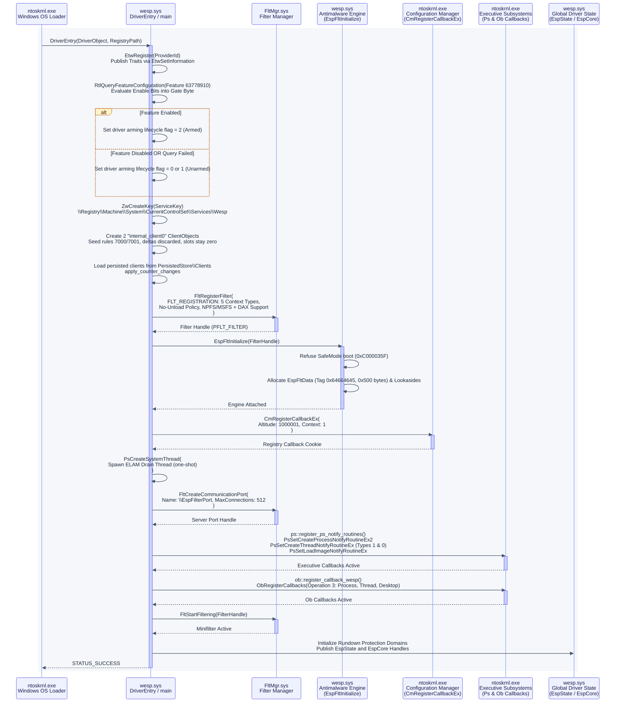
```mermaid
%%{init: {'theme': 'base', 'themeVariables': {'darkMode': false, 'background': '#ffffff', 'primaryColor': '#ffffff', 'primaryTextColor': '#0f172a', 'primaryBorderColor': '#64748b', 'lineColor': '#475569', 'textColor': '#1e293b', 'actorBkg': '#eef2ff', 'actorBorder': '#4f46e5', 'actorTextColor': '#1e1b4b', 'actorLineColor': '#a5b4fc', 'signalColor': '#475569', 'signalTextColor': '#1e293b', 'labelBoxBkgColor': '#fef3c7', 'labelBoxBorderColor': '#b45309', 'labelTextColor': '#451a03', 'loopTextColor': '#1e293b', 'noteBkgColor': '#fef3c7', 'noteBorderColor': '#b45309', 'noteTextColor': '#451a03', 'activationBkgColor': '#c7d2fe', 'activationBorderColor': '#4f46e5', 'sequenceNumberColor': '#0f172a'}, 'themeCSS': '.messageText { fill: #1e293b !important; stroke: none; } .actor text { fill: #1e1b4b; } .loopText { fill: #1e293b !important; } .labelText { fill: #451a03 !important; } .noteText { fill: #451a03 !important; } svg { background-color: #ffffff !important; }'}}%%
sequenceDiagram
participant OS as ntoskrnl.exe<br/>Windows OS Loader
participant Driver as wesp.sys<br/>DriverEntry / main
participant FltMgr as FltMgr.sys<br/>Filter Manager
participant EspFltEngine as wesp.sys<br/>Antimalware Engine<br/>(EspFltInitialize)
participant Cm as ntoskrnl.exe<br/>Configuration Manager<br/>(CmRegisterCallbackEx)
participant Exec as ntoskrnl.exe<br/>Executive Subsystems<br/>(Ps & Ob Callbacks)
participant State as wesp.sys<br/>Global Driver State<br/>(EspState / EspCore)

    rect rgb(245, 247, 250)
        OS->>Driver: DriverEntry(DriverObject, RegistryPath)
        activate Driver
        Driver->>Driver: EtwRegister(ProviderId)<br/>Publish Traits via EtwSetInformation
        Driver->>Driver: RtlQueryFeatureConfiguration(Feature 63778910)<br/>Evaluate Enable Bits into Gate Byte
        alt Feature Enabled
            Driver->>Driver: Set driver arming lifecycle flag = 2 (Armed)
        else Feature Disabled OR Query Failed
            Driver->>Driver: Set driver arming lifecycle flag = 0 or 1 (Unarmed)
        end
        Driver->>Driver: ZwCreateKey(ServiceKey)<br/>\\Registry\\Machine\\System\\CurrentControlSet\\Services\\Wesp
        Driver->>Driver: Create 2 "internal_client0" ClientObjects<br/>Seed rules 7000/7001, deltas discarded, slots stay zero
        Driver->>Driver: Load persisted clients from PersistedStore\\Clients<br/>apply_counter_changes
        Driver->>FltMgr: FltRegisterFilter(<br/>  FLT_REGISTRATION: 5 Context Types,<br/>  No-Unload Policy, NPFS/MSFS + DAX Support<br/>)
        activate FltMgr
        FltMgr-->>Driver: Filter Handle (PFLT_FILTER)
        deactivate FltMgr
        Driver->>EspFltEngine: EspFltInitialize(FilterHandle)
        activate EspFltEngine
        EspFltEngine->>EspFltEngine: Refuse SafeMode boot (0xC000035F)
        EspFltEngine->>EspFltEngine: Allocate EspFltData (Tag 0x64664645, 0x500 bytes) & Lookasides
        EspFltEngine-->>Driver: Engine Attached
        deactivate EspFltEngine
        Driver->>Cm: CmRegisterCallbackEx(<br/>  Altitude: 1000001, Context: 1<br/>)
        activate Cm
        Cm-->>Driver: Registry Callback Cookie
        deactivate Cm
        Driver->>Driver: PsCreateSystemThread(<br/>  Spawn ELAM Drain Thread (one-shot)<br/>)
        Driver->>FltMgr: FltCreateCommunicationPort(<br/>  Name: \\EspFilterPort, MaxConnections: 512<br/>)
        activate FltMgr
        FltMgr-->>Driver: Server Port Handle
        deactivate FltMgr
        Driver->>Exec: ps::register_ps_notify_routines()<br/>PsSetCreateProcessNotifyRoutineEx2<br/>PsSetCreateThreadNotifyRoutineEx (Types 1 & 0)<br/>PsSetLoadImageNotifyRoutineEx
        activate Exec
        Exec-->>Driver: Executive Callbacks Active
        deactivate Exec
        Driver->>Exec: ob::register_callback_wesp()<br/>ObRegisterCallbacks(Operation 3: Process, Thread, Desktop)
        activate Exec
        Exec-->>Driver: Ob Callbacks Active
        deactivate Exec
        Driver->>FltMgr: FltStartFiltering(FilterHandle)
        activate FltMgr
        FltMgr-->>Driver: Minifilter Active
        deactivate FltMgr
        Driver->>State: Initialize Rundown Protection Domains<br/>Publish EspState and EspCore Handles
        Driver-->>OS: STATUS_SUCCESS
        deactivate Driver
    end
```

### Boot-State Arming Gate

At driver load, `wesp.sys` probes the boot configuration using `RtlQueryFeatureConfiguration` with feature identifier `63778910`.

The driver evaluates the returned enable bits into the driver arming lifecycle flag (the gate byte): feature enabled yields `2` (Armed); feature disabled yields the unarmed value; probe failure yields a `0xC0000298`-class status.

`ZwQuerySystemInformation` with information class `0x67` (System Code Integrity Information) no longer arms the driver at load. That call now occurs only in `connect::setup`, where it enforces the connect-time code-integrity checks (the PPL-or-CI fallback path).

This lifecycle byte gates enforcement callbacks. It is one gate among several; callback families arm at different points (see Publication Barriers):

- **Armed State (`2`)**: Minifilter pre-operation and post-operation callbacks, executive notifications, port connect requests, and message dispatches execute normally.
- **Unarmed State (`0` or `1`)**: Registered enforcement callbacks return immediately without processing. Port connection requests are denied with `STATUS_ACCESS_DENIED` (`0xC0000022`), and minifilter callbacks return `FLT_PREOP_SUCCESS_NO_CALLBACK` or `FLT_POSTOP_FINISHED_PROCESSING`. A production-CI host (value `1`) still registers and attaches; the callback stubs then return success without invoking engine logic.

This check is distinct from caller authentication: it validates whether the kernel driver itself is permitted to execute active enforcement on the host.

### Boot-Time Persisted-Store Recovery and WNF BootMonitor

The reference build contains a boot-generation recovery gate and a Windows Notification Facility (WNF) subscription. The two mechanisms detect a reboot and discard stale persisted client state before rule evaluation begins.

**WNF BootMonitor subscription.** During `DriverEntry`, after the feature gate passes, the driver subscribes to a WNF state whose 64-bit state name is `0x418B0D3EA3BC0875` (a member of the `WNF_BOOT` state family; the low half `0xA3BC0875` matches the boot-state marker, and the state is absent from public WNF name tables). The subscription callback `wnf::closure_trampoline` (function ID 3428) forwards the state payload through a Rust closure registered at connect time. When the queried state payload is exactly 4 bytes with first DWORD `3`, the driver calls `ClientPersistedStore::set_boot_id` (ID 2429), which writes the current `KUSER_SHARED_DATA.BootId` (offset `0x2C4`) as a 4-byte `boot_id` value under `HKLM\SYSTEM\Wesp\PersistedStore`. The subscription stays armed while the boot state has not yet reached `3` (an early-boot load) and is torn down on `BootMonitor` drop and on `DriverEntry` cleanup. The WNF channel is distinct from the startup feature gate `RtlQueryFeatureConfiguration(63778910)`: the feature gate selects whether the driver runs, while the WNF subscription selects when the driver refreshes its persisted boot identity.

**Reboot detection and store recovery.** After the WNF query, `main` reads the persisted `boot_id` value and compares it against the live `KUSER_SHARED_DATA.BootId`. The driver loads the persisted store only when the stored value equals the current value or the immediately preceding value (a one-boot-attempt tolerance); otherwise, or when the value is missing or not a `REG_DWORD`, it calls `RecoveryMonitor::recover_persisted_store` (ID 3412). That routine registers a trusted thread, opens `HKLM\SYSTEM\Wesp\PersistedStore` with `KEY_ALL_ACCESS`, and recursively deletes every subkey by re-enumerating index `0` until the key is empty. Recovery is destructive and terminal: stale or partially written state is discarded, no rules are re-seeded or re-loaded, and the driver proceeds to `FltRegisterFilter` with an empty store.

**Persisted client load.** When the `boot_id` gate passes, `PersistedStateLoader::read_clients` (ID 2912) enumerates `PersistedStore\Clients`, converting each GUID subkey into a descriptor carrying the `version` DWORD (must equal `1` when present and typed), the `altitude` string, and the `client_name` string. `ClientManager::load_persisted_clients` (ID 3291) then materializes each descriptor through `load_client`, reading the per-client `Rules`, `Collections`, and event-queue subkeys and applying per-event-type counter deltas through `RegisteredClients::update_rules_for`. The per-client `version` gate guards individual records; the `boot_id` gate guards the whole store.

### Filter Manager Registration Contract

The `FLT_REGISTRATION` configuration specifies strict operational constraints:

- **Service Stop Policy**: Flags explicitly mandate that service stops are not supported (`DO_NOT_SUPPORT_SERVICE_STOP`).
- **Filesystem Support**: Flags mandate support for Named Pipe and Mailslot filesystems (`SUPPORT_NPFS_MSFS`) and Direct Access storage volumes (`SUPPORT_DAX_VOLUME`).
- **Unload Routine**: The unload callback pointer is null, so Filter Manager has no unload path to invoke. No `DriverUnload` assignment exists in `main`.
- **Instance Callback Set**: Defines instance setup (gated on armed state), instance query-teardown (which unconditionally returns `0xC01C0010` to refuse dynamic detachment), instance teardown-complete, and transaction notifications.
- **Registration Layout**: The `0x70`-byte structure carries size `0x0070` and version `0x0203`. The unload callback slot is null, the instance setup callback slot is populated, the instance query-teardown callback slot is populated, the teardown-start slot is null, the instance teardown-complete callback slot is populated, the transaction notification callback slot is populated, and the section notification callback slot is null. The name-provider slots are null, so the driver is not a name provider. Teardown-complete chains through `EspFltInstanceTeardownComplete` to `EspFsInstanceTeardownComplete`; transaction notifications chain through `EspFltTxfCallback` to `EspKtmTransactionPreCommit` and `PreRollback`.
- **Operation Table**: A 50-candidate builder (major function equals index minus 22) registers 18 live IRP pairs plus the terminator; Filter Manager copies the array at registration time. Each row is 32 bytes with the major function code field, the skip flags field, the pre-operation callback field, and the post-operation callback field. A `MajorFunction` value of `0x80` terminates the array, and paging-I/O skip applies only to READ and SET_EA. Registration does not attach an instance and does not start I/O; attachment happens later, when `FltStartFiltering` walks the live volumes.

### Counter Gate and Rule Arming

Registering the filter, the registry callback, the object callbacks, and the four notify routines arms the operating system to invoke the driver on every matching operation for the life of the module. Rules do not add registrations. A rule update writes an interlocked delta into a typed counter, and every already-registered callback tests those counters before it reads a filename, a security descriptor, a key path, or an FSCTL.

`EventTypeCounterGuard::apply_counter_changes` performs the update. It calls none of `FltRegisterFilter`, `FltStartFiltering`, `CmRegisterCallbackEx`, `ObRegisterCallbacks`, or any `PsSet*` routine; it only performs interlocked adds on the counter table: 47 `LONG` slots plus the wildcard in-flight event counter.

| Counter slot                                                                     | Sparse type              | Event                                                                                                            |
| -------------------------------------------------------------------------------- | ------------------------ | ---------------------------------------------------------------------------------------------------------------- |
| the none event counter                                                           | `0`                      | None (slot 0)                                                                                                    |
| the thread create (subsystems), create (nonsystem), and terminate event counters | `1` / `2` / `3`          | Thread create (subsystems) / create (nonsystem) / terminate                                                      |
| the process create, terminate, and load-image event counters                     | `1000` / `1001` / `1002` | Process create / terminate / load image                                                                          |
| the file-object family event counters (create, open, read, write, cleanup)       | `2000` to `2004`         | File-object create / open / read / write / cleanup                                                               |
| the filesystem family event counters (section through unlock)                    | `3000` to `3009`         | Filesystem section, query-information, set-information, security, directory, FSCTL, EA, query-open, lock, unlock |
| the transaction commit and rollback event counters                               | `3010` / `3011`          | Kernel transaction commit / rollback                                                                             |
| the volume mount, dismount, and FSCTL event counters                             | `4000` / `4001` / `4002` | Volume mount / dismount / FSCTL                                                                                  |
| the named-pipe create event counter                                              | `5000`                   | Named pipe create                                                                                                |
| the mailslot create event counter                                                | `6000`                   | Mailslot create                                                                                                  |
| the registry family event counters                                               | `7000` to `7014`         | Registry family                                                                                                  |
| the object handle create and duplicate event counters                            | `8000` / `8001`          | Object handle create / duplicate                                                                                 |
| the boot load driver event counter                                               | `9000`                   | Boot load driver                                                                                                 |
| the wildcard in-flight event counter                                             | none                     | Wildcard / in-flight                                                                                             |

The delta encoding is `0` for increment, `1` for decrement, and `2` for no operation, saturating at `0x7FFFFFFF` and `0x80000000`. A kind-0 batch also increments and decrements the wildcard in-flight event counter for the duration of the update, so every pre-operation evaluates while the batch is in flight. Type `9000` (the boot load driver event counter) has no live OS producer in the driver; only the external ELAM writer feeds that slot.

Two properties follow. First, the gate is a conjunction: a callback proceeds when the wildcard slot or its typed slot is nonzero, and returns early only when both are zero. Second, `active_event_types` keys off flagged comparand presence in the per-type bucket, so activation requires at least one flagged comparand and a rule with an empty comparand list does not arm its slot.

The gate applies to pre-operations. Post-operation callbacks do not re-check the counters; they consume their correlation record instead. The object-manager post callback uses its `CallContext`, and the registry post classes use `get_post_correlation`.

The driver also seeds two rules without a port client. The two built-in `internal_client0` objects register internal rules `7000` (`REG_CREATE_KEY`) and `7001` (`REG_OPEN_KEY`) at boot through `InternalClient::persisted_store_rule`, which builds the `Rule` Arc without calling `update_rules` or `apply_counter_changes` (its outgoing calls contain neither call; the single `main` `apply_counter_changes` invocation in the persisted-client load path serves the persisted-client load loop). The only `apply_counter_changes` invocation locations are the persisted-client load loop and the unregister path, so on a clean, persist-empty boot the registry create-key and open-key slots (the active registry create and open event counters) remain zero and those two registry pre-operations take the early-out. Client-identity creation consequently has a second route that does not pass the port gates. `InternalClient::persisted_store_rule` scopes the seeded rules with a `StoredPredicate` path pattern of `\Registry\Machine\System\Wesp\PersistedStore*`, so those rules match only the persisted-store subtree. The seeded rules are present in the per-type buckets on the two `internal_client0` objects, but with the active registry create and open event counters at zero the counter gate early-outs before matching; the driver's own store writes run on trusted threads.

### Context Type Registrations

The driver registers five typed context definitions with Filter Manager, built by `context_registrations_for_wesp` in the 448-byte pool allocation: the five context definition records (five 56-byte records), a `0xFFFF` terminator heading the terminator record (a zeroed sixth record), and 112 bytes of slack. Each definition carries an allocation size and cleanup callback:

- **Instance Context**: Associated with volume mounts, holding `EspFltInstanceContextInfo`.
- **Stream Context**: Associated with open file streams, tracking stream flags and identifiers.
- **Stream Handle Context**: Associated with individual file handles, tracking direct volume writes (cleanup routine is a no-op).
- **Transaction Context**: Associated with Kernel Transaction Manager enlistments.
- **Section Context**: Associated with memory-mapped file sections.

Each context registration is a 56-byte record carrying its type, allocation size (supplied by `EspFltGetContextSize`), pool tag, and cleanup callback:

| Context       | Type | Size | Pool tag | Cleanup                                                         |
| ------------- | ---- | ---- | -------- | --------------------------------------------------------------- |
| Instance      | `2`  | 368  | `Fpic`   | `EspFltDeleteInstanceContext`                                   |
| Stream        | `8`  | 112  | `Fpsc`   | `EspFltDeleteStreamContext` to `EspFsDeleteStream`              |
| Stream handle | `16` | 24   | `Fphc`   | empty                                                           |
| Transaction   | `32` | 176  | `Fptc`   | `EspFltTxfDeleteContext` to `EspFsKtmTransactionContextDeleted` |
| Section       | `64` | 8    | `FpSC`   | `EspFltDeleteSectionContext`                                    |

No file or volume context is registered.

### Instance Attachment and Data-Scan Enlistment

Filter Manager invokes the instance setup callback when `FltStartFiltering` walks the live volumes and when a volume arrives later. The callback invokes `EspFltInstanceSetup` only when the Code Integrity gate is `2`, propagates a negative result, and normalizes any non-negative result to `0`. When the gate is not `2`, the callback returns `STATUS_SUCCESS` and the instance attaches without the engine context. When the gate is `2`, `EspFltInstanceSetup` refuses attachment with `STATUS_FLT_DO_NOT_ATTACH` (`0xC01C000F`) in three cases: the volume is already on the engine instance list, the instance-context allocation fails, or the volume carries Cluster Shared Volumes. The Cluster Shared Volumes refusal applies to NTFS and to filesystem type 28 (tentatively ReFS per WDK documentation; no corresponding literal in the binary). The driver does not reject Named Pipe, Mailslot, or MUP volumes; combined with the `SUPPORT_NPFS_MSFS` registration flag, it attaches to NPFS, MSFS, disk filesystems, and MUP. The teardown-complete and transaction callbacks also execute only when the gate equals `2`.

On a successful instance-context allocation, the driver calls `FltRegisterForDataScan` (resolved via `EspFltGetSystemRoutines` into the data-scan registration routine pointer) for volumes whose filesystem type passes the bitmask `0x1840203C` and whose type is at most `0x1C`. A zero return sets bit `2` of the instance flags field. This is the only extra Filter Manager enlistment after `FltRegisterFilter`; it is per volume and is not a second filter registration. `FltCreateSectionForDataScan` and `FltCloseSectionForDataScan` are resolved at initialization (into the data-scan section-creation routine pointer and the data-scan section-close routine pointer (the second routine of the pair)) but are never invoked. Transaction enlistment happens on first sight of each `KTRANSACTION` via `FltEnlistInTransaction` with mask `0x4000000C` (commit, rollback, commit-finalize); `TmEnableCallbacks` is not imported. The instance query-teardown callback always returns `STATUS_FLT_DO_NOT_DETACH` (`0xC01C0010`), so a user-mode detach request cannot remove an instance.

### Object Hierarchy and Rundown Protection

Kernel state is managed through a hierarchical ownership tree:

- **`EspCore`**: The root engine record holding the client manager, event queues, and dispatch tables. The 208-byte record (`ExAllocatePool2(64, 208, rust)`) carries the EspCore reference count and excludes the filter handle, which is stored in the filter handle field and published beside `EspCore` in the global block.
- **`EspState`**: A 56-byte reference-counted wrapper around `EspCore` (`ExAllocatePool2(64, 56, rust)`): the inner EspCore pointer, the push-lock field, the validity flag gating the `ZwClose` of the stored handle, the registry callback cookie, the constant field (holding constant 1), and the reference count (set to 1, then incremented to 2).
- **Three Rundown Domains**: Three distinct `EX_RUNDOWN_REF` structures protect global state during concurrent callback processing: the EspState rundown guard for `EspState`, the EspCore rundown guard for `EspCore`, and the boot-initialization rundown guard for early boot initialization. `main` initializes all three; teardown completes all three (two directly, one inside `static_cleanup`). Callbacks acquire rundown protection upon entry and release it on exit: filter, registry, and object callbacks acquire the EspState rundown guard, while process, thread, and image callbacks acquire the EspCore rundown guard, while dispatcher and correlation paths execute under the calling callback's rundown guard, and the boot-initialization rundown guard pairs initialization completion with teardown and has no callback acquirers.
- **Teardown Synchronization**: Teardown uses a guard byte with idle (0) and claimed (1) states. No distinct completed value is defined for this byte; the teardown thread signals completion by calling `ExRundownCompleted`. The teardown thread executes `_InterlockedCompareExchange8(flag, 1, 0)` to claim the state, waits for active rundown references to drain via `ExWaitForRundownProtectionRelease`, and calls `ExRundownCompleted`. Racing threads observing the claimed state return immediately without executing cleanup handlers.
- **Dual Arc Reference Models**: The driver implements two reference-counting layouts: payload-first (strong counter placed immediately after the payload) for `EspState`, `EspCore`, `Rule`, and `ClientObject`; and count-first (counter placed at the beginning of the control header) for `EventQueue` (the leading reference count of the event queue decrements). `wesp_lib::collection::Collection` is count-first (the leading reference count of the Collection decrements in the Collection implementation block), while the distinct type `wesp_lib::client::manager::ClientCollection` constructs payload-first (64-byte allocation with the ClientCollection reference count).

### Publication Barriers and Rundown Domains

The driver publishes its global state through readiness bytes paired with `EX_RUNDOWN_REF` guards and `ExBlockOnAddressPushLock` waits. Callback families arm at different points in `DriverEntry`, so no single lifecycle flag gates all interception. OS-level arming is instant on register success; the address-wait only synchronizes the driver's own callback bodies with cookie and rundown publication.

| Byte                                                  | Armed when                                              | Callback family that waits on it                                                                                                                      |
| ----------------------------------------------------- | ------------------------------------------------------- | ----------------------------------------------------------------------------------------------------------------------------------------------------- |
| the filesystem/registry/object-manager readiness flag | After `CmRegisterCallbackEx` and `EspState` allocation  | Filesystem, registry, and object-manager pre-operations; ELAM drain thread                                                                            |
| the driver arming lifecycle flag                      | After the Code Integrity probe                          | Checked (not waited) by the `Mp*`, `cm::*`, `ps::*`, and `ob::*` engines (test-sign gate; this byte is the boot-gate lifecycle byte)                  |
| the process/thread/image notify readiness flag        | After `EspCore` allocation                              | Process, thread, and image notify routines                                                                                                            |
| the ETW rundown guard                                 | Before `EtwRegister` (compare-exchange 0 to 1, store 2) | ETW write paths contain no wait on the ETW rundown guard; the paths use level guards instead; the barrier is the guard transition and rundown pairing |

A callback acquires rundown protection after the wait so that unload cannot free the Arc while the callback body executes. `DriverEntry` publishes into the global state block only after `main` returns an `Ok` discriminant. The published fields are the Ob handle in the registration-handle field (`RegistrationHandle`), the 16-byte server port (`PFLT_PORT` plus cookie pointer), the `EspState` Arc, the `EspCore` and filter handle pair (`RunRef`), and the driver installed-state sentinel.

Each callback family applies a conjunction of gates rather than testing one byte.

| Plane                                               | Gate conjunction                                                                                                                                                                   |
| --------------------------------------------------- | ---------------------------------------------------------------------------------------------------------------------------------------------------------------------------------- |
| Filesystem, registry, object-manager pre-operations | Wait on the filesystem/registry/object-manager readiness flag; require the driver arming lifecycle flag armed (2); then typed slot or the wildcard in-flight event counter nonzero |
| Registry (additional)                               | `wait_for_elam_cm_stop` ELAM barrier (idempotent via the ELAM synchronization barrier flag) before the counter check                                                               |
| Process, thread, image notify                       | Wait on the process/thread/image notify readiness flag; require the driver arming lifecycle flag to read 2; then the corresponding typed event counter                             |
| Object handle create or duplicate                   | The object handle create counter slot or the object handle duplicate counter slot, or the wildcard in-flight event counter                                                         |
| Port connect                                        | The driver arming lifecycle flag reads 2 at connect; the claim and PPL or CI check follows                                                                                         |

### Driver Unload and Teardown Sequence

With no unload routine registered, teardown runs at system shutdown, on initialization-failure rollback, and on reload (see below), following the 7-stage order with the stage-5 exception noted:

1. Unregister image-load, thread (subsystems and nonsystem), and process notify routines (process notify unregisters with removal flag set).
2. Unregister Object Manager callbacks via `ObUnRegisterCallbacks`.
3. Close `\EspFilterPort` via `FltCloseCommunicationPort`.
4. Release the port-cookie Arc reference (the guarded close, unregister, and free in that block do not fire while the global reference is live).
5. Unregister minifilter via `FltUnregisterFilter`, then call `EspFltUninitialize` (bugchecking with `0x108` if the instance list head is still populated). This order holds for the `DriverEntry` teardown path; the `main` initialization-failure rollback reverses the pair (`EspFltUninitialize` before `FltUnregisterFilter`).
6. Execute static cleanup on `EspState`: claim the wrapper flag, drain rundown, drop the `EspCore`, close the stored handle via `ZwClose`, unregister the Configuration Manager callback via `CmUnRegisterCallback`, free the allocation, and complete rundown.
7. Unregister ETW provider via `EtwUnregister` and complete rundown references.

Initialization-failure rollback in `main` unwinds in reverse: the Ps routines drop, then the `EspState` Arc and `static_cleanup`, then `EspFltUninitialize` before `FltUnregisterFilter`, then the `EspCore` Arc drop, keeping only the `EspCore` rundown completion last. `DriverEntry` also runs a reload-teardown before it publishes new globals. When a previous publication exists, it unregisters the prior image, thread, process, object, port, filter, and provider registrations, then copies the new 72-byte result structure (four `OWORD` values plus one `QWORD`) into the global block. On a first boot the driver installed-state sentinel carries its data-section initializer (the value 2), so the reload path is skipped and the null-handle unregister calls are not reached.

`FltStartFiltering` does not participate in this rollback. A non-zero return from `FltStartFiltering` (including informational `STATUS_*` codes) fails the `start_filtering` assertion and panics via `wesp::panic` (`KeBugCheckEx` `0x52555354`) instead of rolling back.

### Connected Process Tracking

Connected process tracking (`ConnectedClientProcesses`) is maintained by `ClientManager` as a two-level container mapping monitored process structures to sets of client GUIDs (`Process` mapped to a `HashSet<ClientGuid>`). Insertion into the map happens at session connect through identifier lookup plus process attach; this mapping establishes process attribution: when an operation is evaluated, the driver verifies whether the calling process is authorized to submit requests on behalf of the target client identity. During client disconnection (`EspDisconnectClient`), the driver removes the client GUID from the process entry. When the inner client set becomes empty, the outer process entry is unlinked and the kernel process object reference is released. Full client removal splices the client out of the altitude-sorted collection, then runs `start_unregister` (state 5), waits with `ExWaitForRundownProtectionRelease` so in-flight rule updates cannot mutate the dying client, and finishes with `finish_unregister` (state 6, terminal); a repeat removal reports `0xC000A003`. Lifecycle state progresses from 2 at creation, to 5 while unregister rundown drains, to 6 as the terminal state.

## Kernel Interception Callbacks

The `wesp.sys` driver establishes interception hooks across multiple Windows executive subsystems to assemble a unified system event stream.

### Executive Notification Callbacks

- **Process Creation and Rundown**: Registered via `PsSetCreateProcessNotifyRoutineEx2` (subsystem creation notify, type 0). The creation callback intercepts process startup, resolves the backing executable file object, inspects command line arguments; image signing levels resolve lazily during rule evaluation. If policy rules dictate process denial, the driver writes the failure status directly into the process creation information block, causing the Windows process manager to terminate initialization.
- **Thread Creation and Termination**: Registered via `PsSetCreateThreadNotifyRoutineEx` across two distinct callback routines:
  - Subsystem Threads (type 1): Intercepts user-mode subsystem threads, generating `ThreadCreate` and `ThreadTerminate` events. It evaluates thread process identity against the calling process, asserting a cross-process flag (`CurrentProcess != TargetProcess`) to identify remote thread injection.
  - Non-System Threads (type 0): Intercepts native non-system thread creation, generating `ThreadStart` events.
- **Image Load Interception**: Registered via `PsSetLoadImageNotifyRoutineEx`. It captures executable and DLL module mappings. When process identifier `0` is passed, the driver normalizes the value to the System process identifier (`4`). The driver inspects image properties; if the system-mode image flag is set, it extracts the backing file object to link image execution with filesystem origin.
- **Object Manager Handle Interception**: Registered via `ObRegisterCallbacks` (the altitude string supplied with this registration is a 4-character value recorded as `L"1234"`). It registers pre-operation and post-operation callbacks covering `PsProcessType`, `PsThreadType`, and `ExDesktopObjectType` for both `OB_OPERATION_HANDLE_CREATE` and `OB_OPERATION_HANDLE_DUPLICATE` (operation mask 3). The pre-operation callback evaluates requested access masks against policy, but its mask store does not reach the `DesiredAccess` field: both guarded stores write through the RegistrationContext slot instead, so the callback has no effective refusal mechanism. The post-operation callback reports the correlated final access mask (entry gated on the combined GrantedAccess/ReturnStatus field; the duplicate path reads `Parameters->GrantedAccess` into rule evaluation). When intercepting operations on `ExDesktopObjectType`, desktop objects are managed through an internal `DesktopMarker` borrow; the driver resolves desktop object names via `ObQueryNameString`, initiating with a 1,024-byte stack buffer and dynamically allocating a non-paged pool buffer if `STATUS_BUFFER_TOO_SMALL` is returned.
- **Configuration Manager Registry Interception**: Registered via `CmRegisterCallbackEx` at altitude `1000001`. It maps the registry notify classes through a 31-slot jump table. Callbacks synchronize with ELAM boot state through an idempotent barrier (`wait_for_elam_cm_stop`).

A kernel-side constraint applies to three of the four notify registrations. `PsSetCreateProcessNotifyRoutineEx2`, `PsSetCreateThreadNotifyRoutineEx`, and `ObRegisterCallbacks` require the registering image to be signed (`MmVerifyCallbackFunctionCheckFlags`) and fail with `STATUS_ACCESS_DENIED` otherwise. `PsSetLoadImageNotifyRoutineEx` does not perform this check.

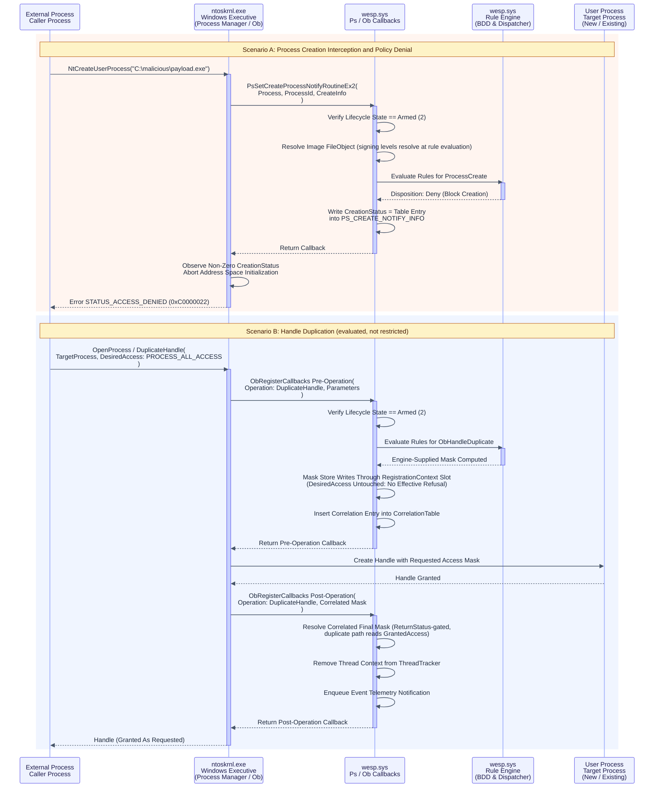
```mermaid
%%{init: {'theme': 'base', 'themeVariables': {'darkMode': false, 'background': '#ffffff', 'primaryColor': '#ffffff', 'primaryTextColor': '#0f172a', 'primaryBorderColor': '#64748b', 'lineColor': '#475569', 'textColor': '#1e293b', 'actorBkg': '#eef2ff', 'actorBorder': '#4f46e5', 'actorTextColor': '#1e1b4b', 'actorLineColor': '#a5b4fc', 'signalColor': '#475569', 'signalTextColor': '#1e293b', 'labelBoxBkgColor': '#fef3c7', 'labelBoxBorderColor': '#b45309', 'labelTextColor': '#451a03', 'loopTextColor': '#1e293b', 'noteBkgColor': '#fef3c7', 'noteBorderColor': '#b45309', 'noteTextColor': '#451a03', 'activationBkgColor': '#c7d2fe', 'activationBorderColor': '#4f46e5', 'sequenceNumberColor': '#0f172a'}, 'themeCSS': '.messageText { fill: #1e293b !important; stroke: none; } .actor text { fill: #1e1b4b; } .loopText { fill: #1e293b !important; } .labelText { fill: #451a03 !important; } .noteText { fill: #451a03 !important; } svg { background-color: #ffffff !important; }'}}%%
sequenceDiagram
    participant Caller as External Process<br/>Caller Process
    participant WinExec as ntoskrnl.exe<br/>Windows Executive<br/>(Process Manager / Ob)
    participant Driver as wesp.sys<br/>Ps / Ob Callbacks
    participant Engine as wesp.sys<br/>Rule Engine<br/>(BDD & Dispatcher)
    participant Target as User Process<br/>Target Process<br/>(New / Existing)

    rect rgb(255, 245, 240)
        Note over Caller,Target: Scenario A: Process Creation Interception and Policy Denial
        Caller->>WinExec: NtCreateUserProcess("C:\malicious\payload.exe")
        activate WinExec
        WinExec->>Driver: PsSetCreateProcessNotifyRoutineEx2(<br/>  Process, ProcessId, CreateInfo<br/>)
        activate Driver
        Driver->>Driver: Verify Lifecycle State == Armed (2)
        Driver->>Driver: Resolve Image FileObject (signing levels resolve at rule evaluation)
        Driver->>Engine: Evaluate Rules for ProcessCreate
        activate Engine
        Engine-->>Driver: Disposition: Deny (Block Creation)
        deactivate Engine
        Driver->>Driver: Write CreationStatus = Table Entry<br/>into PS_CREATE_NOTIFY_INFO
        Driver-->>WinExec: Return Callback
        deactivate Driver
        WinExec->>WinExec: Observe Non-Zero CreationStatus<br/>Abort Address Space Initialization
        WinExec-->>Caller: Error STATUS_ACCESS_DENIED (0xC0000022)
        deactivate WinExec
    end

    rect rgb(240, 245, 255)
        Note over Caller,Target: Scenario B: Handle Duplication (evaluated, not restricted)
        Caller->>WinExec: OpenProcess / DuplicateHandle(<br/>  TargetProcess, DesiredAccess: PROCESS_ALL_ACCESS<br/>)
        activate WinExec
        WinExec->>Driver: ObRegisterCallbacks Pre-Operation(<br/>  Operation: DuplicateHandle, Parameters<br/>)
        activate Driver
        Driver->>Driver: Verify Lifecycle State == Armed (2)
        Driver->>Engine: Evaluate Rules for ObHandleDuplicate
        activate Engine
        Engine-->>Driver: Engine-Supplied Mask Computed
        deactivate Engine
        Driver->>Driver: Mask Store Writes Through RegistrationContext Slot<br/>(DesiredAccess Untouched: No Effective Refusal)
        Driver->>Driver: Insert Correlation Entry into CorrelationTable
        Driver-->>WinExec: Return Pre-Operation Callback
        deactivate Driver
        WinExec->>Target: Create Handle with Requested Access Mask
        Target-->>WinExec: Handle Granted
        WinExec->>Driver: ObRegisterCallbacks Post-Operation(<br/>  Operation: DuplicateHandle, Correlated Mask<br/>)
        activate Driver
        Driver->>Driver: Resolve Correlated Final Mask (ReturnStatus-gated,<br/>duplicate path reads GrantedAccess)
        Driver->>Driver: Remove Thread Context from ThreadTracker
        Driver->>Driver: Enqueue Event Telemetry Notification
        Driver-->>WinExec: Return Post-Operation Callback
        deactivate Driver
        WinExec-->>Caller: Handle (Granted As Requested)
        deactivate WinExec
    end
```

### Filesystem Minifilter Major-Function Surface

The driver registers 18 Filter Manager major function codes. Only `IRP_MJ_READ` and `IRP_MJ_SET_EA` set `FLTFL_OPERATION_REGISTRATION_SKIP_PAGING_IO`, so write, create, FSCTL, and set-information operations still observe paging traffic. Every other registered row has no skip flags.

| Major | Name                                         | Skip flags      |
| ----- | -------------------------------------------- | --------------- |
| `-20` | `IRP_MJ_VOLUME_DISMOUNT`                     | none            |
| `-19` | `IRP_MJ_VOLUME_MOUNT`                        | none            |
| `-7`  | `IRP_MJ_QUERY_OPEN`                          | none            |
| `-1`  | `IRP_MJ_ACQUIRE_FOR_SECTION_SYNCHRONIZATION` | none            |
| `0`   | `IRP_MJ_CREATE`                              | none            |
| `1`   | `IRP_MJ_CREATE_NAMED_PIPE`                   | none            |
| `3`   | `IRP_MJ_READ`                                | skip paging I/O |
| `4`   | `IRP_MJ_WRITE`                               | none            |
| `5`   | `IRP_MJ_QUERY_INFORMATION`                   | none            |
| `6`   | `IRP_MJ_SET_INFORMATION`                     | none            |
| `7`   | `IRP_MJ_QUERY_EA`                            | none            |
| `8`   | `IRP_MJ_SET_EA`                              | skip paging I/O |
| `12`  | `IRP_MJ_DIRECTORY_CONTROL`                   | none            |
| `13`  | `IRP_MJ_FILE_SYSTEM_CONTROL`                 | none            |
| `17`  | `IRP_MJ_LOCK_CONTROL`                        | none            |
| `18`  | `IRP_MJ_CLEANUP`                             | none            |
| `19`  | `IRP_MJ_CREATE_MAILSLOT`                     | none            |
| `21`  | `IRP_MJ_SET_SECURITY`                        | none            |

`IRP_MJ_CLOSE` and `IRP_MJ_QUERY_SECURITY` are not registered. Flush, volume information, device control, internal device control, shutdown, power, quota, and Plug and Play operations are not registered. The Plug and Play pre-operation exists as a stub that clears the completion context and returns, and it is reachable only if that slot is enabled.

The section acquire path carries an additional gate. `EspFltPreAcquireSectionSync` returns `FLT_PREOP_SUCCESS_NO_CALLBACK` unless all of the following hold: the synchronization type is section-create (`Parameters.Read.Length == 1`), the volume supports stream contexts, the operation is not a prefetch, there is no top-level IRP, and a stream context already exists. When it proceeds, a page protection of `PAGE_READWRITE` or `PAGE_EXECUTE_READWRITE` sets bit `0x20` in the stream-context page-protection flag field.

Several pre-operations require an existing stream context before they reach the engine: read, write, query-information, set-information, set-security, set-EA, FSCTL, lock-control, cleanup, and section-create. `EspFltPreCreate` additionally skips a null or stack `FILE_OBJECT`, an `OperationFlags` value with bit `2` or bit `4` set, and a kernel-mode ECP when the engine feature bit is present. These skips are independent of the rule counters.

### Kernel Transaction Manager Integration

The driver integrates with the Kernel Transaction Manager (KTM) to track atomic operations:

- Pre-operation and post-operation handlers intercept transaction commit and rollback phases.
- The driver queries transaction basic information (`TransactionBasicInformation`) at `PASSIVE_LEVEL`, resolving transaction GUIDs. The driver issues no parent-UOW, superior-transaction, or nesting query, so parent-child relationship resolution is unproven.
- Transaction deletion callbacks automatically clean up in-memory transaction contexts and associated event objects.

Enlistment is not performed at initialization. `TmEnableCallbacks` is not imported. The driver stores the transaction notification callback at registration and enlists each transaction the first time it observes a `KTRANSACTION` object, with the notification mask `0x4000000C` (`TRANSACTION_NOTIFY_COMMIT | TRANSACTION_NOTIFY_ROLLBACK | TRANSACTION_NOTIFY_COMMIT_FINALIZE`). Commit applies stored stream snapshots and tears down the transaction stream list; rollback raises `EspKtmTransactionPreRollback` and then runs the same teardown; commit-finalize raises `EspKtmTransactionPreCommit` only. The prepare, pre-prepare, single-phase-commit, and recovery notifications are not requested.

Savepoint events are not part of that mask. `EspFltTxfPreSavepointNotification` and `EspFltTxfPostSavepointNotification` fire from the FSCTL pre- and post-operations when the FSCTL code is `0x98178` (`FSCTL_TXFS_SAVEPOINT_INFORMATION`). The pre path references the transaction object by handle; the post path sets a flag when the savepoint type is `2`.

### Kernel System Threads

The driver creates four system threads.

| Thread               | Created by                        | Lifetime                                 | Purpose                                                        |
| -------------------- | --------------------------------- | ---------------------------------------- | -------------------------------------------------------------- |
| ELAM drain           | `DriverEntry`                     | One shot, then `PsTerminateSystemThread` | Map the ELAM queue section and inject boot notifications       |
| Event-queue worker   | Connect (opcode mapping untraced) | Per connected event queue                | Wait on the queue and issue `FltSendMessage` for notifications |
| State-change worker  | Connect (opcode mapping untraced) | Per state-change port                    | Deliver 4-byte state-change pings                              |
| Disk identity worker | On demand                         | Short                                    | Query the disk instance identifier                             |

No timer, DPC, or work-item polling loop is registered. The only `ZwQuerySystemInformation` call in `DriverEntry` is the one-shot Code Integrity probe.

### Absent OS Listeners

The driver does not subscribe to several operating system notification families. The following APIs are neither imported nor called.

- Network: `Fwps*` / `Wfp*`, NDIS, and TDI.
- Plug and Play and power: `IoRegisterPlugPlayNotification`, `PoRegisterPowerSettingCallback`, and any other `PoRegister*`.
- Token and logon: `SeRegisterLogonSessionTerminatedRoutine` and any other `SeRegister*`.
- Classic filesystem and UNC: `IoRegisterFileSystem`, `IoRegisterFsRegistrationChange`, `FsRtlRegisterUncProvider`, and `FsRtlRegisterFileSystemFilterCallbacks`.
- Kernel Transaction Manager callback API: `TmEnableCallbacks`; enlistment is performed through Filter Manager instead.
- Code Integrity and ELAM callbacks: `SeRegisterImageVerificationCallback` and `CiRegister*`. Boot-driver load visibility is registered by `wesp_elam.sys` through a boot-driver callback (`IoRegisterBootDriverCallback`) that evaluates each load record against platform rules and returns a verdict per notification. `wesp.sys` itself holds no boot-driver callback registration and consumes boot telemetry only through the shared queue drain.
- ETW consumer and system telemetry: `EtwRegisterTraceGuids`, `EtwRegisterEventCallback`, `IoWMI*`, `PcwRegister`, and `WheaRegister*`. The driver is an ETW producer only.
- Timers and deferred execution: `KeSetTimer`, `KeInitializeTimer`, and `KeInitializeDpc`.
- Filter Manager content input and output: `FltReadFile`, `FltWriteFile`, `FltDeviceIoControlFile`, `FltPerformSynchronousIo`, `FltLockUserBuffer`, and `FltAllocateCallbackData` are neither imported nor called, extending the pended-completion omission above. The sole Flt create primitive is `FltCreateFileEx2`, called only from `EspFltCreateFileInternal` for name-based reopen marked with an internal ECP, so file content arrives in callback-data buffers.

`FsRtlIsPagingFile` and `FsRtlIsSystemPagingFile` are queries. `CmGetBoundTransaction` is used by registry comparand resolvers in the registry event path. `IoGetTransactionParameterBlock` is used only by the filesystem file-object helpers `is_transacted` and `transaction`, not by the registry callback.

### Streaming and Input Output Buffers

The driver mediates memory transfers between user and kernel address spaces during filesystem I/O using a discriminated buffer abstraction (`FsIoBuffer`). It supports five operational variants (variants 0 through 4):

- Variant 0: Provides direct kernel memory access without IRQL restrictions.
- Variant 1: Enforces a caller IRQL gate (`KeGetCurrentIrql() <= APC_LEVEL`) for kernel memory buffers.
- Variant 2: Maps locked buffer pages into system address space via a Memory Descriptor List (`MDL`) using `EspFltMapMdlSafe` clamped to `EspFltGetMdlByteCount`.
- Variant 3: Gates user-mode addresses at `APC_LEVEL`, validating the range with `ProbeForRead` and `copy_user_memory`.
- Variant 4: Represents an unsupported buffer state that is rejected immediately upon inspection.

Storage device path resolution and disk identity queries use `EspFltString`, an owned Unicode string allocated from paged pool with tag `MPvn` (`0x6E76504D`).

### IRQL and Execution Context

All interception callbacks execute at PASSIVE_LEVEL in the calling thread. Asynchronous post-operations that can arrive above passive either defer through `FltDoCompletionProcessingWhenSafe` or skip engine work behind an IRQL gate. `FltSendMessage` never runs in a callback; dedicated system threads own all sends. No timer, DPC, or work-item polling loop exists; all waits are event or pushlock driven with explicit timeouts.

| Callback family                                                                            | IRQL                                                                                                        | Blocks                                                                                                               | Paged memory                                                         | Context                                                                                                                                            |
| ------------------------------------------------------------------------------------------ | ----------------------------------------------------------------------------------------------------------- | -------------------------------------------------------------------------------------------------------------------- | -------------------------------------------------------------------- | -------------------------------------------------------------------------------------------------------------------------------------------------- |
| Filesystem pre-operation (all registered majors)                                           | PASSIVE_LEVEL                                                                                               | Yes: readiness pushlock wait plus rundown acquisition on entry; `FltGetFileNameInformation` on name paths            | Yes: paged lookaside allocations                                     | Caller thread                                                                                                                                      |
| Filesystem post-operation, synchronous                                                     | PASSIVE_LEVEL                                                                                               | Yes: same entry waits                                                                                                | Yes                                                                  | Caller thread; the pre-operation selected synchronous completion                                                                                   |
| Filesystem post-operation for read and write, asynchronous                                 | Defers when `KeGetCurrentIrql() > 1` or a DPC is executing                                                  | After deferral, yes                                                                                                  | Yes                                                                  | Safe worker context after `FltDoCompletionProcessingWhenSafe`; `EspFltPostWrite` defers write-context release through one Filter Manager work item |
| Filesystem post-operation for mount and dismount                                           | Gated: engine work runs only below dispatch level (mount) or at or below APC_LEVEL outside a DPC (dismount) | On the gated path, yes                                                                                               | None observed                                                        | Caller or notifier thread                                                                                                                          |
| Registry pre-operation and post-operation                                                  | PASSIVE_LEVEL                                                                                               | Yes: one-shot ELAM event wait, pushlock and rundown waits, `ZwOpenKey` and `ZwQuerySecurityObject` on property paths | None observed: flag-64 pool only                                     | Caller thread                                                                                                                                      |
| Registry context cleanup (class 40)                                                        | PASSIVE_LEVEL                                                                                               | Locks only: skips the ELAM wait, keeps pushlock and rundown                                                          | None observed                                                        | Caller thread                                                                                                                                      |
| Object pre-operation and post-operation                                                    | PASSIVE_LEVEL                                                                                               | Yes: pushlock and rundown waits; `ObQueryNameString` and handle reference on desktop paths                           | None observed: flag-64 pool only                                     | Caller thread                                                                                                                                      |
| Process, thread, and image notify                                                          | PASSIVE_LEVEL                                                                                               | Yes: readiness pushlock wait, rundown acquisition, `PsLookup*`                                                       | None in the notify bodies                                            | Creator thread                                                                                                                                     |
| KTM commit and rollback notify                                                             | PASSIVE_LEVEL                                                                                               | Yes: ERESOURCE plus pushlock and rundown                                                                             | Yes: paged lookaside use                                             | Notifier thread; transaction queries run lazily during rule evaluation and return without querying when IRQL is nonzero                            |
| Port connect, message, and disconnect                                                      | PASSIVE_LEVEL                                                                                               | Yes: token queries, registry transactions, pushlock and rundown waits                                                | Yes: user-buffer probe and copy in caller context                    | Caller thread; disconnect can arrive on an arbitrary thread                                                                                        |
| Instance setup and teardown                                                                | PASSIVE_LEVEL                                                                                               | Yes: ERESOURCE plus `Flt*` volume queries                                                                            | Yes: paged lookasides                                                | Caller thread                                                                                                                                      |
| System worker threads (ELAM drain, event-queue sender, state-change sender, disk identity) | PASSIVE_LEVEL                                                                                               | Yes: infinite event waits; sends use an infinite timeout except the 30-second state-change send                      | Yes: section mapping and paged string use on the ELAM and disk paths | Dedicated system threads; the ELAM drain and disk identity threads are one-shot                                                                    |

Four properties follow from this table. First, the buffer abstraction enforces its own ceiling: `FsIoBuffer` variants 1 and 3 refuse work above APC_LEVEL, and variant 3 additionally requires caller process context for user addresses. Second, pre-operations that need a post view return the synchronize disposition, which forces the post-operation to run synchronously in the caller at passive level. Third, every `FltSendMessage` call site runs on a worker thread; callbacks evaluate inline and hand telemetry to those threads. Fourth, the only waits without a timeout are event and pushlock waits on worker and boot paths; no callback spins on a retry loop.

Paged-pool use is concentrated in the filesystem, KTM, port, and instance paths; the registry, object, and notify bodies allocate from the flag-64 pool and non-paged lookasides only.

The `wesp.sys` driver contains an integrated antimalware engine consisting of 129 dedicated functions sharing the `Mp` naming prefix.

### Engine Architecture and Feature Flags

The engine operates on a central state allocation (`EspFltData`) that coordinates operational capabilities:

- **Static Architecture**: All 129 engine functions (`Mp*` in the baseline fork analysis, `EspFlt*` in the current build) are compiled directly into `wesp.sys`. The binary does not import or link against `WdFilter.sys`.
- **Engine Provenance**: External fork analysis identifies the 129 functions as a statically compiled, feature-trimmed derivative of the Defender `WdFilter.sys` engine, reporting 68 shared names and 4 functions instruction-identical modulo image base, both reference the engine global `MpData` and pool tag `0x7375704D`, and the fork routes filesystem events to a `wesp.sys`-specific `EspFs*` layer. That analysis reports a control comparison of adjacent `WdFilter` builds at 99.5 percent instruction-identical, indicating a deliberate fork rather than version drift. The current build renames the engine prefix from `Mp*` to `EspFlt*` (pool tag `0x64664645`); the shared-name counts above describe the analyzed baseline and are retained as fork evidence. The rename is a clean 129-to-129 substitution with one deviation: `MpFilterInitialize` becomes `EspFltInitialize` (the `Filter` infix is dropped).
- **Safe-Boot Refusal**: Engine initialization checks `InitSafeBootMode`; when a safe-mode boot is detected, initialization is refused with status `0xC000035F`.
- **Dynamic Kernel Binding**: The engine probes operating system build levels, dynamically resolving kernel routines including signing level queries (`SeGetCachedSigningLevel`), kernel-mode extended attribute setting (`FsRtlSetKernelEaFile`), and section scan registration (`FltRegisterForDataScan`).
- **Volume Context Caching (`EspFltInstanceContextInfo`)**: Per-volume characteristics (filesystem type, device characteristics, volume serial numbers) are cached in a 0x88-byte structure stored inside a `OnceCell`. Initialization executes once per volume; re-entrant initialization raises an unrecoverable panic. Volume properties are cached per volume in a separate `FileQueryBuffer` `OnceCell` holding the full `FLT_VOLUME_PROPERTIES` buffer.

### Pre-Create Bridge and Verdict Mapping

The minifilter pre-create callback delegates inspection to the internal engine bridge `EspFltPreCreate`. The bridge evaluates caller attributes and returns an operational verdict; the callback wrapper maps verdicts 1 through 7 to Filter Manager dispositions, although `EspFltPreCreate` emits only verdicts `1`, `5`, and `6`:

- `Verdict 1`: Complete with status. The callback writes the engine-supplied status into `CallbackData->IoStatus.Status` and returns `FLT_PREOP_COMPLETE`, terminating the create request before it reaches the filesystem. This is the blocking path.
- `Verdict 2`: Disallow Fast I/O. Callback returns `FLT_PREOP_DISALLOW_FASTIO`, forcing the request onto the IRP-based path.
- `Verdict 3`: Pending. Callback returns `FLT_PREOP_PENDING`.
- `Verdict 4`: Success with callback. Callback returns `FLT_PREOP_SUCCESS_WITH_CALLBACK` and attaches a completion context. This arm is defined by the wrapper but is not emitted by `EspFltPreCreate`; the non-blocking path returns verdict `6`.
- `Verdict 5`: Success without callback. Callback returns `FLT_PREOP_SUCCESS_NO_CALLBACK` and explicitly clears the completion context pointer.
- `Verdict 6`: Synchronize. Callback returns `FLT_PREOP_SYNCHRONIZE`, forcing the post-operation callback to execute in the context of the calling thread. This is the path that enables post-open cancellation.
- `Verdict 7`: Disallow FSFilter I/O. Callback returns `FLT_PREOP_DISALLOW_FSFILTER_IO`.
- `Verdict 0`: Unreachable state; triggers an engine panic.

### ELAM Producer Driver (`wesp_elam.sys`)

The `wesp_elam.sys` driver (1,524,152 bytes, 1,363 functions, 19 classes, 6 exports) is the early-boot telemetry producer for the platform. It builds the 64MB shared queue section, records boot-time activity into it, and stages it for draining by `wesp.sys`. It is a sensor, not a trust provider: it links only against `ntoskrnl`, exposes `DriverEntry` as its sole code export (the remaining exports are CRT handlers and `_fltused`), exposes no `Elam*` exports, and creates no device object.

The reference-build image is identified by MD5 `5d20bc643e672aea9aaf56434ea86c9e` and SHA-256 `2cf98638904ab9c6bef8e13504b5f114e9ae9b73dcd80bf976bb0acbf17296ef`, with compilation timestamp `2026-08-31 18:42:18` and PDB `wesp_elam.pdb`. The 1,363 functions split into 1,329 named and 34 unnamed; 458 functions contain 1,918 loops. The function inventory mirrors `wesp.sys`: the same `wesp_api_types::schema::filter` read and write deserializers, the same `wesp_lib::rule::engine::RuleEngine` monomorphs, and the same `string_match` pattern-matching engine, with the module set (`hashbrown`, `alloc`, `core`, `falloc`, `sorted_map`, `string_match`) confirming the Rust implementation.

Initialization refuses safe-mode boot before any allocation and evaluates a feature kill-switch (feature identifier `63778910`) before creating state. `DriverEntry` creates the `Wesp`, `PersistedStore`, and `ElamBoot` registry keys, opens the `Policy` subtree read-only, allocates client, event, lookaside, tracker, and core state, maps the 64MB queue section into system space through `ElamQueue::create`, loads persisted clients, registers a registry callback at altitude `1000000`, initializes ELAM state under rundown protection, spawns a single one-shot worker thread, registers the boot-driver callback, and returns success. Unload is idempotent and rundown-based: it drops implementation state, unregisters the boot-driver callback, signals `\WespElamQueueDrained`, waits for `\WespBootDoneReadingElamQueue`, then destroys the queue.

Queue records carry kinds `0` through `4` (thread, process, registry key object, token, registry path); the producer never emits kind `5` or above (panic path, no error return). The append path hashes the incoming notification identifier and probes the per-queue in-flight table; on a hit it drops the incoming entry, retains the existing entry, and returns `0xC0000017`.

The producer creates the four events and the section while the consumer opens them. The producer creates `\WespStarted` and waits on it while the consumer sets it; the consumer opens all four events with `SYNCHRONIZE` access. All signaling uses `ZwSetEvent` with sticky signaled state; no pulse primitive exists.

Registry state lives under `System\Wesp`: the service root is created with full access while the `Policy` subtree opens read-only, and the `PersistedStore` rules and event-queue subtrees are created with full access (`0xF003F`) through transacted writes carrying version and capacity words. The boot-driver callback handles class-1 notifications: it gates on driver initialization state, evaluates each load record against platform rules, and writes a DWORD verdict back through the callback out-parameter. The written verdict values are `1` allow, `2` block, and `3` boot-critical; the decode path writes no value for rule-engine outcome `5` (abstain, fail-open), writes `1` for outcome `6`, writes `2` for outcomes `7` and `3`, and writes `3` for outcome `4`. The write-back is telemetry only, as the boot callback returns `void` with no in-driver enforcement sink. The producer performs no enforcement itself; blocking on a block verdict is operating-system-side behavior. The producer registry callback at altitude `1000000` and the `wesp.sys` callback at altitude `1000001` are independent instruments on the same registry stream.

#### Local rule evaluation

`wesp_elam.sys` evaluates policy locally and is not a pure telemetry forwarder. The driver compiles in the full rule/filter/BDD stack: `RuleEngine::process_event_internal` in 14 monomorphs covering `BootDriverLoad` plus 13 registry operations, `FilterBdd::evaluate` over compiled predicate BDDs, `RuleTable`, `OrderGroupedRules`, and `ClientRules::update_rules`. Callbacks run through `EventDispatcher::enter` with per-thread tracking, resolve clients per event type under a shared lock, and build a notification on match. Predicates are content-comparison only; no signature verification exists in the driver. Direct calls run with at least `0x4000` bytes of stack, otherwise the driver trampolines through `KeExpandKernelStackAndCalloutEx`.

#### Initialization and teardown

Initialization refuses safe-mode boot before allocation, evaluates the feature kill-switch (feature identifier `63778910`), refuses on a pre-existing volatile `ElamBoot` key (`0xC0000510`), and branches on recovery mode (`0x35` recovers with client load skipped; other modes abort). The `Policy` subtree opens read-only and its failure degrades without aborting. Callbacks, worker progress, and teardown block until the init flag reaches state `2`. `DriverEntry` assigns `DriverUnload`, creates registry state, allocates client, event, lookaside, tracker, and core state, creates and maps the queue section, conditionally loads persisted clients, registers the registry callback at altitude `1000000`, publishes state under rundown protection, spawns the single one-shot worker thread, registers the boot-driver callback, and returns success. Teardown is idempotent: boot-callback unregister, `\WespElamQueueDrained` signal with the queue frozen first, infinite wait on `\WespBootDoneReadingElamQueue`, queue destroy, handle close, rundown release.

#### Queue fill policy

The section fills linearly until full. The cursor word advances monotonically with each committed record; no wrap, no eviction, and no blocking wait exist. An append that does not fit fails with `(33, 0xC0000023)` and rolls back the in-flight reservation. The append path deduplicates by `EventId` with FNV-1a-64 over the notification identity key: on a hit in the in-flight table it drops the incoming entry, retains the existing entry, and returns out-code `25` with `0xC0000017`.

#### Section and record layout

The section object name is exactly `\WespElamQueue` (the decompiler renders an adjacent `.rdata` literal as a `1000000` tail that is not part of the name). `ElamQueue::create` calls `ZwCreateSection` with `SECTION_ALL_ACCESS` (`0xF001F`), `OBJ_KERNEL_HANDLE | OBJ_CASE_INSENSITIVE` (`0x240`) attributes, `PAGE_READWRITE` page protection, `SEC_COMMIT` (`0x8000000`) allocation, and `MaximumSize = 0x4000000` (64 MiB). After mapping with `MmMapViewInSystemSpace`, the section header stores the size `0x4000000` in the first QWORD and `32` in the second QWORD. Records are contiguous and 8-aligned: a 104-byte header (total length, `EventId` dedup key, header length, entry count, entries end, payload size) followed by per-kind 24-byte entries. Kind `0` carries a thread object, kind `1` a process object, kind `2` a registry key object, kind `3` a token object, and kind `4` a registry path Unicode blob. Class-1 boot-driver load records carry 4 `UNICODE_STRING` pointer/length pairs (image path, second path/registry string, two signer strings), DWORD flags, two pointer-plus-length hash/certificate blobs, and control fields; malformed strings are zeroed, not rejected.

#### Registry map

Registry state lives under the `System\Wesp` service hive. The service root is created with full access and the `Policy` subtree opens read-only (`0x20019`); the `PersistedStore/Rules/boot_id/Clients` subtree is created with full access. Per-client GUID subkeys carry a version DWORD that must equal `1`, plus altitude and client-name strings; `notification_version` and `queue_typemax_capacity_bytes` DWORDs and the `boot_id` recovery oracle travel with the persisted state. Per-client rules, event queues, and collections persist through transacted writes with commit/rollback, and rule updates take the pushlock exclusively while readers hold it shared. Each driver loads its own copy of persisted clients at its own `DriverEntry`; the handoff is schema-shared and registry-persisted, not live-shared.

#### Ownership and synchronization

Ownership uses reference-counted `Arc` instances (`Arc<EspElamState>`, `Arc<EspCore>`, client, rule, event-object, queue, and notification-entry Arcs) with weak back-references; no COM interfaces and no C++ vtables exist, and the only dynamic dispatch is `FnOnce` closure and formatting-trait slots. Module boundaries are `extern-C` (`DriverEntry`, callback routines, thread entry). All callback work runs on caller threads at `PASSIVE_LEVEL` with pushlocks and two rundown domains; no spinlocks, ERESOURCE locks, mutexes, or semaphores exist. Exactly one worker thread exists: it creates the four events, publishes slots, waits on `\WespStarted`, unregisters the registry callback, signals `\WespElamStoppedCmWatch`, and terminates.

#### Cross-driver contract

`wesp.sys` is the sole consumer: the NULL security descriptor plus kernel-handle attributes restrict openers to kernel mode, and no device object, IOCTL, or user-mode interface exists on either side. The contract is the shared section plus the four-event handshake plus the persisted-schema handoff, with no direct calls in either direction and no in-band version negotiation. The producer callback at altitude `1000000` and the consumer callback at altitude `1000001` are independent instruments with producer-first invocation order. Neither WESP driver links against or references `WdBoot` in either direction. The exposed surface is kernel-only: creation and signaling use owned handles, and the section has no user-mode mapping path.

### Early Launch Anti-Malware (ELAM) Synchronization

During boot, `wesp.sys` coordinates with early-launch drivers using a dedicated system thread:

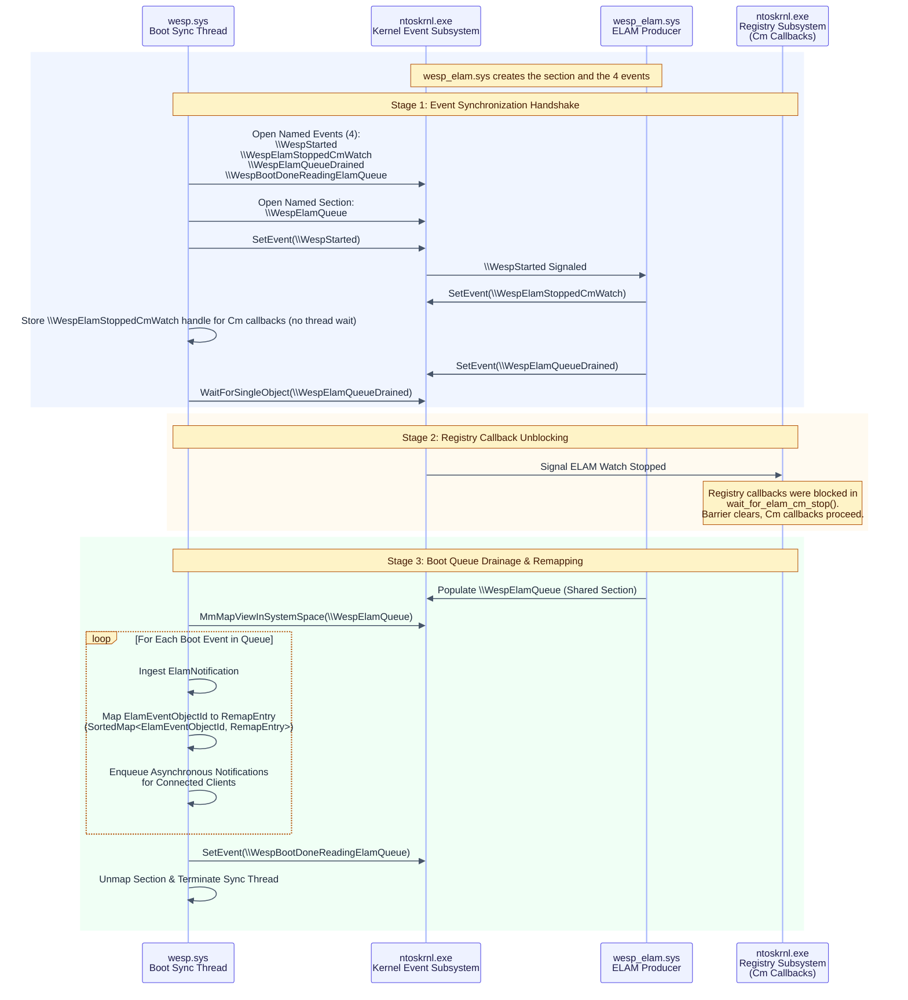
```mermaid
%%{init: {'theme': 'base', 'themeVariables': {'darkMode': false, 'background': '#ffffff', 'primaryColor': '#ffffff', 'primaryTextColor': '#0f172a', 'primaryBorderColor': '#64748b', 'lineColor': '#475569', 'textColor': '#1e293b', 'actorBkg': '#eef2ff', 'actorBorder': '#4f46e5', 'actorTextColor': '#1e1b4b', 'actorLineColor': '#a5b4fc', 'signalColor': '#475569', 'signalTextColor': '#1e293b', 'labelBoxBkgColor': '#fef3c7', 'labelBoxBorderColor': '#b45309', 'labelTextColor': '#451a03', 'loopTextColor': '#1e293b', 'noteBkgColor': '#fef3c7', 'noteBorderColor': '#b45309', 'noteTextColor': '#451a03', 'activationBkgColor': '#c7d2fe', 'activationBorderColor': '#4f46e5', 'sequenceNumberColor': '#0f172a'}, 'themeCSS': '.messageText { fill: #1e293b !important; stroke: none; } .actor text { fill: #1e1b4b; } .loopText { fill: #1e293b !important; } .labelText { fill: #451a03 !important; } .noteText { fill: #451a03 !important; } svg { background-color: #ffffff !important; }'}}%%
sequenceDiagram
    participant Wesp as wesp.sys<br/>Boot Sync Thread
    participant Events as ntoskrnl.exe<br/>Kernel Event Subsystem
    participant Elam as wesp_elam.sys<br/>ELAM Producer
    participant Cm as ntoskrnl.exe<br/>Registry Subsystem<br/>(Cm Callbacks)

    rect rgb(240, 245, 255)
        Note over Elam,Events: wesp_elam.sys creates the section and the 4 events
        Note over Wesp,Cm: Stage 1: Event Synchronization Handshake
        Wesp->>Events: Open Named Events (4):<br/>\\WespStarted<br/>\\WespElamStoppedCmWatch<br/>\\WespElamQueueDrained<br/>\\WespBootDoneReadingElamQueue
        Wesp->>Events: Open Named Section:<br/>\\WespElamQueue
        Wesp->>Events: SetEvent(\\WespStarted)
        Events->>Elam: \\WespStarted Signaled
        Elam->>Events: SetEvent(\\WespElamStoppedCmWatch)
        Wesp->>Wesp: Store \\WespElamStoppedCmWatch handle for Cm callbacks (no thread wait)
        Elam->>Events: SetEvent(\\WespElamQueueDrained)
        Wesp->>Events: WaitForSingleObject(\\WespElamQueueDrained)
    end

    rect rgb(255, 250, 240)
        Note over Wesp,Cm: Stage 2: Registry Callback Unblocking
        Events->>Cm: Signal ELAM Watch Stopped
        Note over Cm: Registry callbacks were blocked in<br/>wait_for_elam_cm_stop().<br/>Barrier clears, Cm callbacks proceed.
    end

    rect rgb(240, 255, 245)
        Note over Wesp,Cm: Stage 3: Boot Queue Drainage & Remapping
        Elam->>Events: Populate \\WespElamQueue (Shared Section)
        Wesp->>Events: MmMapViewInSystemSpace(\\WespElamQueue)
        loop For Each Boot Event in Queue
            Wesp->>Wesp: Ingest ElamNotification
            Wesp->>Wesp: Map ElamEventObjectId to RemapEntry<br/>(SortedMap<ElamEventObjectId, RemapEntry>)
            Wesp->>Wesp: Enqueue Asynchronous Notifications<br/>for Connected Clients
        end
        Wesp->>Events: SetEvent(\\WespBootDoneReadingElamQueue)
        Wesp->>Wesp: Unmap Section & Terminate Sync Thread
    end
```

The boot synchronization thread sets `\WespStarted`, then executes its single wait on `\WespElamQueueDrained` before mapping the section. The `\WespElamStoppedCmWatch` handle is stored for registry callbacks and the thread does not wait on it. The producer signals `\WespElamStoppedCmWatch` with a set operation that leaves a sticky signaled state, so a consumer that opens the event after the signal still observes it. Partial open failure panics with an inconsistent-state message; total absence of all four events on the `wesp.sys` consumer side exits quietly with status `0` (the `wesp_elam.sys` producer thread creates rather than opens the events: any creation failure terminates with `0xC0000001`, success with `0`); section-open failure skips the drain block, still sets the done event, and terminates with status `0`. Once `\WespElamQueue` is mapped into system space, the driver ingests early-boot notifications and remaps boot-time identifiers into client-visible references via a sorted remapping vector (`SortedMap<ElamEventObjectId, RemapEntry>`). The producer is `wesp_elam.sys`: `ElamQueue::create` creates the 64MB `\WespElamQueue` section, its event thread creates the 4 named events, and its boot-driver and registry callbacks feed boot notifications. Both `WdBoot` images are refuted as producers (9 stub-only functions each, zero ELAM, section, or event references). The boot-driver callback handles class-1 boot-driver notifications: it gates on driver initialization state, evaluates the load record against platform rules, and writes a DWORD verdict back through the callback out-parameter (decisive outcomes write `1`, `2`, or `3`; outcome `5` abstains, leaving the record at its default so the OS default applies). The producer performs no enforcement itself; whether the operating system blocks the loading driver on a block verdict is operating-system-side behavior and is unverified in the binary. At append time the producer rejects a per-queue duplicate notification identifier: the queue-append routine hashes the incoming notification identifier and, on a hit in the in-flight table, drops the incoming entry with `0xC0000017` while the existing entry is retained.

The remap covers five object kinds: `0` thread, `1` process, `2` registry key object, `3` token, and `4` registry path (a Unicode string carried in the extra blob). A record with a kind of `5` or greater is never emitted by the producer (the producer switch panics on kind `5` and above with no error return); invalid-kind records are skipped consumer-side at drain. There is no image, file, or driver related-object kind; driver-load payloads remain inside the serialized record.

The remap is applied by `patch_event_object_ids` (function ID 3089, source `lib\src\event_queue\elam_boot.rs`), invoked by the boot drain thread. The routine copies each serialized boot notification into a per-notification lookaside buffer, then rewrites the boot-time event-object IDs in place: it binary-searches the sorted key vector of the `SortedMap<ElamEventObjectId, RemapEntry>` for each ID and overwrites the ID field with the remapped client-visible reference (the first 8 bytes of the matching `RemapEntry`). A final exhaustiveness pass requires every `RemapEntry` to be consumed exactly once; an unconsumed entry rejects the whole notification. The function returns `9` on success and `1`, `3`, or `5` on structural, bounds, or overflow failure. `wesp::server::TraceEventQueueClear` (a `start`/`stop`/`stop_error_i32_` ETW span) is telemetry only and is not part of the drain path.

There is no replay for late-connecting clients. The boot thread performs a single pass over the mapped queue and delivers each boot notification only to a client already registered with an openable event queue; otherwise the notification is freed and nothing is retained. Delivery to client event queues rejects duplicate `NotificationId` values; per-queue FIFO order and cross-queue ordering are not established.

The Configuration Manager callback (`CmRegisterCallbackEx`) monitors and enforces registry security policies.

### Intercepted Registry Classes

The single Configuration Manager callback maps `REG_NOTIFY_CLASS` values through a jump table with 31 implemented slots. The class numbering is the official `wdm.h` numbering; post-operation classes begin at 15 rather than interleaving with the pre-operation classes.

| Class                          | Name                                | Counter slot                                | Event                |
| ------------------------------ | ----------------------------------- | ------------------------------------------- | -------------------- |
| 0                              | `RegNtPreDeleteKey`                 | the active registry delete-key counter      | `RegDeleteKey`       |
| 1                              | `RegNtPreSetValueKey`               | the active registry set-value counter       | `RegSetValueKey`     |
| 2                              | `RegNtPreDeleteValueKey`            | the active registry delete-value counter    | `RegDeleteValueKey`  |
| 4                              | `RegNtPreRenameKey`                 | the active registry rename-key counter      | `RegRenameKey`       |
| 5                              | `RegNtPreEnumerateKey`              | the active registry enumerate-key counter   | `RegEnumKey`         |
| 6                              | `RegNtPreEnumerateValueKey`         | the active registry enumerate-value counter | `RegEnumValueKey`    |
| 7                              | `RegNtPreQueryKey`                  | the active registry query-key counter       | `RegQueryKey`        |
| 8                              | `RegNtPreQueryValueKey`             | the active registry query-value counter     | `RegQueryValueKey`   |
| 15, 16, 17, 19, 20, 21, 22, 23 | `RegNtPost*`                        | none                                        | post-operation pairs |
| 26                             | `RegNtPreCreateKeyEx`               | the create-key counter slot                 | `RegCreateKey`       |
| 27                             | `RegNtPostCreateKeyEx`              | none                                        | post                 |
| 28                             | `RegNtPreOpenKeyEx`                 | the active registry open-key counter        | `RegOpenKey`         |
| 29                             | `RegNtPostOpenKeyEx`                | none                                        | post                 |
| 32                             | `RegNtPreLoadKey`                   | the active registry load-key counter        | `RegLoadKey`         |
| 33                             | `RegNtPostLoadKey`                  | none                                        | post                 |
| 38                             | `RegNtPreSetKeySecurity`            | the active registry set-security counter    | `RegSetKeySecurity`  |
| 39                             | `RegNtPostSetKeySecurity`           | none                                        | post                 |
| 40                             | `RegNtCallbackObjectContextCleanup` | none                                        | context teardown     |
| 41                             | `RegNtPreRestoreKey`                | the active registry restore-key counter     | `RegRestoreKey`      |
| 42                             | `RegNtPostRestoreKey`               | none                                        | post                 |
| 43                             | `RegNtPreSaveKey`                   | the active registry save-key counter        | `RegSaveKey`         |
| 44                             | `RegNtPostSaveKey`                  | none                                        | post                 |
| 45                             | `RegNtPreReplaceKey`                | the active registry replace-key counter     | `RegReplaceKey`      |
| 46                             | `RegNtPostReplaceKey`               | none                                        | post                 |

`RegNtPreSetInformationKey` (3), `RegNtPreQueryMultipleValueKey` (9), the XP create and open classes (10 to 13), `RegNtPreKeyHandleClose` (14), and the flush classes (30 and 31) are not implemented. Classes 18 (post set-information), 24 (post query-multiple), 25 (post handle-close), 34 and 35 (unload pair), 36 and 37 (query-security pair), and 47 and 48 (query-key-name pair) are also not implemented. Create and open operations on modern Windows reach the callback through the Ex classes (26 to 29) only. Every pre-operation class also tests the wildcard in-flight event counter; post-operation classes do not re-check counters and consume their correlation record instead.

Create-key and open-key are not telemetry-only. After `process_rules<RegCreateKey>` or `process_rules<RegOpenKey>`, an action index in `0` through `4` selects the create-key disposition table (class 26) or the open-key disposition table (class 28) and the callback returns that `NTSTATUS`. All 15 pre-operation classes have a per-class 0 to 4 disposition table with a flag-guarded return. The deny model, runtime table contents, and the unmatched `7000` canary are documented in [Policy Enforcement, Disposition Tables, and Deny Flow](#policy-enforcement-disposition-tables-and-deny-flow) and [Operational Verification and Target Host Findings](#operational-verification-and-target-host-findings).

The category summary is:

- Key creation and opening: pre-operation and post-operation callbacks for `RegCreateKeyEx` and `RegOpenKeyEx`. Non-Ex variants are bypassed.
- Key deletion: `RegDeleteKey`.
- Value mutation: `RegSetValueKey` and `RegDeleteValueKey`.
- Key renaming: `RegRenameKey` and `RegReplaceKey`.
- Key enumeration: subkey and value enumeration (`RegEnumKey`, `RegEnumValueKey`).
- Security modification: `RegSetKeySecurity`, validating modified DACLs and SACLs.
- Key queries: `RegQueryKey` and `RegQueryValueKey`.
- Hive management: hive loading, saving, and restoration (`RegLoadKey`, `RegSaveKey`, `RegRestoreKey`).
- Object context cleanup: `RegNtCallbackObjectContextCleanup`, which destroys tracking context without generating a telemetry event.

### Registry Execution Frame

Each registry callback executes within a standardized execution frame:

1. **Arming Gate Check**: Verifies global boot state byte equals `2`.
2. **ELAM Barrier Check**: Executes `wait_for_elam_cm_stop`. The thread waits on an internal synchronization event until the ELAM boot thread signals that early boot watch is complete.
3. **Thread Registration**: Calls `EventDispatcher::enter` to record thread execution context.
4. **Path Materialization (create and open only)**: Cases 26 and 28 resolve target paths via `to_full_path_tuple`. If a relative path is supplied with a parent key handle, the driver queries `CmCallbackGetKeyObjectIDEx` to resolve the root key name, concatenating it with the relative subkey name. All other pre classes build object-based arguments (`RegistryKeyObjectArgument`).
5. **DOS to NT Path Normalization**: The driver performs no DOS-to-NT prefix mapping. No `HKEY_*` string exists in `wesp.sys`, neither path constructor performs prefix mapping, and kernel callbacks supply NT names natively.
6. **Security Descriptor Handling (lazy and class-specific)**: `query_security_descriptor` calls `ZwQuerySecurityObject` with `SecurityInformation 0xF`, retries up to 10 times on `STATUS_BUFFER_TOO_SMALL`, and runs lazily through `read_security_descriptor` on a freshly opened handle, not on the callback key handle. Callback-level `RtlValidRelativeSecurityDescriptor` calls exist only in cases 26, 27, 38, and 39 and validate caller-supplied descriptors from `Argument2`. Case 41 performs no query and no validation.
7. **Hive Restoration File Binding**: On `RegRestoreKey` and `RegSaveKey`, the driver references the target backup file handle using `ObReferenceObjectByHandle` with `IoFileObjectType`, packaging it into a `FileObjectArgument` to bind filesystem provenance to the registry event.

Case 40 skips the arming gate, the helper-form ELAM barrier, and thread registration.

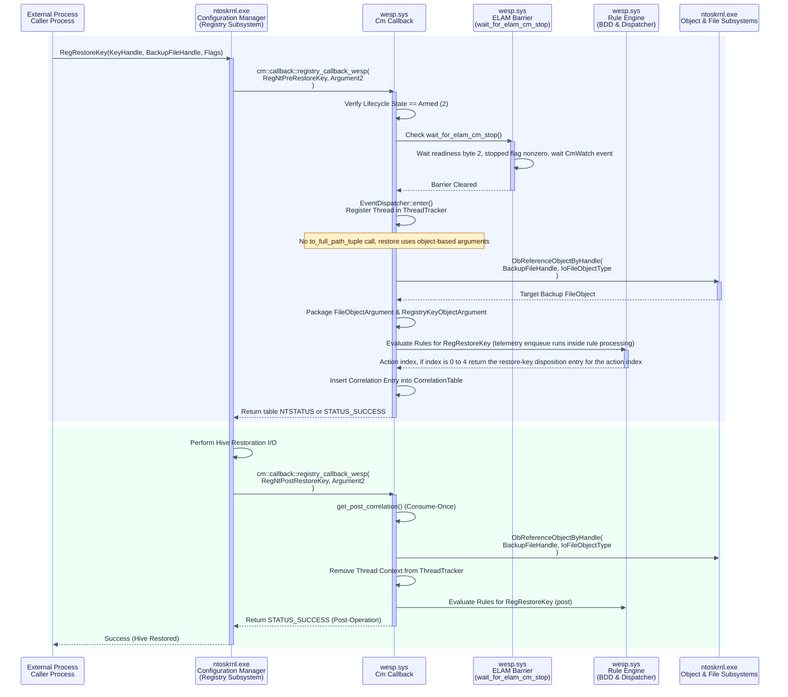
```mermaid
%%{init: {'theme': 'base', 'themeVariables': {'darkMode': false, 'background': '#ffffff', 'primaryColor': '#ffffff', 'primaryTextColor': '#0f172a', 'primaryBorderColor': '#64748b', 'lineColor': '#475569', 'textColor': '#1e293b', 'actorBkg': '#eef2ff', 'actorBorder': '#4f46e5', 'actorTextColor': '#1e1b4b', 'actorLineColor': '#a5b4fc', 'signalColor': '#475569', 'signalTextColor': '#1e293b', 'labelBoxBkgColor': '#fef3c7', 'labelBoxBorderColor': '#b45309', 'labelTextColor': '#451a03', 'loopTextColor': '#1e293b', 'noteBkgColor': '#fef3c7', 'noteBorderColor': '#b45309', 'noteTextColor': '#451a03', 'activationBkgColor': '#c7d2fe', 'activationBorderColor': '#4f46e5', 'sequenceNumberColor': '#0f172a'}, 'themeCSS': '.messageText { fill: #1e293b !important; stroke: none; } .actor text { fill: #1e1b4b; } .loopText { fill: #1e293b !important; } .labelText { fill: #451a03 !important; } .noteText { fill: #451a03 !important; } svg { background-color: #ffffff !important; }'}}%%
sequenceDiagram
    participant Caller as External Process<br/>Caller Process
    participant Cm as ntoskrnl.exe<br/>Configuration Manager<br/>(Registry Subsystem)
    participant Driver as wesp.sys<br/>Cm Callback
    participant Barrier as wesp.sys<br/>ELAM Barrier<br/>(wait_for_elam_cm_stop)
    participant Engine as wesp.sys<br/>Rule Engine<br/>(BDD & Dispatcher)
    participant Objects as ntoskrnl.exe<br/>Object & File Subsystems

    rect rgb(240, 245, 255)
        Caller->>Cm: RegRestoreKey(KeyHandle, BackupFileHandle, Flags)
        activate Cm

        Cm->>Driver: cm::callback::registry_callback_wesp(<br/>  RegNtPreRestoreKey, Argument2<br/>)
        activate Driver

        Driver->>Driver: Verify Lifecycle State == Armed (2)
        Driver->>Barrier: Check wait_for_elam_cm_stop()
        activate Barrier
        Barrier->>Barrier: Wait readiness byte 2, stopped flag nonzero, wait CmWatch event
        Barrier-->>Driver: Barrier Cleared
        deactivate Barrier

        Driver->>Driver: EventDispatcher::enter()<br/>Register Thread in ThreadTracker

        Note over Driver: No to_full_path_tuple call, restore uses object-based arguments

        Driver->>Objects: ObReferenceObjectByHandle(<br/>  BackupFileHandle, IoFileObjectType<br/>)
        activate Objects
        Objects-->>Driver: Target Backup FileObject
        deactivate Objects
        Driver->>Driver: Package FileObjectArgument & RegistryKeyObjectArgument

        Driver->>Engine: Evaluate Rules for RegRestoreKey (telemetry enqueue runs inside rule processing)
        activate Engine
        Engine-->>Driver: Action index, if index is 0 to 4 return the restore-key disposition entry for the action index
        deactivate Engine

        Driver->>Driver: Insert Correlation Entry into CorrelationTable
        Driver-->>Cm: Return table NTSTATUS or STATUS_SUCCESS
        deactivate Driver
    end

    rect rgb(240, 255, 245)
        Cm->>Cm: Perform Hive Restoration I/O

        Cm->>Driver: cm::callback::registry_callback_wesp(<br/>  RegNtPostRestoreKey, Argument2<br/>)
        activate Driver
        Driver->>Driver: get_post_correlation() (Consume-Once)
        Driver->>Objects: ObReferenceObjectByHandle(<br/>  BackupFileHandle, IoFileObjectType<br/>)
        Driver->>Driver: Remove Thread Context from ThreadTracker
        Driver->>Engine: Evaluate Rules for RegRestoreKey (post)
        Driver-->>Cm: Return STATUS_SUCCESS (Post-Operation)
        deactivate Driver

        Cm-->>Caller: Success (Hive Restored)
        deactivate Cm
    end
```

## Event Object Identity and Argument Resolution

To prevent user-mode clients from relying on unstable kernel virtual addresses, WESP manages a dual-table object identity model.

### Universal Event Object Identification

Every monitored kernel entity is assigned a persistent 64-bit `EventObjectId` drawn from a monotonic counter. Ids are assigned upon first reference and remain valid until all strong and weak references clear.

The identity manager maintains a primary hash table indexed by `EventObjectId` and 14 secondary hash tables plus a direct-id path, covering 15 key categories:

- `Thread`: Keyed by thread pointer combined with thread creation timestamp.
- `Process`: Keyed by process pointer and start key.
- `Token`: Keyed by token pointer.
- `RegistryKey`: Keyed by canonical registry path.
- `RegistryKeyObject`: Keyed by the key object pointer; the `CmCallbackGetKeyObjectIDEx`-derived ID is captured (object context tagged `0x50534557`) and stored as the event-object identity payload.
- `FileObject`: Keyed by `FILE_OBJECT` pointer.
- `FileStream`: Keyed by stream identifier and volume identity.
- `File`: Keyed by 128-bit file ID and volume GUID.
- `Pipe`: Keyed by pipe stream identifier.
- `Mailslot`: Keyed by mailslot path.
- `Volume`: Keyed by volume GUID.
- `KtmTransaction`: Keyed by transaction GUID and volume instance.
- `Disk`: Keyed by disk device object pointer.
- `Desktop`: Keyed by desktop object pointer.
- `EventObject`: Direct reference to an existing `EventObjectId` (no key table; direct-id lookup).

### Reference Counting and Table Entry Lifecycle

The object identity table implements a dual-stage reference model:

- **Weak Table References**: Entries in secondary key tables hold weak references. A weak reference ensures key lookups succeed without preventing object reclamation if the underlying kernel resource closes.
- **Strong References**: Returned to callers via `ensure_object`. As long as at least one strong reference exists, the event object remains active and linked to its client context pins.
- **Strong Zero Transition**: When the strong reference counter falls to zero, the driver unlinks the key from secondary tables, disconnects associated client context keys, and releases references to the underlying native executive object (`PEPROCESS`, `PETHREAD`, `PFILE_OBJECT`).
- **Weak Zero Transition**: When all weak references clear, the entry allocation is returned to the non-paged pool.

### Thread Tracking and Correlation Infrastructure

The driver decouples pre-operation rule evaluation from post-operation processing via two dedicated tracking engines:

- **Current Thread Tracker (`ThreadTracker`)**: A 256-bucket open-addressed hash table keyed by the tuple `(ThreadId, ThreadCreateTime)` using FNV-1a hashing. Upon callback entry, `EventDispatcher::enter` registers the active thread. If the key is already present in the table, it returns an empty guard to prevent recursive re-entrancy. The creation timestamp check guarantees that if a thread identifier is recycled while processing an event, state collision cannot occur.
- **Pre/Post Correlation Table (`CorrelationTable`)**: A generational storage table storing a 144-byte correlation payload keyed by a 64-bit `EventId`. When pre-operation rules require post-operation telemetry, a correlation entry is inserted. To bound memory usage, the table implements a two-generation swap at 1,024 entries, retiring older entries. Post-operation lookups perform a consume-once removal.
- **Post-Operation Client Tracking (`PostOperationClientMap`)**: An open-addressed table mapping client GUIDs to active post-operation interest states. Clients lacking post-operation interest for a specific event (indicated by sentinel state 2) are skipped during post-callback dispatch.

WESP processes intercepted operations through a lazy argument resolution model that minimizes evaluation overhead.

### Lazy Resolution Architecture

When an executive callback fires, the driver does not immediately extract all object metadata. Instead, it constructs a lightweight event argument container holding borrowed pointers to kernel structures:

1. **Initial Borrow**: The callback captures native parameters (e.g., `PFLT_CALLBACK_DATA`, `FILE_OBJECT`, `IO_SECURITY_CONTEXT`).
2. **Identity Registration**: The argument resolves its identity through `ensure_event_object`, minting an `EventObjectId` if none exists.
3. **On-Demand Property Materialization**: Specific attributes (such as full paths, security descriptors, or process tokens) are materialized only when an active predicate rule queries that property.
4. **Result Packaging**: Accessors return a tagged result structure indicating whether the property is valid, uninitialized, or inaccessible, avoiding raw kernel null pointer dereferences.

The reference build includes a process-image attribution arm: `ProcessArgument::image_file` resolves a process's executable `FILE_OBJECT` through the `PsReferenceProcessFilePointer` import (function ID 3589) and wraps it in a `FileStreamArgument`. This arm feeds the process-chain builders (`collect_process_chain` and the per-event `NotificationBuilder_*::init_process_chain_*` methods), attaching the executable path, signing level, and file identity of each ancestor process to every event.

### Three-Level Filesystem Identity

Filesystem operations are categorized into three hierarchical argument types:

- **`FileObjectArgument`**: Represents the transient handle context. It captures the `FILE_OBJECT` pointer, associated minifilter instance, and the open flags word.
- **`FileStreamArgument`**: Represents an individual data stream within a file. It captures stream names, stream kinds, and alternate data streams (ADS).
- **`FileArgument`**: Represents the underlying physical file identity on disk. It captures the volume GUID and 128-bit file reference number (`FILE_ID_128`), ensuring rules match files across renames and handle closures.

### Create-Path Metadata Containers

For filesystem creation, the driver extracts specialized metadata wrappers:

- **`AccessStateInfo`**: Captures security context data. It validates the relative security descriptor, captures a single token with impersonation preference (the client token field, falling back to the primary token field), and copies remaining desired access rights.
- **`IoOperationInfo`**: Captures operational attributes, distinguishing IRP-based I/O from Fast I/O, recording I/O priority hints, and preserving driver requestor modes.
- **`RemoteClientInfo`**: Captures network client attributes during SMB/NFS opens. If a remote open is detected, it validates and stores the caller network SID and transport address. `RemoteClientInfo` carries no protocol-version field, so that sub-claim is unproven.

The comparand resolver mediates between predicate rules and runtime event properties. It translates requested field identifiers into typed comparison values across the 45 observed operational event types plus reserved codes (including event type 9000, reserved boot code).

### Core and Optional Resolver Arms

Each event type implements a monomorphized resolver trait supporting 13 core resolution arms and 3 optional arms:

- **Core Arms (Always Present)**:
  - `resolve_numeric`: Resolves 64-bit unsigned and signed integers.
  - `resolve_bool`: Resolves boolean flags.
  - `resolve_string`: Resolves Unicode character strings.
  - `resolve_string_list`: Resolves multi-string arrays.
  - `resolve_binary`: Resolves raw octet buffers.
  - `resolve_sid`: Resolves Windows Security Identifiers.
  - `resolve_path`: Resolves normalized NT namespace paths.
  - `resolve_token`: Resolves security token references.
  - `resolve_security_descriptor`: Resolves relative security descriptors.
  - `resolve_memory_address_basic`: Resolves virtual memory allocation descriptors.
  - `resolve_context_key`: Resolves client and event context keys.
  - `resolve_ea_list`: Resolves extended attribute chains.
  - `evaluate_at_parent_chain`: Traverses the process ancestry chain.
- **Optional Arms (Omitted on Incompatible Events)**:
  - `resolve_byte_range`: Resolves file lock byte offsets and lengths (omitted on `ThreadStart`, `KtmTransactionRollback`, `RegEnumKey`, `RegSaveKey`).
  - `resolve_ecp_list`: Resolves Extra Create Parameter lists (omitted on `ThreadStart`, `KtmTransactionRollback`, `RegEnumValueKey`, `RegRestoreKey`).
  - `resolve_ip_address`: Resolves remote network transport addresses (omitted on `ThreadStart`, `KtmTransactionCommit`, `RegEnumKey`, `RegRestoreKey`).

### Field Resolution Cache

To eliminate redundant extraction during complex rule evaluation, the resolver employs an open-addressed field cache (`FieldCache`):

- Keyed by a 32-bit field identifier combined with FNV-1a hashing.
- Memoizes derived objects. Process-structure and access-mask memoization holds in `fetch_process` and `cached_access_mask`; token and parent memoization is unenumerated.
- Field entries are consume-once within an evaluation cycle: the first fetch takes the entry, and a later same-field query re-materializes the value.

### Comparand Transformation Operations

Numeric comparands can be dynamically transformed before comparison:

- Arithmetic Operators: Addition (0), subtraction (1), multiplication (2), division (3), and modulo (4).
- Bitwise Operators: Bitwise AND (5), bitwise OR (6), bitwise XOR (7), and bitwise NOT (8).
- Comparison Operators: Equal (0), not equal (1), less than (2), less or equal (3), greater than (4), greater or equal (5), bitwise subset tests (6 to 9), collection membership (10), and inclusive range verification (11).
- Width Scaling: Division and modulo operators dynamically switch between 32-bit and 64-bit division paths based on operand magnitude.

<br>

---

# Security, Authentication, and Access Control

## Layered Caller Authentication and Authorization

The `wesp.sys` driver implements a seven-layer authorization model covering caller authentication at connect time and message authorization at dispatch time, plus thread attribution for administrative mutations:

- Layer 1: Token Security Attribute Verification (`WESP://Permission` attribute on primary token).
- Layer 2: Permission Tier Determination (Full Trust `1000000000` vs Restricted Trust `10000000`).
- Layer 3: Process Protection Audit (Protected Process Light with Antimalware signer).
- Layer 4: Code Integrity Fallback (Laboratory/test-signing bypass mode via `CODEINTEGRITY_OPTION_TESTSIGN`).
- Layer 5: Client Descriptor Validation and Altitude-Sorted Allowlist.
- Layer 6: Per-Message Capability Gate (Tier 0 Full vs Tier 1 Restricted vs Tier 2+ Denied with sentinel code `8`).
- Layer 7: Per-Property Query Restriction (Tier 1 callers limited to property kinds 1 to 20 on the byte-array variant).
- Thread attribution (not an authorization layer): `register_trusted_thread` records the calling thread (object, creation timestamp, exit status) and binds a thread event object, so administrative mutations and registry persistence are attributable to a stable thread identity. It verifies the thread against nothing and denies nothing.

The seven layers compose into a five-gate chain that a connection traverses in order. The failure status identifies which gate rejected it.

| Gate | Check                                                                                                                                 | Failure                                                                                                 |
| ---- | ------------------------------------------------------------------------------------------------------------------------------------- | ------------------------------------------------------------------------------------------------------- |
| A    | Port DACL (`FLT_PORT_ALL_ACCESS` for Administrators `S-1-5-32-544` and SYSTEM `S-1-5-18`) and mandatory integrity on `\EspFilterPort` | `0x80070005`                                                                                            |
| B    | Driver armed: the driver arming lifecycle flag reads 2                                                                                | `0xC0000022`                                                                                            |
| C    | Opcode parse and cookie mint                                                                                                          | `0xC000000D`, `0xC0000023`, or `0xC0000017` (allocation failure)                                        |
| D    | `WESP://Permission` claim plus PPL-antimalware or the CI test-sign fallback, then the allowlist lookup                                | `0xC0000022` (claim or PPL), `0x80070490` (allowlist miss)                                              |
| E    | Per-message cookie type, then the wire parser, then `verify_capabilities == 8`, then dispatch including the event-capability bitmask  | `0xC0000022` (capability), `0xC0000042` (wrong cookie), `0x80070006` (illegal kind on the admin handle) |

The discriminator is the field diagnostic. `0x80070005` means the port DACL refused before the allowlist was consulted. `0xC0000022` means the driver is unarmed or the claim or PPL check failed. `0x80070490` means authentication passed and the client GUID was not registered.

`0x80070006` or `0xC0000042` means a valid handle was used with the wrong cookie type. Opcode 5 stops after gate C and does not enter gate D. The `0x8007xxxx` values are user-mode HRESULT layer values with driver-side anchors (`0x80070490` corresponds to `0xC0000225`; `0x80070006` corresponds to `0xC0000042`); no `0x8007xxxx` constant exists in driver code.

Gate A decomposes further. The port DACL is exactly `D:(A;;0x1f0001;;;BA)(A;;0x1f0001;;;SY)`, constructed by `FltBuildDefaultSecurityDescriptor` with mask `0x1F0001` (`FLT_PORT_ALL_ACCESS`); neither `wesp.sys` nor `fltMgr.sys` constructs a SACL or label, and the live object is `\EspFilterPort` at the object-manager root. An 8-cell integrity/membership matrix measured on a real VM separates three gates: object-manager DACL (Administrators/SYSTEM only), default-Medium mandatory integrity (denial cutoff between Low and Medium, matching generic unlabeled-object behavior), and gate-A framing (`0x80070057` on empty input; on the opcode-5 path, claimless non-PPL calls succeed under testsigning). Owner/group is `O:BA G:SY` per the default-owner rule (owner bytes not directly read).


```mermaid
%%{init: {'theme': 'base', 'themeVariables': {'darkMode': false, 'background': '#ffffff', 'primaryColor': '#ffffff', 'primaryTextColor': '#0f172a', 'primaryBorderColor': '#64748b', 'lineColor': '#475569', 'textColor': '#1e293b', 'actorBkg': '#eef2ff', 'actorBorder': '#4f46e5', 'actorTextColor': '#1e1b4b', 'actorLineColor': '#a5b4fc', 'signalColor': '#475569', 'signalTextColor': '#1e293b', 'labelBoxBkgColor': '#fef3c7', 'labelBoxBorderColor': '#b45309', 'labelTextColor': '#451a03', 'loopTextColor': '#1e293b', 'noteBkgColor': '#fef3c7', 'noteBorderColor': '#b45309', 'noteTextColor': '#451a03', 'activationBkgColor': '#c7d2fe', 'activationBorderColor': '#4f46e5', 'sequenceNumberColor': '#0f172a'}, 'themeCSS': '.messageText { fill: #1e293b !important; stroke: none; } .actor text { fill: #1e1b4b; } .loopText { fill: #1e293b !important; } .labelText { fill: #451a03 !important; } .noteText { fill: #451a03 !important; } svg { background-color: #ffffff !important; }'}}%%
sequenceDiagram
    participant Caller as External Process<br/>Connecting Caller
    participant Port as wesp.sys<br/>\\EspFilterPort<br/>(Connect Callback)
    participant Auth as wesp.sys<br/>Security Engine<br/>(wesp::server::connect)
    participant Token as ntoskrnl.exe<br/>Token & Process Context
    participant Policy as ntoskrnl.exe<br/>System Policy

    rect rgb(240, 245, 255)
        Caller->>Port: Connect Request (\\EspFilterPort)
        Port->>Auth: Evaluate Caller Credentials
    end
    rect rgb(245, 247, 250)
        Note over Auth,Policy: Token Security Attribute Verification
        Auth->>Token: Query Primary Token Attributes<br/>(TokenSecurityAttributes, class 39)
        alt Attribute "WESP://Permission" Missing
            Auth->>Policy: Check Test-Signing Status (Code Integrity)
        else Attribute Found
            Auth->>Auth: Verify Tag == 1 & Octet Length >= 16 bytes
            Note over Auth,Policy: Malformed attribute (wrong type, length, or tag)<br/>falls through to the same Code Integrity check
        end
    end
    rect rgb(255, 250, 240)
        Note over Caller,Auth: Permission Tier Determination
        alt Permission == 1,000,000,000 (0x3B9ACA00)
            Auth->>Auth: Designate Full Trust Tier
        else Permission == 10,000,000 (0x989680)
            Auth->>Auth: Check Request High-Word Discriminator
            alt High Word == 0xABCD
                Auth-->>Caller: STATUS_ACCESS_DENIED (0xC0000022)
            else High Word != 0xABCD
                Auth->>Auth: Designate Restricted Trust Tier
            end
        else Unrecognized Permission Value
            Auth-->>Caller: STATUS_INVALID_PARAMETER (0xC000000D)
        end
    end
    rect rgb(240, 245, 255)
        Note over Auth,Policy: Process Protection Audit
        alt Full Trust Tier Selected
            Auth->>Token: Query ProcessProtectionInformation (class 0x3D)
            alt Signer == Antimalware AND Type == ProtectedLight
                Auth->>Auth: PPL Verification Succeeded
            else PPL Audit Failed
                Auth->>Policy: Check Test-Signing Fallback (Code Integrity)
            end
        end
    end
    rect rgb(250, 245, 255)
        Note over Caller,Policy: Code Integrity Fallback (Lab/Debug Mode)
        alt Attribute Missing OR PPL Mismatch
            Auth->>Policy: Query SystemCodeIntegrityInformation (class 0x67)
            alt Test-Signing Flag Enabled (CODEINTEGRITY_OPTION_TESTSIGN)
                Auth->>Auth: Permit Connection (Development Mode)
            else Production Mode (Test-Signing Disabled)
                Auth-->>Caller: STATUS_ACCESS_DENIED (0xC0000022)
            end
        end
    end
    rect rgb(245, 247, 250)
        Note over Auth,Policy: Client Descriptor & Durable Allowlist
        Auth->>Auth: Validate GUID & String Lengths (<= 256 chars)
        Auth->>Auth: Check Altitude Uniqueness (RtlCompareAltitudes)
        Auth->>Policy: Commit Client Store (ZwCreateRegistryTransaction)
        Auth-->>Caller: Accept Connection (Connection Port Handle)
    end
    rect rgb(255, 245, 240)
        Note over Caller,Auth: Per-Message Capability Gate
        Caller->>Port: Send Client Message (Kinds 0-28)
        Port->>Auth: Verify Capabilities (Sentinel Code 8)
        alt Client State Tier >= Tier 2 OR Invalid Operation
            Auth-->>Caller: STATUS_ACCESS_DENIED (0xC0000022)
        end
    end
    rect rgb(255, 250, 240)
        Note over Caller,Auth: Property Query Restrictions
        alt Client == Tier 1 (Restricted)
            Auth->>Auth: Validate Property Kinds (Restricted to 1-20)
            alt Extended Property Requested
                Auth-->>Caller: STATUS_ACCESS_DENIED (0xC0000022)
            end
        end
    end
    rect rgb(240, 255, 245)
        Note over Auth,Token: Trusted-Thread Binding
        Auth->>Token: Bind Context to Active Thread<br/>(register_trusted_thread)
        Auth->>Auth: Attribute Transactions to Thread Identity
    end
```

### Decision Path Pseudocode

The two security-critical decision paths are pinned below as direct transliterations of the driver logic as implemented. They are normative: where prose and pseudocode disagree, the pseudocode wins.

```c
// Connect-time authentication (wesp::server::connect)
NTSTATUS OnConnect(port, context, connection):
    if (g_lifecycle_byte != 2)                         // boot arming gate
        return STATUS_ACCESS_DENIED;                   // driver is unarmed on this host

    token = PsReferencePrimaryToken(connecting_process);      // impersonation tokens bypassed
    attrs = QueryToken(token, TokenSecurityAttributes);       // information class 39
    attr  = find(attrs, name == "WESP://Permission");         // 34-byte compare, no terminator

    if (attr present and well-formed) {                // OCTET_STRING (0x10), >= 16 bytes, value tag == 1
        permission = attr.value.u32[1];
        if (permission == 1_000_000_000) {             // 0x3B9ACA00: full trust
            level = QueryProcess(ProcessProtectionInformation); // class 0x3D
            if ((level & 0xF700) != 0x3100)            // signer Antimalware (3), type ProtectedLight (1)
                if (!CodeIntegrityTestSignEnabled())   // class 0x67, bit 0x2; mismatch-only path
                    return STATUS_ACCESS_DENIED;       // query failure denies directly, no fallback
            tier = FULL_TRUST;
        } else if (permission == 10_000_000) {         // 0x989680: restricted trust
            if ((request_field & 0xFFFF0000) == 0xABCD0000)
                return STATUS_ACCESS_DENIED;           // reserved discriminator cutoff
            tier = RESTRICTED;                         // PPL audit bypassed by construction
        } else {
            return STATUS_INVALID_PARAMETER;
        }
    } else {
        if (!CodeIntegrityTestSignEnabled())           // laboratory fallback
            return STATUS_ACCESS_DENIED;
        tier = FULL_TRUST;                             // CI fallback; PPL query still executes (mismatch tolerated, query-failure denies); static assignment recovered
                                                       // at the connect-time tier assignment (the client session trust tier)
    }

    ValidateDescriptor(guid, name, altitude);          // GUID not all-zero/all-0xFF; strings <= 0x100 chars
    InsertAllowlist(client, RtlCompareAltitudes);      // altitude collision -> reject
    PersistClient();                                   // transactional registry store
    return STATUS_SUCCESS;
```

```c
// Per-message capability gate (ClientMessage::verify_capabilities)
u8 VerifyCapabilities(client, msg):
    if (client.state.tier > 1)                         // tier byte is kernel state, not caller input
        return 1;                                      // tier 2 and above: never dispatched

    switch (msg.internal_discriminant) {               // tags 0-5 identity, 6 query, 7/8/9 control, 10 caps, 11-27 minus 3, 28 payload, 29/30 reserved
        case 1:  case 11:                              // event-object / client context key update
            return tier == 0 ? 8 : 6;
        case 3:                                        // event object reference creation
            return tier == 0 ? 8 : 7;
        case 14:                                       // create collection
            return (msg.selector_flags == 0 || tier == 0) ? 8 : 5;
        case 22:                                       // create event queue
            return (msg.selector_flags == 0 || tier == 0) ? 8 : 5;
        case 6:                                        // property query
            if (msg.query_variant == 15)
                return 8;                              // variant 15 is ungated
            return VerifyPropertyQuery(tier, msg);     // per-variant scans; the byte-array
                                                       // variant enforces property kinds 1..20
        default:
            return 8;
    }
// Dispatch proceeds only when the verifier returns exactly 8 (the permit sentinel).
// Any other value, including the deny codes 1, 5, 6, and 7, rejects the message
// with STATUS_ACCESS_DENIED.
```

Variant `15` is permitted by this gate at restricted tier but is not the event-capability query; its execute path returns `0xC000000D`. The capability query is wire kind `10`, handled by `case 7` after the remap.

### Token Security Attribute Verification

When a connection arrives, `wesp.sys` obtains the primary token of the connecting process via `PsReferencePrimaryToken`. Thread impersonation tokens are explicitly bypassed to prevent privilege spoofing through temporary impersonation. The driver opens the primary token with `TOKEN_QUERY` access and queries information class `TokenSecurityAttributes` (information class 39).

The driver parses the returned `TOKEN_SECURITY_ATTRIBUTE_V1` structures, searching for an attribute whose name matches `WESP://Permission` (17 UTF-16 code units, 34 bytes, compared without a terminator). The attribute must meet specific layout requirements:

- Format: `OCTET_STRING` (`TOKEN_SECURITY_ATTRIBUTE_TYPE_OCTET_STRING`, code `0x10`).
- Value Count: Minimum 1 element.
- Value Buffer: Minimum length of 16 bytes.
- Value Tag: The first 4 bytes of the octet buffer must equal `1`.

Connect-time validation constrains the attribute by name, type, and value only and never reads the Flags field, so inheritance of the marker by child processes depends entirely on whether the provisioner set `NON_INHERITABLE`.

### Permission Tier Determination

The second 4 bytes of the attribute payload contain the permission value, which assigns the caller to an operational trust tier:

- **Full Trust Tier (`1000000000` / `0x3B9ACA00`)**: Designates a trusted endpoint agent. Callers proceed to the process protection audit.
- **Restricted Trust Tier (`10000000` / `0x989680`)**: Designates a constrained client. Callers bypass the process protection audit, but are subjected to message-level discriminator validation. The connection request field is inspected; if its upper 16 bits match the reserved discriminator `0xABCD`, the connection is rejected with `STATUS_ACCESS_DENIED` (`0xC0000022`).
- **Invalid Permission**: Any other value results in connection termination with `STATUS_INVALID_PARAMETER` (`0xC000000D`).

### Process Protection Audit

Callers evaluated under the Full Trust tier must satisfy Windows Protected Process Light (PPL) requirements. The driver queries `ProcessProtectionInformation` (class `0x3D`) from the connecting process.

The returned `PS_PROTECTION` byte encodes signer identity and protection type. The driver asserts that the protection level matches Protected Light with the Antimalware signer (`PsProtectedSignerAntimalware`, `PsProtectedTypeProtectedLight`), accepting audit bit variants.

### Code Integrity Fallback

If the caller lacks the `WESP://Permission` attribute or fails the PPL audit, the driver evaluates system-wide code integrity state via `SystemCodeIntegrityInformation` (class `0x67`).

If mask `0x2` (`CODEINTEGRITY_OPTION_TESTSIGN`) is asserted, the driver bypasses both the token attribute check and the PPL protection check. This mechanism allows developers to test client integrations on test-signed Windows installations without requiring Microsoft-signed antimalware certificates or custom token provisioners. In production environments where test signing is disabled, this fallback is completely non-functional.

### Client Descriptor Validation and Durable Allowlist

Following authentication, the driver parses the connection context descriptor:

- Unique Identifier: The client GUID must not be all zeros or all `0xFF`.
- String Bounds: Client name and altitude strings are capped at 256 wide characters (`0x100`).
- Altitude Ordering: The client is inserted into an altitude-sorted collection ordered via `RtlCompareAltitudes`. Collision with an existing client altitude results in rejection.
- Durable Store: Client identity and active configurations are transactionally persisted into the system registry using `ZwCreateRegistryTransaction`.

The durable store is a driver-owned `PersistedStore` registry subtree with fixed category subkeys (`Clients`, `Rules`, `Collections`, `EventQueues`) and per-object GUID subkeys holding `REG_BINARY` payloads. The driver initialization entry point opens the store root with `KEY_ALL_ACCESS`; the root is `HKLM\SYSTEM\Wesp\PersistedStore`. Administrators are not DACL-excluded, so the `CmRegisterCallbackEx` registry callback is the runtime mediation point.

### Per-Message Capability Gate and Post-Connect Escalation Barrier

Every subsequent command message received over `FilterSendMessage` is filtered through an authorization gate before execution. The driver inspects the client capability state (clamped to Tiers 0, 1, and 2), switching on the internal message discriminant (the decoded message variant, not the wire tag):

- **Tier 0 (Full Trust)**: Authorized for all message operations.
- **Tier 1 (Restricted Trust)**: Denied access to sensitive operations:
  - Event-object context key updates (wire tag 1 / internal discriminant 1) and client context key updates (wire tag 14 / internal discriminant 11): Unconditionally rejected.
  - Event object reference creation (wire tag 3 / internal discriminant 3): Unconditionally rejected.
  - Collection creation (wire tag 17 / internal discriminant 14): Rejected if non-zero selector flags are asserted.
  - Event queue creation (wire tag 25 / internal discriminant 22): Rejected if non-zero selector flags are asserted.
  - Property queries (wire tag 6 with an unresolved driver discriminant): Delegated to `CapabilityTier::verify_property_query`. The byte-array variant (variant 0) permits base property kinds 1 to 20 while denying extended property kinds; variants 1 through 14 deny only zero selectors.
- **Tier 2 and Above (Invalid/Unregistered)**: All operations denied.

The verification routine must return the permit-token sentinel code `8`. Any other return value causes immediate message rejection with `STATUS_ACCESS_DENIED` (`0xC0000022`).

If a message is denied at the capability gate, the dispatcher executes a per-kind cleanup pass. It frees any partially decoded owned heap structures (such as rule batches, query descriptors, or context updates) before returning `STATUS_ACCESS_DENIED`, preventing resource exhaustion via unauthorized requests.

### Per-Property Query Restriction

Tier 1 clients attempting property queries (message kind 6) are restricted by a secondary property filter. The byte-array variant (variant 0) scans the requested property kinds; Tier 1 clients may only query base property identifiers within the range 1 to 20, and extended property queries outside this boundary are rejected. Variants 1 through 14 deny only zero selectors.

### Restricted-Property Thread Gate

Distinct from the live property query filter (which restricts Tier 1 clients to property kinds 1 to 20 during live queries), `CapabilityTier::thread_has_restricted_property` inspects incoming thread configuration structures. It scans embedded configuration vectors; if any vector contains a property selector outside the authorized range 1 to 20 (or equal to 0), the gate returns 1 (Restricted). This structural enforcement rejects thread configurations with unauthorized property selectors (tier scoping unconfirmed).

### Trusted-Thread Binding

For administrative mutations and registry persistence, the driver binds operations to identified execution threads using `register_trusted_thread`. The driver resolves the calling thread object, captures its creation timestamp and exit status, and creates an associated thread event object. Operations are thereby attributed to identified thread contexts, preventing worker pool confusion. Registration verifies the thread against nothing and denies nothing; it is attribution, not authorization.

### Privilege Requirements for Token Stamping

Because `WESP://Permission` is a token security attribute, user-mode applications cannot grant this attribute to their own tokens without holding `SeTcbPrivilege`. Token-stamping privilege requirements on the examined target:

- **Administrator Context (without `SeTcbPrivilege`)**: Setting the attribute returns `STATUS_PRIVILEGE_NOT_HELD` (`0xC0000061`).
- **SYSTEM Context (with `SeTcbPrivilege`)**: Setting the attribute succeeds (`STATUS_SUCCESS`).

Consequently, unauthorized user-mode processes cannot escalate their own platform privileges to establish a WESP connection.

### Three Meanings of Capability

The platform enforces three distinct mechanisms termed capabilities: connection capabilities, event capabilities, and filtering capabilities.

| Term                                        | Gate                                                          | Question answered                                                                      |
| ------------------------------------------- | ------------------------------------------------------------- | -------------------------------------------------------------------------------------- |
| Connect or session capability               | The claim and tier check at connect (gates A through D)       | May this process open this cookie type, and may that cookie send this kind?            |
| Event capability                            | The 12-byte `{type, caps, extra}` record read by wire kind 10 | May a rule for event type N use incoming action 1 (bit `0x8`) or action 3 (bit `0x2`)? |
| Filtering capability (Filter Manager sense) | The `FLT_REGISTRATION` at boot                                | Which IRP major functions does the minifilter observe?                                 |

The first two are enforced on the `\EspFilterPort` control plane. The third is an install-time Filter Manager property and is not changed by the port.

## Trust Boundaries, Attack Vantages, and Capability Model

The authorization model defines a small set of hard trust boundaries. Evaluating the platform as an attack target requires stating what crosses each boundary, what is verified at the crossing, and what remains reachable when a boundary fails.

### Boundary Inventory

- **Boundary 1: Process to Port**. Any local process can attempt `FilterConnectCommunicationPort` on `\EspFilterPort`. The connect callback is the first enforcement point: primary-token attribute, permission tier, PPL signer and type, and the code-integrity fallback are all evaluated here. Nothing supplied before this point is trusted.
- **Boundary 2: Connection to Message Dispatch**. An accepted connection does not imply message authorization. Every `FilterSendMessage` request passes the per-message capability gate, which switches on the internal message discriminant and the connection tier state held in kernel memory. Dispatch proceeds only when the verifier returns the sentinel value `8`.
- **Boundary 3: User Buffers to Kernel Parsers**. Request buffers are probed, length-checked with overflow-safe arithmetic, and copied into kernel memory before decode. Enum discriminants are validated by zero-copy predicates before any dispatch table is consulted, so malformed input is rejected at the reader rather than at the consumer.
- **Boundary 4: Session to Durable State**. Registry persistence executes inside transactions and is attributed to registered threads. Client descriptors are length-bounded, and altitude collisions are rejected before the store is modified.
- **Boundary 5: Driver to Consumer (Reverse Direction)**. The driver uses null reply buffers (wait semantics not established statically), and the completion path carries acknowledgments only. User-mode consumers therefore cannot stall kernel I/O, and enforcement outcomes are computed entirely in kernel mode.

### Vantage Analysis

| Attacker Position                                       | Reachable Surface                      | Governing Checks                                                                                                                                                               | Residual Capability                                                                                                                                                          |
| ------------------------------------------------------- | -------------------------------------- | ------------------------------------------------------------------------------------------------------------------------------------------------------------------------------ | ---------------------------------------------------------------------------------------------------------------------------------------------------------------------------- |
| Unprivileged local process, production host             | Port connect attempt only              | Token attribute absent; PPL audit fails; CI fallback inactive                                                                                                                  | None; connection denied                                                                                                                                                      |
| Administrator without `SeTcbPrivilege`, production host | Port connect attempt only              | Cannot self-stamp `WESP://Permission` (`STATUS_PRIVILEGE_NOT_HELD`)                                                                                                            | None; connection denied                                                                                                                                                      |
| Any local process, test-signed host                     | Full message surface                   | Token and PPL checks bypassed by the CI fallback; descriptor validation, altitude ordering, and decode validation still apply                                                  | Connection succeeds as full trust (tier 0): reference creation passes the gate that denies tier 1, and ungated enumeration succeeds, which places the session outside tier 2 |
| Restricted-tier client (attribute present, non-PPL)     | Role 1 messages minus gated operations | Context-key updates and reference creation denied unconditionally; collection and queue creation denied when selector flags are set; property queries limited to kinds 1 to 20 | Rule deployment and removal, collection updates, bounded property queries                                                                                                    |
| Full-trust client (attribute plus PPL antimalware)      | All message kinds                      | Sentinel gate and per-kind decode validation                                                                                                                                   | Full platform control, including rule replacement and queue teardown                                                                                                         |

Two structural properties govern this matrix. First, rule deployment (wire tag 0) is not on the Tier 1 deny list: a restricted-tier principal can load compiled BDD policy into the kernel and influence enforcement dispositions for the entire machine, which makes the restricted tier a meaningful principal rather than a telemetry-only one. Second, the tier byte that drives the capability gate is kernel state rather than caller input, so the gate cannot be influenced by message content.

### Design Observations

- **The arming gate and the authentication fallback key off the same bit.** The boot arming check and the connect-time code-integrity fallback both test `CODEINTEGRITY_OPTION_TESTSIGN`. Where the bit is clear, the driver never arms and denies every connection. Where the bit is set, all callbacks execute and the fallback admits unprovisioned callers. The full token-and-PPL path is therefore only ever exercised by provisioned callers on test-signed hosts, and this build does not exercise a retail enforcement configuration, because with test-signing off (the retail default) the driver is inert. On the examined host, an unprovisioned, non-PPL process registers a client, opens a session, and passes the capability gate as full trust.
- **Session connect requires prior registration.** The image contains a distinct `STATUS_NOT_FOUND` (`0xC0000225`, surfacing as `0x80070490`) constant apart from `STATUS_ACCESS_DENIED` (`0xC0000022`); session-connect attribution and allowlist stage ordering were not traced, so the failure-class distinction is unproven. Test runs contain no session-connect with an unregistered GUID; the code returns distinct statuses for the two cases (`STATUS_NOT_FOUND` for unknown GUIDs, `STATUS_ACCESS_DENIED` for denied callers).
- **No provisioner ships on the examined image.** No binary in the analyzed module set references `WESP://Permission`; `wesp.sys` is the sole string holder in a 4767-file sweep; zero of 180 processes carry the attribute (token census); and user-mode self-stamping requires `SeTcbPrivilege`. On this build the gap is masked because the test-signing fallback admits callers without the attribute. In a configuration where the driver arms without test-signing, the absence of a provisioner would make the port unreachable to every caller.
- **PPL is required for full trust but not for restricted trust.** Protected Process Light (PPL) verification is enforced for Full Trust but waived for Restricted Trust because message capability gates strictly confine Tier 1 callers. The trade is that a non-PPL process holding the restricted attribute can still deploy and remove rules.
- **Enforcement never waits on user mode.** The absence of `FilterReplyMessage` and of the pended-completion imports removes the classical antivirus minifilter failure modes: a hung user-mode agent cannot stall filesystem I/O, and paging-path deadlocks against a user-mode scan are structurally impossible. The cost is that all policy must compile into kernel-evaluable BDD form; policy that cannot be expressed in that form cannot be enforced.
- **Telemetry loss is preferred over backpressure.** Quota exhaustion drops notifications with `STATUS_QUOTA_EXCEEDED` rather than stalling producers. This protects system availability at the cost of detection completeness: an attacker able to cheaply generate intercepted activity can force drops of the events a security product relies on. Event flooding is a detection-evasion vector against the telemetry plane, though never an enforcement bypass.
- **`ForceAllow` cannot be persisted.** The override action exists only in engine memory, and neither the wire schema nor the registry schema can express it. A blanket-allow rule therefore cannot survive a reboot through registry tampering; persistence is limited to compilable rule definitions.
- **The capability gate is fail-closed by construction.** Dispatch requires the verifier to return exactly the sentinel value `8`; any other value, including error codes and uninitialized states, denies the message.
- **The restricted discriminator is a reserved cutoff.** Restricted-tier connections carrying `0xABCD` in the high 16 bits of the request field are denied outright on the analyzed build; the reference build no longer contains the check. The check is a reserved deny sentinel on the connect-context discriminator dword (the opcode-3 context's `GUID.Data1`), applied only to the restricted tier and before the allowlist lookup. No examined client emits the value.
- **Two-stage retrieval keeps the hot read path fixed in size.** The armed `FilterGetMessage` read always lands in a fixed 4,112-byte buffer, so the listener never guesses a message size at arm time. Variable-length payloads are pulled on demand with message kind 28, and the pointer fixup table makes the kernel-built buffer position-independent across the address-space boundary.

<br>

---

# Rule Engine and In-Kernel Policy Enforcement

## Rule, Filter, and ROBDD Decision Engine

The WESP rule engine compiles high-level security policies into in-kernel evaluation structures designed for deterministic execution times.

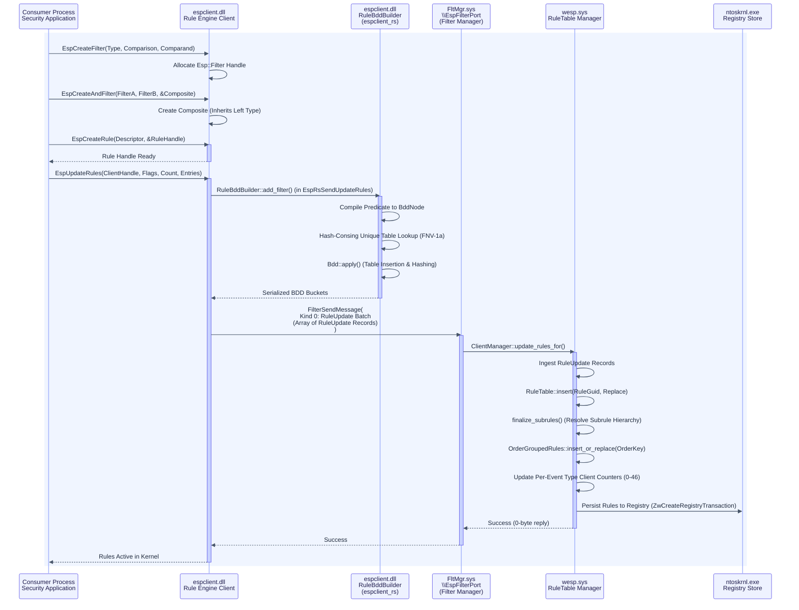
```mermaid
%%{init: {'theme': 'base', 'themeVariables': {'darkMode': false, 'background': '#ffffff', 'primaryColor': '#ffffff', 'primaryTextColor': '#0f172a', 'primaryBorderColor': '#64748b', 'lineColor': '#475569', 'textColor': '#1e293b', 'actorBkg': '#eef2ff', 'actorBorder': '#4f46e5', 'actorTextColor': '#1e1b4b', 'actorLineColor': '#a5b4fc', 'signalColor': '#475569', 'signalTextColor': '#1e293b', 'labelBoxBkgColor': '#fef3c7', 'labelBoxBorderColor': '#b45309', 'labelTextColor': '#451a03', 'loopTextColor': '#1e293b', 'noteBkgColor': '#fef3c7', 'noteBorderColor': '#b45309', 'noteTextColor': '#451a03', 'activationBkgColor': '#c7d2fe', 'activationBorderColor': '#4f46e5', 'sequenceNumberColor': '#0f172a'}, 'themeCSS': '.messageText { fill: #1e293b !important; stroke: none; } .actor text { fill: #1e1b4b; } .loopText { fill: #1e293b !important; } .labelText { fill: #451a03 !important; } .noteText { fill: #451a03 !important; } svg { background-color: #ffffff !important; }'}}%%
sequenceDiagram
participant App as Consumer Process<br/>Security Application
participant Client as espclient.dll<br/>Rule Engine Client
participant BDD as espclient.dll<br/>RuleBddBuilder<br/>(espclient_rs)
participant Port as FltMgr.sys<br/>\\EspFilterPort<br/>(Filter Manager)
participant Driver as wesp.sys<br/>RuleTable Manager
participant Store as ntoskrnl.exe<br/>Registry Store

    rect rgb(240, 245, 255)
        App->>Client: EspCreateFilter(Type, Comparison, Comparand)
        Client->>Client: Allocate Esp::Filter Handle
        App->>Client: EspCreateAndFilter(FilterA, FilterB, &Composite)
        Client->>Client: Create Composite (Inherits Left Type)
        App->>Client: EspCreateRule(Descriptor, &RuleHandle)
        activate Client
        Client-->>App: Rule Handle Ready
        deactivate Client
        App->>Client: EspUpdateRules(ClientHandle, Flags, Count, Entries)
        activate Client
        Client->>BDD: RuleBddBuilder::add_filter() (in EspRsSendUpdateRules)
        activate BDD
        BDD->>BDD: Compile Predicate to BddNode
        BDD->>BDD: Hash-Consing Unique Table Lookup (FNV-1a)
        BDD->>BDD: Bdd::apply() (Table Insertion & Hashing)
        BDD-->>Client: Serialized BDD Buckets
        deactivate BDD
        Client->>Port: FilterSendMessage(<br/>  Kind 0: RuleUpdate Batch<br/>  (Array of RuleUpdate Records)<br/>)
        activate Port
        Port->>Driver: ClientManager::update_rules_for()
        activate Driver
        Driver->>Driver: Ingest RuleUpdate Records
        Driver->>Driver: RuleTable::insert(RuleGuid, Replace)
        Driver->>Driver: finalize_subrules() (Resolve Subrule Hierarchy)
        Driver->>Driver: OrderGroupedRules::insert_or_replace(OrderKey)
        Driver->>Driver: Update Per-Event Type Client Counters (0-46)
        Driver->>Store: Persist Rules to Registry (ZwCreateRegistryTransaction)
        Driver-->>Port: Success (0-byte reply)
        deactivate Driver
        Port-->>Client: Success
        deactivate Port
        Client-->>App: Rules Active in Kernel
        deactivate Client
    end
```

### Rule Definition and Action Model

A rule pairs an event type with a predicate tree, context key assignments, and an action descriptor:

- **Notification Actions**: Instruct the driver to capture event telemetry and enqueue a notification to a specific event queue. Wire cases 0, 1, 2, and 4 in `RuleAction::from_incoming` map to internal discriminants 2, 3, 4, and 6 (the variant selectors of the in-memory `RuleAction` enum). Case 0 binds a queue with no capability test. Case 1 requires bit `0x08` and establishes a virtual queue. Case 2 stores variant 4 with no queue interaction. Case 4 allocates the event queue and stores variant 6.
- **Enforcing Action**: Wire case 3 maps to internal variant 5, stores the index at the action-result index field, and requires capability bit `0x02`. It may wrap a `VirtualQueue` (the pointer can be null). Index `> 2` on a non-`9000` type returns tag `46`. This is the deny ingest path documented in [Policy Enforcement, Disposition Tables, and Deny Flow](#policy-enforcement-disposition-tables-and-deny-flow).
- **Non-Notification Actions**: Wire cases 5, 6, 7, 8, and 9 map to internal discriminants 7, 8, 0, 10, and 11. These actions update internal state or take non-queue outcomes other than the case-3 deny path.
- **Subrule Matching (`RuleActionMatchSubrules`)**: Encapsulates a hierarchy of subrules evaluated sequentially against event properties. Wire case 3 can also transition to internal discriminant 46 under specialized conditions (tag 46; subrule-mode label unconfirmed). Subrule graphs are finalized via `RuleTable::finalize_subrules`.
- **In-Memory Override Action (`ForceAllow`)**: An internal action variant that forces an operation to pass evaluation without persisting the rule. The in-memory-only behavior follows from the `from_incoming` conversion, which never yields discriminants `1` or `9`; `Rule::to_schema` carries a `ForceAllow` must-not-persist string. Symbolic names for the remaining discriminants are unconfirmed; no `Debug` or `Display` implementation for `RuleAction` was located in the examined scope.

### Functional Filter Type Space (Types 1 to 18)

Filter definitions are categorized across 18 distinct filter types:

- `1`: Generic Comparison Filter (Maps to FFI Descriptor Kind 3)
- `2`: Client Property Filter (Maps to FFI Descriptor Kind 2)
- `3`: Event Metadata Filter (Maps to FFI Descriptor Kind 1)
- `4`: Thread Attribute Filter (Maps to FFI Descriptor Kind 4)
- `5`: Process Attribute Filter (Maps to FFI Descriptor Kind 5)
- `6`: File Identity Filter (Maps to FFI Descriptor Kind 7)
- `7`: File Object Filter (Maps to FFI Descriptor Kind 8)
- `8`: File Stream Filter (Maps to FFI Descriptor Kind 6)
- `9`: Volume Attribute Filter (Maps to FFI Descriptor Kind 9)
- `10`: Disk Device Filter (Maps to FFI Descriptor Kind 10)
- `11`: Registry Key Path Filter (Maps to FFI Descriptor Kind 11)
- `12`: Registry Key Object Filter (Maps to FFI Descriptor Kind 12)
- `13`: Network Connection Filter (Maps to FFI Descriptor Kind 13; internal-only, no `EspCreateNetworkFilter` wrapper)
- `14`: Desktop Object Filter (Maps to FFI Descriptor Kind 14)
- `15`: KTM Transaction Filter (Maps to FFI Descriptor Kind 15)
- `16`: Named Pipe Filter (Maps to FFI Descriptor Kind 16)
- `17`: Mailslot Filter (Maps to FFI Descriptor Kind 17)
- `18`: Token Security Attribute Filter (Maps to FFI Descriptor Kind 18)

Public filter types 1, 3, 6, 7, and 8 permute into FFI descriptor kinds 3, 1, 7, 8, and 6, while all other filter types maintain identity mapping. `Esp::Details::CreateFilterInternal` identity-maps public type 13 to FFI descriptor kind 13, and `espclient_rs::filter::Filter::new` dispatches kind 13 to `network::NetworkConnectionFilterDescriptor::try_from_bytes`. No `EspCreateNetworkFilter` wrapper exists (the generic `EspCreateFilter` is hardcoded to type 1), so the 17 public create exports cover types 1 through 12 and 14 through 18.

### Composite Filter Construction Rules

When combining filters through composite constructors (`EspCreateAndFilter`, `EspCreateOrFilter`, `EspCreateXorFilter`):

- Binary Arity: Combinator constructors accept exactly two operand filters.
- Tag Compatibility: Operand identity words are evaluated to assert structural compatibility.
- Type Inheritance: The composite filter automatically inherits the `Esp::FilterType` and configuration parameters of its left operand.
- Unary Negation (`EspCreateNotFilter`): Accepts a single operand filter, inheriting the target filter type and configuration parameters while setting an internal inversion flag.

### Binary Decision Diagram (BDD) Acceleration

To evaluate complex predicate trees containing multiple `And`, `Or`, `Xor`, and `Not` combinators without recursive stack consumption, WESP compiles predicate logic into Reduced Ordered Binary Decision Diagrams:

- **Shared Subgraph Compression**: In naive predicate tree evaluation, evaluating overlapping rule sets scales exponentially with rule density. By compiling predicate trees into an ROBDD, isomorphic subtrees across multiple rules are collapsed into a canonical directed acyclic graph.
- **Decision Nodes (`BddNode`)**: 32-byte structures encoding node tags, target property variable indices, and low/high branch indices. Tag `0` represents a terminal leaf node carrying a boolean outcome; Tag `1` represents an internal decision node.
- **Hash-Consing Unique Table**: BDD nodes are deduplicated using an FNV-1a hash table. If an equivalent decision node already exists, the engine reuses the existing node index, ensuring minimal graph representation.
- **Reduction and Level Ordering**: The `Bdd::apply` construction loop uses unique-table insertion, computed-table lookup, and FNV hashing. Strict variable level order and low-equals-high node elimination are unverified at assembly level.
- **Iterative Evaluation**: At runtime, `Filter::evaluate` walks the compiled BDD iteratively from the root index, branching based on the truth value returned by each individual predicate without stack recursion.

### Kernel Stack Expansion in Rule Evaluation

Every per-event evaluation entry point (`RuleEngine::process_event_internal_<Event>`, 45 monomorphs) is dispatched through a kernel-stack guard (`nt_types::stack::KernelStack`, source `crates\nt_types\src\stack.rs`) in `EventDispatcher::process_rules_with_current_thread_process_<Event>`. The guard calls `IoGetStackLimits` and compares the free stack (current stack pointer minus the low limit) against `0x4000` (16,384 bytes). When at least `0x4000` bytes remain, the dispatcher calls `process_event_internal_<Event>` directly on the current stack. When less remains, the dispatcher calls `KeExpandKernelStackAndCalloutEx` with a `0x6000`-byte (24,576-byte) guarantee, a wait flag of TRUE, and a `KernelStack::callout_closure_<...process_event...>` trampoline as the callout. The callout enforces a "runs exactly once" invariant and re-enters `process_event_internal_<Event>` on the expanded stack.

The guard does not imply recursion. `Filter::evaluate` walks the compiled BDD iteratively, `Predicate::evaluate` dispatches through a jump table, and `bdd::Bdd::apply` uses explicit loops. The guard exists because the rule-evaluation call tree has a large aggregate stack footprint (an approximately 3,000-byte dispatcher frame plus an approximately 1,500-byte core frame, before predicate, comparison, and notification-building frames). The `0x4000` free-stack threshold matches the threshold the ELAM producer path uses; the reference build applies it uniformly across the 45-event data-plane dispatch.

### String Pattern Matching Engine

String comparisons (such as filesystem paths and registry keys) are accelerated through the `string_match` crate:

- **Tokenization**: Patterns are tokenized into literal code units, single-character wildcards (`?`), bounded wildcards (`{n}` only; no `{n,m}` form), and unbounded wildcards (`*`). Repetition counts are validated to prevent integer overflow.
- **Trie and NFA Compilation**: `StringPatternBuilder::compile` converts pattern strings into a combined Trie and Nondeterministic Finite Automaton (NFA).
- **Lookaside Scratch Buffers**: To eliminate heap allocations during in-kernel string matching, `StringPatternMatcher` allocates scratch buffers from pre-allocated lookaside lists. Scratch buffers partition into five 64-bit arrays matching state counts, requiring a minimum capacity (`40 * state_count`) and 8-byte alignment.
- **Path Boundaries and Wildcards**: Path separators (`/` and `\`) are handled as token boundaries to prevent wildcards from traversing directory delimiters unexpectedly.
- **Case-Insensitive Default**: No `RtlDowncaseUnicodeString` call exists in the `string_match` path; driver-wide callers are `ensure_registry_key`, which downcases registry key text at ingestion, and `to_lowercase`, which also feeds the evaluator path. The evaluator path downcases via `to_lowercase` in `evaluate_string_op`. Equality predicates pass the inverted case flag as the `CaseInSensitive` argument to `RtlCompareUnicodeString`. Case-sensitive behavior requires the rule or collection case flag.

### Client-Side Rule Pipeline

Before rules are transmitted to the kernel:

1. `RuleBddBuilder` interns predicates into local `BddNode` buckets at `EspRsSendUpdateRules` serialization time.
2. Comparison right-hand-side values are copied into a stable pointer arena (`StableItems::stash`) to ensure memory addresses remain valid during serialization.
3. The client groups rules into batches formatted as `_ESP_RS_RULE_UPDATE_ENTRY` records (operation codes 1 and 2 for handles, 3 through 5 for raw GUIDs).
4. `EspUpdateRules` transmits the batch across `\EspFilterPort` via message kind 0.

`EspUpdateRules` normalizes the caller array in two passes. The first pass partitions the 24-byte entries into type 1 and 2 (add and update) versus types 3, 4, and 5 (remove and identity) with no reordering, refcounts each `Rule` object into a 40-byte `Esp::RuleUpdateEntry`, and sizes the vector to at least 8. The second pass flattens the 40-byte records into the 24-byte `_ESP_RS_RULE_UPDATE_ENTRY` wire record `{DWORD type; QWORD a; QWORD b}`, resolving each rule descriptor through `EspRsGetRuleDescriptor`; a negative HRESULT aborts the batch. `EspRsSendUpdateRules` then sends the records on the session port as kind 0 (connect-context opcode untraced). A cookie value of `1` on this path is unproven with no literal in static sources. The fourth send position carries the `EspUpdateRules` second argument, for which `esptool` passes `0`; the `lifetime` label is unconfirmed because per-rule lifetime travels inside each rule descriptor.

Rule creation validates the descriptor fail-closed: `EspRsCreateRule` checks the action selector, descriptor lifetime field, and event type against accepted ranges, and constructs the per-event notification configuration from the descriptor's configuration blob. `EspCreateRule` takes the descriptor and an output handle. It does not take a client handle. The export builds the rule in process and does not send a Filter Manager message. `EspUpdateRules` transmits the batch on message kind `0`.

The queue-backed action selector is `1`. Selector `0` is rejected. A queue-backed descriptor stores the 16-byte event-queue handle wrapper in the event-queue field. A null wrapper on that path is rejected.

Selector `7` is `RuleActionMatchSubrules`. That path does not store an event-queue handle in the shared tail. It stores a 32-bit subrule count and an 8-aligned pointer to an array of rule handles. A count of `0` still requires a non-null 8-aligned empty array. Swapping the count and the array pointer was observed to return `E_INVALIDARG` (`0x80070057`). `esptool` writes count then array for selector `7`.

The descriptor lifetime field is the rule lifetime, an integer in `0` through `4`. For the queue-backed selector, lifetime `0` is rejected with `E_INVALIDARG` (`0x80070057`) before any driver round trip; `1` is transient and `3` is persistent. The switch on this field gates the `EventModify` conversion, whose kind is the descriptor modify-kind field (`1` to `8000`, `2` to `8001`, `3` to `2000`, `4` to `3007`). An empty modify payload is accepted. Install runs use lifetime `1`.

The `1052`-byte (`0x41C`) descriptor configuration region partitions into the event header at the start of the configuration region (64 bytes), the client header (60 bytes, a mirror layout with its own filter, triples, and `ClientPropertyQuery::new` accepting only tag 1), the inline ThreadConfig blob (520 bytes), and the inline ProcessConfig blob (408 bytes). The event-header triples are: the context-key count/pointer (40-byte elements through `ContextKeyConfig::new`), the property-query count/pointer (u32 array consumed by an inline loop accepting tags 1 through 3), and the binding count/pointer (16-byte records through `property_bindings_from_ffi`). The per-family pointer dispatches through an event-discriminant union map (discriminants 16 through 61); serialization walks `BindingMap` and `RuleMessageState` into `0xF8`-stride `Vec<RuleUpdate>` records. Writes that `esptool` issues land on ProcessConfig bytes the constructor never reads.

A zeroed configuration blob of `1052` (`0x41C`) bytes is accepted for empty-filter queue-backed rules across the sparse ranges listed in [Complete Functional Event Surface](#complete-functional-event-surface), except `0` (skipped by `InstallRules`; the DLL gate admits `0` and the harness refuses it before calling the export) and `9000` (rejected by `EspUpdateRules`; static code accepts `9000` and the exact rejecting check is unisolated). Isolated typed notifications appear in the harness per-event-type support matrix.

Closing a rule handle does not remove the rule from the driver. The consumer-facing construction sequence, predicate language, collections, post-notification query, and the XML mapping onto the same exports are detailed in the following sections.

### Per-Event Rule Configuration Structures

Each monitored event family is supported by a dedicated notification configuration structure: `FileNotificationConfig`, `VolumeNotificationConfig`, `FileStreamNotificationConfig`, `ProcessNotificationConfig`, `ThreadNotificationConfig`, `TokenNotificationConfig`, `RegistryNotificationConfig`, and `FieldParameterConfig`. These structures support bidirectional conversion (`to_stored` for kernel-side persistence and `try_from` for wire deserialization). Property-kind vectors convert between incoming schema definitions and internal kernel property identifiers. Process lineage configurations sort ancestor records into a canonical `SortedProcessChain`. When an invalid configuration discriminant is encountered during conversion, the decoder returns an error status. The exact invalid-discriminant to `STATUS_INVALID_PARAMETER` (`0xC000000D`) edge is unisolated.

A WESP rule is an event subscription descriptor. It names an event family, an optional predicate over objects that participate in that event, and an action the driver takes when the predicate holds. The kernel does not parse product configuration files or XML. `espclient.dll` is the construction surface. Every examined consumer, including `esptool`, assembles the same handle types and sends the same update batch (`MpRtp.dll` not examined in this scope).

Kernel evaluation (BDD compilation, string matching, comparand resolution) are detailed in the preceding sections. This section describes the objects a caller builds, the order of those calls, and how a match continues into notification, object identity, and property inspection.

### How the Pieces Connect

The control plane and the telemetry plane share one client session. The data plane evaluates rules without waiting for user mode.

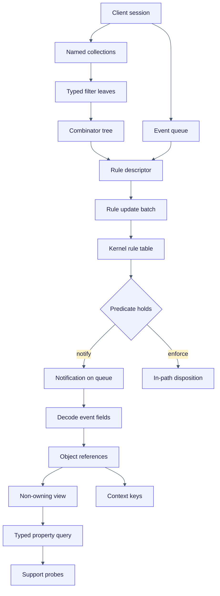
```mermaid
%%{init: {'theme': 'base', 'themeVariables': {'darkMode': false, 'background': '#ffffff', 'primaryColor': '#eef2ff', 'primaryTextColor': '#1e1b4b', 'primaryBorderColor': '#4f46e5', 'lineColor': '#475569', 'textColor': '#1e293b', 'edgeLabelBackground': '#fef3c7'}, 'themeCSS': '.node rect, .node polygon { fill: #eef2ff !important; stroke: #4f46e5 !important; } .node text { fill: #1e1b4b !important; } .edgeLabel { color: #1e293b !important; background-color: #fef3c7 !important; } svg { background-color: #ffffff !important; }'}}%%
flowchart TD
    session[Client session] --> queue[Event queue]
    session --> collections[Named collections]
    collections --> leaf[Typed filter leaves]
    leaf --> tree[Combinator tree]
    tree --> rule[Rule descriptor]
    queue --> rule
    rule --> update[Rule update batch]
    update --> kernel[Kernel rule table]
    kernel --> match{Predicate holds}
    match -->|notify| notif[Notification on queue]
    match -->|enforce| disposition[In-path disposition]
    notif --> decode[Decode event fields]
    decode --> refs[Object references]
    refs --> view[Non-owning view]
    view --> query[Typed property query]
    refs --> context[Context keys]
    query --> support[Support probes]
```

Install-time objects determine **whether** an event matches and **what** the driver does. Post-notification objects inspect **which** kernel resource participated. A query recipe attached to a harness document is not part of the kernel rule. It runs in the consumer after a notification arrives.

### Session Preconditions

Rule install requires an authenticated client session and, for queue-backed notify, a live event queue.

1. Register a client identity (name, altitude, optional GUID) or connect an already registered identity.
2. Connect a session. All later create and update calls use that session handle.
3. Create an event queue and bind a delivery mode (application callback or I/O completion port).
4. Optionally create named collections and populate entries. A string collection can become a membership comparand on a later leaf.
5. Create typed filter leaves, then combinators if the predicate is more than one leaf.
6. Create each rule in process from a descriptor. The create export does not take a client handle and does not send a port message.
7. Submit the rule handles in one update batch on the session. The driver inserts, replaces, or removes rules and, for persistent lifetime, writes the durable store.
8. Arm notification objects if the action is queue-backed notify.


```mermaid
%%{init: {'theme': 'base', 'themeVariables': {'darkMode': false, 'background': '#ffffff', 'primaryColor': '#ffffff', 'primaryTextColor': '#0f172a', 'primaryBorderColor': '#64748b', 'lineColor': '#475569', 'textColor': '#1e293b', 'actorBkg': '#eef2ff', 'actorBorder': '#4f46e5', 'actorTextColor': '#1e1b4b', 'actorLineColor': '#a5b4fc', 'signalColor': '#475569', 'signalTextColor': '#1e293b', 'labelBoxBkgColor': '#fef3c7', 'labelBoxBorderColor': '#b45309', 'labelTextColor': '#451a03', 'loopTextColor': '#1e293b', 'noteBkgColor': '#fef3c7', 'noteBorderColor': '#b45309', 'noteTextColor': '#451a03', 'activationBkgColor': '#c7d2fe', 'activationBorderColor': '#4f46e5', 'sequenceNumberColor': '#0f172a'}, 'themeCSS': '.messageText { fill: #1e293b !important; stroke: none; } .actor text { fill: #1e1b4b; } .loopText { fill: #1e293b !important; } .labelText { fill: #451a03 !important; } .noteText { fill: #451a03 !important; } svg { background-color: #ffffff !important; }'}}%%
sequenceDiagram
    participant App as Consumer Process<br/>Security Application
    participant Client as espclient.dll<br/>Session and Rule API
    participant Port as FltMgr.sys<br/>\\EspFilterPort<br/>(Filter Manager)
    participant Driver as wesp.sys<br/>Client and Rule Manager

    rect rgb(240, 245, 255)
        Note over App,Driver: Steps 1-2: Identity and session (opcodes 1 and 3)
        opt Register new identity (skip if already registered)
            App->>Client: EspRegisterClient(name, altitude, GUID)
            activate Client
            Client->>Port: FilterConnectCommunicationPort(<br/>Context: Opcode 1 + descriptor<br/>)
            activate Port
            Port->>Driver: Persist client identity
            activate Driver
            Driver-->>Port: Registered (ephemeral port closes)
            deactivate Driver
            Port-->>Client: S_OK
            deactivate Port
            deactivate Client
        end
        App->>Client: EspConnectClient(ClientGuid)
        activate Client
        Client->>Port: FilterConnectCommunicationPort(<br/>Context: Opcode 3 + ClientGuid<br/>)
        activate Port
        Port->>Driver: Authenticate caller, open session
        activate Driver
        Driver-->>Port: Session port (cookie 1)
        deactivate Driver
        Port-->>Client: Session established
        deactivate Port
        Client-->>App: Session handle (all later calls use it)
        deactivate Client
    end

    rect rgb(255, 250, 240)
        Note over App,Driver: Step 3: Event queue and delivery binding
        App->>Client: EspCreateEventQueue() + bind callback or IOCP
        activate Client
        Client->>Port: FilterSendMessage(Kind 25: Create Event Queue)
        activate Port
        Port->>Driver: Allocate kernel queue
        activate Driver
        Driver-->>Port: Queue GUID
        deactivate Driver
        Port-->>Client: Queue created
        deactivate Port
        Client->>Port: FilterConnectCommunicationPort(<br/>Context: Opcode 4 + queue GUID<br/>)
        activate Port
        Port->>Driver: Attach delivery port
        activate Driver
        Driver-->>Port: Delivery port (cookie 2)
        deactivate Driver
        Port-->>Client: Delivery port ready
        deactivate Port
        Client-->>App: Queue handle
        deactivate Client
    end

    rect rgb(240, 255, 245)
        Note over App,Driver: Step 4: Collections (optional)
        opt String collection for membership comparand
            App->>Client: EspCreateCollection() + EspUpdateCollection(entries)
            activate Client
            Client->>Port: FilterSendMessage(Kinds 17, 20:<br/>Create + Update Collection<br/>)
            activate Port
            Port->>Driver: Store collection entries
            activate Driver
            Driver-->>Port: Collection ready
            deactivate Driver
            Port-->>Client: Success
            deactivate Port
            Client-->>App: Collection handle
            deactivate Client
        end
    end

    rect rgb(250, 245, 255)
        Note over App,Driver: Steps 5-6: Filters and rules (in process, no port messages)
        App->>Client: EspCreate*Filter() leaves + combinators
        activate Client
        Client->>Client: Build predicate tree (inherits left-operand kind)
        Client-->>App: Filter handles
        deactivate Client
        App->>Client: EspCreateRule(descriptor per rule)
        activate Client
        Client->>Client: Validate selector, lifetime, event type (fail-closed)
        Client-->>App: Rule handles (repeat per rule)
        deactivate Client
    end

    rect rgb(240, 245, 255)
        Note over App,Driver: Step 7: Single update batch on the session
        App->>Client: EspUpdateRules(session, rule handles)
        activate Client
        Client->>Client: Serialize batch (compile predicate to decision diagram)
        Client->>Port: FilterSendMessage(Kind 0: Rule update batch)
        activate Port
        Port->>Driver: Insert, replace, or remove rules,<br/>write durable store if persistent
        activate Driver
        Driver-->>Port: Rules active (0-byte reply)
        deactivate Driver
        Port-->>Client: Success
        deactivate Port
        Client-->>App: Rules installed
        deactivate Client
    end

    rect rgb(255, 250, 240)
        Note over App,Driver: Step 8: Arm notifications (queue-backed notify only)
        App->>Client: EspArmEventNotification(notification)
        activate Client
        Client->>Port: FilterGetMessage (armed overlapped read)
        activate Port
        Port-->>Client: Read armed (completes on event)
        deactivate Port
        Client-->>App: Armed
        deactivate Client
    end

    rect rgb(250, 240, 240)
        Note over App,Driver: Closing a handle does not uninstall the rule
        opt Remove installed rules
            App->>Client: EspRemoveAllRulesForClient() or delete batch
            activate Client
            Client->>Port: FilterSendMessage(Kind 12: Remove All Rules)
            activate Port
            Port->>Driver: Delete rules, decrement counters
            activate Driver
            Driver-->>Port: Removed (0-byte reply)
            deactivate Driver
            Port-->>Client: Success
            deactivate Port
            Client-->>App: Rules removed
            deactivate Client
        end
    end
```

Closing a filter or rule handle releases the consumer-side object. It does not uninstall the rule. Removal uses the remove-rules exports or an update batch that deletes by identifier.

Transient lifetime lasts for the session. Persistent lifetime survives reconnect when the client identity remains on the allowlist. The harness `persist-rules` path is the persistent install of the same descriptors.

### Anatomy of One Rule

| Part               | Role                                                                                                                                                                                                  |
| ------------------ | ----------------------------------------------------------------------------------------------------------------------------------------------------------------------------------------------------- |
| Event type         | Sparse identifier for the intercepted operation (process create, file-object create, registry create, and the families in [Complete Functional Event Surface](#complete-functional-event-surface)).   |
| Predicate          | Optional tree of typed leaves and combinators. An empty predicate is accepted (match-all evaluation semantics not traced).                                                                            |
| Action             | What the driver does on a match: enqueue telemetry, deny, rewrite access, cancel, or evaluate a list of subrules.                                                                                     |
| Order key          | Integer that orders this client's rules relative to each other. Connected clients themselves order by altitude.                                                                                       |
| Queue binding      | Required when the action is queue-backed notify. The descriptor holds the queue handle.                                                                                                               |
| Configuration blob | Per-event request for which properties the driver should materialize onto the notification. An empty blob is accepted for empty-filter notify across the accepted sparse types except BootLoadDriver. |

The create export validates the action selector, descriptor lifetime field, and event type fail-closed. Queue-backed notify uses selector `1`. Selector `0` is rejected. Match-subrules uses selector `7` and stores a subrule handle array instead of a queue handle. The kernel accepts selectors `0` through `9` and maps them to internal `RuleAction` discriminants (selector `0` to discriminant `2`, `1` to `3`, `2` to `4`, `3` to `5`, `4` to `6`, `5` to `7`, `6` to `8`, `7` to `0`, `8` to `10`, `9` to `11`). The client ABI labels selector `4` deny and `5` rewrite; on build `10.0.29641` the labels are inverted. Selector `4` maps to the notification-producing discriminant `6` and can carry an event-queue reference, so it enqueues telemetry and does not block. Selector `5` maps to the non-notification discriminant `7` and is the enforcing selector: a matching rule refuses the operation. The forbidding selector pair is therefore `5` for enforcement and `4` for notification suppression without enforcement.

An omitted or zero action in a harness document is rewritten to queue-backed notify. That rewrite is a document convenience. The DLL still receives selector `1`.

### Predicate Leaves

A leaf is one comparison against one property of one object kind. The public create exports are typed by object kind. The harness XML `type` attribute selects which of those exports to call. That index is not the public filter-type numbering in [Functional Filter Type Space](#functional-filter-type-space-types-1-to-18).

| Object kind         | Typical event family                  | What the leaf tests                                  |
| ------------------- | ------------------------------------- | ---------------------------------------------------- |
| Client              | Any                                   | Session-scoped client property (boolean capability). |
| Desktop             | Object-manager handle                 | Desktop name.                                        |
| Disk                | Volume and disk                       | Disk identity string.                                |
| Event               | Any                                   | Event metadata (boolean or numeric).                 |
| File                | File-object I/O                       | File path or numeric file property.                  |
| File object         | File-object I/O, pipe open            | Name strings or numeric class (Pipe is class `3`).   |
| File stream         | File-object I/O                       | Stream name.                                         |
| Registry key        | Registry                              | Key path.                                            |
| Registry key object | Registry                              | Object-level boolean or numeric.                     |
| Process             | Process create, terminate, image load | Image name.                                          |
| Thread              | Thread create, start, terminate       | Thread identifier.                                   |
| Token               | Process create                        | Token SID slots, privileges, and numeric properties. |
| Volume              | Volume mount, dismount, fsctl         | Volume name.                                         |
| Pipe                | Pipe create                           | Pipe name.                                           |
| Mailslot            | Mailslot create                       | Mailslot name.                                       |
| KTM transaction     | Commit, rollback                      | Transaction numeric property.                        |

A leaf that the constructor does not accept for that property returns `E_INVALIDARG` and does not call the export. Payload kinds are string, numeric, boolean, and SID. String leaves use four comparands:

| Comparand | Meaning                                                                                                  |
| --------- | -------------------------------------------------------------------------------------------------------- |
| `1`       | Equals.                                                                                                  |
| `2`       | Not-equals.                                                                                              |
| `3`       | Pattern (`*` and related wildcards). A bare image name is not a pattern.                                 |
| `4`       | Membership in a named string collection. Integer and binary collections are not valid as this comparand. |

Numeric leaves use a separate operator range. Boolean leaves test an immediate true or false. SID leaves carry binary SID payloads for token SID slots, token group membership, and security descriptor owner and group fields. Tags `6` and `11` do not form a pair in any examined switch. The client accepts SDDL string form through `ConvertStringSidToSidW`, imports `IsValidSid`, `GetLengthSid`, and `CopySid` (individual call sites not traced), and rejects invalid input during construction before filter serialization. Token privilege comparisons use binary and numeric arms and stay outside this family. XML `op` and `propertyName` are labels for logs. The installer stores the numeric comparand and property identifier.

Path values may be Win32, `$nt:`-prefixed, or NT device form. The client expands `$nt:` before the comparison record is built. A pre-expanded `\Registry\Machine\...` leaf value installs and matches (`monitor_reg_ntpath`: `update=0x00000000`, `received=1`). `ERROR_BAD_PATHNAME` (`161`) applies only on the reference path, where `EnsureNtRegistryPath` rejects kind-`1` descriptors carrying NT text. No shipped document or executed run covers an `HKLM`-form leaf value.

### Combinators

Four combinators compose leaves into a tree:

- **AND**: both children must hold. Two sibling leaves with no wrapper become an implicit AND.
- **OR**: either child holds.
- **XOR**: exactly one child holds.
- **NOT**: the child must not hold.

Binary combinators accept two children. Extra siblings are retained by a document parser and are not sent to the create-combinator export. Unary NOT accepts one child. Maximum documented tree depth is 16.

The composite inherits the object kind of its left child for configuration purposes. Evaluation in the kernel does not walk the original tree. The client compiles the tree into a BDD before the update batch is sent.

### Collections

A collection is a named, client-scoped set. Create types are integer (`1`), string (`2`), and binary (`3`). Those numbers are not the enumerate-ids lifetime values `1` through `3`.

A string collection can be bound on a string leaf as comparand `4`. The leaf then matches when the runtime property is a member of that set. Integer and binary collections are created, updated, and enumerated. They are not bound as string membership. Opening an existing collection by GUID requires the GUID. A document that sets `open="true"` without a GUID is a parser error.

Collection identifiers are session-local. A shipped document does not embed a hop-local open GUID.

### Actions and Enforcement

| Action              | Selector       | Effect when the predicate holds                                                                                                                                                                                                                                                                   |
| ------------------- | -------------- | ------------------------------------------------------------------------------------------------------------------------------------------------------------------------------------------------------------------------------------------------------------------------------------------------- |
| Queue-backed notify | `1`            | Capture the event and enqueue a notification. The I/O path does not wait for the consumer.                                                                                                                                                                                                        |
| Enforcing deny      | `5`            | Fail the operation in kernel. Requires a nonzero event modify kind. For file creation the driver completes the create with `STATUS_NOT_FOUND` (`0xC0000225`). Victim-side evidence is in [Operational Verification and Target Host Findings](#operational-verification-and-target-host-findings). |
| Notify form         | `4`            | Drop the queued notification for the matching event. The operation completes and the object is created; this selector does not block.                                                                                                                                                             |
| Cancel              | `6`            | Cancel the in-flight operation. Follows from code; no executed run in the examined scope covers this path.                                                                                                                                                                                        |
| Match subrules      | `7`            | Evaluate a listed set of other rules. An empty list still requires a valid empty array.                                                                                                                                                                                                           |
| Access-mask rewrite | not identified | Change the access mask (create path) and continue. No runtime measurement identifies the selector that reaches this branch.                                                                                                                                                                       |

The client ABI labels selector `4` deny and `5` rewrite. On build 10.0.29641 the behavior is the inverse: selector `5` refuses the operation and selector `4` only suppresses the queued notification. The enforcing selector is constructible only for the event types the client accepts (`2000`, `3007`, `8000`, `8001`); the client rejects the enforcing selector with a zero modify kind for every other event type. The `3007` entry requires the 4-byte query-open payload; kind-sweep coverage of `3007` is the 16-byte access-mask payload only, and its rejection there is a payload-shape outcome, per the kind-sweep table in [The Two-Sided Enforcement Gate](#the-two-sided-enforcement-gate). The client acceptance set and the driver capability bit `0x02` intersect at `{2000}`, so an unmodified client enforces file creation only. The process-creation notify routine is a separate consumer with its own disposition table. Reaching it through `EspCreateRule` still requires a nonzero modify kind, which the unpatched client refuses for type `1000`. The in-memory `from_ffi` patch in [Policy Enforcement, Disposition Tables, and Deny Flow](#policy-enforcement-disposition-tables-and-deny-flow) supplies kind `3` and reaches that table. The full per-family inventory is documented in [Policy Enforcement, Disposition Tables, and Deny Flow](#policy-enforcement-disposition-tables-and-deny-flow).

Notify and enforce can coexist across different rules. Hierarchical evaluation runs connected clients in altitude order, then rules of one client by order key. A later ForceAllow override exists as an in-memory action and is not persisted.

BootLoadDriver (`9000`) is a valid event type on the descriptor and its entry is rejected with `0x80070057`. The current installer submits each rule in its own batch, so a mixed document arms valid siblings and reports `Partial` instead of vetoing the whole document.

### After a Match: Identity, Query, and Context

A notification is not a kernel object handle. It is a relocated snapshot. To inspect the live object, the consumer creates an **object reference** from a natural key, unwraps a non-owning **view**, then queries properties on that view.

| Kind                                  | Natural key                                   | Query export                          | Notes                                                                                          |
| ------------------------------------- | --------------------------------------------- | ------------------------------------- | ---------------------------------------------------------------------------------------------- |
| Process                               | Process identifier                            | `EspQueryProcessProperties`           |                                                                                                |
| Thread                                | Thread identifier                             | `EspQueryThreadProperties`            |                                                                                                |
| Token                                 | Process or thread identifier                  | `EspQueryTokenProperties`             | Thread token requires an impersonation token.                                                  |
| File                                  | Win32 or NT path, or volume GUID plus file id | `EspQueryFileProperties`              |                                                                                                |
| File object                           | Path                                          | `EspQueryFileObjectProperties`        |                                                                                                |
| File stream                           | Path, or typed by-id (five arguments)         | `EspQueryFileStreamProperties`        | Stream-by-id is not a four-argument generic call.                                              |
| Registry                              | Win32 path such as `HKLM\Software`            | `EspQueryRegistryKeyProperties`       |                                                                                                |
| Registry key object                   | (no create-by-path)                           | `EspQueryRegistryKeyObjectProperties` | Support probe and query on a view when one exists.                                             |
| Volume, disk, desktop, pipe, mailslot | GUID for volume; path or name for the others  | Matching `EspQuery*Properties`        |                                                                                                |
| Event                                 | Event-object identifier                       | None                                  | `EspQueryEventProperties` is not exported. `EspIsEventPropertySupported` is the support probe. |
| Client                                | Session handle                                | `EspQueryClientProperties`            | First argument is the client handle, not a reference.                                          |
| KTM                                   | (no create-by-path)                           | `EspQueryKtmTransactionProperties`    | Support probe is the success path without a reference.                                         |

Aliases `process-token` and `thread-token` canonicalize to token. Alias `stream` canonicalizes to file stream. Create still distinguishes process token from thread token when a thread identifier is supplied and the process identifier is empty.

`EspIs*PropertySupported` answers whether a property identifier is in range for that kind. Those probes run in user mode and do not send a port message. `EspQuery*Properties` reads live values through a view and may return `ERROR_NOT_FOUND` or `E_INVALIDARG` after a successful create. That HRESULT is a completed probe, not a failed create. No examined run captures these HRESULTs; the behavior follows from code.

Context keys attach extra values to a **reference handle** (set and enumerate). Get-id, get-type, and property query use the **view**. Mixing those roles fails the call. No deliberate role-mixing failure appears in the executed runs; the behavior follows from code.

An event-object reference is minted from the stable 64-bit identifier, not from a raw notification pointer. A harness `--from-notify` path installs rules, waits for one notification, decodes a process identifier or file path, creates the matching reference, reads the event-object identifier, then creates the event-object reference by that identifier.

Close exports `EspCloseEventObjectReference` and `EspCloseCollection` exist; pairing convention not traced.

## Policy Enforcement, Disposition Tables, and Deny Flow

The `wesp.sys` driver operates not only as a passive telemetry sensor, but as an active in-kernel policy enforcement filter. Minifilter callbacks convert rule evaluation outcomes into Filter Manager statuses and active I/O modifications. For `2000` (`FoCreate`) pre-create, file-create deny is a complete-with-status disposition (`STATUS_NOT_FOUND` at index 2), not an access-mask rewrite.

The enforcement model spans client descriptor construction, wire ingest, capability acceptance, rule matching, action disposition index selection, and family-specific kernel writes that terminate operations at the source.

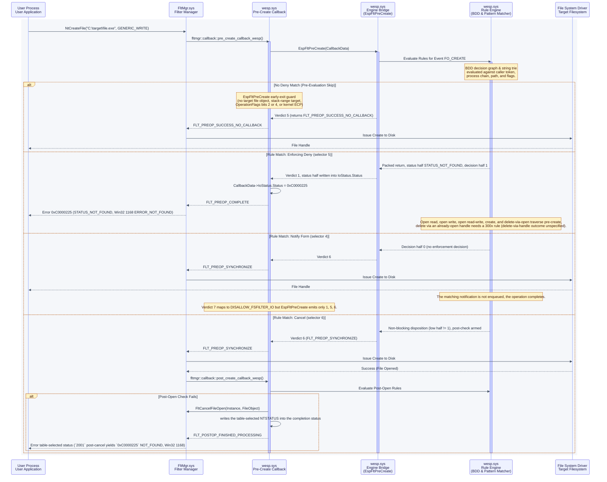
```mermaid
%%{init: {'theme': 'base', 'themeVariables': {'darkMode': false, 'background': '#ffffff', 'primaryColor': '#ffffff', 'primaryTextColor': '#0f172a', 'primaryBorderColor': '#64748b', 'lineColor': '#475569', 'textColor': '#1e293b', 'actorBkg': '#eef2ff', 'actorBorder': '#4f46e5', 'actorTextColor': '#1e1b4b', 'actorLineColor': '#a5b4fc', 'signalColor': '#475569', 'signalTextColor': '#1e293b', 'labelBoxBkgColor': '#fef3c7', 'labelBoxBorderColor': '#b45309', 'labelTextColor': '#451a03', 'loopTextColor': '#1e293b', 'noteBkgColor': '#fef3c7', 'noteBorderColor': '#b45309', 'noteTextColor': '#451a03', 'activationBkgColor': '#c7d2fe', 'activationBorderColor': '#4f46e5', 'sequenceNumberColor': '#0f172a'}, 'themeCSS': '.messageText { fill: #1e293b !important; stroke: none; } .actor text { fill: #1e1b4b; } .loopText { fill: #1e293b !important; } .labelText { fill: #451a03 !important; } .noteText { fill: #451a03 !important; } svg { background-color: #ffffff !important; }'}}%%
sequenceDiagram
    participant App as User Process<br/>User Application
    participant FltMgr as FltMgr.sys<br/>Filter Manager
    participant PreCreate as wesp.sys<br/>Pre-Create Callback
    participant Bridge as wesp.sys<br/>Engine Bridge<br/>(EspFltPreCreate)
    participant Engine as wesp.sys<br/>Rule Engine<br/>(BDD & Pattern Matcher)
    participant FS as File System Driver<br/>Target Filesystem

    rect rgb(245, 247, 250)
        App->>FltMgr: NtCreateFile("C:\target\file.exe", GENERIC_WRITE)
        FltMgr->>PreCreate: fltmgr::callback::pre_create_callback_wesp()
        activate PreCreate

        PreCreate->>Bridge: EspFltPreCreate(CallbackData)
        activate Bridge

        Bridge->>Engine: Evaluate Rules for Event FO_CREATE
        activate Engine

        Note over Engine: BDD decision graph & string trie<br/>evaluated against caller token,<br/>process chain, path, and flags.

        alt No Deny Match (Pre-Evaluation Skip)
            Note over PreCreate: EspFltPreCreate early-exit guard<br/>(no target file object, stack-range target,<br/>OperationFlags bits 2 or 4, or kernel ECP)
            Bridge-->>PreCreate: Verdict 5 (returns FLT_PREOP_SUCCESS_NO_CALLBACK)
            PreCreate-->>FltMgr: FLT_PREOP_SUCCESS_NO_CALLBACK
            FltMgr->>FS: Issue Create to Disk
            FS-->>App: File Handle
        else Rule Match: Enforcing Deny (selector 5)
            Engine-->>Bridge: Packed return, status half STATUS_NOT_FOUND, decision half 1
            Bridge-->>PreCreate: Verdict 1, status half written into IoStatus.Status
            PreCreate->>PreCreate: CallbackData->IoStatus.Status = 0xC0000225
            PreCreate-->>FltMgr: FLT_PREOP_COMPLETE
            FltMgr-->>App: Error 0xC0000225 (STATUS_NOT_FOUND, Win32 1168 ERROR_NOT_FOUND)
            Note over Engine: Open read, open write, open read-write, create, and delete-via-open traverse pre-create,<br/>delete via an already-open handle needs a 300x rule (delete-via-handle outcome unspecified).
        else Rule Match: Notify Form (selector 4)
            Engine-->>Bridge: Decision half 0 (no enforcement decision)
            Bridge-->>PreCreate: Verdict 6
            PreCreate-->>FltMgr: FLT_PREOP_SYNCHRONIZE
            FltMgr->>FS: Issue Create to Disk
            FS-->>App: File Handle
            Note over Engine: The matching notification is not enqueued, the operation completes.
            Note over PreCreate: Verdict 7 maps to DISALLOW_FSFILTER_IO but EspFltPreCreate emits only 1, 5, 6.
        else Rule Match: Cancel (selector 6)
            Engine-->>Bridge: Non-blocking disposition (low half != 1), post-check armed
            Bridge-->>PreCreate: Verdict 6 (FLT_PREOP_SYNCHRONIZE)
            PreCreate-->>FltMgr: FLT_PREOP_SYNCHRONIZE
            FltMgr->>FS: Issue Create to Disk
            FS-->>FltMgr: Success (File Opened)
            FltMgr->>PreCreate: fltmgr::callback::post_create_callback_wesp()
            PreCreate->>Engine: Evaluate Post-Open Rules
            alt Post-Open Check Fails
                PreCreate->>FltMgr: FltCancelFileOpen(Instance, FileObject)
                PreCreate->>PreCreate: writes the table-selected NTSTATUS into the completion status
                PreCreate-->>FltMgr: FLT_POSTOP_FINISHED_PROCESSING
                FltMgr-->>App: Error table-selected status (`2001` post-cancel yields `0xC0000225` NOT_FOUND, Win32 1168)
            end
        end

        deactivate Engine
        deactivate Bridge
        deactivate PreCreate
    end
```

### Preconditions for In-Kernel Enforcement

An enforcing rule produces an in-kernel deny only when every condition below holds:

- **Connected Client Armed**: The per-event counter for the sparse event type and the wildcard in-flight event counter are both nonzero, ensuring the pre-operation callback does not take the early-out return.
- **Predicate Match**: The compiled rule matches the live kernel entity (either via an empty wildcard predicate or a typed leaf comparing the exact namespace materialized by the callback).
- **Enforcing Variant Stored**: The stored action is the enforcing variant (internal variant `5`, produced from incoming wire action `3`).
- **Action Index in Range**: The action disposition index is within the range `0` through `4` at match time. An index greater than `4` bypasses every disposition table and returns pass-through status.
- **Ingest Constraint**: At rule ingest, wire action `3` reads the incoming request action index as an 8-byte value and stores it only when that value is `<= 2` for every type except `9000`. A larger index returns error tag `46`. Table slots `3` and `4` exist in the kernel tables, but `from_incoming` does not store them for `2000`, `7000`, or other non-`9000` types.

A missing condition explains a successful rule installation that does not subsequently fail the intercepted operation.

### Action Selectors and Wire Mapping

The client ABI labels selector `4` deny and selector `5` rewrite. On build `10.0.29641`, selector `4` is notify and selector `5` is enforcing.

| Layer                                               | Enforcing value                             | Notify or suppress value                                                                                        |
| :-------------------------------------------------- | :------------------------------------------ | :-------------------------------------------------------------------------------------------------------------- |
| `esptool` XML `action`                              | `deny`                                      | `suppress` or omitted/`0` (rewritten to `1`)                                                                    |
| Client descriptor selector                          | `5`                                         | `1` (queue-backed notify) or `4` (notify form; does not block)                                                  |
| Wire incoming action in `RuleAction::from_incoming` | `3`                                         | `0` (selector 1, ungated queue bind), `1` (selector 2, virtual queue; requires bit `0x08`), or `2` (selector 4) |
| Internal `RuleAction` variant after ingest          | `5`                                         | `2`, `3`, or `4` for selectors 1, 2, and 4                                                                      |
| Index consumed on match                             | Action disposition index in `0` through `4` | not consulted for a status write                                                                                |

After ingest, a stored enforcing rule holds internal variant `5` in the variant field, index `2` as a byte in the disposition index field, and sparse type `0x7d0` (`2000`).

`RuleAction::from_incoming` is the rule-action ingest routine. Case `1` tests capability bit `0x08` (virtual queue) and returns error tag `17` when the bit is clear. Case `3` tests capability bit `0x02` and returns error tag `16` when the bit is clear. Case `3` then stores internal variant `5` in the action-variant field and the index as a byte in the action disposition index field. It may also wrap a `VirtualQueue` through the virtual-queue wrapper closure; the queue pointer in the result structure can be null. An unknown type returns tag `31`. An index above `2` on a non-`9000` type, or an index of `2` or below on `9000`, returns tag `46`.

### The Two-Sided Enforcement Gate

Enforcement requires two independent per-event-type gates to agree: the client `EventModify::from_ffi` conversion and the driver `RuleAction::from_incoming` capability record. Each gate accepts a closed set of event types, and enforcement is possible only in their intersection.

#### Client Gate (`EventModify::from_ffi`)

`espclient_rs::rule::modify::EventModify::from_ffi` (on the 1,108,088-byte DLL from build 10.0.29641.0) accepts an enforcing descriptor only for four pairs:

| Sparse type | Name                | Required modify kind |
| :---------- | :------------------ | :------------------- |
| `2000`      | `FoCreate`          | `3`                  |
| `3007`      | `FileQueryOpen`     | `4`                  |
| `8000`      | `ObCreateHandle`    | `1`                  |
| `8001`      | `ObDuplicateHandle` | `2`                  |

The event-type check on the 1,108,088-byte DLL from build 10.0.29641.0 compares the event type against `FoCreate` (2000) and branches to the `FoCreate` path on match, which is the `FoCreate` kind-`3` path. The build-10.0.29641.0 DLL implements this converter and check. Every other event type fails with error code `109`, which the client error-mapping routine maps to `E_INVALIDARG` (`0x80070057`). Kind `4` for `3007` is accepted only with the 4-byte query-open payload, not with the 16-byte access-mask payload.

The kind field is the descriptor modify-kind field. The action selector is the descriptor action-selector field. A zero kind on selector `5` is rejected with error `110` before `from_ffi` runs. `from_ffi` itself treats kind `0` as an empty success.

`EspRsCreateRule` runs `EventConfig::new` on the configuration blob **before** `from_ffi`. A type that fails `EventConfig` never reaches the four-pair check. For example, `7003` (`RegSetValue`) fails in `EventConfig::new` before `from_ffi` via set-value configuration validation, returning `0x80070057` even after the `from_ffi` patch (constructor-tag details unconfirmed). In contrast, `7000` and `7001` fail at `from_ffi` without the patch, but pass `EventConfig` through `RegCreateKeyConfig` and `RegOpenKeyConfig`.

#### Driver Gate (`RuleAction::from_incoming`)

`RuleAction::from_incoming` case `3` indexes a 12-byte record in read-only data `{u32 type, u32 flags, u32 extra}` by sparse event type and tests `(flags & 2) == 0`. Bit `0x02` is an acceptance flag. It does not by itself write a disposition.

On build `10.0.29641.0`, the capability records are:

| Type   | Name                | Flags  | Extra | Bit `0x02` |
| :----- | :------------------ | :----- | :---- | :--------- |
| `1000` | `ProcessCreate`     | `0x03` | `1`   | set        |
| `2000` | `FoCreate`          | `0x1B` | `1`   | set        |
| `2001` | `FoOpen`            | `0x03` | `1`   | set        |
| `2004` | `FoCleanup`         | `0x09` | `1`   | clear      |
| `3007` | `FileQueryOpen`     | `0x19` | `1`   | clear      |
| `7000` | `RegCreateKey`      | `0x1B` | `2`   | set        |
| `7001` | `RegOpenKey`        | `0x1B` | `2`   | set        |
| `7003` | `RegSetValue`       | `0x0B` | `2`   | set        |
| `8000` | `ObCreateHandle`    | `0x19` | `1`   | clear      |
| `8001` | `ObDuplicateHandle` | `0x19` | `1`   | clear      |

`0x19` is `0x01 | 0x08 | 0x10`. `0x1B` is `0x19 | 0x02`. `0x0B` is `0x01 | 0x02 | 0x08`. `0x09` is `0x01 | 0x08`. `0x03` is `0x01 | 0x02`. `3007` flags are `0x19`.

#### Gate Intersection Analysis

| Set                                                  | Types                                                                                                                               |
| :--------------------------------------------------- | :---------------------------------------------------------------------------------------------------------------------------------- |
| Client accepts enforcing descriptor                  | `2000`, `3007`, `8000`, `8001`                                                                                                      |
| Driver bit `0x02` set                                | `1000`, `2000`, `2001` through `2003`, `3000` through `3006`, `3008`, `4000`, `4002`, `5000`, `6000`, `7000` through `7014`, `9000` |
| Both gates (unmodified client)                       | `{2000}`                                                                                                                            |
| Client accepts, driver bit clear (driver-impossible) | `3007`, `8000`, `8001`                                                                                                              |
| Driver bit set, client refuses (client-blocked)      | `1000`, `2001` through `2003`, `3000` through `3006`, `3008`, `4000`, `4002`, `5000`, `6000`, `7000` through `7014`, `9000`         |
| Both gates refuse                                    | `1`, `2`, `3`, `1001`, `1002`, `2004`, `3009`, `3010`, `3011`, `4001`, and every type outside `is_bit_valid`                        |

`3007`, `8000`, and `8001` cannot be made to deny by changing the descriptor, the payload size, or the modify kind. The capability records are compile-time constants in read-only data in `wesp.sys`. Those types require a driver change.

`1000` and the other client-blocked types require a change to the signed `espclient.dll` `from_ffi` conversion, or an equivalent in-memory patch in the installing process. They do not require a `wesp.sys` change for the driver to accept wire action `3`.

#### Event Type Reachability Sweep

A systematic reachability sweep covering 14 representative event types evaluated descriptor creation under both natural modify kinds and forced kinds 1 through 4:

| Event type                                                                     | Natural kind          | Natural result             | Kind 1               | Kind 2               | Kind 3          | Kind 4         |
| :----------------------------------------------------------------------------- | :-------------------- | :------------------------- | :------------------- | :------------------- | :-------------- | :------------- |
| `2000` FoCreate                                                                | `3`                   | `S_OK` + `S_OK`            | `E_INVALIDARG`       | `E_INVALIDARG`       | `S_OK` + `S_OK` | `E_INVALIDARG` |
| `8000` ObCreateHandle                                                          | `1`                   | `S_OK` + update fail       | `S_OK` + update fail | `E_INVALIDARG`       | `E_INVALIDARG`  | `E_INVALIDARG` |
| `8001` ObDuplicateHandle                                                       | `2`                   | `S_OK` + update fail       | `E_INVALIDARG`       | `S_OK` + update fail | `E_INVALIDARG`  | `E_INVALIDARG` |
| `3007` FsQueryOpen                                                             | `4` (16-byte payload) | `E_INVALIDARG`             | `E_INVALIDARG`       | `E_INVALIDARG`       | `E_INVALIDARG`  | `E_INVALIDARG` |
| `1000`, `2002`, `2004`, `3000`, `3011`, `4000`, `5000`, `6000`, `7000`, `9000` | `0`                   | refused on zero-kind guard | `E_INVALIDARG`       | `E_INVALIDARG`       | `E_INVALIDARG`  | `E_INVALIDARG` |

"Update fail" denotes that `EspCreateRule` succeeded but `EspUpdateRules` returned `0x80070057` (`E_INVALIDARG`) due to driver capability tag rejection (Tag 16).

### Disposition Determination and Disposition Tables

Pre-operation callbacks evaluate the rule engine to determine an action index (bounded from 0 to 4). The index selects one of five entries in a disposition table that maps the engine decision to an underlying NTSTATUS code or Filter Manager status.

#### Unified 5-Status Disposition Codes

Across all 14 disposition tables in `wesp.sys`, the five status slots are identical in value and order:

| Index | Status Symbolic Name    | NTSTATUS Code | Win32 Equivalence                    |
| :---: | :---------------------- | :-----------: | :----------------------------------- |
|  `0`  | `STATUS_VIRUS_INFECTED` | `0xC0000906`  | `ERROR_VIRUS_INFECTED`               |
|  `1`  | `STATUS_ACCESS_DENIED`  | `0xC0000022`  | `ERROR_ACCESS_DENIED` (`0x80070005`) |
|  `2`  | `STATUS_NOT_FOUND`      | `0xC0000225`  | `ERROR_NOT_FOUND` (`0x80070490`)     |
|  `3`  | `STATUS_ACCESS_DENIED`  | `0xC0000022`  | `ERROR_ACCESS_DENIED` (`0x80070005`) |
|  `4`  | `STATUS_ACCESS_DENIED`  | `0xC0000022`  | `ERROR_ACCESS_DENIED` (`0x80070005`) |

#### Kernel Disposition Table Inventory

The driver instantiates 14 distinct disposition tables in read-only data sections:

| Table Identifier                        | Data Type                           | Consumer Routine                                                           | Operational Effect                                                                                    |
| :-------------------------------------- | :---------------------------------- | :------------------------------------------------------------------------- | :---------------------------------------------------------------------------------------------------- |
| Filesystem and KTM Disposition Table    | 64-bit Packed (`status << 32 \| 1`) | File pre/post callbacks, Section create, Volume mount, KTM commit/rollback | Low dword `1` selects complete-with-status. High dword is written to `CallbackData->IoStatus.Status`. |
| Process Creation Disposition Table      | 32-bit `DWORD`                      | `PsSetCreateProcessNotifyRoutineEx2` callback                              | Selected status written directly to `PS_CREATE_NOTIFY_INFO.CreationStatus`.                           |
| RegNtPreDeleteKey Table (Class 0)       | 32-bit `DWORD`                      | `RegNtPreDeleteKey` callback                                               | Callback returns table status directly; Configuration Manager aborts delete.                          |
| RegNtPreSetValueKey Table (Class 1)     | 32-bit `DWORD`                      | `RegNtPreSetValueKey` callback (event `7003`)                              | Callback returns table status directly; Configuration Manager aborts set value.                       |
| RegNtPreDeleteValueKey Table (Class 2)  | 32-bit `DWORD`                      | `RegNtPreDeleteValueKey` callback                                          | Callback returns table status directly; Configuration Manager aborts delete value.                    |
| RegNtPreRenameKey Table (Class 4)       | 32-bit `DWORD`                      | `RegNtPreRenameKey` callback                                               | Callback returns table status directly; Configuration Manager aborts rename.                          |
| RegNtPreQueryValueKey Table (Class 8)   | 32-bit `DWORD`                      | `RegNtPreQueryValueKey` callback                                           | Callback returns table status directly; Configuration Manager fails query.                            |
| RegNtPreCreateKeyEx Table (Class 26)    | 32-bit `DWORD`                      | `RegNtPreCreateKeyEx` callback (event `7000`)                              | Callback returns table status directly; Configuration Manager aborts key creation.                    |
| RegNtPreOpenKeyEx Table (Class 28)      | 32-bit `DWORD`                      | `RegNtPreOpenKeyEx` callback (event `7001`)                                | Callback returns table status directly; Configuration Manager aborts key open.                        |
| RegNtPreLoadKey Table (Class 32)        | 32-bit `DWORD`                      | `RegNtPreLoadKey` callback                                                 | Callback returns table status directly; Configuration Manager aborts hive load.                       |
| RegNtPreSetKeySecurity Table (Class 38) | 32-bit `DWORD`                      | `RegNtPreSetKeySecurity` callback                                          | Callback returns table status directly; Configuration Manager aborts security update.                 |
| RegNtPreRestoreKey Table (Class 41)     | 32-bit `DWORD`                      | `RegNtPreRestoreKey` callback                                              | Callback returns table status directly; Configuration Manager aborts hive restoration.                |
| RegNtPreSaveKey Table (Class 43)        | 32-bit `DWORD`                      | `RegNtPreSaveKey` callback                                                 | Callback returns table status directly; Configuration Manager aborts hive save.                       |
| RegNtPreReplaceKey Table (Class 45)     | 32-bit `DWORD`                      | `RegNtPreReplaceKey` callback                                              | Callback returns table status directly; Configuration Manager aborts hive replacement.                |

Every in-range index (`0` through `4`) blocks the operation. A non-complete disposition is selected only when the action disposition index exceeds `4`, in which case table lookup is bypassed and pass-through status is returned.

### Subsystem Refusal Mechanics

#### Master Per-Family Refusal Inventory

| Family                             | Event Types                               | Disposition Consumer                                                                     | Refusal Mechanism                                                                                  |
| :--------------------------------- | :---------------------------------------- | :--------------------------------------------------------------------------------------- | :------------------------------------------------------------------------------------------------- |
| File Create                        | `2000`                                    | Filesystem/KTM disposition table                                                         | Completes with status through `EspFltPreCreate`. Index 2 writes `STATUS_NOT_FOUND` (`0xC0000225`). |
| File Open, Read, Write             | `2001` through `2003`                     | `2001` via `EspFsFilePostOpen`; `2002`/`2003` via `EspFsFilePreRead`/`EspFsFilePreWrite` | Unmodified client refuses descriptor. With `--enforce-compat`, `2001` post-cancel denies.          |
| File Cleanup                       | `2004`                                    | Capability Bit `0x02` clear                                                              | Driver-impossible; no deny path.                                                                   |
| Filesystem Set (except Query-Open) | `3000` through `3006`, `3008`             | Filesystem/KTM disposition table                                                         | Unmodified client refuses. Within `--enforce-compat` candidate set.                                |
| File Query-Open                    | `3007`                                    | Capability Bit `0x02` clear (`0x19`)                                                     | Client accepts kind 4; driver Tag 16 rejects rule update. Driver-impossible.                       |
| Volume Mount and FSCTL             | `4000`, `4002`                            | `EspFsVolumePreMount`, `EspFsVolumePostMount`                                            | Unmodified client refuses descriptor. Within `--enforce-compat` candidate set.                     |
| Volume Dismount                    | `4001`                                    | Capability Bit `0x02` clear                                                              | No deny path.                                                                                      |
| KTM Commit and Rollback            | `3010`, `3011`                            | Capability Bit `0x02` clear                                                              | No pre-operation deny path.                                                                        |
| Registry (Create, Open, Mutation)  | `7000`, `7001`, and `7002` through `7014` | Per-class `DWORD` disposition tables                                                     | Callback returns failing NTSTATUS. Unmodified client refuses descriptor.                           |
| Object Handle Create and Duplicate | `8000`, `8001`                            | None; mask store writes to registration context parameter (value 1)                      | Capability Bit `0x02` clear. No effective refusal mechanism.                                       |
| Process Create                     | `1000`                                    | Process creation disposition table                                                       | Writes status to `PS_CREATE_NOTIFY_INFO.CreationStatus`. Client refuses without patch.             |
| Thread Create and Image Load       | `1`, `2`, `3`, `1001`, `1002`             | None; callback signature is `void`                                                       | No deny path possible in Windows architecture.                                                     |
| Pipe and Mailslot Create           | `5000`, `6000`                            | Pre-create: none; Post-create: Filesystem/KTM table                                      | Post-create cancellation only; not reachable via public client ABI.                                |

#### File Create Pre-Complete Refusal

The two mapping stages compose as follows:

1. The rule engine evaluates BDD predicates and produces an action disposition index (`0` through `4`).
2. `EspFsFilePreCreate` maps the index through the Filesystem/KTM table to a packed 64-bit disposition pair (`status << 32 | 1`).
3. The `EspFltPreCreate` engine bridge translates the disposition into operational verdict `1` (complete-with-status), writing the high-half NTSTATUS into `CallbackData->IoStatus.Status`.
4. The callback wrapper maps verdict `1` to `FLT_PREOP_COMPLETE` and returns to Filter Manager.
5. Filter Manager terminates the create request before it reaches the filesystem driver, surfacing `STATUS_NOT_FOUND` (`0xC0000225` / Win32 `1168` `ERROR_NOT_FOUND`) to the calling application.

#### Access Mask Rewriting

On `FileCreate` operations, WESP can modify the access privileges requested by an application before the request reaches the filesystem. The driver modifies both:

- `SecurityContext->DesiredAccess`
- `AccessState->RemainingDesiredAccess`

Following modification, the driver calls `FltSetCallbackDataDirty(CallbackData)`. This instructs the Filter Manager to re-read the security context and enforce the rewritten access mask. The write executes after `process_rules` when `SecurityContext` and `AccessState` are present, including on the variant-5 deny path. Access mask rewriting is structurally distinct from complete-with-status refusal: rewriting allows the create to proceed with reduced rights (e.g. read-only), whereas complete-with-status terminates the request immediately.

#### Process Creation Blocking

On process creation callbacks, if policy evaluation results in an action index of `0` through `4`, the routine extracts the status from the Process Creation Disposition Table:

```c
if (action_index < 5)
{
    selected_status = disposition_table[action_index];
    CreateInfo->CreationStatus = selected_status;
    return;
}
```

Writing a nonzero `CreationStatus` causes the Windows process manager to abort address space initialization and fail the process creation. While an unmodified client refuses the enforcing descriptor for type `1000`, the `--enforce-compat` in-memory patch enables this path, surfacing the table-selected status.

#### Object Manager Handle Access Modification

Within the pre-operation callback for handle creation and duplication (`ObRegisterCallbacks`), the driver evaluates policy for processes, threads, and desktop objects, but its mask store does not reach the `DesiredAccess` field. Both guarded stores (conditional on action `1` or `2`) write through the pointer loaded from the registration context parameter whose registered value is `1`, rather than the `DesiredAccess` field at the parameters block base.

Consequently, no permission restriction (`PROCESS_VM_WRITE`, `THREAD_SET_CONTEXT`, or zero-mask denial) follows from this path. The callback consumes no disposition table and has no effective refusal mechanism.

#### Post-Operation Cancellation

If a file open succeeds at the filesystem and the post-open rule index selects a packed `1` entry, `EspFltPostCreate` calls `FltCancelFileOpen` after `EspFsFilePostOpen`. `EspFltPipePostCreate` and `EspFltMailslotPostCreate` use the same undo when their post-create callbacks return packed `1`.

The driver zeroes `IoStatus.Information`, replaces `IoStatus.Status` with the high-half NTSTATUS from the packed table entry, cleans up tracking records via `EspfsRemoveFileObject`, and returns `FLT_POSTOP_FINISHED_PROCESSING`. For `2001` post-cancel, the status is `STATUS_NOT_FOUND` (`0xC0000225`, surfacing in user mode as HRESULT `0x80070490`); `STATUS_ACCESS_DENIED` (`0xC0000022`, surfacing as `0x80070005`) holds only when the post index is `1`, `3`, or `4`. This post-open cancellation is distinct from the `2000` pre-complete deny path.

### Client-Side Compatibility: esptool `--enforce-compat`

`--enforce-compat` is an in-process, in-memory patch of the loaded `espclient.dll`. It does not modify the on-disk image. The identity check opens the DLL file with `GENERIC_READ` for SHA-256 only. The write is `VirtualProtect` plus a 6-byte `memcpy` on this process's mapped executable code.

| Item           | Value                                                                                                                   |
| :------------- | :---------------------------------------------------------------------------------------------------------------------- |
| Guard          | SHA-256 `6ea81fe48b9068ff893ae76ebd00f5e7e1397d422b71ba48477d64a3f5ef73f8` (build-10.0.29641.0 file is 1,108,088 bytes) |
| Site           | The event-kind comparison in `from_ffi`                                                                                 |
| Original bytes | A six-byte comparison of the event kind against 2000 (`FoCreate`)                                                       |
| Patched bytes  | A self-compare that always matches, padded with NOPs to six bytes                                                       |
| Effect         | The branch always selects the `FoCreate` path.                                                                          |
| Fail-closed    | Hash mismatch, unexpected site bytes, or protect failure. A failed protect restore reverts the six bytes.               |

The compat event-type set is the intersection of `IsDriverEnforceCapable` (bit `0x02`) and `IsDispositionWritingCallback` (a callback that writes a filesystem or process disposition):

- Included: `1000`, `2001` through `2003`, `3000` through `3006`, `3008`, `4000`, `4002`.
- Excluded: `2000` (native client already accepts it), `2004`, `3007`, `5000`, `6000`, `7000` through `7014`, `8000`, `8001`, `9000`.

The patch forces modify kind `3` and a 16-byte access-mask payload. That is enough for the driver to accept wire action `3` on the included types. It does not change `wesp.sys` and does not survive process exit.

### Architectural Invariants: What Deny Is Not

- **Deny is not an access-mask rewrite**: `EspFsFilePreCreate` writes `DesiredAccess` and `RemainingDesiredAccess` after `process_rules` when those structures are present, including on the variant-5 path. The `2000` refusal is the packed complete-with-status return (`0xC0000225_00000001`), not that mask write.
- **Post-open undo is not pre-complete deny**: `EspFltPostCreate` calls `FltCancelFileOpen` when `EspFsFilePostOpen` returns packed `1`. `EspFltPipePostCreate` and `EspFltMailslotPostCreate` use the same undo when their post-create returns packed `1`.
- **Deny is not a user-mode veto**: `FltSendMessage` uses a null reply buffer. The operation fails directly inside the originating kernel callback that writes the status.
- **Bit `0x02` is not a guarantee of denial**: Passing the driver gate admits the rule into kernel memory; the operation only fails if the rule predicate matches and the callback consumes a disposition table.
- **Successful rule update is not proof of enforcement**: `EspUpdateRules` returning `S_OK` confirms only that the driver ingested the BDD graph; it does not prove that subsequent operations will match or that the callback can enforce.
- **Selector `4` is not deny**: Selector `4` (`suppress`) drops the queued notification while allowing the object to be created normally. Only selector `5` (`deny`) invokes disposition blocking.

<br>

---

# Telemetry Plane and Client Runtime

## Asynchronous Notification Pipeline and Memory Accounting

The notification delivery pipeline mediates the transfer of event telemetry from the kernel driver to connected user-mode agents.

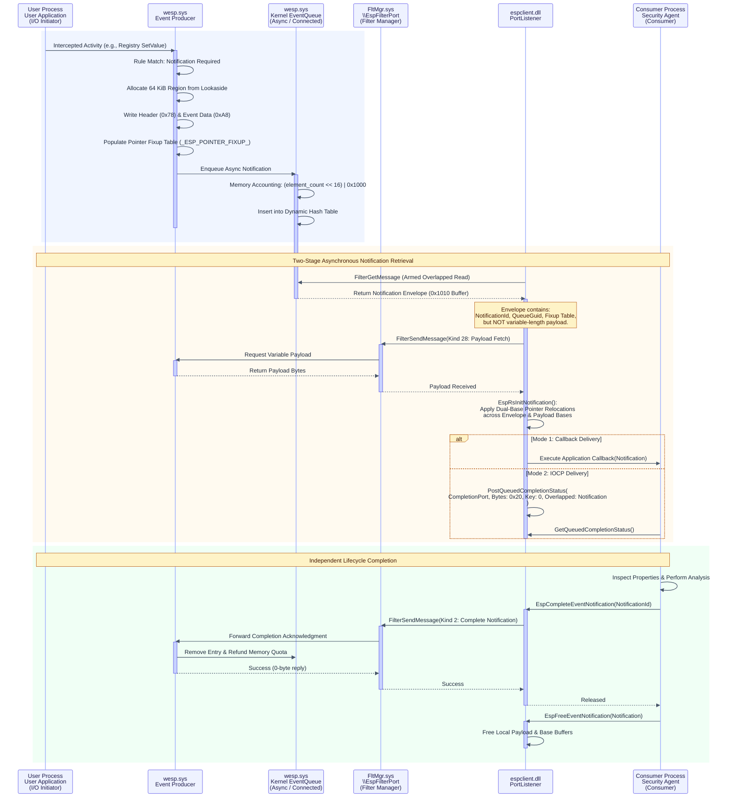
```mermaid
%%{init: {'theme': 'base', 'themeVariables': {'darkMode': false, 'background': '#ffffff', 'primaryColor': '#ffffff', 'primaryTextColor': '#0f172a', 'primaryBorderColor': '#64748b', 'lineColor': '#475569', 'textColor': '#1e293b', 'actorBkg': '#eef2ff', 'actorBorder': '#4f46e5', 'actorTextColor': '#1e1b4b', 'actorLineColor': '#a5b4fc', 'signalColor': '#475569', 'signalTextColor': '#1e293b', 'labelBoxBkgColor': '#fef3c7', 'labelBoxBorderColor': '#b45309', 'labelTextColor': '#451a03', 'loopTextColor': '#1e293b', 'noteBkgColor': '#fef3c7', 'noteBorderColor': '#b45309', 'noteTextColor': '#451a03', 'activationBkgColor': '#c7d2fe', 'activationBorderColor': '#4f46e5', 'sequenceNumberColor': '#0f172a'}, 'themeCSS': '.messageText { fill: #1e293b !important; stroke: none; } .actor text { fill: #1e1b4b; } .loopText { fill: #1e293b !important; } .labelText { fill: #451a03 !important; } .noteText { fill: #451a03 !important; } svg { background-color: #ffffff !important; }'}}%%
sequenceDiagram
    participant App as User Process<br/>User Application<br/>(I/O Initiator)
    participant Driver as wesp.sys<br/>Event Producer
    participant Queue as wesp.sys<br/>Kernel EventQueue<br/>(Async / Connected)
    participant Port as FltMgr.sys<br/>\\EspFilterPort<br/>(Filter Manager)
    participant Client as espclient.dll<br/>PortListener
    participant Agent as Consumer Process<br/>Security Agent<br/>(Consumer)

    rect rgb(240, 245, 255)
        App->>Driver: Intercepted Activity (e.g., Registry SetValue)
        activate Driver
        Driver->>Driver: Rule Match: Notification Required
        Driver->>Driver: Allocate 64 KiB Region from Lookaside
        Driver->>Driver: Write Header (0x78) & Event Data (0xA8)
        Driver->>Driver: Populate Pointer Fixup Table (_ESP_POINTER_FIXUP_)

        Driver->>Queue: Enqueue Async Notification
        activate Queue
        Queue->>Queue: Memory Accounting: (element_count << 16) | 0x1000
        Queue->>Queue: Insert into Dynamic Hash Table
        deactivate Driver
    end

    rect rgb(255, 250, 240)
        Note over App,Agent: Two-Stage Asynchronous Notification Retrieval
        Client->>Queue: FilterGetMessage (Armed Overlapped Read)
        Queue-->>Client: Return Notification Envelope (0x1010 Buffer)
        deactivate Queue
        activate Client
        Note over Client: Envelope contains:<br/>NotificationId, QueueGuid, Fixup Table,<br/>but NOT variable-length payload.

        Client->>Port: FilterSendMessage(Kind 28: Payload Fetch)
        activate Port
        Port->>Driver: Request Variable Payload
        activate Driver
        Driver-->>Port: Return Payload Bytes
        deactivate Driver
        Port-->>Client: Payload Received
        deactivate Port

        Client->>Client: EspRsInitNotification():<br/>Apply Dual-Base Pointer Relocations<br/>across Envelope & Payload Bases

        alt Mode 1: Callback Delivery
            Client->>Agent: Execute Application Callback(Notification)
        else Mode 2: IOCP Delivery
            Client->>Client: PostQueuedCompletionStatus(<br/>  CompletionPort, Bytes: 0x20, Key: 0, Overlapped: Notification<br/>)
            Agent->>Client: GetQueuedCompletionStatus()
        end
        deactivate Client
    end

    rect rgb(240, 255, 245)
        Note over App,Agent: Independent Lifecycle Completion
        Agent->>Agent: Inspect Properties & Perform Analysis
        Agent->>Client: EspCompleteEventNotification(NotificationId)
        activate Client

        Client->>Port: FilterSendMessage(Kind 2: Complete Notification)
        activate Port
        Port->>Driver: Forward Completion Acknowledgment
        activate Driver
        Driver->>Queue: Remove Entry & Refund Memory Quota
        Driver-->>Port: Success (0-byte reply)
        deactivate Driver
        Port-->>Client: Success
        deactivate Port

        Client-->>Agent: Released
        deactivate Client

        Agent->>Client: EspFreeEventNotification(Notification)
        activate Client
        Client->>Client: Free Local Payload & Base Buffers
        deactivate Client
    end
```

### Producer-Consumer Queue Architecture

The kernel-side `EventQueue` manages event buffering:

- **Queue States**: A queue operates in `Async` state (buffering events while a user-mode connection is pending or disconnected) or `Connected` state (actively signaling worker threads).
- **Memory Quota and Accounting**: Every notification incurs a base memory charge calculated as `(element_count << 16) | 0x1000` (a 4,096-byte baseline plus 65,536 bytes per counted sub-element).
- **Memory Pressure Monitoring**: The queue monitors memory usage percentage against configured low and high thresholds. Level 1 indicates limit saturation, Level 2 indicates elevated low-threshold pressure, and Level 3 indicates recovery. State transitions emit telemetry warnings, alerting security agents to potential backpressure conditions.
- **Notification Entry States**: Individual entries transition across five states: Buffered (0), Pending (1), In-Flight Send (2), Delivered (3), and Removed/Failed (4). Clearing a queue via `EspClearEventQueue` removes only entries in state 1.
- **Producer and Consumer Stages**: Quota applies at enqueue time, not at delivery. The consumer stage blocks in `FltSendMessage` until the client drains the port: the event worker passes Timeout NULL for variable-length delivery with a length assert, while the state worker passes a 30-second relative timeout for 4-byte notifications.

### Notification Formatting and Pointer Relocation

Notification buffers are composed within 64 KiB kernel lookaside regions:

- `_ESP_EVENT_NOTIFICATION_HEADER_`: 120-byte (`0x78`) fixed header recording total payload length, notification identifier, and context handles.
- `_ESP_EVENT_NOTIFICATION_DATA_V1_`: 168-byte data block storing the event index, flags, event type, and embedded sub-object descriptors.
- Pointer Fixup Table (`_ESP_POINTER_FIXUP_`): Because notification buffers are constructed in kernel space but consumed in user space, internal pointers cannot be absolute kernel addresses. The builder emits 24-byte relocation records detailing target offsets, source buffers, and alignment requirements. Upon reception in user mode, `EspRsInitNotification` traverses the fixup table, calculating and writing valid absolute user-mode addresses across both the fixed envelope and heap payload memory bases.

Related-object emission follows family patterns:

| Notification family          | Related objects emitted                           |
| ---------------------------- | ------------------------------------------------- |
| File, volume, pipe, mailslot | Thread, process chain, token, file stream, volume |
| Registry, transaction        | Process chain, token                              |

Single-helper exceptions add string internal for `RegLoadKey`, registry data for `RegSetValueKey`, buffer pointer for `FileCreate`, pipe info for `PipeCreate`, and mailslot info for `MailslotCreate`; `ProcessLoadImage` emits process chain, token, file stream, volume, and image path without thread info. Related-object collection recurses before formatting: file object collection invokes the stream, pipe, mailslot, volume, and KTM transaction collectors; thread collection chains into the token and process chain collectors; and registry key object collection chains into the registry key and KTM transaction collectors.

### Two-Stage Retrieval Protocol

To balance fixed-buffer efficiency with variable-length event data, delivery uses a two-stage protocol:

1. **Stage 1 (Envelope Delivery)**: The client port listener maintains an armed overlapped read via `FilterGetMessage` covering a fixed 4,112-byte buffer (`0x1010` bytes, comprising a 24-byte transport prefix and a 4,088-byte data region). The prefix decomposes into the 16-byte `FILTER_MESSAGE_HEADER` (reply length and message identifier) plus an 8-byte header-size field; only the data region carries WESP content. This envelope contains event metadata, identifiers, and pointer fixup tables.
2. **Stage 2 (Payload Retrieval)**: Upon receiving an envelope, the client reads the notification identifier and declared payload length, allocates a heap buffer, and calls `FilterSendMessage` with message kind `28`. The driver copies the variable-length telemetry payload into this buffer. The envelope is allocated as `0x1010` bytes with the notification pointer returned past the transport prefix, leaving room for the `FILTER_MESSAGE_HEADER`. The arm path treats `ERROR_IO_PENDING` (`0x800703E5`) as success. Stage 2 passes the WESP notification identifier through the `OVERLAPPED.Internal` slot, and the completion kind 2 reads the notification cookie field. The kernel sender asserts the first-hop length is below `0x1001` rather than clamping it.

### Dedicated State-Change Channel

In addition to the event stream, event queues support a dedicated state-change channel established via connect opcode `6`. This channel uses a separate port listener and receive buffer to deliver 4-byte queue status updates (such as quota warnings or driver state shifts). State-change messages are sent with a 30-second relative timeout.

### Lifecycle Completion Acknowledgment

When the user-mode application finishes processing an event, it calls `EspCompleteEventNotification`. This issues a synchronous `FilterSendMessage` with message kind `2` containing the notification identifier. The driver removes the notification from its tracking hash table and refunds the memory charge. This call is strictly an accounting release; it does not return an enforcement verdict.

<br>

---

# Client Library Architecture: espclient.dll

## Overview

The `espclient.dll` library is the sole construction surface for WESP policy and the sole consumption surface for WESP telemetry. It translates Filter Manager port protocols into an idiomatic, handle-safe C programming model: opaque handles, intrusive reference counting, synchronous calls on the control plane, and callback or completion-port delivery on the telemetry plane.

The library is organized in three layers. The exported C API (comprising 120 C functions and the `_DllMainCRTStartup` entry point, for 121 total PE export symbols) validates arguments and manages handle lifetimes; an internal C++ layer (`Esp::` namespace) owns port handles, port listeners, and the reference-counted object bodies; and the Rust core (`espclient_rs` crate) builds filters, rules, and notification decoders. The layers meet across 38 `EspRs*` shims (C++ into Rust) and 6 `EspCpp*` reverse callbacks (Rust into C++).

Every public handle is an opaque 16-byte pair of an object-body pointer and a reference-count control block, so duplication and closing are uniform across clients, queues, filters, rules, collections, and references. Identity registration is ephemeral and closes its port immediately; sessions, queues, and references hold live kernel state through dedicated ports and must be closed explicitly. Filters and rules are staged entirely in process and take effect only when submitted through a session.

The sections below follow that order: identity versus session, handle encapsulation, delivery modes, object references, property queries, static probes, collections and context keys, telemetry, utilities, external dependencies, and the runtime and FFI inventory.

### Client Identity Versus Session Connection

The client library enforces a strict conceptual distinction between client identity registration and active communication sessions:

- **Identity Registration (`EspRegisterClient`)**: A one-shot, ephemeral operation using connect opcode `1`. The client transmits its descriptor (GUID, name, altitude), and the driver records the client in its durable registry store. The communication port is closed immediately upon completion. Registering a name that already exists in the store is rejected with a name-collision status, surfacing as `HRESULT_FROM_WIN32(ERROR_ALREADY_EXISTS)` (`0x800700B7`) (no trace covers the name scan; the GUID half is verified). Registering a GUID that matches an existing client in any state other than 6 (fully unregistered) fails with `STATUS_OBJECT_NAME_COLLISION` (`0xC0000035`), which surfaces as the same `0x800700B7` status; the driver drops the newly constructed client and leaves the existing entry unchanged. Entries in state 6 are skipped by both duplicate scans, so re-registration of a fully unregistered GUID proceeds to fresh insert. Re-registration of an active GUID returns `0x800700B7` on the enforcement verification host (build `10.0.29641.0`). On the reference build, fresh `EspRegisterClient` returns `S_OK` (2/2 probes via the System32 espclient.dll from elevated admin claimless context; clients persisted then unregistered cleanly) while enumeration succeeds from the same context.
- **Session Connection (`EspConnectClient`)**: A persistent communication channel established using connect opcode `3`. It returns a live `Esp::ClientObject` handle that owns an active Filter Manager port handle. All subsequent rule deployments, queue bindings, and object queries must be submitted through an active session handle.
- **Identity Unregistration (`EspUnregisterClient`)**: An ephemeral operation using connect opcode `2`. It deletes persisted client metadata from the registry allowlist and closes the connection. Unregistration is rejected while the client still holds an active session (`0x8007139F`); the client must disconnect first.

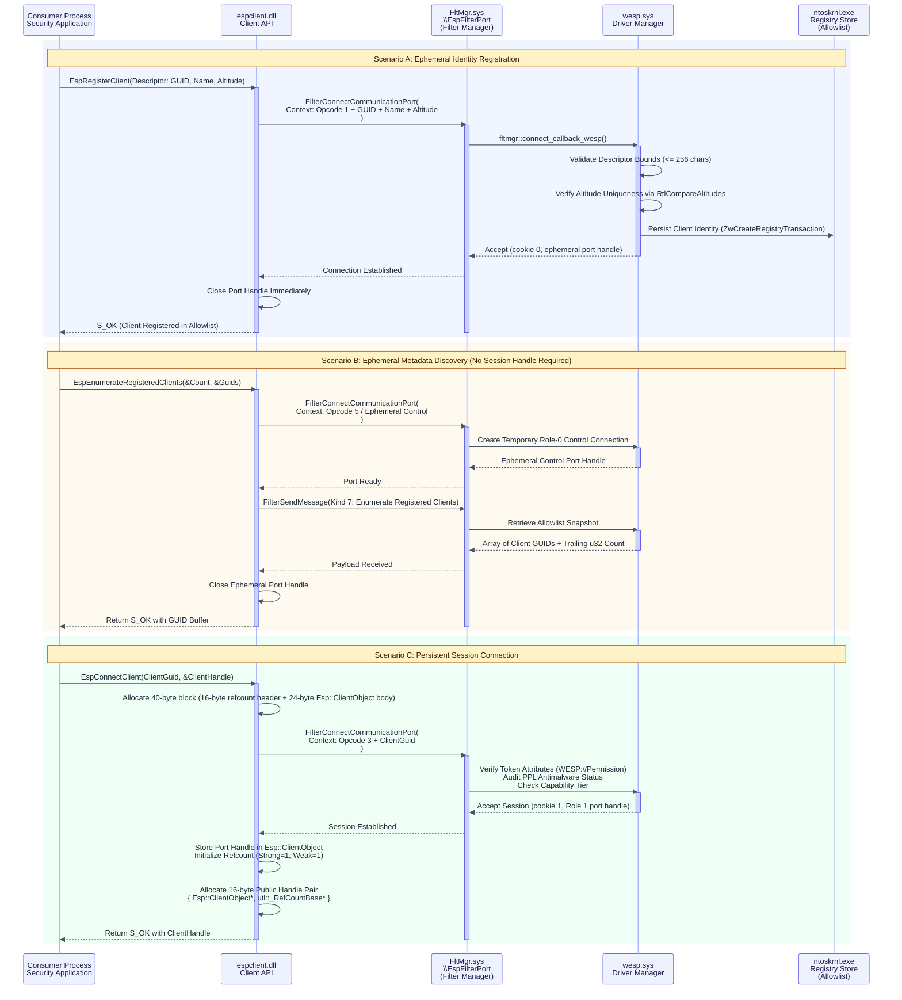
```mermaid
%%{init: {'theme': 'base', 'themeVariables': {'darkMode': false, 'background': '#ffffff', 'primaryColor': '#ffffff', 'primaryTextColor': '#0f172a', 'primaryBorderColor': '#64748b', 'lineColor': '#475569', 'textColor': '#1e293b', 'actorBkg': '#eef2ff', 'actorBorder': '#4f46e5', 'actorTextColor': '#1e1b4b', 'actorLineColor': '#a5b4fc', 'signalColor': '#475569', 'signalTextColor': '#1e293b', 'labelBoxBkgColor': '#fef3c7', 'labelBoxBorderColor': '#b45309', 'labelTextColor': '#451a03', 'loopTextColor': '#1e293b', 'noteBkgColor': '#fef3c7', 'noteBorderColor': '#b45309', 'noteTextColor': '#451a03', 'activationBkgColor': '#c7d2fe', 'activationBorderColor': '#4f46e5', 'sequenceNumberColor': '#0f172a'}, 'themeCSS': '.messageText { fill: #1e293b !important; stroke: none; } .actor text { fill: #1e1b4b; } .loopText { fill: #1e293b !important; } .labelText { fill: #451a03 !important; } .noteText { fill: #451a03 !important; } svg { background-color: #ffffff !important; }'}}%%
sequenceDiagram
participant App as Consumer Process<br/>Security Application
participant Client as espclient.dll<br/>Client API
participant Port as FltMgr.sys<br/>\\EspFilterPort<br/>(Filter Manager)
participant Driver as wesp.sys<br/>Driver Manager
participant Store as ntoskrnl.exe<br/>Registry Store<br/>(Allowlist)

    rect rgb(240, 245, 255)
        Note over App,Store: Scenario A: Ephemeral Identity Registration
        App->>Client: EspRegisterClient(Descriptor: GUID, Name, Altitude)
        activate Client
        Client->>Port: FilterConnectCommunicationPort(<br/>  Context: Opcode 1 + GUID + Name + Altitude<br/>)
        activate Port
        Port->>Driver: fltmgr::connect_callback_wesp()
        activate Driver
        Driver->>Driver: Validate Descriptor Bounds (<= 256 chars)
        Driver->>Driver: Verify Altitude Uniqueness via RtlCompareAltitudes
        Driver->>Store: Persist Client Identity (ZwCreateRegistryTransaction)
        Driver-->>Port: Accept (cookie 0, ephemeral port handle)
        deactivate Driver
        Port-->>Client: Connection Established
        Client->>Client: Close Port Handle Immediately
        Client-->>App: S_OK (Client Registered in Allowlist)
        deactivate Client
        deactivate Port
    end

    rect rgb(255, 250, 240)
        Note over App,Store: Scenario B: Ephemeral Metadata Discovery (No Session Handle Required)
        App->>Client: EspEnumerateRegisteredClients(&Count, &Guids)
        activate Client
        Client->>Port: FilterConnectCommunicationPort(<br/>  Context: Opcode 5 / Ephemeral Control<br/>)
        activate Port
        Port->>Driver: Create Temporary Role-0 Control Connection
        activate Driver
        Driver-->>Port: Ephemeral Control Port Handle
        deactivate Driver
        Port-->>Client: Port Ready
        Client->>Port: FilterSendMessage(Kind 7: Enumerate Registered Clients)
        Port->>Driver: Retrieve Allowlist Snapshot
        activate Driver
        Driver-->>Port: Array of Client GUIDs + Trailing u32 Count
        deactivate Driver
        Port-->>Client: Payload Received
        Client->>Client: Close Ephemeral Port Handle
        Client-->>App: Return S_OK with GUID Buffer
        deactivate Client
        deactivate Port
    end

    rect rgb(240, 255, 245)
        Note over App,Store: Scenario C: Persistent Session Connection
        App->>Client: EspConnectClient(ClientGuid, &ClientHandle)
        activate Client
        Client->>Client: Allocate 40-byte block (16-byte refcount header + 24-byte Esp::ClientObject body)
        Client->>Port: FilterConnectCommunicationPort(<br/>  Context: Opcode 3 + ClientGuid<br/>)
        activate Port
        Port->>Driver: Verify Token Attributes (WESP://Permission)<br/>Audit PPL Antimalware Status<br/>Check Capability Tier
        activate Driver
        Driver-->>Port: Accept Session (cookie 1, Role 1 port handle)
        deactivate Driver
        Port-->>Client: Session Established
        Client->>Client: Store Port Handle in Esp::ClientObject<br/>Initialize Refcount (Strong=1, Weak=1)
        Client->>Client: Allocate 16-byte Public Handle Pair<br/>{ Esp::ClientObject*, utl::_RefCountBase* }
        Client-->>App: Return S_OK with ClientHandle
        deactivate Client
        deactivate Port
    end
```

### Handle Encapsulation and Reference Counting

Public handles are returned as opaque pointer-sized handles representing an internal 16-byte structure:

- Pointer 1: Address of the underlying object body (`Esp::ClientObject`, `Esp::EventQueue`, `Esp::Filter`, `Esp::Rule`, `Esp::Collection`, or `Esp::EventObjectReference`).
- Pointer 2: Address of the intrusive reference-count control block (`utl::_RefCountBase`).

Notable object-internal fields: `Esp::ClientObject` stores its session port handle and client GUID; `Esp::PortListener` stores its port handle; `Esp::Rule` and `Esp::Filter` hold no port handle until `EspUpdateRules` serializes them. The port handle is stored in the internal body structure past the 16-byte refcount header.

The control block maintains separate strong and weak 32-bit reference counters. Handle duplication increments the strong counter using atomic interlocked operations. Closing a handle (`EspCloseFilter`, `EspCloseRule`, `EspCloseCollection`, `EspCloseEventQueue`, `EspCloseEventObjectReference`) decrements the strong counter; when the counter reaches zero, the object deleter executes, closing driver handles and releasing heap buffers. The `utl::_RefCountBase` implementation provides an optimized fast-path check: if strong and weak counts both equal 1, destruction executes immediately without secondary atomic synchronization.

### Delivery Modes and Thread-Pool I/O

Event queues support three functional delivery mode states: Mode 0 (Disconnected/Unbound), Mode 1 (Application Callback), and Mode 2 (I/O Completion Port). Only one delivery binding may be established per queue:

- **Mode 1 (Application Callback)**: Notifications are delivered directly to a client-provided callback function executing on a worker thread provided by an internal Windows thread pool (`Esp::PortListener`).
- **Mode 2 (I/O Completion Port)**: Notifications are posted to a duplicated I/O Completion Port (IOCP) via `PostQueuedCompletionStatus`. The client application retrieves ready events on its own worker threads via `GetQueuedCompletionStatus`.

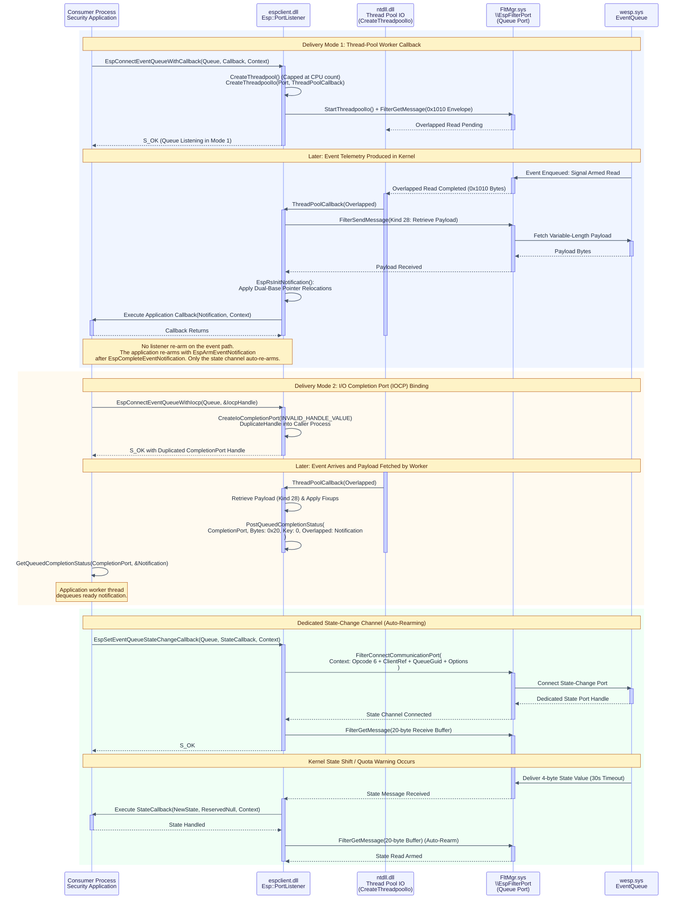
```mermaid
%%{init: {'theme': 'base', 'themeVariables': {'darkMode': false, 'background': '#ffffff', 'primaryColor': '#ffffff', 'primaryTextColor': '#0f172a', 'primaryBorderColor': '#64748b', 'lineColor': '#475569', 'textColor': '#1e293b', 'actorBkg': '#eef2ff', 'actorBorder': '#4f46e5', 'actorTextColor': '#1e1b4b', 'actorLineColor': '#a5b4fc', 'signalColor': '#475569', 'signalTextColor': '#1e293b', 'labelBoxBkgColor': '#fef3c7', 'labelBoxBorderColor': '#b45309', 'labelTextColor': '#451a03', 'loopTextColor': '#1e293b', 'noteBkgColor': '#fef3c7', 'noteBorderColor': '#b45309', 'noteTextColor': '#451a03', 'activationBkgColor': '#c7d2fe', 'activationBorderColor': '#4f46e5', 'sequenceNumberColor': '#0f172a'}, 'themeCSS': '.messageText { fill: #1e293b !important; stroke: none; } .actor text { fill: #1e1b4b; } .loopText { fill: #1e293b !important; } .labelText { fill: #451a03 !important; } .noteText { fill: #451a03 !important; } svg { background-color: #ffffff !important; }'}}%%
sequenceDiagram
    participant App as Consumer Process<br/>Security Application
    participant Listener as espclient.dll<br/>Esp::PortListener
    participant TP as ntdll.dll<br/>Thread Pool IO<br/>(CreateThreadpoolIo)
    participant Port as FltMgr.sys<br/>\\EspFilterPort<br/>(Queue Port)
    participant Driver as wesp.sys<br/>EventQueue

    rect rgb(240, 245, 255)
        Note over App,Driver: Delivery Mode 1: Thread-Pool Worker Callback
        App->>Listener: EspConnectEventQueueWithCallback(Queue, Callback, Context)
        activate Listener
        Listener->>Listener: CreateThreadpool() (Capped at CPU count)<br/>CreateThreadpoolIo(Port, ThreadPoolCallback)
        Listener->>Port: StartThreadpoolIo() + FilterGetMessage(0x1010 Envelope)
        activate Port
        Port-->>TP: Overlapped Read Pending
        deactivate Port
        Listener-->>App: S_OK (Queue Listening in Mode 1)
        deactivate Listener
        Note over App,Driver: Later: Event Telemetry Produced in Kernel
        Driver->>Port: Event Enqueued: Signal Armed Read
        activate Port
        Port-->>TP: Overlapped Read Completed (0x1010 Bytes)
        deactivate Port
        activate TP
        TP->>Listener: ThreadPoolCallback(Overlapped)
        activate Listener
        Listener->>Port: FilterSendMessage(Kind 28: Retrieve Payload)
        activate Port
        Port->>Driver: Fetch Variable-Length Payload
        activate Driver
        Driver-->>Port: Payload Bytes
        deactivate Driver
        Port-->>Listener: Payload Received
        deactivate Port
        Listener->>Listener: EspRsInitNotification():<br/>Apply Dual-Base Pointer Relocations
        Listener->>App: Execute Application Callback(Notification, Context)
        activate App
        App-->>Listener: Callback Returns
        deactivate App
        deactivate Listener
        deactivate TP
        Note over App,Listener: No listener re-arm on the event path.<br/>The application re-arms with EspArmEventNotification<br/>after EspCompleteEventNotification. Only the state channel auto-re-arms.
    end

    rect rgb(255, 250, 240)
        Note over App,Driver: Delivery Mode 2: I/O Completion Port (IOCP) Binding
        App->>Listener: EspConnectEventQueueWithIocp(Queue, &IocpHandle)
        activate Listener
        Listener->>Listener: CreateIoCompletionPort(INVALID_HANDLE_VALUE)<br/>DuplicateHandle into Caller Process
        Listener-->>App: S_OK with Duplicated CompletionPort Handle
        deactivate Listener
        Note over App,Driver: Later: Event Arrives and Payload Fetched by Worker
        activate TP
        TP->>Listener: ThreadPoolCallback(Overlapped)
        activate Listener
        Listener->>Listener: Retrieve Payload (Kind 28) & Apply Fixups
        Listener->>Listener: PostQueuedCompletionStatus(<br/>  CompletionPort, Bytes: 0x20, Key: 0, Overlapped: Notification<br/>)
        deactivate Listener
        deactivate TP
        App->>App: GetQueuedCompletionStatus(CompletionPort, &Notification)
        Note over App: Application worker thread<br/>dequeues ready notification.
    end

    rect rgb(240, 255, 245)
        Note over App,Driver: Dedicated State-Change Channel (Auto-Rearming)
        App->>Listener: EspSetEventQueueStateChangeCallback(Queue, StateCallback, Context)
        activate Listener
        Listener->>Port: FilterConnectCommunicationPort(<br/>  Context: Opcode 6 + ClientRef + QueueGuid + Options<br/>)
        activate Port
        Port->>Driver: Connect State-Change Port
        activate Driver
        Driver-->>Port: Dedicated State Port Handle
        deactivate Driver
        Port-->>Listener: State Channel Connected
        deactivate Port
        Listener->>Port: FilterGetMessage(20-byte Receive Buffer)
        activate Port
        Listener-->>App: S_OK
        deactivate Listener
        Note over App,Driver: Kernel State Shift / Quota Warning Occurs
        Driver->>Port: Deliver 4-byte State Value (30s Timeout)
        Port-->>Listener: State Message Received
        deactivate Port
        activate Listener
        Listener->>App: Execute StateCallback(NewState, ReservedNull, Context)
        activate App
        App-->>Listener: State Handled
        deactivate App
        Listener->>Port: FilterGetMessage(20-byte Buffer) (Auto-Rearm)
        activate Port
        Port-->>Listener: State Read Armed
        deactivate Port
        deactivate Listener
    end
```

The event path does not auto-re-arm. `Esp::PortListener::ThreadPoolCallback` dispatches the notification and decrements the pending count without re-arming; the application re-arms with `EspArmEventNotification` after completing with `EspCompleteEventNotification`. Only the state-change channel auto-re-arms inside `StateChangeCallback`.

### Object Reference Subsystem

Clients reference runtime kernel objects through opaque handles constructed across 15 distinct key types:

- Process and Thread References: Keyed by 32-bit process identifier (`EspCreateProcessReference`, Key 2, Size 4) or thread identifier (`EspCreateThreadReference`, Key 3, Size 4).
- Security Token References: Keyed by target process (`EspCreateProcessTokenReference`, Key 13, Size 4) or target thread (`EspCreateThreadTokenReference`, Key 14, Size 4).
- Filesystem References: Keyed by path (`EspCreateFileReferenceByPath`, Key 4, Size 16; `EspCreateFileStreamReferenceByPath`, Key 6, Size 16) or by physical 128-bit file ID and volume GUID (`EspCreateFileReferenceById`, Key 5, Size 32; `EspCreateFileStreamReferenceById`, Key 7, Size 48, covering volume GUID, file id, and stream name). Path strings require even byte lengths and are normalized to NT format via `EnsureNtPath`. The Key 7 stream name is the only optional key component and may be empty.
- IPC References: Keyed by normalized pipe path (`EspCreatePipeReference`, Key 10, Size 16) or mailslot path (`EspCreateMailslotReference`, Key 11, Size 16). Pipe paths accept both `\Device\NamedPipe\...` and `\??\pipe\...` spellings; the driver canonicalizes to NT form.
- Storage References: Keyed by volume GUID (`EspCreateVolumeReference`, Key 8, Size 16) or disk path (`EspCreateDiskReference`, Key 9, Size 16).
- Registry References: Keyed by normalized registry path (`EspCreateRegistryKeyReference`, Key 12, Size 16). Any path mints an entry, including paths that do not exist; the driver performs no registry open on this path.
- Desktop References: Keyed by desktop handle value (`EspCreateDesktopReference`, Key 15, Size 8). The client translates the desktop name to an `HDESK` via `OpenDesktopW` and sends the handle value; the name never crosses the port.
- Event Object References: Keyed directly by 64-bit `EventObjectId` (`EspCreateEventObjectReference`, `EspCreateEventObjectReferenceById`, Key 1, Size 8). The direct lookup carries no key-kind restriction, so a by-id reference can also address event-path-only entries (file object, registry key object, transaction) while they remain live.

Client key kinds 1 through 15 map to wire discriminants by subtracting one; kind 0 is rejected client side with `E_INVALIDARG` before any port traffic. Each key kind carries a fixed payload size, listed above. Path keys require even byte lengths (enforced client side) and are capped at 32,767 characters (enforced driver side); empty paths are rejected on every string key except the Key 7 stream name, and a zero `EventObjectId` is rejected at decode. Reference creation requires full trust: kind 3 passes the capability gate at tier 0 only and fails with `STATUS_ACCESS_DENIED` otherwise. A kind 3 request on any connection other than a client session fails with `STATUS_INVALID_PORT_HANDLE`.

### Driver Dispatch and Object Lookup

The driver resolves each key through a per-key dispatch arm, then mints or returns the event object through the shared ensure path. Identifier allocation and table lifecycle are documented in [Event Object Identity and Argument Resolution](#event-object-identity-and-argument-resolution).

- Process, thread, and token references (Keys 2, 3, 13, 14): process/thread id lookup with exit-status sampling. Process tokens resolve to the primary token; thread tokens resolve to the impersonation token only and never fall back to the primary token.
- File, stream, and mailslot references by path (Keys 4, 6, 11): internal path open followed by instance resolution. Mailslot selection is kind-checked, and a non-mailslot object fails the open.
- File and stream references by id (Keys 5, 7): volume GUID formatted to a volume path, by-id open, then flag and filesystem-context checks.
- Volume and disk references (Keys 8, 9): volume-from-name resolution; the disk path must resolve as a volume name before the disk device is derived.
- Pipe references (Key 10): prefix match against either accepted spelling, canonicalization to NT form, then stream-id lookup. The entry key is the pipe stream id, not the path.
- Registry references (Key 12): direct path-keyed mint with downcasing and no object open.
- Desktop references (Key 15): handle reference by the transmitted HDESK value with user access mode.
- Direct id references (Key 1): primary-table lookup with a strong-count bump and no secondary-table involvement.

### Reply Blob and Type Codes

A successful create returns a 32-byte reply: the close key, an empty slot the client fills with its owning-client pointer, the 64-bit event-object id, the 32-bit type code, and zero padding. The driver refuses reply buffers under 32 bytes; the client requires exactly 32 bytes returned and a type code below 15. If the reply copy fails, the driver rolls the minted reference back through the close path, leaving no orphan.

| TypeCode | Object type         | Reachable by            |
| -------- | ------------------- | ----------------------- |
| 0        | Thread              | Key 3, Key 1            |
| 1        | Process             | Key 2, Key 1            |
| 2        | Token               | Keys 13, 14, Key 1      |
| 3        | Registry key        | Key 12, Key 1           |
| 4        | File object         | Key 1 only (event path) |
| 5        | Registry key object | Key 1 only (event path) |
| 6        | File stream         | Keys 6, 7, Key 1        |
| 7        | File                | Keys 4, 5, Key 1        |
| 8        | Pipe                | Key 10, Key 1           |
| 9        | Mailslot            | Key 11, Key 1           |
| 10       | Volume              | Key 8, Key 1            |
| 11       | KTM transaction     | Key 1 only (event path) |
| 12       | Disk                | Key 9, Key 1            |
| 13       | Desktop             | Key 15, Key 1           |

Codes 14 (lookup miss) and 15 (error tag) are driver-internal and never appear on a successful reply.

### Close Keys and Release

Each close key comes from a per-client ascending counter and is inserted into the client reference table alongside the type code and a strong pointer. Closing unlinks the table entry and releases one strong reference and one weak reference. Unknown, replayed, duplicate, and zero keys all fail identically with `STATUS_NOT_FOUND` and no side effects. The removal routine additionally requires a connected tier, so closes past disconnect fail the same way. Client disconnect drops the whole per-client reference table, and later reference creation on the dead client fails with `STATUS_PORT_DISCONNECTED`.

### Reference Errors

| Condition                                            | Status                                      |
| ---------------------------------------------------- | ------------------------------------------- |
| Unknown process or thread id                         | `STATUS_INVALID_CID`                        |
| Unknown event-object id or close key                 | `STATUS_NOT_FOUND`                          |
| Object type mismatch on open                         | `STATUS_OBJECT_TYPE_MISMATCH`               |
| Short reply buffer (driver requires 32 bytes)        | `STATUS_BUFFER_TOO_SMALL`                   |
| Thread with no impersonation token                   | `0xC000005C`                                |
| Null process primary token                           | `STATUS_INVALID_HANDLE`                     |
| Pipe path with neither accepted prefix               | `STATUS_OBJECT_NAME_INVALID`                |
| Kind 3 at restricted tier                            | `STATUS_ACCESS_DENIED`                      |
| Kind 3 on a non-session connection                   | `STATUS_INVALID_PORT_HANDLE`                |
| Kind 0, size mismatch, odd path length, or zero GUID | `E_INVALIDARG` client side, no port traffic |

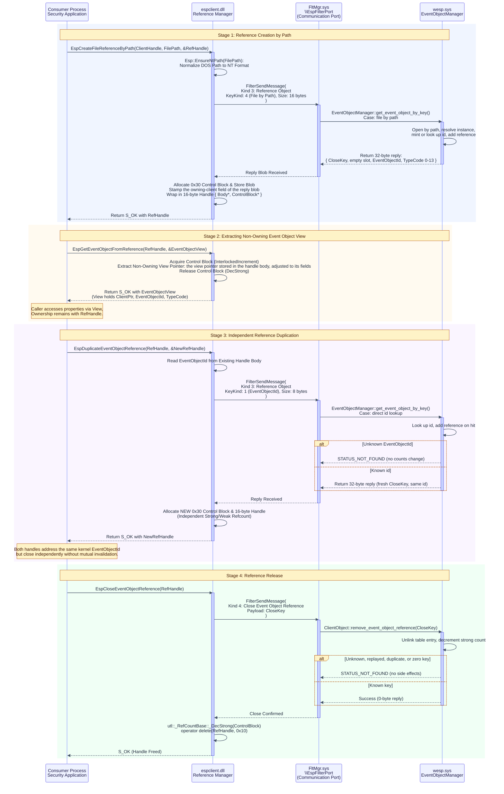
```mermaid
%%{init: {'theme': 'base', 'themeVariables': {'darkMode': false, 'background': '#ffffff', 'primaryColor': '#ffffff', 'primaryTextColor': '#0f172a', 'primaryBorderColor': '#64748b', 'lineColor': '#475569', 'textColor': '#1e293b', 'actorBkg': '#eef2ff', 'actorBorder': '#4f46e5', 'actorTextColor': '#1e1b4b', 'actorLineColor': '#a5b4fc', 'signalColor': '#475569', 'signalTextColor': '#1e293b', 'labelBoxBkgColor': '#fef3c7', 'labelBoxBorderColor': '#b45309', 'labelTextColor': '#451a03', 'loopTextColor': '#1e293b', 'noteBkgColor': '#fef3c7', 'noteBorderColor': '#b45309', 'noteTextColor': '#451a03', 'activationBkgColor': '#c7d2fe', 'activationBorderColor': '#4f46e5', 'sequenceNumberColor': '#0f172a'}, 'themeCSS': '.messageText { fill: #1e293b !important; stroke: none; } .actor text { fill: #1e1b4b; } .loopText { fill: #1e293b !important; } .labelText { fill: #451a03 !important; } .noteText { fill: #451a03 !important; } svg { background-color: #ffffff !important; }'}}%%
sequenceDiagram
participant App as Consumer Process<br/>Security Application
participant Client as espclient.dll<br/>Reference Manager
participant Port as FltMgr.sys<br/>\\EspFilterPort<br/>(Communication Port)
participant Driver as wesp.sys<br/>EventObjectManager

    rect rgb(240, 245, 255)
        Note over App,Driver: Stage 1: Reference Creation by Path
        App->>Client: EspCreateFileReferenceByPath(ClientHandle, FilePath, &RefHandle)
        activate Client
        Client->>Client: Esp::EnsureNtPath(FilePath):<br/>Normalize DOS Path to NT Format
        Client->>Port: FilterSendMessage(<br/>  Kind 3: Reference Object<br/>  KeyKind: 4 (File by Path), Size: 16 bytes<br/>)
        activate Port
        Port->>Driver: EventObjectManager::get_event_object_by_key()<br/>Case: file by path
        activate Driver
        Driver->>Driver: Open by path, resolve instance,<br/>mint or look up id, add reference
        Driver-->>Port: Return 32-byte reply:<br/>{ CloseKey, empty slot, EventObjectId, TypeCode 0-13 }
        deactivate Driver
        Port-->>Client: Reply Blob Received
        deactivate Port
        Client->>Client: Allocate 0x30 Control Block & Store Blob<br/>Stamp the owning-client field of the reply blob<br/>Wrap in 16-byte Handle { Body*, ControlBlock* }
        Client-->>App: Return S_OK with RefHandle
        deactivate Client
    end

    rect rgb(255, 250, 240)
        Note over App,Driver: Stage 2: Extracting Non-Owning Event Object View
        App->>Client: EspGetEventObjectFromReference(RefHandle, &EventObjectView)
        activate Client
        Client->>Client: Acquire Control Block (InterlockedIncrement)<br/>Extract Non-Owning View Pointer: the view pointer stored in the handle body, adjusted to its fields<br/>Release Control Block (DecStrong)
        Client-->>App: Return S_OK with EventObjectView<br/>(View holds ClientPtr, EventObjectId, TypeCode)
        deactivate Client
        Note over App: Caller accesses properties via View,<br/>Ownership remains with RefHandle.
    end

    rect rgb(250, 245, 255)
        Note over App,Driver: Stage 3: Independent Reference Duplication
        App->>Client: EspDuplicateEventObjectReference(RefHandle, &NewRefHandle)
        activate Client
        Client->>Client: Read EventObjectId from Existing Handle Body
        Client->>Port: FilterSendMessage(<br/>  Kind 3: Reference Object<br/>  KeyKind: 1 (EventObjectId), Size: 8 bytes<br/>)
        activate Port
        Port->>Driver: EventObjectManager::get_event_object_by_key()<br/>Case: direct id lookup
        activate Driver
        Driver->>Driver: Look up id, add reference on hit
        alt Unknown EventObjectId
            Driver-->>Port: STATUS_NOT_FOUND (no counts change)
        else Known id
            Driver-->>Port: Return 32-byte reply (fresh CloseKey, same id)
        end
        deactivate Driver
        Port-->>Client: Reply Received
        deactivate Port
        Client->>Client: Allocate NEW 0x30 Control Block & 16-byte Handle<br/>(Independent Strong/Weak Refcount)
        Client-->>App: Return S_OK with NewRefHandle
        deactivate Client
        Note over App: Both handles address the same kernel EventObjectId<br/>but close independently without mutual invalidation.
    end

    rect rgb(240, 255, 245)
        Note over App,Driver: Stage 4: Reference Release
        App->>Client: EspCloseEventObjectReference(RefHandle)
        activate Client
        Client->>Port: FilterSendMessage(<br/>  Kind 4: Close Event Object Reference<br/>  Payload: CloseKey<br/>)
        activate Port
        Port->>Driver: ClientObject::remove_event_object_reference(CloseKey)
        activate Driver
        Driver->>Driver: Unlink table entry, decrement strong count
        alt Unknown, replayed, duplicate, or zero key
            Driver-->>Port: STATUS_NOT_FOUND (no side effects)
        else Known key
            Driver-->>Port: Success (0-byte reply)
        end
        deactivate Driver
        Port-->>Client: Close Confirmed
        deactivate Port
        Client->>Client: utl::_RefCountBase::_DecStrong(ControlBlock)<br/>operator delete(RefHandle, 0x10)
        Client-->>App: S_OK (Handle Freed)
        deactivate Client
    end
```

The event-object view is a purely client-side derivation from the stored reply blob and costs no port round trip; the id and type accessors read the stored fields. Property queries against views follow the protocol below, and identifier allocation and table lifecycle are documented in [Event Object Identity and Argument Resolution](#event-object-identity-and-argument-resolution).

### Property Query and Resizing Protocol

Properties of live kernel objects are queried on-demand using `EspQuery*Properties`. The required response size is not known to the caller in advance.

```mermaid
%%{init: {'theme': 'base', 'themeVariables': {'darkMode': false, 'background': '#ffffff', 'primaryColor': '#ffffff', 'primaryTextColor': '#0f172a', 'primaryBorderColor': '#64748b', 'lineColor': '#475569', 'textColor': '#1e293b', 'actorBkg': '#eef2ff', 'actorBorder': '#4f46e5', 'actorTextColor': '#1e1b4b', 'actorLineColor': '#a5b4fc', 'signalColor': '#475569', 'signalTextColor': '#1e293b', 'labelBoxBkgColor': '#fef3c7', 'labelBoxBorderColor': '#b45309', 'labelTextColor': '#451a03', 'loopTextColor': '#1e293b', 'noteBkgColor': '#fef3c7', 'noteBorderColor': '#b45309', 'noteTextColor': '#451a03', 'activationBkgColor': '#c7d2fe', 'activationBorderColor': '#4f46e5', 'sequenceNumberColor': '#0f172a'}, 'themeCSS': '.messageText { fill: #1e293b !important; stroke: none; } .actor text { fill: #1e1b4b; } .loopText { fill: #1e293b !important; } .labelText { fill: #451a03 !important; } .noteText { fill: #451a03 !important; } svg { background-color: #ffffff !important; }'}}%%
sequenceDiagram
    participant App as Consumer Process<br/>Security Application
    participant Client as espclient.dll<br/>EspQuery*Properties
    participant Port as FltMgr.sys<br/>\\EspFilterPort<br/>(FilterSendMessage)
    participant Driver as wesp.sys<br/>Property Query Engine

    rect rgb(240, 245, 255)
        App->>Client: EspQueryFileProperties(FileRef, Count, PropertyIds, &OutBuffer)
        activate Client
        Client->>Client: Allocate Initial Buffer (256 bytes)

        loop Retry Budget: Up to 10 Attempts
            Client->>Port: FilterSendMessage(<br/>  Kind 6: Query Object Properties<br/>  Buffer: 256 bytes<br/>)
            activate Port
            Port->>Driver: Evaluate Target Object Properties
            activate Driver

            alt Buffer Capacity Sufficient
                Driver-->>Port: STATUS_SUCCESS + Data Bytes (e.g., 420 bytes)
                Port-->>Client: S_OK + BytesReturned: 420
                deactivate Driver
                deactivate Port
                Client->>App: Return S_OK, OutBuffer points to Data
                   Note over App: Caller processes data and<br/>frees via EspFreeMemory().
               else Buffer Capacity Insufficient
                   Driver-->>Port: STATUS_BUFFER_TOO_SMALL + Required Size (e.g., 512 bytes)
                   Port-->>Client: ERROR_INSUFFICIENT_BUFFER (0x8007007A)<br/>BytesReturned = 512
                deactivate Driver
                deactivate Port
                Client->>Client: Free Previous Buffer
                Client->>Client: Allocate Resized Buffer (512 bytes)
            end
        end

        alt Attempt Counter >= 10 (Budget Exhausted)
            Client->>App: Return HRESULT_FROM_WIN32(ERROR_TIMEOUT) (0x800705B4)
        end

        deactivate Client
    end
```

The query loop initializes with a 256-byte buffer. If the driver returns `ERROR_INSUFFICIENT_BUFFER` (`0x8007007A`), the required size returned in `lpBytesReturned` replaces the allocation size, the previous buffer is freed, and the request retries. The loop permits up to 10 attempts before failing with `HRESULT_FROM_WIN32(ERROR_TIMEOUT)` (`0x800705B4`). Returned buffers are owned by the application and must be released with `EspFreeMemory`. The full query path (reference creation, non-owning view extraction, and a multi-property query returning structured per-property records) completes successfully against a live driver.

### Static Capability Probing (`EspIs*PropertySupported`)

Before issuing property queries, applications can probe whether a property kind is supported for an object type using `EspIs*PropertySupported`. These 16 functions execute purely in user mode without issuing communication port requests. They evaluate candidate property kinds against a static compile-time bound table:

- If the property identifier is within the valid range for that object type, the output flag is set to `1` and the function returns `S_OK`.
- If property kind `0` is supplied, the function returns `E_INVALIDARG` (`0x80070057`) and leaves the output flag unwritten.
- If an out-of-range property kind is queried, the function returns `E_INVALIDARG` without modifying the output flag.

### Client-Side Collections and Context Keys

- **Collections**: Represent client-scoped data sets managed across kinds 17 through 22. Collections support three data types: Integer (Type 1), String (Type 2), and Binary (Type 3). Applications populate collections using `EspUpdateCollection`, which transmits serialized entries via message kind 20 using `StableCollectionUpdates` vectorization.
- **Context Keys**: Represent correlation metadata attached to clients (`EspSetClientContextKey`, message kind 14) or event objects (`EspSetEventObjectContextKey`, message kind 1). Updates specify key identifiers, update actions, and value encodings: 0 (Empty), 1 (64-bit Integer), 2 (Counted Unicode String), 3 (Counted Binary Buffer), or 4 (Raw 64-bit Scalar). In addition, when an internal value discriminant equals 3, the value is resolved dynamically through the rule binding map (`BindingMap::get`).

### Client Telemetry and Activity Tracing

The client library reports telemetry through `WespClientProvider`, an ETW TraceLogging provider integrated with the Windows Implementation Library (`wil`):

- Activity Architecture: Every exported `Esp*` function instantiates a corresponding `WespClientProvider` activity class, opening with `StartActivity` and closing with `Stop`.
- Level Gating: Activities are emitted at two TraceLogging levels. Level 4 carries connection lifecycle and object creation activities (connect, disconnect, create queue, create rule); level 5 carries high-frequency data-plane operations (filter creation, client property queries, notification completion). A listener that enables the provider only at level 4 observes the control plane without the data plane.
- Failure Bridging: In `DllMain`, the library registers a global WIL failure callback that catches all internal errors and routes them directly into `WespClientProvider::wil_error` ETW events.

### Utility Interface Specifications

The client library exports three general-purpose utility routines:

- `EspInitUnicodeString`: Initializes a counted `UNICODE_STRING` from a null-terminated wide string buffer, validating that character length does not exceed `0x7FFF`.
- `EspStringMatchesPattern`: Compiles and tests a candidate Unicode string against a wildcard pattern string using the internal `string_match` crate.
- `EspFreeMemory`: Releases memory buffers returned by the library (such as property query buffers or enumeration arrays) through C++ `operator delete`.

### External Operating System Dependencies

The client library maintains a minimal external dependency footprint:

- `RPCRT4.dll`: Imported exclusively for `UuidCreate` to generate unique GUIDs when callers supply all-zero identifiers during client, queue, collection, or rule creation. No RPC runtime interfaces, network bindings, or server stubs are used.
- `USER32.dll`: Imported exclusively for `OpenDesktopW` and `CloseDesktop`. When an application creates a desktop object reference (`EspCreateDesktopReference`), the client library temporarily acquires an `HDESK` handle from the operating system to marshal the kernel object reference, closing the handle immediately thereafter.
- `ADVAPI32.dll`: Imported for SID marshalling during filter construction (`ConvertStringSidToSidW`, `IsValidSid`, `GetLengthSid`, `CopySid`) and ETW provider routines. No token acquisition, token query, or privilege adjustment routines are used.

### Support Runtimes and FFI Inventory

The client library integrates several support frameworks:

- **Windows Implementation Library (`wil`)**: Supplies result macros (`Return_Hr`, `Return_Win32`, `Return_NtStatus`), thread-local failure caches, and ETW activity scopes (`wil::ActivityBase`).
- **`utl` Utility Library**: Implements intrusive reference-counted pointers (`utl::_RefCountBase`, `utl::shared_ptr`, `utl::unique_ptr`), safe strings, vectors, and empty-safe functors (`utl::_FuncSmall`). It provides a fast-path optimization where reading strong and weak counts simultaneously as `0x100000001` triggers immediate destruction without atomic decrements.
- **C++ Runtime Initialization**: `_DllMainCRTStartup` dispatches process and thread attachment. `DllMain` disables thread library calls, constructs the `WespClientProvider` singleton via an `InitOnce` primitive, and registers a global WIL logging callback.
- **Foreign Function Interface (FFI)**: The boundary between C++ and Rust comprises 38 `EspRs*` shims (C++ calling into Rust) and 6 `EspCpp*` support routines (Rust calling into C++), executing under the x64 `__fastcall` calling convention. The 38 shims decompose into 9 local helpers (including `EspRsGetNotificationPayload`, `EspRsInitNotification`, and `EspRsIsPropertyTypeSupported`), 27 `EspRsSend*` message shims, `EspRsSendUpdateRules`, and `EspRsStringMatchesPattern`. Success tags are strictly typed: tag `59` marks filter creation success, and tag `115` marks rule creation success.

<br>

---

# Integration Workflows and Operational Verification

## End-to-End Operational Workflows

The platform coordinates communication across multiple operational phases: client registration, session authentication, event queue binding, rule deployment, live kernel interception, and decoupled telemetry delivery. The following sequence traces the complete lifecycle of a client integration:

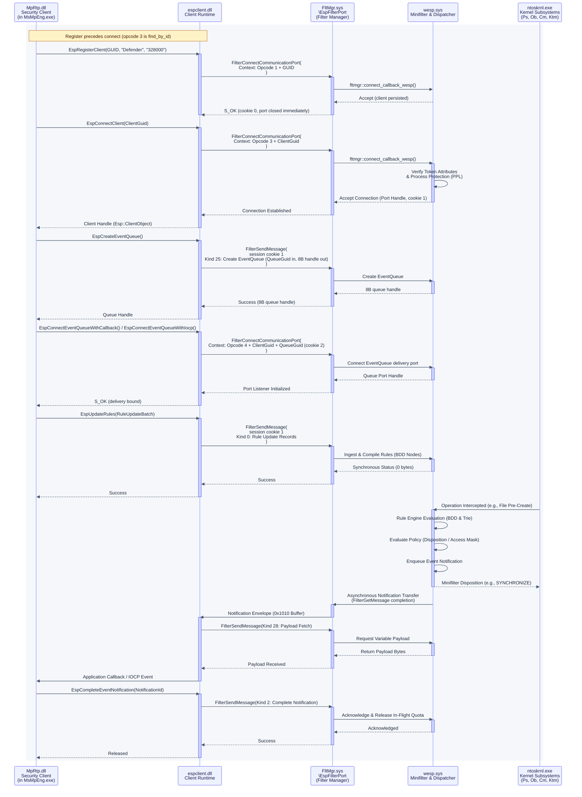
```mermaid
%%{init: {'theme': 'base', 'themeVariables': {'darkMode': false, 'background': '#ffffff', 'primaryColor': '#ffffff', 'primaryTextColor': '#0f172a', 'primaryBorderColor': '#64748b', 'lineColor': '#475569', 'textColor': '#1e293b', 'actorBkg': '#eef2ff', 'actorBorder': '#4f46e5', 'actorTextColor': '#1e1b4b', 'actorLineColor': '#a5b4fc', 'signalColor': '#475569', 'signalTextColor': '#1e293b', 'labelBoxBkgColor': '#fef3c7', 'labelBoxBorderColor': '#b45309', 'labelTextColor': '#451a03', 'loopTextColor': '#1e293b', 'noteBkgColor': '#fef3c7', 'noteBorderColor': '#b45309', 'noteTextColor': '#451a03', 'activationBkgColor': '#c7d2fe', 'activationBorderColor': '#4f46e5', 'sequenceNumberColor': '#0f172a'}, 'themeCSS': '.messageText { fill: #1e293b !important; stroke: none; } .actor text { fill: #1e1b4b; } .loopText { fill: #1e293b !important; } .labelText { fill: #451a03 !important; } .noteText { fill: #451a03 !important; } svg { background-color: #ffffff !important; }'}}%%
sequenceDiagram
    participant Client as MpRtp.dll<br/>Security Client<br/>(in MsMpEng.exe)
    participant DLL as espclient.dll<br/>Client Runtime
    participant Port as FltMgr.sys<br/>\EspFilterPort<br/>(Filter Manager)
    participant Driver as wesp.sys<br/>Minifilter & Dispatcher
    participant Kernel as ntoskrnl.exe<br/>Kernel Subsystems<br/>(Ps, Ob, Cm, Ktm)

    rect rgb(245, 247, 250)
        Note over Client,DLL: Register precedes connect (opcode 3 is find_by_id)
        Client->>DLL: EspRegisterClient(GUID, "Defender", "328000")
        activate DLL
        DLL->>Port: FilterConnectCommunicationPort(<br/>  Context: Opcode 1 + GUID<br/>)
        activate Port
        Port->>Driver: fltmgr::connect_callback_wesp()
        Driver-->>Port: Accept (client persisted)
        Port-->>DLL: S_OK (cookie 0, port closed immediately)
        deactivate Port
        deactivate DLL
        Client->>DLL: EspConnectClient(ClientGuid)
        activate DLL
        DLL->>Port: FilterConnectCommunicationPort(<br/>  Context: Opcode 3 + ClientGuid<br/>)
        activate Port
        Port->>Driver: fltmgr::connect_callback_wesp()
        activate Driver
        Driver->>Driver: Verify Token Attributes<br/>& Process Protection (PPL)
        Driver-->>Port: Accept Connection (Port Handle, cookie 1)
        deactivate Driver
        Port-->>DLL: Connection Established
        deactivate Port
        DLL-->>Client: Client Handle (Esp::ClientObject)
        deactivate DLL
        Client->>DLL: EspCreateEventQueue()
        activate DLL
        DLL->>Port: FilterSendMessage(<br/>  session cookie 1<br/>  Kind 25: Create EventQueue (QueueGuid in, 8B handle out)<br/>)
        activate Port
        Port->>Driver: Create EventQueue
        activate Driver
        Driver-->>Port: 8B queue handle
        deactivate Driver
        Port-->>DLL: Success (8B queue handle)
        deactivate Port
        DLL-->>Client: Queue Handle
        deactivate DLL
        Client->>DLL: EspConnectEventQueueWithCallback() / EspConnectEventQueueWithIocp()
        activate DLL
        DLL->>Port: FilterConnectCommunicationPort(<br/>  Context: Opcode 4 + ClientGuid + QueueGuid (cookie 2)<br/>)
        activate Port
        Port->>Driver: Connect EventQueue delivery port
        activate Driver
        Driver-->>Port: Queue Port Handle
        deactivate Driver
        Port-->>DLL: Port Listener Initialized
        deactivate Port
        DLL-->>Client: S_OK (delivery bound)
        deactivate DLL
        Client->>DLL: EspUpdateRules(RuleUpdateBatch)
        activate DLL
        DLL->>Port: FilterSendMessage(<br/>  session cookie 1<br/>  Kind 0: Rule Update Records<br/>)
        activate Port
        Port->>Driver: Ingest & Compile Rules (BDD Nodes)
        activate Driver
        Driver-->>Port: Synchronous Status (0 bytes)
        deactivate Driver
        Port-->>DLL: Success
        deactivate Port
        DLL-->>Client: Success
        deactivate DLL
        Kernel->>Driver: Operation Intercepted (e.g., File Pre-Create)
        activate Driver
        Driver->>Driver: Rule Engine Evaluation (BDD & Trie)
        Driver->>Driver: Evaluate Policy (Disposition / Access Mask)
        Driver->>Driver: Enqueue Event Notification
        Driver-->>Kernel: Minifilter Disposition (e.g., SYNCHRONIZE)
        deactivate Driver
        Driver->>Port: Asynchronous Notification Transfer<br/>(FilterGetMessage completion)
        activate Port
        Port->>DLL: Notification Envelope (0x1010 Buffer)
        deactivate Port
        activate DLL
        DLL->>Port: FilterSendMessage(Kind 28: Payload Fetch)
        activate Port
        Port->>Driver: Request Variable Payload
        activate Driver
        Driver-->>Port: Return Payload Bytes
        deactivate Driver
        Port-->>DLL: Payload Received
        deactivate Port
        DLL->>Client: Application Callback / IOCP Event
        deactivate DLL
        Client->>DLL: EspCompleteEventNotification(NotificationId)
        activate DLL
        DLL->>Port: FilterSendMessage(Kind 2: Complete Notification)
        activate Port
        Port->>Driver: Acknowledge & Release In-Flight Quota
        activate Driver
        Driver-->>Port: Acknowledged
        deactivate Driver
        Port-->>DLL: Success
        deactivate Port
        DLL-->>Client: Released
        deactivate DLL
    end
```

### Client Registration, Authentication, and Session Setup

A client identity must be registered before a session connects. Opcode 3 is a `find_by_id` lookup; a connect naming an unregistered GUID fails with `STATUS_NOT_FOUND` (`0xC0000225`, surfacing in user mode as HRESULT `0x80070490`) rather than `STATUS_ACCESS_DENIED` (`0xC0000022`). The production order is register (opcode 1), connect (opcode 3), create and connect the event queue (kind 25, opcode 4), arm notifications, then install rules (kind 0); esptool arms inside the pump and arm-before-rules is functionally equivalent; no examined harness row demonstrates arm-before-rules.

This workflow establishes an authenticated client connection:

1. Application registers the identity with `EspRegisterClient` (opcode 1; the port closes immediately), then calls `EspConnectClient(ClientGuid, &ClientHandle)`.
2. `espclient.dll` allocates `Esp::ClientObject` and formats a 20-byte connect context (Opcode 3 + GUID).
3. `FilterConnectCommunicationPort` transmits context to `\\EspFilterPort`.
4. `wesp.sys` intercepts connection, verifies `WESP://Permission` token attribute, validates PPL antimalware level, and checks capability tiers.
5. `wesp.sys` registers client into altitude-sorted collection and returns port handle.
6. `espclient.dll` stores port handle in `Esp::ClientObject` and returns 16-byte handle pair to caller.

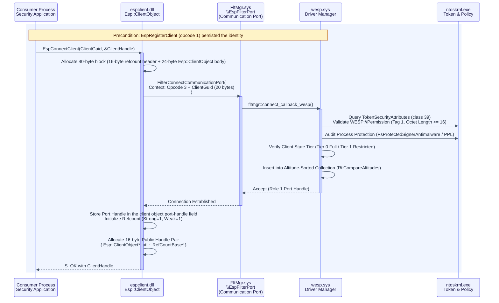
```mermaid
%%{init: {'theme': 'base', 'themeVariables': {'darkMode': false, 'background': '#ffffff', 'primaryColor': '#ffffff', 'primaryTextColor': '#0f172a', 'primaryBorderColor': '#64748b', 'lineColor': '#475569', 'textColor': '#1e293b', 'actorBkg': '#eef2ff', 'actorBorder': '#4f46e5', 'actorTextColor': '#1e1b4b', 'actorLineColor': '#a5b4fc', 'signalColor': '#475569', 'signalTextColor': '#1e293b', 'labelBoxBkgColor': '#fef3c7', 'labelBoxBorderColor': '#b45309', 'labelTextColor': '#451a03', 'loopTextColor': '#1e293b', 'noteBkgColor': '#fef3c7', 'noteBorderColor': '#b45309', 'noteTextColor': '#451a03', 'activationBkgColor': '#c7d2fe', 'activationBorderColor': '#4f46e5', 'sequenceNumberColor': '#0f172a'}, 'themeCSS': '.messageText { fill: #1e293b !important; stroke: none; } .actor text { fill: #1e1b4b; } .loopText { fill: #1e293b !important; } .labelText { fill: #451a03 !important; } .noteText { fill: #451a03 !important; } svg { background-color: #ffffff !important; }'}}%%
sequenceDiagram
participant App as Consumer Process<br/>Security Application
participant Client as espclient.dll<br/>Esp::ClientObject
participant Port as FltMgr.sys<br/>\\EspFilterPort<br/>(Communication Port)
participant Driver as wesp.sys<br/>Driver Manager
participant Policy as ntoskrnl.exe<br/>Token & Policy

    rect rgb(240, 245, 255)
        Note over App,Driver: Precondition: EspRegisterClient (opcode 1) persisted the identity
        App->>Client: EspConnectClient(ClientGuid, &ClientHandle)
        activate Client
        Client->>Client: Allocate 40-byte block (16-byte refcount header + 24-byte Esp::ClientObject body)
        Client->>Port: FilterConnectCommunicationPort(<br/>  Context: Opcode 3 + ClientGuid (20 bytes)<br/>)
        activate Port
        Port->>Driver: fltmgr::connect_callback_wesp()
        activate Driver
        Driver->>Policy: Query TokenSecurityAttributes (class 39)<br/>Validate WESP://Permission (Tag 1, Octet Length >= 16)
        Driver->>Policy: Audit Process Protection (PsProtectedSignerAntimalware / PPL)
        Driver->>Driver: Verify Client State Tier (Tier 0 Full / Tier 1 Restricted)
        Driver->>Driver: Insert into Altitude-Sorted Collection (RtlCompareAltitudes)
        Driver-->>Port: Accept (Role 1 Port Handle)
        deactivate Driver
        Port-->>Client: Connection Established
        deactivate Port
        Client->>Client: Store Port Handle in the client object port-handle field<br/>Initialize Refcount (Strong=1, Weak=1)
        Client->>Client: Allocate 16-byte Public Handle Pair<br/>{ Esp::ClientObject*, utl::_RefCountBase* }
        Client-->>App: S_OK with ClientHandle
        deactivate Client
    end
```

### Rule Deployment, Predicate Assembly, and BDD Compilation

This workflow deploys policy filters to the driver:

1. Application builds predicate trees using `EspCreateFilter` and composite constructors (`EspCreateAndFilter`, `EspCreateOrFilter`).
2. Application calls `EspCreateRule(Descriptor, &RuleHandle)`. The first argument is the rule descriptor, not a client handle.
3. During `EspUpdateRules`, client Rust core interns predicates into 32-byte `BddNode` decision nodes using the FNV-1a unique table.
4. Application calls `EspUpdateRules(ClientHandle, Flags, Count, Entries)`.
5. Client library serializes BDD buckets and sends message kind 0 (`RuleUpdate` records) over communication port.
6. Driver ingests updates, rebuilds subrule graphs via `finalize_subrules`, updates event counters, and, for persisted lifetimes only, commits rule definitions to the system registry (transient lifetime-1 rules skip the commit).

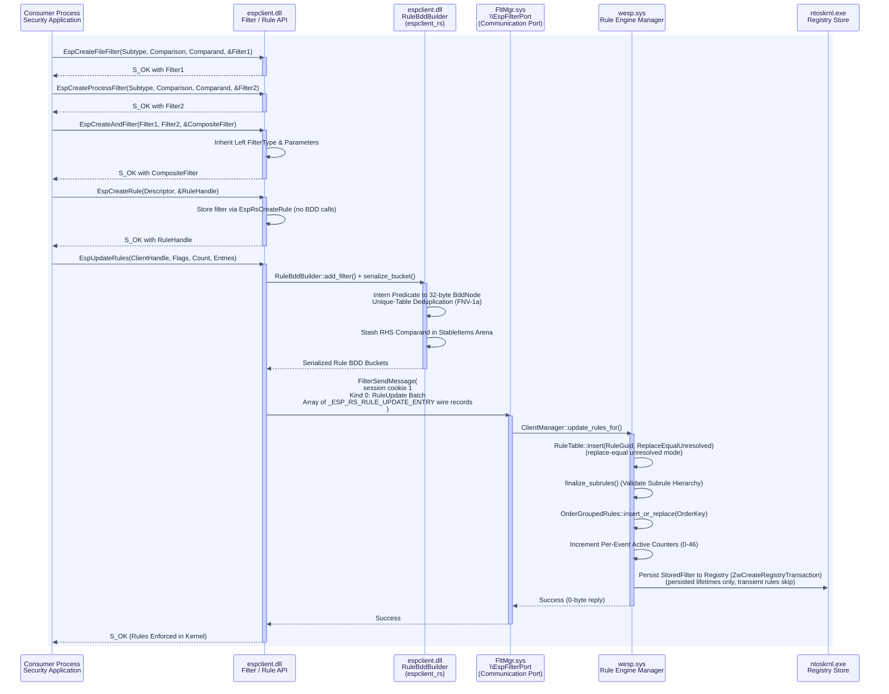
```mermaid
%%{init: {'theme': 'base', 'themeVariables': {'darkMode': false, 'background': '#ffffff', 'primaryColor': '#ffffff', 'primaryTextColor': '#0f172a', 'primaryBorderColor': '#64748b', 'lineColor': '#475569', 'textColor': '#1e293b', 'actorBkg': '#eef2ff', 'actorBorder': '#4f46e5', 'actorTextColor': '#1e1b4b', 'actorLineColor': '#a5b4fc', 'signalColor': '#475569', 'signalTextColor': '#1e293b', 'labelBoxBkgColor': '#fef3c7', 'labelBoxBorderColor': '#b45309', 'labelTextColor': '#451a03', 'loopTextColor': '#1e293b', 'noteBkgColor': '#fef3c7', 'noteBorderColor': '#b45309', 'noteTextColor': '#451a03', 'activationBkgColor': '#c7d2fe', 'activationBorderColor': '#4f46e5', 'sequenceNumberColor': '#0f172a'}, 'themeCSS': '.messageText { fill: #1e293b !important; stroke: none; } .actor text { fill: #1e1b4b; } .loopText { fill: #1e293b !important; } .labelText { fill: #451a03 !important; } .noteText { fill: #451a03 !important; } svg { background-color: #ffffff !important; }'}}%%
sequenceDiagram
participant App as Consumer Process<br/>Security Application
participant Client as espclient.dll<br/>Filter / Rule API
participant BDD as espclient.dll<br/>RuleBddBuilder<br/>(espclient_rs)
participant Port as FltMgr.sys<br/>\\EspFilterPort<br/>(Communication Port)
participant Driver as wesp.sys<br/>Rule Engine Manager
participant Store as ntoskrnl.exe<br/>Registry Store

    rect rgb(240, 245, 255)
        App->>Client: EspCreateFileFilter(Subtype, Comparison, Comparand, &Filter1)
        activate Client
        Client-->>App: S_OK with Filter1
        deactivate Client

        App->>Client: EspCreateProcessFilter(Subtype, Comparison, Comparand, &Filter2)
        activate Client
        Client-->>App: S_OK with Filter2
        deactivate Client

        App->>Client: EspCreateAndFilter(Filter1, Filter2, &CompositeFilter)
        activate Client
        Client->>Client: Inherit Left FilterType & Parameters
        Client-->>App: S_OK with CompositeFilter
        deactivate Client

        App->>Client: EspCreateRule(Descriptor, &RuleHandle)
        activate Client
        Client->>Client: Store filter via EspRsCreateRule (no BDD calls)
        Client-->>App: S_OK with RuleHandle
        deactivate Client

        App->>Client: EspUpdateRules(ClientHandle, Flags, Count, Entries)
        activate Client
        Client->>BDD: RuleBddBuilder::add_filter() + serialize_bucket()
        activate BDD
        BDD->>BDD: Intern Predicate to 32-byte BddNode<br/>Unique-Table Deduplication (FNV-1a)
        BDD->>BDD: Stash RHS Comparand in StableItems Arena
        BDD-->>Client: Serialized Rule BDD Buckets
        deactivate BDD
        Client->>Port: FilterSendMessage(<br/>  session cookie 1<br/>  Kind 0: RuleUpdate Batch<br/>  Array of _ESP_RS_RULE_UPDATE_ENTRY wire records<br/>)
        activate Port

        Port->>Driver: ClientManager::update_rules_for()
        activate Driver
        Driver->>Driver: RuleTable::insert(RuleGuid, ReplaceEqualUnresolved)<br/>(replace-equal unresolved mode)
        Driver->>Driver: finalize_subrules() (Validate Subrule Hierarchy)
        Driver->>Driver: OrderGroupedRules::insert_or_replace(OrderKey)
        Driver->>Driver: Increment Per-Event Active Counters (0-46)
        Driver->>Store: Persist StoredFilter to Registry (ZwCreateRegistryTransaction)<br/>(persisted lifetimes only, transient rules skip)
        Driver-->>Port: Success (0-byte reply)
        deactivate Driver

        Port-->>Client: Success
        deactivate Port
        Client-->>App: S_OK (Rules Enforced in Kernel)
        deactivate Client
    end
```

### Filesystem Interception, Policy Enforcement, and Access Modification

This workflow intercepts active filesystem I/O across two primary enforcement paths:

- **Enforcing Deny (Selector 5)**: When a matching rule specifies an enforcing action, the driver executes complete-with-status refusal (`EspFltPreCreate` Verdict 1), setting `CallbackData->IoStatus.Status = 0xC0000225` (`STATUS_NOT_FOUND`) and returning `FLT_PREOP_COMPLETE`. Filter Manager terminates the request immediately before it reaches the filesystem driver.
- **Access Mask Modification**: When a policy rule dictates privilege restriction, the driver modifies `DesiredAccess` and `RemainingDesiredAccess` (e.g. converting write requests to read-only access), calls `FltSetCallbackDataDirty`, and returns `FLT_PREOP_SYNCHRONIZE` (Verdict 6). The filesystem driver completes the open under the modified access mask.

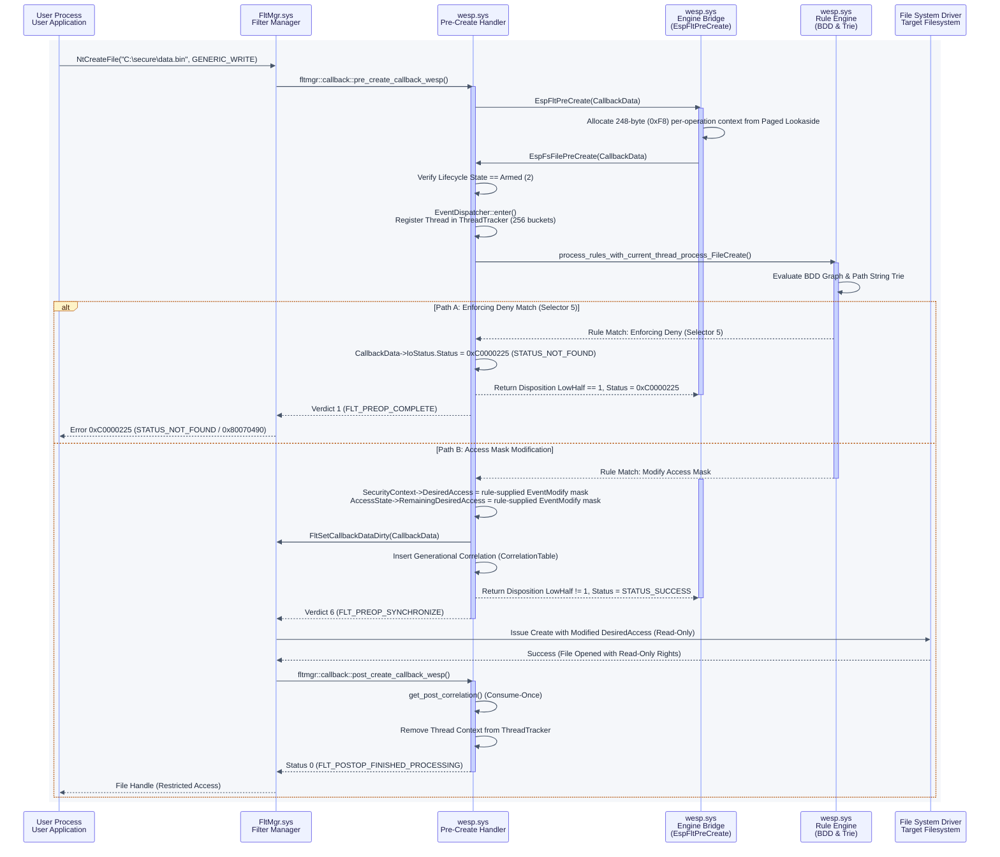
```mermaid
%%{init: {'theme': 'base', 'themeVariables': {'darkMode': false, 'background': '#ffffff', 'primaryColor': '#ffffff', 'primaryTextColor': '#0f172a', 'primaryBorderColor': '#64748b', 'lineColor': '#475569', 'textColor': '#1e293b', 'actorBkg': '#eef2ff', 'actorBorder': '#4f46e5', 'actorTextColor': '#1e1b4b', 'actorLineColor': '#a5b4fc', 'signalColor': '#475569', 'signalTextColor': '#1e293b', 'labelBoxBkgColor': '#fef3c7', 'labelBoxBorderColor': '#b45309', 'labelTextColor': '#451a03', 'loopTextColor': '#1e293b', 'noteBkgColor': '#fef3c7', 'noteBorderColor': '#b45309', 'noteTextColor': '#451a03', 'activationBkgColor': '#c7d2fe', 'activationBorderColor': '#4f46e5', 'sequenceNumberColor': '#0f172a'}, 'themeCSS': '.messageText { fill: #1e293b !important; stroke: none; } .actor text { fill: #1e1b4b; } .loopText { fill: #1e293b !important; } .labelText { fill: #451a03 !important; } .noteText { fill: #451a03 !important; } svg { background-color: #ffffff !important; }'}}%%
sequenceDiagram
participant App as User Process<br/>User Application
participant FltMgr as FltMgr.sys<br/>Filter Manager
participant PreCreate as wesp.sys<br/>Pre-Create Handler
participant Bridge as wesp.sys<br/>Engine Bridge<br/>(EspFltPreCreate)
participant Engine as wesp.sys<br/>Rule Engine<br/>(BDD & Trie)
participant FS as File System Driver<br/>Target Filesystem

    rect rgb(245, 247, 250)
        App->>FltMgr: NtCreateFile("C:\secure\data.bin", GENERIC_WRITE)
        FltMgr->>PreCreate: fltmgr::callback::pre_create_callback_wesp()
        activate PreCreate
        PreCreate->>Bridge: EspFltPreCreate(CallbackData)
        activate Bridge
        Bridge->>Bridge: Allocate 248-byte (0xF8) per-operation context from Paged Lookaside
        Bridge->>PreCreate: EspFsFilePreCreate(CallbackData)
        PreCreate->>PreCreate: Verify Lifecycle State == Armed (2)
        PreCreate->>PreCreate: EventDispatcher::enter()<br/>Register Thread in ThreadTracker (256 buckets)
        PreCreate->>Engine: process_rules_with_current_thread_process_FileCreate()
        activate Engine
        Engine->>Engine: Evaluate BDD Graph & Path String Trie

        alt Path A: Enforcing Deny Match (Selector 5)
            Engine-->>PreCreate: Rule Match: Enforcing Deny (Selector 5)
            PreCreate->>PreCreate: CallbackData->IoStatus.Status = 0xC0000225 (STATUS_NOT_FOUND)
            PreCreate-->>Bridge: Return Disposition LowHalf == 1, Status = 0xC0000225
            deactivate Bridge
            PreCreate-->>FltMgr: Verdict 1 (FLT_PREOP_COMPLETE)
            FltMgr-->>App: Error 0xC0000225 (STATUS_NOT_FOUND / 0x80070490)
        else Path B: Access Mask Modification
            Engine-->>PreCreate: Rule Match: Modify Access Mask
            deactivate Engine
            activate Bridge
            PreCreate->>PreCreate: SecurityContext->DesiredAccess = rule-supplied EventModify mask<br/>AccessState->RemainingDesiredAccess = rule-supplied EventModify mask
            PreCreate->>FltMgr: FltSetCallbackDataDirty(CallbackData)
            PreCreate->>PreCreate: Insert Generational Correlation (CorrelationTable)
            PreCreate-->>Bridge: Return Disposition LowHalf != 1, Status = STATUS_SUCCESS
            deactivate Bridge
            PreCreate-->>FltMgr: Verdict 6 (FLT_PREOP_SYNCHRONIZE)
            deactivate PreCreate
            FltMgr->>FS: Issue Create with Modified DesiredAccess (Read-Only)
            FS-->>FltMgr: Success (File Opened with Read-Only Rights)
            FltMgr->>PreCreate: fltmgr::callback::post_create_callback_wesp()
            activate PreCreate
            PreCreate->>PreCreate: get_post_correlation() (Consume-Once)
            PreCreate->>PreCreate: Remove Thread Context from ThreadTracker
            PreCreate-->>FltMgr: Status 0 (FLT_POSTOP_FINISHED_PROCESSING)
            deactivate PreCreate
            FltMgr-->>App: File Handle (Restricted Access)
        end
    end
```

### Notification Delivery, Variable Payload Retrieval, and Target Property Query

This workflow delivers telemetry to user mode:

1. Rule match generates notification; driver enqueues event into `EventQueue` and charges memory quota.
2. User-mode `PortListener` receives notification envelope via armed `FilterGetMessage` read.
3. Client library extracts notification ID and calls `FilterSendMessage` with message kind 28 to retrieve variable payload.
4. Client executes `EspRsInitNotification`, applying pointer fixups (`_ESP_POINTER_FIXUP_`) to convert relative offsets into absolute addresses.
5. Client dispatches notification to application callback or posts to I/O Completion Port.
6. Application receives event, creates object reference via `EspGetEventObjectFromReference`, and queries live properties using `EspQueryFileProperties`.
7. Client executes resize-negotiation loop (starting at 256 bytes) with message kind 6 to fetch requested properties.
8. Application acknowledges event via `EspCompleteEventNotification`, issuing message kind 2 to release kernel tracking records.
9. Application frees local buffers via `EspFreeEventNotification` and `EspFreeMemory`.

```mermaid
%%{init: {'theme': 'base', 'themeVariables': {'darkMode': false, 'background': '#ffffff', 'primaryColor': '#ffffff', 'primaryTextColor': '#0f172a', 'primaryBorderColor': '#64748b', 'lineColor': '#475569', 'textColor': '#1e293b', 'actorBkg': '#eef2ff', 'actorBorder': '#4f46e5', 'actorTextColor': '#1e1b4b', 'actorLineColor': '#a5b4fc', 'signalColor': '#475569', 'signalTextColor': '#1e293b', 'labelBoxBkgColor': '#fef3c7', 'labelBoxBorderColor': '#b45309', 'labelTextColor': '#451a03', 'loopTextColor': '#1e293b', 'noteBkgColor': '#fef3c7', 'noteBorderColor': '#b45309', 'noteTextColor': '#451a03', 'activationBkgColor': '#c7d2fe', 'activationBorderColor': '#4f46e5', 'sequenceNumberColor': '#0f172a'}, 'themeCSS': '.messageText { fill: #1e293b !important; stroke: none; } .actor text { fill: #1e1b4b; } .loopText { fill: #1e293b !important; } .labelText { fill: #451a03 !important; } .noteText { fill: #451a03 !important; } svg { background-color: #ffffff !important; }'}}%%
sequenceDiagram
participant App as User Process<br/>User Application
participant Driver as wesp.sys<br/>Event Producer
participant Queue as wesp.sys<br/>Kernel EventQueue
participant Port as FltMgr.sys<br/>\\EspFilterPort<br/>(Communication Port)
participant Client as espclient.dll<br/>PortListener
participant Agent as Consumer Process<br/>Security Agent

    rect rgb(240, 245, 255)
        App->>Driver: Intercepted File Write Operation
        activate Driver
        Driver->>Driver: Rule Engine Match: Enqueue Telemetry
        Driver->>Driver: Allocate 64 KiB Lookaside Region<br/>Format Header (0x78) & Event Data (0xA8)<br/>Build Pointer Fixup Table (_ESP_POINTER_FIXUP_)
        Driver->>Queue: Enqueue Async Notification<br/>Charge Quota: (element_count << 16) | 0x1000
        activate Queue
        deactivate Driver
        Note over App,Agent: Stage 1: Envelope Retrieval via Armed Read
        Client->>Queue: FilterGetMessage (Armed Overlapped Read)
        Queue-->>Client: Return 4112-byte Envelope (0x1010 Buffer)
        deactivate Queue
        activate Client
        Note over Client: Envelope holds Header, QueueGuid,<br/>NotificationId, and Fixup Table.
    end

    rect rgb(255, 250, 240)
        Note over App,Agent: Stage 2: Variable Payload Retrieval
        Client->>Port: FilterSendMessage(<br/>  Kind 28: Retrieve Payload for NotificationId<br/>)
        activate Port
        Port->>Driver: Request Payload Bytes
        activate Driver
        Driver-->>Port: Return Variable Payload Bytes
        deactivate Driver
        Port-->>Client: Payload Bytes Received
        deactivate Port
        Client->>Client: EspRsInitNotification():<br/>Resolve Fixup Pointers across Envelope & Payload Bases
        Client->>Agent: Dispatch to Application Callback / IOCP Post
        deactivate Client
        activate Agent
    end

    rect rgb(250, 245, 255)
        Note over App,Agent: Stage 3: Live Target Property Query
        Agent->>Client: EspGetEventObjectFromReference(Ref, &EventObjectView)
        activate Client
        Client-->>Agent: Return Non-Owning View (EventObjectId, TypeCode)
        deactivate Client
        Agent->>Client: EspQueryFileProperties(View, Count, PropertyIds, &OutBuffer)
        activate Client
        Client->>Port: FilterSendMessage(Kind 6: Query Properties, 256 bytes initial)
        activate Port
        Port->>Driver: Evaluate Target Object Properties
        activate Driver
        Driver-->>Port: Status & Data Bytes (Resize Loop if 0x8007007A)
        deactivate Driver
        Port-->>Client: Property Data Buffer
        deactivate Port
        Client-->>Agent: S_OK with Property Data Buffer
        deactivate Client
    end

    rect rgb(240, 255, 245)
        Note over App,Agent: Stage 4: Lifecycle Acknowledgment
        Agent->>Client: EspCompleteEventNotification(NotificationId)
        activate Client
        Client->>Port: FilterSendMessage(Kind 2: Complete Notification)
        activate Port
        Port->>Driver: Forward Completion Acknowledgment
        activate Driver
        Driver->>Queue: Remove Entry & Refund Memory Quota
        Driver-->>Port: Success (0 bytes)
        deactivate Driver
        Port-->>Client: Success
        deactivate Port
        Client-->>Agent: Released
        deactivate Client
        Agent->>Client: EspFreeMemory(OutBuffer) & EspFreeEventNotification(Envelope)
        activate Client
        Client->>Client: Free Heap Buffers
        Client-->>Agent: Buffers Cleared
        deactivate Client
        deactivate Agent
    end
```

### Client Disconnect, Queue Drain, and Subsystem Teardown

```mermaid
%%{init: {'theme': 'base', 'themeVariables': {'darkMode': false, 'background': '#ffffff', 'primaryColor': '#ffffff', 'primaryTextColor': '#0f172a', 'primaryBorderColor': '#64748b', 'lineColor': '#475569', 'textColor': '#1e293b', 'actorBkg': '#eef2ff', 'actorBorder': '#4f46e5', 'actorTextColor': '#1e1b4b', 'actorLineColor': '#a5b4fc', 'signalColor': '#475569', 'signalTextColor': '#1e293b', 'labelBoxBkgColor': '#fef3c7', 'labelBoxBorderColor': '#b45309', 'labelTextColor': '#451a03', 'loopTextColor': '#1e293b', 'noteBkgColor': '#fef3c7', 'noteBorderColor': '#b45309', 'noteTextColor': '#451a03', 'activationBkgColor': '#c7d2fe', 'activationBorderColor': '#4f46e5', 'sequenceNumberColor': '#0f172a'}, 'themeCSS': '.messageText { fill: #1e293b !important; stroke: none; } .actor text { fill: #1e1b4b; } .loopText { fill: #1e293b !important; } .labelText { fill: #451a03 !important; } .noteText { fill: #451a03 !important; } svg { background-color: #ffffff !important; }'}}%%
sequenceDiagram
    participant App as Consumer Process<br/>Security Application
    participant Client as espclient.dll<br/>Client Library
    participant Port as FltMgr.sys<br/>\\EspFilterPort<br/>(Communication Port)
    participant Driver as wesp.sys<br/>Driver Manager
    participant Store as ntoskrnl.exe<br/>Registry Store

    rect rgb(240, 245, 255)
        Note over App,Store: Stage 1: Rule Retirement
        App->>Client: EspRemoveAllRulesForClient(ClientHandle)
        activate Client
        Client->>Port: FilterSendMessage(Kind 12: Remove All Rules)
        activate Port
        Port->>Driver: Delete Rules for ClientGuid
        Driver->>Driver: Rebuild BDD Trees & Decrement Counters
        Driver->>Store: Update Persisted Rule Sets<br/>(persisted lifetimes only)
        Driver-->>Port: Acknowledged (0 bytes)
        Port-->>Client: Success
        deactivate Port
        Client-->>App: Success
        deactivate Client
    end

    rect rgb(255, 250, 240)
        Note over App,Store: Stage 2: Event Queue Teardown
        App->>Client: EspDisconnectEventQueue(QueueHandle)
        activate Client
        Client->>Client: PortListener::BeginDisconnect()<br/>(Set State = Disconnecting)
        Client->>Client: PortListener::CompleteDisconnect()<br/>(CancelIoEx + WaitForThreadpoolIoCallbacks<br/>+ Close TP_IO, Threadpool, PortHandle,<br/>sends no port message)
        Note over Client,Port: EspDisconnectEventQueue sends no port message (local teardown only, kind 27 fires at EspCloseEventQueue)
        Client-->>App: Queue Disconnected
        deactivate Client
        App->>Client: EspCloseEventQueue(QueueHandle)
        activate Client
        Client->>Port: FilterSendMessage(Kind 27: Close Event Queue)<br/>(from queue destructor)
        activate Port
        Port->>Driver: Unlink EventQueue
        Driver->>Driver: Flush Pending Notifications<br/>& Refund Quota
        Driver-->>Port: Acknowledged (0 bytes)
        Port-->>Client: Success
        deactivate Port
        Client->>Client: Release Handle & Control Block
        Client-->>App: Queue Closed
        deactivate Client
    end

    rect rgb(250, 245, 255)
        Note over App,Store: Stage 3: Client Identity Unregistration
        opt If Permanent Deregistration Requested
            App->>Client: EspUnregisterClient(ClientGuid)
            activate Client
            Client->>Port: FilterConnectCommunicationPort(<br/>  Context: Opcode 2 + ClientGuid<br/>)
            activate Port
            Port->>Driver: Delete Client & Subtrees
            Driver->>Store: Delete Client, Rules, Queues, Collections
            Driver->>Driver: Mark Client State = 6 (Terminated)
            Driver-->>Port: Success (Handle closed immediately)
            Port-->>Client: Success
            deactivate Port
            Client-->>App: Unregistered
            deactivate Client
        end
    end

    rect rgb(240, 255, 245)
        Note over App,Store: Stage 4: Session Disconnect & Handle Release
        App->>Client: EspDisconnectClient(ClientHandle)
        activate Client
        Client->>Client: Close Communication Port Handle (no wire message)
        activate Port
        Port->>Driver: Port-Disconnect Cleanup
        Driver->>Driver: Reset State to Registered (State 2)<br/>Remove from ConnectedClientProcesses
        Driver-->>Port: Cleanup Complete
        Port-->>Client: Handle Closed
        deactivate Port
        Client->>Client: Release Client Control Block
        Client->>Client: Close Communication Port Handle
        Client->>Client: Free 16-byte Handle Pair
        Client-->>App: Disconnected & Handles Destroyed
        deactivate Client
    end
```

## Worked End-to-End Scenarios

Two scenarios trace complete paths through the platform using the protocol constants defined in the body.
Placeholders in angle brackets stand for instance-specific values only; every opcode, kind, event type, selector, and status below is the documented value.

### File-Create Deny

A consumer installs an enforcing file-create rule.
A file creation matches, the driver terminates the create in kernel, and the operation completes with a refusal status without creating a user-mode event queue or delivering an asynchronous notification.

1. The consumer registers its identity with `EspRegisterClient`, which connects with opcode `1` and a descriptor carrying the client GUID, name, and altitude; the ephemeral port closes immediately after registration (see [Wire Protocol, Connection Roles, and Communication Ports](#wire-protocol-connection-roles-and-communication-ports), [Client Library Architecture: espclient.dll](#client-library-architecture-espclientdll)).
2. The consumer connects a session with `EspConnectClient(<client-guid>)`, which connects with opcode `3` and a 20-byte context; opcode `3` is a `find_by_id` lookup, so a connect naming an unregistered GUID fails with `0xC0000225` (surfacing as `0x80070490`) instead of opening a session (see [Wire Protocol, Connection Roles, and Communication Ports](#wire-protocol-connection-roles-and-communication-ports), [End-to-End Operational Workflows](#end-to-end-operational-workflows)).
3. The consumer builds a file-path predicate with `EspCreateFileObjectFilter` for `<path>` and assembles an enforcing rule with `EspCreateRule`. The rule descriptor specifies event type `2000`, enforcing selector `5`, modify kind `3`, and lifetime `1`. For selector `5`, descriptor offset `+1112` (`event_queue`) is repurposed as an action disposition index (`0` for default, `1` for virus, `2` for access denied, or `3` for not found); it does not hold an `EventQueue` handle. Passing a queue pointer to `EspCreateRule` with selector `5` fails validation in `EspRsCreateRule` with tag `89` (`E_INVALIDARG` / `0x80070057`) because the low 32 bits of the pointer evaluate to 6 or greater. The rule descriptor is constructed entirely in process memory without establishing a user-mode event queue or issuing port traffic (see [Rule, Filter, and ROBDD Decision Engine](#rule-filter-and-robbd-decision-engine), [Policy Enforcement, Disposition Tables, and Deny Flow](#policy-enforcement-disposition-tables-and-deny-flow)).
4. The consumer submits the rule batch using `EspUpdateRules`. The client runtime compiles the predicate into BDD buckets and serializes selector `5` into wire action tag `3` with a zeroed queue GUID and the selected disposition index. It transmits the update batch across `\EspFilterPort` via synchronous message send (Kind `0` on the session port). The kernel driver `wesp.sys` deserializes the batch via `RuleAction_::from_incoming`; because the wire queue GUID is zero, `closure_0` resolves no queue and stores internal variant `5` with a null `VirtualQueue` reference. The driver increments the `2000` event counter and returns a 0-byte reply (see [Wire Protocol, Connection Roles, and Communication Ports](#wire-protocol-connection-roles-and-communication-ports), [Rule, Filter, and ROBDD Decision Engine](#rule-filter-and-robbd-decision-engine), [Policy Enforcement, Disposition Tables, and Deny Flow](#policy-enforcement-disposition-tables-and-deny-flow)).
5. A process issues `NtCreateFile` for `<path>`. The Minifilter pre-create callback `EspFltPreCreate` (invoking `EspFsFilePreCreate`) verifies the armed lifecycle and non-zero event counter, then executes `wesp_lib::rule::engine::RuleEngine::process_event_internal_...FileCreate_` to traverse the compiled ROBDD decision graph (see [Driver Lifecycle, Global State, and Publication Barriers](#driver-lifecycle-global-state-and-publication-barriers), [Policy Enforcement, Disposition Tables, and Deny Flow](#policy-enforcement-disposition-tables-and-deny-flow)).
6. The predicate matches stored action variant `5`. Because the action queue pointer is null, the rule engine skips telemetry construction (`NotificationBuilder`) and queueing (`queue_async_notification_internal`) entirely. The engine reads the disposition index (index `2` by default for `FoCreate`), maps it through the kernel Filesystem/KTM disposition table, and returns packed status `0xC0000225_00000001` (`STATUS_NOT_FOUND` with the completion bit set).
7. The pre-create bridge `EspFltPreCreate` evaluates the packed verdict; finding low-dword `1`, it writes the high-dword status `0xC0000225` into `CallbackData->IoStatus.Status` and returns `FLT_PREOP_COMPLETE` (numeric `4`) to Filter Manager (see [Policy Enforcement, Disposition Tables, and Deny Flow](#policy-enforcement-disposition-tables-and-deny-flow)).
8. Filter Manager completes the I/O request immediately with `STATUS_NOT_FOUND` (`0xC0000225` / Win32 `1168` `ERROR_NOT_FOUND`) before the IRP reaches the underlying filesystem driver. If disposition `access_denied` was configured at index `1`, `IoStatus.Status` receives `STATUS_ACCESS_DENIED` (`0xC0000022` / Win32 `5`). The file is not created, no notification envelope is enqueued to `\EspFilterPort`, and user mode receives no asynchronous event completion (see [Policy Enforcement, Disposition Tables, and Deny Flow](#policy-enforcement-disposition-tables-and-deny-flow)).
9. When the consumer session ends, `EspDisconnectClient` closes the session port, and `EspUnregisterClient` removes the transient rule from kernel memory, decrements the `2000` event counter, and deletes the client registration (see [Wire Protocol, Connection Roles, and Communication Ports](#wire-protocol-connection-roles-and-communication-ports), [End-to-End Operational Workflows](#end-to-end-operational-workflows)).

### Defender-Style Telemetry Watch

A consumer installs a notify-only rule, observes a matching operation, inspects the live object, and completes the notification.
The registration descriptor mirrors the Defender plugin; the reference and query steps describe the general consumer path.

1. The consumer registers with the descriptor `{<client-guid>, L"Defender", L"328000"}` through opcode `1`; the Defender plugin is the only operating-system-supplied consumer on the examined image (see [Overview](#overview), [Wire Protocol, Connection Roles, and Communication Ports](#wire-protocol-connection-roles-and-communication-ports)).
2. The consumer connects a session with `EspConnectClient(<client-guid>)` through opcode `3` on the same `find_by_id` path as the deny scenario (see [Wire Protocol, Connection Roles, and Communication Ports](#wire-protocol-connection-roles-and-communication-ports)).
3. The consumer creates an event queue (kind `25`), binds a callback (opcode `4`), and arms notification with `EspArmEventNotification` over the fixed 4,112-byte buffer; the event path does not auto-re-arm, so the consumer re-arms after each completion (see [Asynchronous Notification Pipeline and Memory Accounting](#asynchronous-notification-pipeline-and-memory-accounting), [Client Library Architecture: espclient.dll](#client-library-architecture-espclientdll)).
4. The consumer installs a notify-only rule with selector `1` and lifetime `1` through a kind `0` batch; selector `1` enqueues telemetry while selector `5` refuses the operation, and the installed rule arms the per-event-type counter (see [Rule, Filter, and ROBDD Decision Engine](#rule-filter-and-robbd-decision-engine), [Driver Lifecycle, Global State, and Publication Barriers](#driver-lifecycle-global-state-and-publication-barriers)).
5. A matching operation occurs; the I/O proceeds normally while the driver enqueues a notification and charges the queue quota (see [Asynchronous Notification Pipeline and Memory Accounting](#asynchronous-notification-pipeline-and-memory-accounting)).
6. The client retrieves the envelope through `FilterGetMessage`, fetches the variable payload with kind `28`, applies dual-base pointer relocations in `EspRsInitNotification`, and dispatches the notification to the application callback (see [Asynchronous Notification Pipeline and Memory Accounting](#asynchronous-notification-pipeline-and-memory-accounting)).
7. The consumer creates an object reference from a natural key such as `<pid>` or `<path>` (kind `4`, full trust only), derives a non-owning view without port traffic, and queries live properties with kind `6` starting from a 256-byte buffer; an `0x8007007A` response resizes to the returned size for up to 10 attempts before `0x800705B4`, and the returned buffer is released with `EspFreeMemory` (see [Client Library Architecture: espclient.dll](#client-library-architecture-espclientdll)).
8. The consumer acknowledges with `EspCompleteEventNotification` (kind `2`, quota refunded), closes the reference with `EspCloseEventObjectReference`, and frees the envelope with `EspFreeEventNotification` (see [Asynchronous Notification Pipeline and Memory Accounting](#asynchronous-notification-pipeline-and-memory-accounting), [Client Library Architecture: espclient.dll](#client-library-architecture-espclientdll)).

The examined `MpRtp.dll` build does not create object references, query typed properties, manage collections, or attach context keys; step 7 exercises exports that exist on `espclient.dll` and are unused by the Defender plugin (see [Overview](#overview)).

## Operational Verification and Target Host Findings

This section documents empirical validation findings and kernel debugging observations collected from on-VM testing in dedicated research environments (specifically Windows 11 Insider Preview builds on test virtual machines). These records provide verification ground truth for the functional specifications defined in the preceding sections.

### Target Host Environment and Binary Provenance

Enforcement and callback behavior were evaluated on a real VM (Windows 11 Insider Preview, build `10.0.29641.0`). The target host executed with kernel-mode Address Space Layout Randomization (KASLR) active, randomizing the `wesp.sys` image base on each boot (no boot-config capture attached).

Binary provenance across test environments:

- **Kernel Driver (`wesp.sys`)**: The extracted static binary comprises 4,217,568 bytes (3,898 functions). The driver on build `10.0.29641.0` represents a subsequent build, presumed to carry identical export ordinals and capability table structures (VM image not pulled for comparison).
- **User-Mode Client (`espclient.dll`)**: The build-10.0.29641.0 library comprises 1,108,088 bytes (SHA-256 `6ea81fe48b9068ff893ae76ebd00f5e7e1397d422b71ba48477d64a3f5ef73f8`). The extracted static reference comprises 1,102,048 bytes. The extracted static reference exhibits `EventModify::from_ffi` conversion logic and error code mappings to which the build-10.0.29641.0 library is presumed identical (comparison pending a DLL pull from the VM).

Two lab VMs host the two builds. WINVM_102 runs the reference build (`wesp.sys` 4,338,320 bytes, `espclient.dll` 1,122,960 bytes), and WINVM_120 runs the enforcement-verification build (`wesp.sys` 4,223,608 bytes, `espclient.dll` 1,108,088 bytes). On WINVM_102, `wesp_elam.sys` (1,524,152 bytes) is staged on disk but has no service key, so it never loads and the `\WespElamQueue` section and handshake events never exist at runtime; `wesp_elam.sys` is absent on WINVM_120.

### Results on Build 10.0.29641.0

| Family                         | Install                                            | Operation                        | Result                                                                                                                                                                                                                                                                            |
| ------------------------------ | -------------------------------------------------- | -------------------------------- | --------------------------------------------------------------------------------------------------------------------------------------------------------------------------------------------------------------------------------------------------------------------------------- |
| `2000` FoCreate                | Native `action="deny"`                             | Create under the matched NT path | Create returns `0x80070490`. File is absent. Negative control succeeds.                                                                                                                                                                                                           |
| `1000` ProcessCreate           | `--enforce-compat`                                 | Canary spawn                     | Spawn returns `0x80004005`. Negative-control spawn succeeds (pid recorded).                                                                                                                                                                                                       |
| `2001` FoOpen                  | `--enforce-compat`                                 | Open of the matched path         | Open returns `0x80070490`. Negative control opened.                                                                                                                                                                                                                               |
| `4000` / `4002`                | Capability-derived only                            | Volume mount                     | No on-VM test.                                                                                                                                                                                                                                                                    |
| `2004`, `3007`, `8000`, `8001` | Any descriptor                                     | Any                              | Driver rejects or never writes a deny. Requires a `wesp.sys` change.                                                                                                                                                                                                              |
| `7000` RegCreateKey            | Temporary compat widen, absent from shipped source | Registry create                  | `EspCreateRule` / `EspUpdateRules` return `S_OK`. Adjacent test runs have other keys still created. With a hardware breakpoint armed on the create-key table / the index-2 entry, no post-create hit/miss window exists. Table consumption on a matching create remains unproven. |
| `7003` RegSetValue             | `--enforce-compat`                                 | `EspCreateRule`                  | `0x80070057` at `EventConfig::new`, before `from_ffi` (holder exited).                                                                                                                                                                                                            |

Native `2000` deny fails with `0x80070490`, `exists` false, filter set to the matched canary path. The on-VM DLL is 1,108,088 bytes (SHA-256 above).

The initial file-create verification anomaly resulted from an invalid path expansion (`$nt:\test\...`). Upon correcting the prefix to a valid NT path format (`$nt:C:\test\...`), native `2000` pre-complete deny fired consistently with status `0x80070490`.

### Kernel Debugging Observations and Diagnostics

Dynamic verification under kernel debugging (`kd.exe`) over serial WinRM interfaces established several operational constraints:

- **Callback Entry Breakpoints**: Arming software execution breakpoints at the entry point of `cm::callback::registry_callback` generates continuous hits across ambient system registry operations. Over serial WinRM transports, this high-frequency break condition causes transport timeouts and freezes management sessions. Precise debugging requires setting conditional hardware breakpoints on specific table reads or filtering by process context.
- **Disposition Table Memory Breakpoints**: Hardware read breakpoints (`ba r4`) armed on the create-key disposition table suggested that during non-matching registry operations the table entries remain unread, indicating that the rule engine evaluates predicates before indexing disposition statuses (trace sample pending).
- **Rule Evaluation Store Breakpoints**: Placing software breakpoints inside the inner BDD evaluation loop was observed to halt all monitored executive operations system-wide. Target verification on real VMs should rely on Canary files and non-invasive TraceLogging events rather than invasive engine breakpoints.

### Registry Create and Open

Create-key and open-key have a return-status deny path. The driver accepts wire action `3` for `7000` and `7001` because bit `0x02` is set. The create-key disposition table (class 26) and the open-key disposition table (class 28) hold the five failing statuses.

Whether a matching `7000` create consumes the create-key disposition table (class 26) is unproven. The leading hypothesis is a predicate namespace miss: a constructor-`8` `keyPath` leaf compared against a Win32-shaped string, while `to_full_path_tuple` materializes `\REGISTRY\USER\<sid>\Software\...`. If a matching create still leaves the index greater than `4`, the miss is in rule evaluation, not in descriptor construction.

`7003` (`RegSetValue`) fails in `EventConfig::new` before `from_ffi`. `EspCreateRule` still returns `0x80070057` after the in-memory patch because the esptool blob is the wrong registry config type. No run covers a correctly typed set-value config in the descriptor config slot. The driver capability bit for `7003` is set (`0x0B`). Reaching the driver without that blob would require a raw `FilterSendMessage` RuleUpdate that bypasses `EspCreateRule`.

Shipped `esptool` does not widen `IsEnforceCompatEventType` to `7000` or `7001`. The experimental widen for the install test is reverted in source. The shipped `deny_registry_create` rule is a labelled non-enforcement fixture (`action="suppress"`) and contains no `no disposition` comments.

<br>

---

# Reliability, Diagnostics, and Failure Modes

## Observability, Diagnostics, and Failure Recovery

### Observability and Diagnostic Signals

WESP exposes three diagnostic signals: ETW activity events from both binaries, HRESULT and NTSTATUS codes at every API boundary, and queue state through the state-change channel. This section consolidates those signals into one debugging reference for driver developers and integrators. Full converter tables and the error-flow diagram remain in the Annex under Error Model and Status Conversion.

### Event Tracing

The driver registers an ETW provider during initialization with `EtwRegister`, publishes provider traits through `EtwSetInformation`, and initializes activity tracking through `EtwActivityIdControl(3)`. Registration is guarded by a single-registration guard; a register failure skips trait publication without aborting initialization. Write paths use level guards rather than waits, and teardown unregisters the provider through `EtwUnregister`. The registration sequence is in Driver Initialization Sequence; the rundown pairing is in Publication Barriers and Rundown Domains.

The client reports through `WespClientProvider`, an ETW TraceLogging provider. Every exported `Esp*` function opens a provider activity on entry with `StartActivity` and closes it with `Stop`. Level 4 carries connection lifecycle and object creation (connect, disconnect, create queue, create rule). Level 5 carries high-frequency data-plane operations (filter creation, client property queries, notification completion). A listener enabled only at level 4 observes the control plane without the data plane. The activity catalog is in Client Telemetry and Activity Tracing.

Failure bridging connects the two layers. `DllMain` registers a global WIL failure callback that routes internal errors into `WespClientProvider::wil_error` events. A WIL failure therefore appears both as a caller-visible HRESULT and as a traced event with the same failure context.

### Status Conversion at the Boundaries

Three converters sit between kernel NTSTATUS, Rust internals, and caller HRESULTs. `wil::details::NtStatusToHr` maps driver statuses through `RtlNtStatusToDosErrorNoTeb` plus `HRESULT_FROM_WIN32`, preserving unmapped codes with the `FACILITY_NT` bit. `wil::details::HrToNtStatus` performs the reverse mapping. The Rust core maps internal discriminants 0 through 7 to HRESULTs before crossing the FFI boundary.

| Code seen by the caller                    | Origin                                                                                                    | Converter                           |
| ------------------------------------------ | --------------------------------------------------------------------------------------------------------- | ----------------------------------- |
| `S_OK` (`0x00000000`)                      | `STATUS_SUCCESS`                                                                                          | `NtStatusToHr`                      |
| `E_INVALIDARG` (`0x80070057`)              | `STATUS_INVALID_PARAMETER`, Rust discriminant 1, or descriptor rejection 109/110                          | `NtStatusToHr`, Rust map            |
| `0x8007007A` (`ERROR_INSUFFICIENT_BUFFER`) | `STATUS_BUFFER_TOO_SMALL`, Rust discriminant 4                                                            | `NtStatusToHr`, Rust map            |
| `0x80070005` (`ERROR_ACCESS_DENIED`)       | `STATUS_ACCESS_DENIED`                                                                                    | `NtStatusToHr`                      |
| `0x80070006` (`ERROR_INVALID_HANDLE`)      | `STATUS_INVALID_PORT_HANDLE` on cookie mismatch, or `STATUS_PORT_DISCONNECTED`                            | `NtStatusToHr`                      |
| `E_OUTOFMEMORY` (`0x8007000E`)             | `STATUS_NO_MEMORY`                                                                                        | `NtStatusToHr`                      |
| `0x800705B4` (`ERROR_TIMEOUT`)             | Client retry budget exhausted after 10 resizes                                                            | Client query loop, no kernel origin |
| `0x800700B7` (`ERROR_ALREADY_EXISTS`)      | Name collision (no trace covers the name scan), or `STATUS_OBJECT_NAME_COLLISION` on GUID re-registration | Port layer render                   |
| `0x8007139F` (`ERROR_INVALID_STATE`)       | Driver `0xC000A003` on unregister with a live session                                                     | Port layer render                   |
| `0xD000A003`-style codes                   | Unmapped NTSTATUS with `FACILITY_NT` preserved                                                            | `NtStatusToHr`                      |

### Debugging by Symptom

| Failure                                      | Status                                                    | Likely cause                                                                                                                | Defining section                                                                                                                |
| -------------------------------------------- | --------------------------------------------------------- | --------------------------------------------------------------------------------------------------------------------------- | ------------------------------------------------------------------------------------------------------------------------------- |
| Port connect refused before driver logic     | `0x80070005`                                              | Port DACL (Administrators and SYSTEM only) and caller integrity level (denial cutoff between Low and Medium)                | Layered Caller Authentication and Authorization (Gate A)                                                                        |
| Driver unarmed, or claim or PPL check failed | `0xC0000022`                                              | Arming flag (2 required); token attribute presence and tier; PPL signer and type; test-sign fallback state                  | Boot-State Arming Gate; Decision Path Pseudocode                                                                                |
| Session connect for an unknown identity      | `0x80070490`                                              | Registration state (opcode 1 must precede opcode 3) and GUID spelling                                                       | Client Identity Versus Session Connection                                                                                       |
| Valid handle used on the wrong channel       | `0xC0000042` or `0x80070006`                              | Cookie type against kind (completion and payload only on the queue port; enumeration only on the admin port)                | Connection Roles and Message Partitioning                                                                                       |
| Rule install rejected                        | `0x80070057`                                              | Client descriptor validation (selector, lifetime, modify kind, event-config shape), then driver ingest tags                 | Rule, Filter, and ROBDD Decision Engine; Policy Enforcement, Disposition Tables, and Deny Flow (The Two-Sided Enforcement Gate) |
| Reference or property target missing         | `STATUS_NOT_FOUND`, `STATUS_INVALID_CID`, or `0x80070057` | Identifier validity and liveness (process exit, drained reference, disconnected client)                                     | Reference Errors; Property Query and Resizing Protocol                                                                          |
| No telemetry and no error                    | (none)                                                    | Per-event counter still zero (no rule installed for that type); suppress selector dropping matches; quota drops under flood | Counter Gate and Rule Arming; Actions and Enforcement; Queue Quota Exhaustion and Memory Backpressure                           |
| Registration collision                       | `0x800700B7`                                              | Name (scan untraced) or GUID already registered (states other than 6 block re-registration)                                 | Client Identity Versus Session Connection                                                                                       |
| Unregister with a live session               | `0x8007139F`                                              | Disconnect the session before unregistering                                                                                 | Client Identity Versus Session Connection                                                                                       |

### Queue and Backpressure Signals

Each queued notification charges `(element_count << 16) | 0x1000` against the queue quota: a 4,096-byte baseline plus 65,536 bytes per counted sub-element. When the charge reaches the limit, the driver rejects further notifications with `STATUS_QUOTA_EXCEEDED` (`0xC0000044`) and interception continues without telemetry. Recovery is client driven: complete in-flight notifications or flush buffered entries with `EspClearEventQueue`, which removes only entries in the buffered state.

Queue state arrives through the dedicated state-change channel as 4-byte values with a 30-second send timeout. A listener that does not service the channel within the timeout loses that value silently; no cancel routine and no timeout diagnostic exists on this path. Memory pressure transitions also emit telemetry warnings at three levels (saturation, elevated pressure, recovery). The channel contract is in Dedicated State-Change Channel; the quota mechanics are in Producer-Consumer Queue Architecture.

### Operational Failure Modes and Recovery

The platform implements deterministic recovery mechanisms across seven primary operational failure domains: memory queue exhaustion, port connection leaks, multi-client rule conflicts, client abnormal termination, allowlist resynchronization, state-change channel timeouts, and unprivileged capability violations.

#### Queue Quota Exhaustion and Memory Backpressure

Each `EventQueue` maintains an active memory accounting counter. If a security agent delays completing notifications or stalls in payload retrieval, the queue accumulates buffered events.

When the memory charge reaches the configured limit:

- The driver rejects subsequent notifications with `STATUS_QUOTA_EXCEEDED` (`0xC0000044`).
- Under backpressure, interception callbacks drop telemetry rather than stalling system I/O.
- Recovery: The client must process in-flight events and call `EspCompleteEventNotification`, or explicitly flush buffered events using `EspClearEventQueue`.

#### Connection Saturation

`\EspFilterPort` supports up to 512 concurrent connections, counted as simultaneously open client port handles. If client applications repeatedly connect without closing handles:

- Subsequent `FilterConnectCommunicationPort` calls are rejected with `STATUS_INSUFFICIENT_RESOURCES` (`0xC000009A`, documented Filter Manager behavior for `MaxConnections` enforcement; no corresponding path appears in the analyzed `fltMgr.sys` image).
- Existing established connections continue operating normally without global degradation.
- Recovery: Applications must pair every `EspConnectClient` with `EspDisconnectClient`, and every queue connection with `EspCloseEventQueue`.

#### Multi-Client Rule Conflict and Override Precedence

When multiple clients attach to WESP and register overlapping rules on the same event type:

- Rules are evaluated in altitude order according to client registration altitudes.
- If a higher-altitude client evaluates an operation and returns a blocking action (`FLT_PREOP_COMPLETE` with error status), the operation terminates immediately. Lower-altitude clients receive no notification (no trace covers the dispatcher loop short-circuit; this half follows from mechanism plus structure).
- If a rule evaluates to `ForceAllow` (working name; zero code occurrences), the in-memory override supersedes other non-blocking actions, guaranteeing pass-through for trusted operations (no trace covers this behavior).

#### Client Disconnection During In-Flight Payload Retrieval

If a client terminates or disconnects while a notification envelope is held, or during a Stage 2 payload retrieval (message kind 28):

- The Filter Manager signals port disconnection.
- The driver intercepts the disconnect, marks the event queue for teardown, and unlinks pending notifications.
- Outstanding in-flight entries are dropped with the torn-down queue (quota-refund arithmetic on this path is untraced).
- Calls to `FilterSendMessage` from orphaned handles return `STATUS_PORT_DISCONNECTED` (`0xC0000037`).

#### Reconnect and Allowlist Synchronization

When an endpoint security service restarts:

- Existing kernel-side port handles are invalidated.
- The client library connects via `EspConnectClient`, and re-authenticates using its token security attributes.
- Client rules persisted in the system registry store are reloaded automatically by the driver during startup. The client library synchronizes active rule IDs via `EspEnumerateRuleIds`.

#### State-Change Channel Timeout Expiration

The dedicated state-change channel enforces a 30-second relative timeout (`-300,000,000` units):

- If the user-mode listener fails to service the state-change channel within 30 seconds, the 4-byte send times out and the dequeued value is discarded; the worker frees the record before sending and ignores the `FltSendMessage` return.
- No driver cancel routine exists on this path and no timeout diagnostic is emitted.

#### Capability Boundary Violations

If a Tier 1 (Restricted) client attempts an unauthorized operation:

- Extended property queries (identifiers outside 1 to 20, variant 0 only; variants 1 through 14 enforce nonzero-only): Rejected by the property capability gate with `STATUS_ACCESS_DENIED` (`0xC0000022`).
- Context-key mutation (event-object context keys via wire tag 1 / internal discriminant 1, and client context keys via wire tag 14 / internal discriminant 11): Rejected unconditionally by the capability verification gate with `STATUS_ACCESS_DENIED` (`0xC0000022`).
- Object reference creation (wire tag 3 / internal discriminant 3): Rejected unconditionally by the capability verification gate with `STATUS_ACCESS_DENIED` (`0xC0000022`).
- Collection creation (wire tag 17 / internal discriminant 14) and event queue creation (wire tag 25 / internal discriminant 22): Rejected with `STATUS_ACCESS_DENIED` (`0xC0000022`) if non-zero selector flags are asserted.
- Rejections are returned immediately across the communication port without altering driver state.

<br>

---

# Annexes and Reference Tables

## Complete Functional Event Surface

The driver standardizes intercepted activity into 47 distinct event types. Those types have two integer spaces for the same closed set.

**Sparse** `_ESP_EVENT_TYPE` is the public ABI integer. `EspCreateRule`, rule-update decode, and the client notification payload carry this value. Families occupy disjoint thousands so a later sibling can be added inside a family without colliding with the next family.

**Dense** is the packed ordinal `0` through `46`. Rule-update decode first accepts the sparse integer through `is_bit_valid`. The driver then calls `_ESP_EVENT_TYPE::to_index` and uses the result as an array index, bitmap slot, and counter key. Clients do not send dense ordinals. A descriptor `eventType` of `12` is sparse `12`, which `is_bit_valid` rejects; it is not filesystem create (dense `12`, sparse `3000`).

```
EspCreateRule(eventType=1000)
        |
        v
wesp.sys is_bit_valid(1000) -> accepted
wesp.sys to_index(1000)     -> dense 4  (PROCESS_CREATE)
        |
        v
counters[4], dispatch tables, capability bits
```

`is_bit_valid` accepts only these sparse ranges: `0` through `3`, `1000` through `1002`, `2000` through `2004`, `3000` through `3011`, `4000` through `4002`, `5000`, `6000`, `7000` through `7014`, `8000`, `8001`, and `9000`. Every other integer is rejected. There is no family past `9000` on this build.

Event type `9000` (`BOOT_LOAD_DRIVER`) has no producer inside `wesp.sys`. No `process_event_*Boot*` routine exists. Image-load notifications are emitted as `1002`, not `9000`. The only path that carries a `9000` record is the serialized ELAM queue section, which the boot drain thread forwards without constructing the record. No forward-routine implementation appears in the extracted code, so the forward half of this claim is partial (the `ElamQueue` type appears with drop glue only). Incrementing the `9000` counter slot registers no callback and produces no event on its own.

Symbolic names below come from `_ESP_EVENT_TYPE` format strings. The sparse column is the value `EspCreateRule` consumes. The dense column is `to_index(sparse)`.

| Dense | Sparse | Symbolic Identifier                             | Subsystem   | Description                                               |
| ----- | ------ | ----------------------------------------------- | ----------- | --------------------------------------------------------- |
| 0     | `0`    | `ESP_EVENT_TYPE_NONE`                           | Core        | Null or uninitialized event record.                       |
| 1     | `1`    | `ESP_EVENT_TYPE_THREAD_CREATE`                  | Thread      | Creation of an execution thread.                          |
| 2     | `2`    | `ESP_EVENT_TYPE_THREAD_START`                   | Thread      | Initial execution phase of a thread.                      |
| 3     | `3`    | `ESP_EVENT_TYPE_THREAD_TERMINATE`               | Thread      | Termination and exit cleanup of a thread.                 |
| 4     | `1000` | `ESP_EVENT_TYPE_PROCESS_CREATE`                 | Process     | Creation of a new user-mode process.                      |
| 5     | `1001` | `ESP_EVENT_TYPE_PROCESS_TERMINATE`              | Process     | Process exit and rundown.                                 |
| 6     | `1002` | `ESP_EVENT_TYPE_PROCESS_LOAD_IMAGE`             | Process     | Executable image or module mapping into process memory.   |
| 7     | `2000` | `ESP_EVENT_TYPE_FO_CREATE`                      | File Object | File object creation callback.                            |
| 8     | `2001` | `ESP_EVENT_TYPE_FO_OPEN`                        | File Object | File object open callback.                                |
| 9     | `2002` | `ESP_EVENT_TYPE_FO_READ`                        | File Object | Read dispatch against an open file object.                |
| 10    | `2003` | `ESP_EVENT_TYPE_FO_WRITE`                       | File Object | Write dispatch against an open file object.               |
| 11    | `2004` | `ESP_EVENT_TYPE_FO_CLEANUP`                     | File Object | Cleanup processing for a file object handle.              |
| 12    | `3000` | `ESP_EVENT_TYPE_FS_CREATE_FILE_SECTION`         | Filesystem  | Creation of a memory-mapped section backed by a file.     |
| 13    | `3001` | `ESP_EVENT_TYPE_FS_QUERY_FILE_INFORMATION`      | Filesystem  | File metadata and attribute queries.                      |
| 14    | `3002` | `ESP_EVENT_TYPE_FS_SET_FILE_INFORMATION`        | Filesystem  | Modification of file metadata, disposition, or names.     |
| 15    | `3003` | `ESP_EVENT_TYPE_FS_SET_FILE_SECURITY`           | Filesystem  | Modification of security descriptors (DACL, SACL, Owner). |
| 16    | `3004` | `ESP_EVENT_TYPE_FS_QUERY_DIRECTORY_INFORMATION` | Filesystem  | Directory enumeration requests.                           |
| 17    | `3005` | `ESP_EVENT_TYPE_FS_FSCTL_FILE`                  | Filesystem  | Filesystem control (FSCTL) operations.                    |
| 18    | `3006` | `ESP_EVENT_TYPE_FS_SET_EA`                      | Filesystem  | Application of Extended Attributes to files.              |
| 19    | `3007` | `ESP_EVENT_TYPE_FS_QUERY_OPEN_FILE`             | Filesystem  | Fast-path query open operations.                          |
| 20    | `3008` | `ESP_EVENT_TYPE_FS_LOCK_FILE`                   | Filesystem  | Acquisition of byte-range locks on a file.                |
| 21    | `3009` | `ESP_EVENT_TYPE_FS_UNLOCK_FILE`                 | Filesystem  | Release of byte-range locks on a file.                    |
| 22    | `3010` | `ESP_EVENT_TYPE_KTM_TRANSACTION_COMMIT`         | Transaction | Commit phase of a Kernel Transaction Manager transaction. |
| 23    | `3011` | `ESP_EVENT_TYPE_KTM_TRANSACTION_ROLLBACK`       | Transaction | Rollback phase of a KTM transaction.                      |
| 24    | `4000` | `ESP_EVENT_TYPE_VOLUME_MOUNT`                   | Volume      | Mounting of a filesystem volume.                          |
| 25    | `4001` | `ESP_EVENT_TYPE_VOLUME_DISMOUNT`                | Volume      | Dismounting of a filesystem volume.                       |
| 26    | `4002` | `ESP_EVENT_TYPE_VOLUME_FSCTL`                   | Volume      | Volume-targeted filesystem control operations.            |
| 27    | `5000` | `ESP_EVENT_TYPE_PIPE_CREATE`                    | IPC         | Creation of a named pipe instance.                        |
| 28    | `6000` | `ESP_EVENT_TYPE_MAILSLOT_CREATE`                | IPC         | Creation of a mailslot endpoint.                          |
| 29    | `7000` | `ESP_EVENT_TYPE_REG_CREATE_KEY`                 | Registry    | Registry key creation.                                    |
| 30    | `7001` | `ESP_EVENT_TYPE_REG_OPEN_KEY`                   | Registry    | Registry key open operation.                              |
| 31    | `7002` | `ESP_EVENT_TYPE_REG_DELETE_KEY`                 | Registry    | Registry key deletion.                                    |
| 32    | `7003` | `ESP_EVENT_TYPE_REG_SET_VALUE_KEY`              | Registry    | Registry value writing or modification.                   |
| 33    | `7004` | `ESP_EVENT_TYPE_REG_DELETE_VALUE_KEY`           | Registry    | Deletion of a registry value.                             |
| 34    | `7005` | `ESP_EVENT_TYPE_REG_RENAME_KEY`                 | Registry    | Renaming of a registry key.                               |
| 35    | `7006` | `ESP_EVENT_TYPE_REG_REPLACE_KEY`                | Registry    | Hive key replacement.                                     |
| 36    | `7007` | `ESP_EVENT_TYPE_REG_RESTORE_KEY`                | Registry    | Registry hive restoration from backup file.               |
| 37    | `7008` | `ESP_EVENT_TYPE_REG_SET_KEY_SECURITY`           | Registry    | Security descriptor modification on a registry key.       |
| 38    | `7009` | `ESP_EVENT_TYPE_REG_QUERY_KEY`                  | Registry    | Registry key metadata query.                              |
| 39    | `7010` | `ESP_EVENT_TYPE_REG_QUERY_VALUE_KEY`            | Registry    | Querying data from a registry value.                      |
| 40    | `7011` | `ESP_EVENT_TYPE_REG_SAVE_KEY`                   | Registry    | Saving a registry hive to disk.                           |
| 41    | `7012` | `ESP_EVENT_TYPE_REG_LOAD_KEY`                   | Registry    | Dynamically mounting a registry hive.                     |
| 42    | `7013` | `ESP_EVENT_TYPE_REG_ENUM_KEY`                   | Registry    | Enumerating subkeys under a registry key.                 |
| 43    | `7014` | `ESP_EVENT_TYPE_REG_ENUM_VALUE_KEY`             | Registry    | Enumerating values under a registry key.                  |
| 44    | `8000` | `ESP_EVENT_TYPE_OB_CREATE_HANDLE`               | Handle      | Handle creation for process, thread, or desktop objects.  |
| 45    | `8001` | `ESP_EVENT_TYPE_OB_DUPLICATE_HANDLE`            | Handle      | Handle duplication between process contexts.              |
| 46    | `9000` | `ESP_EVENT_TYPE_BOOT_LOAD_DRIVER`               | System      | Driver initialization during boot sequence.               |

### Event Capability Bitmask

Each event type carries a capability DWORD in a 12-byte `{type, caps, extra}` record, indexed by the sparse type. `EspGetEventCapabilities` (wire kind 10) returns it, and `RuleAction::from_incoming` is the only consumer of the bits.

| Capability bit | Gated action | Meaning                                     |
| -------------- | ------------ | ------------------------------------------- |
| `0x1`          | none         | Present on every type                       |
| `0x2`          | Action 3     | Modify or block conversion                  |
| `0x4`          | none         | Set on type `9000` only; no `TEST` consumer |
| `0x8`          | Action 1     | Queue-backed virtual-queue path             |
| `0x10`         | none         | Create and open types; no `TEST` consumer   |

The concrete masks group as follows.

| Capability | Types (sparse)                                                                                           |
| ---------- | -------------------------------------------------------------------------------------------------------- |
| `0x01`     | `1`, `2`, `3`, `1001`, `1002`, `3010`, `3011`, `4001`                                                    |
| `0x03`     | `1000`, `2001`                                                                                           |
| `0x07`     | `9000`                                                                                                   |
| `0x09`     | `2004`, `3009`                                                                                           |
| `0x0B`     | `2002`, `2003`, `3000` through `3006`, `3008`, `4000`, `4002`, `5000`, `6000`, and `7002` through `7014` |
| `0x19`     | `3007`, `8000`, `8001`                                                                                   |
| `0x1B`     | `2000`, `7000`, `7001`                                                                                   |

The rule: incoming action `1` requires bit `0x8`, incoming action `3` requires bit `0x2`, and incoming action `0` (queue bind) is ungated. This is why `FO_OPEN` (`2001` = `0x03`) cannot use action 1 and must use action 0, while `PIPE_CREATE` (`5000` = `0x0B`) can use either. The `extra` field is `2` for registry types, `0` for type `9000`, and `1` otherwise.

The capability bit `0x02` is the driver side of the enforcing-action gate. The client `EventModify::from_ffi` conversion is a second, independent per-event-type gate that mutates the descriptor before it reaches the driver. Enforcement requires both gates to accept the event type; the two acceptance sets and their intersection are described in [Policy Enforcement, Disposition Tables, and Deny Flow](#policy-enforcement-disposition-tables-and-deny-flow) ([The Two-Sided Enforcement Gate](#the-two-sided-enforcement-gate)).

The `EspGetEventCapabilities` contract: the user-mode sender validates the type against the sparse ranges before sending; the call requires an opcode-3 session (cookie 1); the request is a 64-byte `ClientRequest` with kind 10 and the type in the capability-query request event-type field; the out-buffer is 4 bytes and the caller asserts `BytesReturned == 4`. The DLL does not decode the bits. MpRtp does not call this export.

Property query variant `15` is not the capability query. `verify_capabilities` returns `8` for it at restricted tier, but the execute-path outcome is unresolved (the desktop-reader error origin is untraced). The capability query is wire kind `10`.

## Consolidated Wire Protocol Matrix Reference

The complete 31-tag reference table detailing request message structures, response layouts, connection roles, and capability gates across wire tags 0 through 30 is documented as a primary specification in [Wire Protocol, Connection Roles, and Communication Ports](#wire-protocol-connection-roles-and-communication-ports) ([Consolidated Wire Protocol Matrix](#consolidated-wire-protocol-matrix)).

## Public C API Catalog

The `espclient.dll` user-mode library exports 121 symbols (120 exported C application programming interface functions plus the `_DllMainCRTStartup` entry point). The 120 C API functions organize across ten functional domains:

### Client Identity and Session Lifecycle

| Function Name         | Return Type | Architectural Purpose                                                                                                                                                                            |
| :-------------------- | :---------- | :----------------------------------------------------------------------------------------------------------------------------------------------------------------------------------------------- |
| `EspRegisterClient`   | `HRESULT`   | Ephemeral registration of client identity (GUID, name, altitude) in driver durable allowlist via Opcode 1. Port closes immediately.                                                              |
| `EspUnregisterClient` | `HRESULT`   | Ephemeral unregistration and removal of client metadata and persistent rules from registry via Opcode 2. Requires disconnected state.                                                            |
| `EspConnectClient`    | `HRESULT`   | Persistent session connection establishing Role 1 communication port via Opcode 3. Returns `Esp::ClientObject` handle.                                                                           |
| `EspDisconnectClient` | `HRESULT`   | Closes the active client session port handle locally (no wire message), resets connection state to registered (State 2), and releases the control block. Server-side cleanup runs on port close. |

### Client Discovery and Metadata Enumeration

| Function Name                   | Return Type | Architectural Purpose                                                                                            |
| :------------------------------ | :---------- | :--------------------------------------------------------------------------------------------------------------- |
| `EspEnumerateRegisteredClients` | `HRESULT`   | Queries allowlist snapshot of all registered client GUIDs via Opcode 5 control port and Kind 7.                  |
| `EspEnumerateConnectedClients`  | `HRESULT`   | Queries array of currently active client session GUIDs via Opcode 5 control port and Kind 8.                     |
| `EspQueryClientDescriptor`      | `HRESULT`   | Queries 32-byte registration header plus UTF-16 Name and Altitude strings for a specific client GUID via Kind 9. |

### Event Queue Management and Delivery Binding

| Function Name                            | Return Type | Architectural Purpose                                                                                 |
| :--------------------------------------- | :---------- | :---------------------------------------------------------------------------------------------------- |
| `EspCreateEventQueue`                    | `HRESULT`   | Allocates kernel event queue via Kind 25 (queue GUID in) and returns an 8-byte queue handle.          |
| `EspOpenEventQueue`                      | `HRESULT`   | Binds to existing event queue by GUID via Kind 26.                                                    |
| `EspCloseEventQueue`                     | `HRESULT`   | Disconnects and releases event queue handle via Kind 27.                                              |
| `EspClearEventQueue`                     | `HRESULT`   | Flushes pending buffered events (state 1) from kernel queue via Kind 23.                              |
| `EspDisconnectEventQueue`                | `HRESULT`   | Initiates orderly listener teardown (`BeginDisconnect` + `CompleteDisconnect` canceling pending IO).  |
| `EspConnectEventQueueWithCallback`       | `HRESULT`   | Binds event queue to user-mode thread pool worker callback (Delivery Mode 1) via Opcode 4 (Cookie 2). |
| `EspConnectEventQueueWithIocp`           | `HRESULT`   | Binds event queue to I/O Completion Port (Delivery Mode 2) via Opcode 4 (Cookie 2).                   |
| `EspGetEventQueueId`                     | `HRESULT`   | Retrieves 16-byte GUID associated with an active event queue handle.                                  |
| `EspEnumerateEventQueueIds`              | `HRESULT`   | Enumerates array of event queue GUIDs belonging to the calling client via Kind 24.                    |
| `EspSetEventQueueStateChangeCallback`    | `HRESULT`   | Establishes dedicated 4-byte state-change monitoring channel via Opcode 6 (Cookie 3).                 |
| `EspRemoveEventQueueStateChangeCallback` | `HRESULT`   | Tears down dedicated state-change channel listener and closes port handle.                            |

### Telemetry Notification Handling and Relocation

| Function Name                  | Return Type | Architectural Purpose                                                                                    |
| :----------------------------- | :---------- | :------------------------------------------------------------------------------------------------------- |
| `EspAllocateEventNotification` | `HRESULT`   | Allocates user-mode 4,112-byte envelope buffer (`0x1010`) for Stage 1 overlapped read.                   |
| `EspArmEventNotification`      | `HRESULT`   | Issues asynchronous overlapped `FilterGetMessage` read on event queue port. Does not auto-rearm.         |
| `EspCompleteEventNotification` | `HRESULT`   | Issues synchronous Kind 2 acknowledgment to kernel, releasing tracking entry and refunding memory quota. |
| `EspFreeEventNotification`     | `HRESULT`   | Frees user-mode notification envelope and associated variable payload buffers.                           |

### Filter and Predicate Construction

| Function Name                      | Return Type | Architectural Purpose                                                                 |
| :--------------------------------- | :---------- | :------------------------------------------------------------------------------------ |
| `EspCreateFilter`                  | `HRESULT`   | Base filter constructor allocating generic comparison filter (Type 1).                |
| `EspCreateAndFilter`               | `HRESULT`   | Binary combinator creating logical AND composite filter inheriting left operand type. |
| `EspCreateOrFilter`                | `HRESULT`   | Binary combinator creating logical OR composite filter inheriting left operand type.  |
| `EspCreateXorFilter`               | `HRESULT`   | Binary combinator creating logical XOR composite filter inheriting left operand type. |
| `EspCreateNotFilter`               | `HRESULT`   | Unary combinator creating logical NOT inversion filter inheriting operand type.       |
| `EspCreateClientFilter`            | `HRESULT`   | Constructs client-scoped property filter (Type 2).                                    |
| `EspCreateEventFilter`             | `HRESULT`   | Constructs event metadata filter (Type 3).                                            |
| `EspCreateThreadFilter`            | `HRESULT`   | Constructs execution thread attribute filter (Type 4).                                |
| `EspCreateProcessFilter`           | `HRESULT`   | Constructs process attribute and image name filter (Type 5).                          |
| `EspCreateFileFilter`              | `HRESULT`   | Constructs physical file identity filter (Type 6).                                    |
| `EspCreateFileObjectFilter`        | `HRESULT`   | Constructs transient file object handle filter (Type 7).                              |
| `EspCreateFileStreamFilter`        | `HRESULT`   | Constructs file data stream filter (Type 8).                                          |
| `EspCreateVolumeFilter`            | `HRESULT`   | Constructs volume attribute filter (Type 9).                                          |
| `EspCreateDiskFilter`              | `HRESULT`   | Constructs physical disk device filter (Type 10).                                     |
| `EspCreateRegistryKeyFilter`       | `HRESULT`   | Constructs registry key path filter (Type 11).                                        |
| `EspCreateRegistryKeyObjectFilter` | `HRESULT`   | Constructs registry key object filter (Type 12).                                      |
| `EspCreateDesktopFilter`           | `HRESULT`   | Constructs desktop object filter (Type 14).                                           |
| `EspCreateKtmTransactionFilter`    | `HRESULT`   | Constructs Kernel Transaction Manager filter (Type 15).                               |
| `EspCreatePipeFilter`              | `HRESULT`   | Constructs named pipe endpoint filter (Type 16).                                      |
| `EspCreateMailslotFilter`          | `HRESULT`   | Constructs mailslot endpoint filter (Type 17).                                        |
| `EspCreateTokenFilter`             | `HRESULT`   | Constructs security token and privilege filter (Type 18).                             |
| `EspCloseFilter`                   | `HRESULT`   | Decrements strong reference counter on filter handle and frees handle object.         |

### Rule Definition and Deployment

| Function Name                   | Return Type | Architectural Purpose                                                                                        |
| :------------------------------ | :---------- | :----------------------------------------------------------------------------------------------------------- |
| `EspCreateRule`                 | `HRESULT`   | Validates descriptor fail-closed and constructs in-process rule handle. Sends no port message.               |
| `EspUpdateRules`                | `HRESULT`   | Flattens batch, compiles predicates into ROBDD decision graphs, and transmits Kind 0 update batch to driver. |
| `EspCloseRule`                  | `HRESULT`   | Decrements strong reference counter on rule handle. Does not uninstall rule from driver.                     |
| `EspGetRuleId`                  | `HRESULT`   | Retrieves 16-byte rule GUID from rule handle body.                                                           |
| `EspEnumerateRuleIds`           | `HRESULT`   | Queries array of active rule GUIDs configured for client via Kind 11.                                        |
| `EspEnumerateAllRulesForClient` | `HRESULT`   | Retrieves complete rule definitions configured for calling client.                                           |
| `EspRemoveAllRulesForClient`    | `HRESULT`   | Transmits Kind 12 message deleting every rule belonging to client and updating event counters.               |
| `EspRemoveRulesForClient`       | `HRESULT`   | Transmits Kind 13 message deleting rules filtered by lifetime category.                                      |

### Collections Management

| Function Name                   | Return Type | Architectural Purpose                                                                          |
| :------------------------------ | :---------- | :--------------------------------------------------------------------------------------------- |
| `EspCreateCollection`           | `HRESULT`   | Allocates client-scoped collection (Type 1 Integer, Type 2 String, Type 3 Binary) via Kind 17. |
| `EspOpenCollection`             | `HRESULT`   | Binds to existing client collection by GUID via Kind 18.                                       |
| `EspCloseCollection`            | `HRESULT`   | Releases collection handle via Kind 19.                                                        |
| `EspUpdateCollection`           | `HRESULT`   | Serializes and adds or removes collection entries via Kind 20 using `StableCollectionUpdates`. |
| `EspGetCollectionId`            | `HRESULT`   | Retrieves 16-byte collection GUID from collection handle.                                      |
| `EspGetCollectionType`          | `HRESULT`   | Queries collection data type code (1, 2, or 3).                                                |
| `EspEnumerateCollectionIds`     | `HRESULT`   | Lists collection GUIDs belonging to client via Kind 21.                                        |
| `EspEnumerateCollectionEntries` | `HRESULT`   | Retrieves stored entry data from collection via Kind 22.                                       |

### Correlation Context Keys

| Function Name                           | Return Type | Architectural Purpose                                                                       |
| :-------------------------------------- | :---------- | :------------------------------------------------------------------------------------------ |
| `EspSetClientContextKey`                | `HRESULT`   | Attaches persistent correlation key to calling client object via Kind 14 (Full Trust only). |
| `EspEnumerateAllClientContextKeys`      | `HRESULT`   | Retrieves all context keys defined on client object via Kind 15.                            |
| `EspSetEventObjectContextKey`           | `HRESULT`   | Attaches correlation key to specific kernel event object via Kind 1 (Full Trust only).      |
| `EspEnumerateAllEventObjectContextKeys` | `HRESULT`   | Retrieves all context keys defined on event object via Kind 16.                             |

### Object References, Views, and Property Queries

| Function Name                             | Return Type | Architectural Purpose                                                                                  |
| :---------------------------------------- | :---------- | :----------------------------------------------------------------------------------------------------- |
| `EspCreateProcessReference`               | `HRESULT`   | References process object by 32-bit PID via Kind 3 (Key 2, Size 4). Mints 32-byte reply.               |
| `EspCreateThreadReference`                | `HRESULT`   | References thread object by 32-bit TID via Kind 3 (Key 3, Size 4). Mints 32-byte reply.                |
| `EspCreateProcessTokenReference`          | `HRESULT`   | References primary token of process via Kind 3 (Key 13, Size 4).                                       |
| `EspCreateThreadTokenReference`           | `HRESULT`   | References impersonation token of thread via Kind 3 (Key 14, Size 4). Fails if no impersonation token. |
| `EspCreateFileReferenceByPath`            | `HRESULT`   | References physical file by normalized NT path via Kind 3 (Key 4, Size 16).                            |
| `EspCreateFileReferenceById`              | `HRESULT`   | References physical file by 128-bit file ID and volume GUID via Kind 3 (Key 5, Size 32).               |
| `EspCreateFileStreamReferenceByPath`      | `HRESULT`   | References file data stream by path via Kind 3 (Key 6, Size 16).                                       |
| `EspCreateFileStreamReferenceById`        | `HRESULT`   | References file stream by volume GUID, file ID, and stream name via Kind 3 (Key 7, Size 48).           |
| `EspCreatePipeReference`                  | `HRESULT`   | References named pipe endpoint by normalized path via Kind 3 (Key 10, Size 16).                        |
| `EspCreateMailslotReference`              | `HRESULT`   | References mailslot endpoint by path via Kind 3 (Key 11, Size 16).                                     |
| `EspCreateVolumeReference`                | `HRESULT`   | References volume by volume GUID via Kind 3 (Key 8, Size 16).                                          |
| `EspCreateDiskReference`                  | `HRESULT`   | References physical disk device by name via Kind 3 (Key 9, Size 16).                                   |
| `EspCreateRegistryKeyReference`           | `HRESULT`   | Mints reference for registry path via Kind 3 (Key 12, Size 16) without opening object.                 |
| `EspCreateDesktopReference`               | `HRESULT`   | References desktop object by `HDESK` handle via Kind 3 (Key 15, Size 8).                               |
| `EspCreateEventObjectReference`           | `HRESULT`   | References object directly by 64-bit `EventObjectId` via Kind 3 (Key 1, Size 8).                       |
| `EspCreateEventObjectReferenceById`       | `HRESULT`   | Direct identifier lookup alias addressing any active event-path object.                                |
| `EspDuplicateEventObjectReference`        | `HRESULT`   | Clones reference with independent refcount control block via Kind 3 (Key 1, same ID, fresh CloseKey).  |
| `EspCloseEventObjectReference`            | `HRESULT`   | Unlinks table entry and releases reference via Kind 4 transmitting `CloseKey`.                         |
| `EspGetEventObjectFromReference`          | `HRESULT`   | Extracts non-owning view (`EventObjectId`, `TypeCode`, ClientPtr) from reference handle body. No IPC.  |
| `EspGetEventObjectId`                     | `HRESULT`   | Returns 64-bit monotonic `EventObjectId` from view.                                                    |
| `EspGetEventObjectType`                   | `HRESULT`   | Returns 32-bit `TypeCode` (0 to 13) from view.                                                         |
| `EspQueryClientProperties`                | `HRESULT`   | Queries live client object properties via Kind 6 on client handle.                                     |
| `EspQueryProcessProperties`               | `HRESULT`   | Queries live process properties via Kind 6 on process view. Negotiates buffer resize loop.             |
| `EspQueryThreadProperties`                | `HRESULT`   | Queries live thread properties via Kind 6 on thread view.                                              |
| `EspQueryTokenProperties`                 | `HRESULT`   | Queries live security token properties (SIDs, privileges) via Kind 6 on token view.                    |
| `EspQueryFileProperties`                  | `HRESULT`   | Queries live physical file properties via Kind 6 on file view.                                         |
| `EspQueryFileObjectProperties`            | `HRESULT`   | Queries live file object handle properties via Kind 6 on file object view.                             |
| `EspQueryFileStreamProperties`            | `HRESULT`   | Queries live file stream properties via Kind 6 on stream view.                                         |
| `EspQueryPipeProperties`                  | `HRESULT`   | Queries live named pipe properties via Kind 6 on pipe view.                                            |
| `EspQueryMailslotProperties`              | `HRESULT`   | Queries live mailslot properties via Kind 6 on mailslot view.                                          |
| `EspQueryVolumeProperties`                | `HRESULT`   | Queries live volume properties via Kind 6 on volume view.                                              |
| `EspQueryDiskProperties`                  | `HRESULT`   | Queries live physical disk properties via Kind 6 on disk view.                                         |
| `EspQueryRegistryKeyProperties`           | `HRESULT`   | Queries live registry key properties via Kind 6 on registry key view.                                  |
| `EspQueryRegistryKeyObjectProperties`     | `HRESULT`   | Queries live registry key object properties via Kind 6 on key object view.                             |
| `EspQueryDesktopProperties`               | `HRESULT`   | Queries live desktop object properties via Kind 6 on desktop view.                                     |
| `EspQueryKtmTransactionProperties`        | `HRESULT`   | Queries live KTM transaction properties via Kind 6 on transaction view.                                |
| `EspIsClientPropertySupported`            | `HRESULT`   | Static user-mode capability probe verifying if property ID is supported for client objects.            |
| `EspIsProcessPropertySupported`           | `HRESULT`   | Static user-mode capability probe verifying if property ID is supported for process objects.           |
| `EspIsThreadPropertySupported`            | `HRESULT`   | Static user-mode capability probe verifying if property ID is supported for thread objects.            |
| `EspIsTokenPropertySupported`             | `HRESULT`   | Static user-mode capability probe verifying if property ID is supported for token objects.             |
| `EspIsFilePropertySupported`              | `HRESULT`   | Static user-mode capability probe verifying if property ID is supported for file objects.              |
| `EspIsFileObjectPropertySupported`        | `HRESULT`   | Static user-mode capability probe verifying if property ID is supported for file object handles.       |
| `EspIsFileStreamPropertySupported`        | `HRESULT`   | Static user-mode capability probe verifying if property ID is supported for stream objects.            |
| `EspIsPipePropertySupported`              | `HRESULT`   | Static user-mode capability probe verifying if property ID is supported for pipe objects.              |
| `EspIsMailslotPropertySupported`          | `HRESULT`   | Static user-mode capability probe verifying if property ID is supported for mailslot objects.          |
| `EspIsVolumePropertySupported`            | `HRESULT`   | Static user-mode capability probe verifying if property ID is supported for volume objects.            |
| `EspIsDiskPropertySupported`              | `HRESULT`   | Static user-mode capability probe verifying if property ID is supported for disk objects.              |
| `EspIsRegistryKeyPropertySupported`       | `HRESULT`   | Static user-mode capability probe verifying if property ID is supported for registry keys.             |
| `EspIsRegistryKeyObjectPropertySupported` | `HRESULT`   | Static user-mode capability probe verifying if property ID is supported for key objects.               |
| `EspIsDesktopPropertySupported`           | `HRESULT`   | Static user-mode capability probe verifying if property ID is supported for desktop objects.           |
| `EspIsKtmTransactionPropertySupported`    | `HRESULT`   | Static user-mode capability probe verifying if property ID is supported for KTM transactions.          |
| `EspIsEventPropertySupported`             | `HRESULT`   | Static user-mode capability probe verifying if property ID is supported for event metadata.            |

### Utilities and Capability Probing

| Function Name             | Return Type | Architectural Purpose                                                                                    |
| :------------------------ | :---------- | :------------------------------------------------------------------------------------------------------- |
| `EspGetEventCapabilities` | `HRESULT`   | Queries 4-byte capability bitmask for sparse event type via Kind 10. Requires Cookie 1 session.          |
| `EspInitUnicodeString`    | `HRESULT`   | Initializes counted `UNICODE_STRING` from null-terminated wide string, validating length <= `0x7FFF`.    |
| `EspStringMatchesPattern` | `HRESULT`   | Compiles and tests candidate string against wildcard pattern using internal `string_match` engine.       |
| `EspFreeMemory`           | `VOID`      | Releases memory buffers allocated and returned by library (query buffers, arrays) via `operator delete`. |

## Module Security Postures and Import Boundaries

Both binaries implement standard operating system security mitigations and strict import boundaries:

| Security Mitigation or Attribute          | Kernel Driver (`wesp.sys`)              | User-Mode Client (`espclient.dll`)                                                                                      |
| ----------------------------------------- | --------------------------------------- | ----------------------------------------------------------------------------------------------------------------------- |
| Address Space Layout Randomization (ASLR) | Enabled (`true`)                        | Enabled (`true`)                                                                                                        |
| Data Execution Prevention (DEP / NX)      | Enabled (`true`)                        | Enabled (`true`)                                                                                                        |
| Control Flow Guard (CFG)                  | Enabled (`true`)                        | Enabled (`true`)                                                                                                        |
| Structured Exception Handling (SEH)       | Present (`true`)                        | Present (`true`)                                                                                                        |
| Stack Canary (/GS) Coverage               | 46.6 percent                            | 15.1 percent                                                                                                            |
| Imported Modules                          | `FLTMGR.sys`, `ntoskrnl.exe`, `HAL.dll` | `ADVAPI32.dll`, `KERNEL32.dll`, `kernelbase.dll`, `ntdll.dll`, `ucrtbase.dll`, `FLTLIB.dll`, `RPCRT4.dll`, `USER32.dll` |
| Noise Ratio (Library / Total Functions)   | 0.0 (0 library functions reported)      | 0.102 (154 library functions out of 1,508)                                                                              |

The stack canary coverage of 15.1 percent in `espclient.dll` reflects the statically linked Rust core (`espclient_rs`), where memory safety and buffer bounds are enforced through slice bounds checks and panic handlers rather than compiler-injected stack canaries. The driver import surface is strictly limited to core kernel services, with zero dependencies on network, RPC, or user-mode APIs. The sole `HAL.dll` import is `KeQueryPerformanceCounter`, used to seed the antimalware-engine cookie.

## Platform Constants Reference

Key numerical constants, bitmasks, and operational boundaries across WESP:

| Constant or Identifier          | Value                       | Domain               | Architectural Purpose                                                                                                                                                          |
| ------------------------------- | --------------------------- | -------------------- | ------------------------------------------------------------------------------------------------------------------------------------------------------------------------------ |
| `FLT_MINIFILTER_ALTITUDE`       | `329500`                    | Kernel / FltMgr      | Minifilter load altitude in `FSFilter Anti-Virus` group.                                                                                                                       |
| `MAX_FILTER_CONNECTIONS`        | `512`                       | Kernel / FltMgr      | Maximum concurrent connection ports on `\EspFilterPort`.                                                                                                                       |
| `FULL_TRUST_PERMISSION`         | `1000000000` (`0x3B9ACA00`) | Security / Token     | Permission tier granting full operational capabilities.                                                                                                                        |
| `RESTRICTED_TRUST_PERMISSION`   | `10000000` (`0x989680`)     | Security / Token     | Permission tier granting constrained operational capabilities.                                                                                                                 |
| `RESTRICTED_DENY_DISCRIMINATOR` | `0xABCD`                    | Security / Protocol  | High 16-bit request discriminator causing Restricted Tier rejection.                                                                                                           |
| `CAPABILITY_PERMIT_SENTINEL`    | `8`                         | Security / Protocol  | Verification return code authorizing message dispatch.                                                                                                                         |
| `CODEINTEGRITY_TESTSIGN_BIT`    | `0x2`                       | Security / CI        | Bitmask in System Code Integrity Information class `0x67` for lab bypass.                                                                                                      |
| `NOTIFICATION_ENVELOPE_SIZE`    | `4112` (`0x1010` bytes)     | Telemetry / Buffer   | Size of fixed notification envelope (24-byte prefix plus 4,088 bytes).                                                                                                         |
| `NOTIFICATION_HEADER_SIZE`      | `120` (`0x78` bytes)        | Telemetry / Buffer   | Size of `_ESP_EVENT_NOTIFICATION_HEADER_`.                                                                                                                                     |
| `NOTIFICATION_DATA_SIZE`        | `168` (`0xA8` bytes)        | Telemetry / Buffer   | Size of `_ESP_EVENT_NOTIFICATION_DATA_V1_`.                                                                                                                                    |
| `POINTER_FIXUP_ENTRY_SIZE`      | `24` bytes                  | Telemetry / Buffer   | Size of individual `_ESP_POINTER_FIXUP_` relocation record.                                                                                                                    |
| `BDD_NODE_RECORD_SIZE`          | `32` bytes                  | Rule Engine / BDD    | Size of individual `BddNode` decision record.                                                                                                                                  |
| `STORED_PREDICATE_SIZE`         | `272` bytes                 | Rule Engine / Schema | Size of compiled `StoredPredicate` record.                                                                                                                                     |
| `RULE_UPDATE_RECORD_SIZE`       | `248` bytes                 | Rule Engine / Wire   | Size of `RuleUpdate` batch entry record.                                                                                                                                       |
| `RULE_CONFIG_BLOB_SIZE`         | `1052` (`0x41C` bytes)      | Rule Engine / Client | Per-event configuration blob size in the rule descriptor.                                                                                                                      |
| `RULE_DESCRIPTOR_MIN_SIZE`      | `1128` bytes                | Rule Engine / Client | Minimum rule descriptor size in the analyzed build.                                                                                                                            |
| `ACTION_SELECTOR_QUEUE_BACKED`  | `1`                         | Rule Engine / Client | Action selector that references an event queue. Selector `0` is rejected.                                                                                                      |
| `ACTION_MODIFIER_EVENT_MODIFY`  | `1`                         | Rule Engine / Client | Action modifier that reaches `EventModify` conversion. Queue-backed selector plus modifier `0` returns `E_INVALIDARG`.                                                         |
| `EVENT_TYPE_PROCESS_CREATE`     | `1000`                      | Rule Engine / Event  | Sparse `_ESP_EVENT_TYPE` for process create. Dense ordinal `4`.                                                                                                                |
| `EVENT_TYPE_FO_CREATE`          | `2000`                      | Rule Engine / Event  | Sparse `_ESP_EVENT_TYPE` for file-object create. Dense ordinal `7`.                                                                                                            |
| `EVENT_TYPE_REG_CREATE_KEY`     | `7000`                      | Rule Engine / Event  | Sparse `_ESP_EVENT_TYPE` for registry key create. Dense ordinal `29`.                                                                                                          |
| `EVENT_TYPE_DENSE_COUNT`        | `47`                        | Rule Engine / Event  | Packed ordinals `0` through `46` after `_ESP_EVENT_TYPE::to_index`.                                                                                                            |
| `CORRELATION_TABLE_CAPACITY`    | `1024` entries              | Dispatcher / State   | Active generation threshold triggering non-interlocked correlation table rotation.                                                                                             |
| `THREAD_TRACKER_CAPACITY`       | `256` buckets               | Dispatcher / State   | Bucket capacity of active thread tracking hash table.                                                                                                                          |
| `STATE_CHANGE_TIMEOUT`          | `30` seconds                | Transport / Queue    | Relative kernel timeout (`-300,000,000` units) on state-change channel.                                                                                                        |
| `DISCONNECT_DRAIN_TIMEOUT`      | `300` seconds               | Client / Listener    | Unbiased-time bound for draining in-flight I/O during port disconnect (bound not located in the analyzed image).                                                               |
| `PROPERTY_RETRY_BUDGET`         | `10` attempts               | Client / Query       | Maximum resize negotiation attempts before returning timeout.                                                                                                                  |
| `WIRE_MAGIC_HEADER`             | `0x57455350` (`"WESP"`)     | Wire Schema          | 32-bit validation magic in `StoredFilter` and `StoredContextKeyUpdates` (literal unrecovered: no occurrence in code; byte order unresolved against the wire tag `0x50534557`). |
| `WNF_BOOT_STATE_NAME`           | `0x418B0D3EA3BC0875`        | Boot / WNF           | 64-bit WNF state the BootMonitor subscribes to; payload DWORD `3` triggers the `boot_id` stamp.                                                                                |
| `KERNEL_STACK_THRESHOLD`        | `0x4000` (16,384 bytes)     | Rule Engine / Stack  | Free kernel stack below which `process_event_internal_<Event>` bounces through `KeExpandKernelStackAndCalloutEx`.                                                              |
| `KERNEL_STACK_EXPAND_SIZE`      | `0x6000` (24,576 bytes)     | Rule Engine / Stack  | Stack guarantee passed to `KeExpandKernelStackAndCalloutEx` on the slow path.                                                                                                  |

## Retrieved Panic String and PDB Path Inventory

Compiler strings, assertion diagnostics, and PDB paths embedded in the binaries define the build environment and module provenance.

### Symbol and Module Provenance

- `wesp.sys`: PDB file `wesp.pdb`, GUID `064003E5BBED4ACF895E4B8537C5D4B51`.
- `espclient.dll`: PDB file `C:\__w\1\s\bin\x64_Release\espclient.pdb`, GUID `BB190A0E8A07C060FB7D1D180EFE2FFE1`.
- `wesp_elam.sys`: PDB file `wesp_elam.pdb`.

### Leaked Driver Source Paths from Panic Strings

- `crates\fltmgr\src\callback.rs`: Minifilter callback dispatchers.
- `crates\ps\src\process.rs`: Process notification handling.
- `crates\fs\src\fileobject.rs`: File object argument parsing.
- `crates\fs\src\volume.rs`: Volume identity resolution and name formatting.
- `crates\bdd\src\apply.rs`: BDD unique table insertion assertions.
- `crates\elam-interop\src\notification.rs`: ELAM notification structure definitions.
- `crates\nt_types\src\stack.rs`: Kernel-stack-expansion callout ("callout runs exactly once") guard.
- `sys\src\server.rs`: Port connection and message decoding.
- `lib\src\client\rules.rs`: Rule collection bounds verification.
- `lib\src\event\registry.rs`: Registry callback synchronization.
- `lib\src\rule\table.rs`: Subrule resolution invariants.
- The in-memory rule module: In-memory override action invariants (module present; no path literal in extraction).
- `lib\src\event_queue\in_flight\mod.rs`: Memory quota accounting invariants.
- `lib\src\event_queue\elam_boot.rs`: ELAM boot remapping table assertions.
- The ELAM synchronization module: ELAM synchronization event state verification (module present; no path literal in extraction).
- `C:\__w\_temp\cargo_home\registry\src\pkgs.dev.azure.com-04623ce4b0629d08\tracelogging-1.2.4\src\native.rs`: Embedded TraceLogging crate provider registration.

### Leaked Client Source Paths from WIL Diagnostic Strings

- `client\dll\api.cpp`: Exported C API argument validation.
- `client\lib\client.cpp`: Client connection, registration, and dispatch.
- `client\lib\core.cpp`: Core handle management and creation.
- `client\lib\eventqueue.cpp`: Event queue listeners and callback dispatch.
- `client\lib\message.h`: Synchronous port send and retry loops.
- `client\lib\rustfilter.cpp`: Rust filter construction bridge.
- `client\lib\filter.cpp`: Composite filter allocation.
- `client\lib\rustrule.cpp`: Rust rule construction bridge.
- `client\lib\rustexports.cpp`: C++ callback shims invoked by Rust.
- `client\lib\rule.cpp`: Rule handle initialization.
- `client\wil\wil\opensource\wil\result.h`: Windows Implementation Library error macros.

## Functional Data Structures Catalog

Data structures across WESP are organized functionally without dependence on raw memory offsets:

### `TOKEN_SECURITY_ATTRIBUTE_V1`

- Name: Unicode string naming the attribute (must match `WESP://Permission`).
- ValueType: Data type tag (must equal `TOKEN_SECURITY_ATTRIBUTE_TYPE_OCTET_STRING` / `0x10`).
- Flags: Attribute behavior flags (such as `MANDATORY` or `NON_INHERITABLE`).
- ValueCount: Number of elements (minimum 1).
- Values: Container storing the octet pointer and byte length.

### `_ESP_EVENT_NOTIFICATION_HEADER_`

- Cursor: Running byte offset for region allocations.
- ContextHandle: Reference to the owning kernel context.
- PayloadTotalLength: Total size of the combined notification data.
- NotificationCount: Number of distinct event entries in the buffer.
- PayloadDescriptorArray: Array of region descriptors for pointer relocation.

### `_ESP_EVENT_NOTIFICATION_DATA_V1_`

- EventArgumentReference: Identity of the originating kernel event.
- EventObjectIdentity: Associated 64-bit `EventObjectId`.
- EventIndex: Sequential event identifier.
- Flags: Event state and attribute flags.
- ThreadInfoSlot: Destination descriptor for thread telemetry.
- ProcessChainSlot: Destination descriptor for process lineage ancestry.
- EventType: Sparse `_ESP_EVENT_TYPE` integer in the client notification payload (for example `1000`, `2000`, `5000`). The driver maps that value to a dense ordinal through `to_index` for internal tables. The client pump must not treat dense `0` through `46` as wire identifiers.

### `_ESP_POINTER_FIXUP_`

- TargetOffset: Byte offset within the notification buffer where a pointer must be written.
- SourceOffset: Byte offset of the target data within the notification or payload region.
- Alignment: Required memory alignment for the destination pointer.

### `BddNode`

- Tag: Discriminator (0 for terminal leaf, 1 for decision node).
- VariableIndex: Index of the predicate evaluated at this decision level.
- LowBranchIndex: Node index traversed when the predicate evaluates false.
- HighBranchIndex: Node index traversed when the predicate evaluates true.

### `RuleUpdate`

- OperationCode: Update operation (add, modify, delete, enable, disable).
- RuleId: 16-byte rule GUID.
- RuleConfigPayload: Configuration bytes defining event associations.
- FilterReference: Root index of the associated compiled BDD filter tree.

### `_ESP_RS_RULE_UPDATE_ENTRY`

- OperationCode: Operation selector (1 and 2 for handle references, 3 through 5 for raw GUIDs).
- TargetDescriptor: Pointer to rule descriptor or raw GUID bytes.
- AuxiliaryData: Secondary GUID bytes or configuration modifiers.

### `ESP_COLLECTION_DESCRIPTOR`

- CollectionGuid: 16-byte unique collection identifier.
- CollectionType: Data category (1 for integer, 2 for string, 3 for binary). This is the client-side C ABI numbering. `EspRsSendCreateCollection` remaps the C ABI value into a 0-based wire enum (`0` string, `1` binary, `2` integer) before `FilterSendMessage`, and the kernel stores collections under its own internal `CollectionKind` tag (`1` binary, `2` string, `3` integer). The collection-type space is therefore a three-layer numbering: client C ABI (`1`/`2`/`3`), wire (`0`/`1`/`2`), and kernel-internal (`1`/`2`/`3`).
- ConfigurationSelectors: Operational parameters controlling storage limits.

### `ESP_CONTEXT_KEY_UPDATE`

- KeyIdentifier: Signed 32-bit correlation identifier.
- SourceSelector: Scope selector (client scope vs event object scope).
- UpdateKind: Action to apply (set, clear, modify).
- ValueType: Semantic data type category.
- ValueEncoding: Binary encoding format (integer, counted string, counted binary).
- Payload: Byte buffer containing the serialized value.

### `StoredFilter`

- Magic: 32-bit identifier `0x57455350` (no occurrence in extracted code; byte order unresolved against the `0x50534557` cookie present in code).
- Version: Format version `1`.
- NodeCount: Number of 32-byte `BddNode` records.
- PredicateCount: Number of 272-byte `StoredPredicate` records.

### `NumericTransform`

- Opcode: Transformation operator (add, subtract, multiply, divide, modulo, AND, OR, XOR, NOT).
- Operand: 64-bit transformation value.

### Packed `UNICODE_STRING` encoding

Rust stores both 16-bit `UNICODE_STRING` length fields in one DWORD as `(MaximumLength << 16) | Length`, with `Length` expressed in bytes. Values used at initialization include `0x001C001C` (14 wide characters, `\EspFilterPort`), `0x00080008` (4, `1234`), `0x000E000E` (7, `1000001`), `0x00480048` (36, the Policy key path), and `0x00700070` (56, the service key path).

### `OBJECT_ATTRIBUTES` flag values

- `0x240`: `OBJ_KERNEL_HANDLE | OBJ_CASE_INSENSITIVE`, used for the service key, persist clients, the port, and the ELAM events.
- `0x340`: `0x240` plus `OBJ_OPENLINK` (`0x100`), used on the optional Policy `ZwOpenKey`.
- `0x200`: `OBJ_KERNEL_HANDLE`, used for `PsCreateSystemThread`.

## Error Model and Status Conversion

WESP implements bidirectional error translation to bridge kernel-mode NTSTATUS codes with user-mode HRESULT codes.

### NTSTATUS to HRESULT Conversion (`wil::details::NtStatusToHr`)

When `FilterSendMessage` or `FilterConnectCommunicationPort` completes, returned NTSTATUS codes are converted:

- Success (`STATUS_SUCCESS` / `0x00000000`): Returns `S_OK` (`0x00000000`).
- Memory Exhaustion (`STATUS_NO_MEMORY` / `0xC0000017`): Returns `E_OUTOFMEMORY` (`0x8007000E`).
- Standard Conversion: Converted via `RtlNtStatusToDosErrorNoTeb` and formatted with `HRESULT_FROM_WIN32`:
  - `STATUS_INVALID_PARAMETER` (`0xC000000D`) maps to `E_INVALIDARG` (`0x80070057`).
  - `STATUS_BUFFER_TOO_SMALL` (`0xC0000023`) maps to `HRESULT_FROM_WIN32(ERROR_INSUFFICIENT_BUFFER)` (`0x8007007A`).
  - `STATUS_ACCESS_DENIED` (`0xC0000022`) maps to `HRESULT_FROM_WIN32(ERROR_ACCESS_DENIED)` (`0x80070005`).
  - `STATUS_PORT_DISCONNECTED` (`0xC0000037`) maps to `HRESULT_FROM_WIN32(ERROR_INVALID_HANDLE)` (`0x80070006`).
- Unmapped Statuses: If no Win32 mapping exists, the NTSTATUS is preserved by asserting the `FACILITY_NT` bit (`status | 0x10000000`), allowing custom status codes to reach callers without data loss.

### HRESULT to NTSTATUS Conversion (`wil::details::HrToNtStatus`)

When the user-mode library formats return codes for drivers:

- `E_INVALIDARG` (`0x80070057`) maps to `STATUS_INVALID_PARAMETER` (`0xC000000D`).
- `E_OUTOFMEMORY` (`0x8007000E`) maps to `STATUS_NO_MEMORY` (`0xC0000017`).
- `HRESULT_FROM_WIN32(ERROR_INSUFFICIENT_BUFFER)` (`0x8007007A`) maps to `STATUS_BUFFER_TOO_SMALL` (`0xC0000023`).
- `E_FAIL` (`0x80004005`) maps to `STATUS_UNSUCCESSFUL` (`0xC0000001`).
- `FACILITY_NT` codes (`hr & 0x10000000`): Clears the facility bit, restoring the original NTSTATUS.

### Rust Internal Error Mapping

The Rust core maps internal result discriminants to HRESULTs before crossing the FFI boundary:

- Discriminant 0 maps to `S_OK` (`0x00000000`).
- Discriminant 1 maps to `E_INVALIDARG` (`0x80070057`).
- Discriminant 2 maps to `E_ILLEGAL_METHOD_CALL` (`0x8000000E`); the `E_OUTOFMEMORY` alternative appears in no examined code location (both examined sites emit `E_ILLEGAL_METHOD_CALL`).
- Discriminant 3 maps to `E_NOTIMPL` (`0x80004001`).
- Discriminant 4 maps to `HRESULT_FROM_WIN32(ERROR_INSUFFICIENT_BUFFER)` (`0x8007007A`).
- Discriminant 5 maps to `E_FAIL` (`0x80004005`).
- Discriminant 6 maps to `HRESULT_FROM_WIN32(ERROR_NOT_SUPPORTED)` (`0x80070032`).
- Discriminant 7 maps to a preserved parameterized Win32 error code.

```mermaid
%%{init: {'theme': 'base', 'themeVariables': {'darkMode': false, 'background': '#ffffff', 'primaryColor': '#ffffff', 'primaryTextColor': '#0f172a', 'primaryBorderColor': '#64748b', 'lineColor': '#475569', 'textColor': '#1e293b', 'actorBkg': '#eef2ff', 'actorBorder': '#4f46e5', 'actorTextColor': '#1e1b4b', 'actorLineColor': '#a5b4fc', 'signalColor': '#475569', 'signalTextColor': '#1e293b', 'labelBoxBkgColor': '#fef3c7', 'labelBoxBorderColor': '#b45309', 'labelTextColor': '#451a03', 'loopTextColor': '#1e293b', 'noteBkgColor': '#fef3c7', 'noteBorderColor': '#b45309', 'noteTextColor': '#451a03', 'activationBkgColor': '#c7d2fe', 'activationBorderColor': '#4f46e5', 'sequenceNumberColor': '#0f172a'}, 'themeCSS': '.messageText { fill: #1e293b !important; stroke: none; } .actor text { fill: #1e1b4b; } .loopText { fill: #1e293b !important; } .labelText { fill: #451a03 !important; } .noteText { fill: #451a03 !important; } svg { background-color: #ffffff !important; }'}}%%
sequenceDiagram
participant App as Consumer Process<br/>Security Application
participant Client as espclient.dll<br/>Client API
participant WIL as espclient.dll<br/>wil Error Layer<br/>(NtStatusToHr / HrToNtStatus)
participant Rust as espclient.dll<br/>Rust Core<br/>(espclient_rs)
participant Port as FltMgr.sys<br/>\\EspFilterPort<br/>(Filter Manager)
participant Driver as wesp.sys<br/>Kernel Driver

    rect rgb(240, 245, 255)
        Note over App,Driver: Flow A: Kernel Driver NTSTATUS to User-Mode HRESULT
        Driver->>Port: Return NTSTATUS (e.g., STATUS_BUFFER_TOO_SMALL / 0xC0000023)
        Port->>Client: FilterSendMessage fails with 0xC0000023
        activate Client
        Client->>WIL: wil::details::NtStatusToHr(0xC0000023)
        activate WIL
        WIL->>WIL: RtlNtStatusToDosErrorNoTeb(0xC0000023)<br/>Returns Win32 122 (ERROR_INSUFFICIENT_BUFFER)
        WIL->>WIL: Format HRESULT_FROM_WIN32(122)<br/>Produces 0x8007007A
        WIL-->>Client: Return 0x8007007A
        deactivate WIL
        Note over Client: Resize loop catches 0x8007007A,<br/>reallocates buffer, and retries.
    end

    rect rgb(255, 250, 240)
        Note over App,Driver: Flow B: Unmapped Custom Driver Status Preservation
        Driver->>Port: Return Custom NTSTATUS (e.g., 0xC000A003)
        Port->>Client: FilterSendMessage returns 0xC000A003
        Client->>WIL: wil::details::NtStatusToHr(0xC000A003)
        activate WIL
        WIL->>WIL: RtlNtStatusToDosErrorNoTeb(0xC000A003)<br/>Returns 317 (ERROR_MR_MID_NOT_FOUND)
        WIL->>WIL: Assert FACILITY_NT Bit:<br/>(Status | 0x10000000) yields 0xD000A003
        WIL-->>Client: Return 0xD000A003 (Status preserved without loss)
        deactivate WIL
        Client-->>App: Return HRESULT 0xD000A003
        deactivate Client
    end

    rect rgb(250, 245, 255)
        Note over App,Driver: Flow C: User-Mode HRESULT to Kernel NTSTATUS
        activate Client
        Client->>WIL: wil::details::HrToNtStatus(0x80070057: E_INVALIDARG)
        activate WIL
        WIL->>WIL: Switch on HRESULT:<br/>0x80070057 maps to STATUS_INVALID_PARAMETER (0xC000000D)<br/>0x8007000E maps to STATUS_NO_MEMORY (0xC0000017)<br/>0x8007007A maps to STATUS_BUFFER_TOO_SMALL (0xC0000023)
        WIL-->>Client: Return 0xC000000D
        deactivate WIL
        deactivate Client
    end

    rect rgb(240, 255, 245)
        Note over App,Driver: Flow D: Rust Core Internal Discriminant to HRESULT
        activate Client
        Client->>Rust: FFI Function (e.g., Filter Construction)
        activate Rust
        Rust->>Rust: Validation Fails (Missing Parameter)
        Rust->>Rust: Map Discriminant 1 via hresult mapping:<br/>Discriminant 0 maps to S_OK (0x00000000)<br/>Discriminant 1 maps to E_INVALIDARG (0x80070057)<br/>Discriminant 2 maps to E_ILLEGAL_METHOD_CALL (0x8000000E)<br/>Discriminant 4 maps to 0x8007007A<br/>Discriminant 7 maps to Preserved Parameterized Win32 Error
        Rust-->>Client: Return HRESULT 0x80070057
        deactivate Rust
        Client-->>App: Return E_INVALIDARG (0x80070057)
        deactivate Client
    end
```

## Glossary of Terms

The table below defines terms as used in this specification; the defining section follows each definition.

| Term                                     | Definition                                                                                                                                                                                                                                                                                                                                                                                                                                                                          |
| ---------------------------------------- | ----------------------------------------------------------------------------------------------------------------------------------------------------------------------------------------------------------------------------------------------------------------------------------------------------------------------------------------------------------------------------------------------------------------------------------------------------------------------------------- |
| cookie (0-3)                             | First QWORD of the 40-byte inner session object; the connection-type tag that `message_notify` switches on (0 = admin, 1 = session, 2 = event-queue port, 3 = state-change port). (§ Connection Cookies and Port Model)                                                                                                                                                                                                                                                             |
| wire tag                                 | The kind number carried on the wire in a `FilterSendMessage` request (tags 0-28); the external message identifier. (§ Wire Tag to Internal Discriminant Mapping)                                                                                                                                                                                                                                                                                                                    |
| internal discriminant                    | The decoded in-memory message variant selector; the value the capability gate and dispatch switch test (tags 0-5 identity, tag 6 property query with unresolved discriminant, tags 7-9 control-port tags, tag 10 capability query, tags 11-12 enumerate and remove-all shapes, tags 13-27 minus 3, tag 28 payload retrieval, tags 29-30 reserved). (§ Wire Tag to Internal Discriminant Mapping)                                                                                    |
| BDD (Binary Decision Diagram)            | Client-compiled Reduced Ordered BDD of 32-byte `BddNode` records that the kernel walks iteratively to evaluate predicate trees without recursion; string predicates allocate per-evaluation scratch buffers from a pool-backed lookaside list. ( Binary Decision Diagram (BDD) Acceleration)                                                                                                                                                                                        |
| ELAM (Early Launch Anti-Malware)         | Boot-time coordination in which `wesp_elam.sys` registers a boot-driver callback (`IoRegisterBootDriverCallback`) and a registry callback (altitude `1000000`), evaluates load records against platform rules, stages evaluated notifications in the `\WespElamQueue` section, and a one-shot `wesp.sys` thread waits on `\WespElamQueueDrained`, maps the section, and remaps boot identifiers into client-visible references. ( Early Launch Anti-Malware (ELAM) Synchronization) |
| ECP (Extra Create Parameter)             | Create-time parameter list resolvable by the comparand engine (`resolve_ecp_list`); a kernel-mode ECP also triggers the `EspFltPreCreate` early-exit skip. ( Core and Optional Resolver Arms; Filesystem Minifilter Major-Function Surface)                                                                                                                                                                                                                                         |
| PPL (Protected Process Light)            | Process-protection requirement for Full Trust: signer Antimalware with type ProtectedLight, queried via `ProcessProtectionInformation` (class `0x3D`). ( Process Protection Audit)                                                                                                                                                                                                                                                                                                  |
| IL                                       | Integrity Level (IL; Windows mandatory-integrity rank as in Low/Medium); mandatory-integrity component of gate A on `\EspFilterPort` (unlabeled object, default-Medium; denial cutoff between Low and Medium); a Low-IL session connect fails with `0x80070005`. ( Layered Caller Authentication and Authorization; Connection Cookies and Port Model)                                                                                                                              |
| SID (Security Identifier)                | Windows identity value resolved by `resolve_sid` and carried in binary SID leaf payloads for token slots, group membership, and SD owner/group fields. ( Event Object Identity and Argument Resolution; Predicate Leaves)                                                                                                                                                                                                                                                           |
| DACL (Discretionary Access Control List) | The access-granting half of a security descriptor; the port DACL `D:(A;;0x1f0001;;;BA)(A;;0x1f0001;;;SY)` admits only Administrators and SYSTEM (gate A). ( Layered Caller Authentication and Authorization)                                                                                                                                                                                                                                                                        |
| SACL (System Access Control List)        | The auditing half of a security descriptor; neither binary constructs one for the port, and FS/registry set-security events cover DACL, SACL, and Owner together. ( Layered Caller Authentication and Authorization; Complete Functional Event Surface)                                                                                                                                                                                                                             |
| IRP major function                       | The I/O request class the minifilter registers for; the driver registers 18 majors (e.g. `CREATE`, `READ`, `FSCTL`); only `READ` and `SET_EA` skip paging I/O. ( Filesystem Minifilter Major-Function Surface)                                                                                                                                                                                                                                                                      |
| IOCP (I/O Completion Port)               | Delivery mode 2: the listener posts ready notifications via `PostQueuedCompletionStatus` and the application dequeues them with `GetQueuedCompletionStatus` on its own threads. ( Delivery Modes and Thread-Pool I/O)                                                                                                                                                                                                                                                               |
| APC_LEVEL                                | The IRQL ceiling for pageable buffer variants: user/kernel buffer gates require `KeGetCurrentIrql() <= APC_LEVEL`. ( Streaming and Input Output Buffers)                                                                                                                                                                                                                                                                                                                            |
| PASSIVE_LEVEL                            | The IRQL at which KTM queries run and at which a SYNCHRONIZE post-operation is forced to execute in the caller thread context. ( Kernel Transaction Manager Integration; Disposition Determination and Disposition Tables)                                                                                                                                                                                                                                                          |
| rundown protection                       | `EX_RUNDOWN_REF` domains (EspState, EspCore, boot-init) that callbacks acquire on entry and release on exit so teardown drains in-flight work before freeing state. ( Object Hierarchy and Rundown Protection)                                                                                                                                                                                                                                                                      |
| lookaside list                           | Pre-allocated pool backing for hot paths (string-match scratch buffers, 64 KiB notification regions); the string-match path draws scratch per evaluation with pool fallback on miss. ( String Pattern Matching Engine; Producer-Consumer Queue Architecture)                                                                                                                                                                                                                        |
| minifilter altitude                      | Installation-time Filter Manager ordering key (service-key property, not compiled in); `wesp.sys` attaches at `329500` (`FSFilter Anti-Virus`), above `WdFilter.sys` at `328010`. ( Operating Environment and Altitudes)                                                                                                                                                                                                                                                            |
| WdFilter                                 | The standard Windows Defender minifilter (`WdFilter.sys`, altitude 328010) that `wesp.sys` pre-processes; the static 129-function engine (`Mp*` in the baseline fork analysis, `EspFlt*` in the current build) is a trimmed derivative of its engine, not a link dependency. ( Operating Environment and Altitudes; Engine Architecture and Feature Flags)                                                                                                                          |
| MpRtp                                    | Defender Real-Time Protection SideBand plugin (`MpRtp.dll`, build 4.18.26080.3), the sole in-image linker against `espclient.dll` (15 bound-IAT imports, no delay-load machinery), client GUID `{EDCF342B-E484-43A0-A8A6-A76C7ACAE8BF}`. ( Target Host Integration)                                                                                                                                                                                                                 |
| MsMpEng                                  | The Defender antimalware service engine process hosting `MpRtp.dll` under the `WinDefend` service identity (protected process environment). ( Target Host Integration)                                                                                                                                                                                                                                                                                                              |
| disposition                              | The per-family NTSTATUS outcome table entry (index 0-4 selects one of five statuses) that a callback consumes to fail an operation (filesystem/KTM packed table, registry per-class tables, process table). ( Disposition Determination and Disposition Tables)                                                                                                                                                                                                                     |
| verdict                                  | The `EspFltPreCreate` bridge return (emits 1, 5, 6) that the wrapper maps to `FLT_PREOP_*` statuses (1 = complete-with-status blocking path). ( Pre-Create Bridge and Verdict Mapping)                                                                                                                                                                                                                                                                                              |
| counter gate                             | The conjunction of the wildcard in-flight slot and the 47 typed `LONG` slots: a pre-operation proceeds when either is nonzero and early-outs only when both are zero. ( Counter Gate and Rule Arming)                                                                                                                                                                                                                                                                               |
| allowlist                                | The altitude-sorted, descriptor-validated in-memory client collection (`RtlCompareAltitudes` ordering; collision rejects) consulted after authentication at session connect. ( Client Descriptor Validation and Durable Allowlist)                                                                                                                                                                                                                                                  |
| persist store (`PersistedStore`)         | Driver-owned registry subtree (`Clients`, `Rules`, `Collections`, `EventQueues` category subkeys; per-object GUID subkeys with `REG_BINARY`) holding durable client/rule state across reboot. ( Client Descriptor Validation and Durable Allowlist)                                                                                                                                                                                                                                 |
| envelope                                 | The fixed 4,112-byte (`0x1010`) stage-1 delivery buffer: 24-byte transport prefix plus 4,088-byte data region carrying header, IDs, and fixup table but not the variable payload. ( Two-Stage Retrieval Protocol; Platform Constants Reference)                                                                                                                                                                                                                                     |
| fixup (pointer fixup)                    | 24-byte `_ESP_POINTER_FIXUP_` relocation records (target offset, source offset, alignment) that `EspRsInitNotification` applies across envelope and payload bases to rebuild user-mode pointers. ( Notification Formatting and Pointer Relocation; `_ESP_POINTER_FIXUP_`)                                                                                                                                                                                                           |
| CloseKey                                 | Per-client ascending-counter value returned in the 32-byte reference-reply blob; the handle by which kind 4 closes one reference (unknown/replayed/zero keys fail identically). ( Reply Blob and Type Codes; Close Keys and Release)                                                                                                                                                                                                                                                |
| TypeCode                                 | 32-bit object-type tag in the reference-reply blob (0-13 valid: thread through desktop; 14/15 driver-internal), echoed by the non-owning view. ( Reply Blob and Type Codes)                                                                                                                                                                                                                                                                                                         |
| order key                                | The explicit integer that orders rules within one client (clients order by altitude); install path `OrderGroupedRules::insert_or_replace(OrderKey)`. ( Core Architectural Principles; Anatomy of One Rule)                                                                                                                                                                                                                                                                          |
| BDD bucket                               | The serialized per-rule BDD node set produced by `RuleBddBuilder` at `EspUpdateRules` time and shipped inside the kind-0 batch. ( Client-Side Rule Pipeline)                                                                                                                                                                                                                                                                                                                        |
| stable items arena (`StableItems`)       | Client-side pointer-stability store (`StableItems::stash`) where comparison RHS values are copied so their addresses stay valid during serialization. ( Client-Side Rule Pipeline)                                                                                                                                                                                                                                                                                                  |
| ForceAllow (in-memory override)          | Working-name internal action variant that forces pass-through without persisting; neither the wire nor the registry schema can express it. ( Rule Definition and Action Model; Design Observations)                                                                                                                                                                                                                                                                                 |
| BootMonitor                              | The WNF subscription registered at `DriverEntry` that stamps the persisted `boot_id` from `KUSER_SHARED_DATA.BootId` when a boot-state WNF payload equals `3`. ( Boot-Time Persisted-Store Recovery and WNF BootMonitor)                                                                                                                                                                                                                                                            |
| boot_id                                  | A `REG_DWORD` under `PersistedStore` recording the OS loader `KUSER_SHARED_DATA.BootId` at the last stamp; the reboot-detection oracle that gates persisted-store load versus recovery. ( Boot-Time Persisted-Store Recovery and WNF BootMonitor)                                                                                                                                                                                                                                   |
| WNF (Windows Notification Facility)      | Kernel notification mechanism (`ExSubscribeWnfStateChange` / `ExQueryWnfStateData`) the driver uses to detect boot completion and trigger the `boot_id` refresh; distinct from the `RtlQueryFeatureConfiguration` feature gate. ( Boot-Time Persisted-Store Recovery and WNF BootMonitor)                                                                                                                                                                                           |
| RecoveryMonitor                          | The `wesp_lib::recovery` routine that recursively wipes `HKLM\SYSTEM\Wesp\PersistedStore` when the `boot_id` oracle indicates stale state. ( Boot-Time Persisted-Store Recovery and WNF BootMonitor)                                                                                                                                                                                                                                                                                |
| kernel stack expansion                   | The `IoGetStackLimits` plus `KeExpandKernelStackAndCalloutEx` guard that re-dispatches rule evaluation onto a fresh 24 KB stack when less than 16 KB of kernel stack remains. ( Kernel Stack Expansion in Rule Evaluation)                                                                                                                                                                                                                                                          |

## Easily Confused Pairs

The table below separates terms that share namespaces, integer ranges, or names.

| Pair                                         | Distinguisher                                                                                                                                                                                                                                                    | See                                                                                                              |
| -------------------------------------------- | ---------------------------------------------------------------------------------------------------------------------------------------------------------------------------------------------------------------------------------------------------------------- | ---------------------------------------------------------------------------------------------------------------- |
| Connect **opcode** vs send **kind**          | Opcodes 1-6 ride the `FilterConnectCommunicationPort` context (opcode 3 connects a session); kinds 0-28 ride the `FilterSendMessage` header (kind 2 completes a notification); the same small integers live in separate namespaces.                              | Connect-Context Opcode Catalog (Opcodes 1 to 6); Request Message Wire-Tag Catalog (Tags 0 to 28)                 |
| **Sparse** vs **dense** event IDs            | Sparse (`0-3`, `1000-1002`, ...) is the public ABI integer the client sends; dense (`0-46`) is the packed `to_index` ordinal the driver uses for arrays/bitmaps/counters; never send a dense value.                                                              | Complete Functional Event Surface                                                                                |
| Action selector **4** vs **5**               | Selector 5 is enforcing deny (fails the operation); selector 4 is notify-form suppress (drops the queued notification, object still created); the client ABI labels are inverted on build 10.0.29641.                                                            | Action Selectors and Wire Mapping; Actions and Enforcement                                                       |
| Wire action **0** vs **1**                   | Action 0 is an ungated queue bind (no capability test); action 1 is the virtual-queue path requiring capability bit `0x08`.                                                                                                                                      | Rule Definition and Action Model; Action Selectors and Wire Mapping                                              |
| The three **capabilities**                   | Connect/session capability (whether this process may open this cookie/kind) vs event capability (12-byte `{type,caps,extra}` record gating actions 1/3) vs Filter Manager filtering capability (`FLT_REGISTRATION` majors); only the first two live on the port. | Three Meanings of Capability                                                                                     |
| Client **tier** vs client **state**          | Tier (0/1/2+) is the trust byte the capability gate tests; state adds lifecycle values (2 = registered-disconnected, 4 = disconnecting, 5/6 = unregistering/terminal) on the same low byte.                                                                      | Per-Message Capability Gate and Post-Connect Escalation Barrier; Connection Cookies and Port Model               |
| **Register** vs **connect**                  | Register (opcode 1) is an ephemeral identity insert into the durable allowlist (port closes immediately); connect (opcode 3) opens the persistent Role 1 session port that carries all later messages.                                                           | Client Identity Versus Session Connection                                                                        |
| **Notify** vs **deny**                       | Notify enqueues telemetry and lets the operation complete; deny fails the operation in-kernel via a disposition-table status write; a successful rule install proves neither.                                                                                    | Policy Enforcement, Disposition Tables, and Deny Flow (Preconditions, What Deny Is Not); Actions and Enforcement |
| **Rule** vs **filter**                       | A filter is one typed predicate leaf (or combinator tree); a rule is the subscription bundle, event type plus predicate plus action plus order key plus queue binding, that the descriptor carries.                                                              | Anatomy of One Rule; Predicate Leaves; Functional Filter Type Space (Types 1 to 18)                              |
| **Queue** vs **session**                     | The session (cookie 1, opcode 3) is the control channel for rules/queries; the queue (cookie 2, opcode 4 plus kind 25) is the telemetry channel holding notifications; a product client holds both plus the state port.                                          | Connection Cookies and Port Model; Producer-Consumer Queue Architecture                                          |
| **Cookie** vs **role**                       | The cookie (0-3) is the per-connection type minted by the connect opcode; the role (0/1/2) is the message-partition the connection enforces; cookie 3 (state port) accepts no messages at all.                                                                   | Connection Cookies and Port Model; Connection Roles and Message Partitioning                                     |
| Property-query **variant 15** vs **kind 10** | Variant 15 of the kind-6 property query is ungated-but-inert (execute returns `0xC000000D`); the real capability query is wire kind 10; variant 15 is not the capability query.                                                                                  | Per-Message Capability Gate and Post-Connect Escalation Barrier; Event Capability Bitmask                        |
